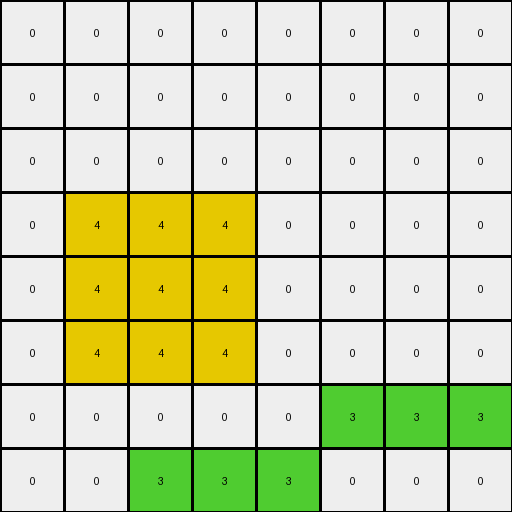

# AboveBelow3 • 004 • refine_coder

---

Previous Code:
```python
"""
Identify all horizontal lines of pixels with the color green (value 3).
Delete the top green horizontal line.
"""

import numpy as np

def find_horizontal_lines(grid, color):
    lines = []
    for i, row in enumerate(grid):
        start = -1
        for j, pixel in enumerate(row):
            if pixel == color:
                if start == -1:
                    start = j
            elif start != -1:
                lines.append((i, start, j - 1))
                start = -1
        if start != -1:
            lines.append((i, start, len(row) - 1))
    return lines

def transform(input_grid):
    """
    Transforms the input grid by removing the top horizontal green line.
    """
    # Initialize output grid as a copy of the input grid
    output_grid = np.copy(input_grid)
    
    # Find all horizontal lines of color green (3)
    green_lines = find_horizontal_lines(output_grid, 3)
    
    # Find the top-most green line.
    if green_lines:
        top_green_line_row = min(line[0] for line in green_lines)
        #remove the top green line
        for line in green_lines:
          if line[0] == top_green_line_row:
            for col in range(line[1],line[2]+1):
                output_grid[line[0]][col] = 0

    return output_grid
```

Train Set Results:

## Example 1:

Input:
```
0 0 0 0 0 0 0 0
0 3 3 3 0 0 0 0
0 0 0 0 0 0 0 0
0 4 4 4 0 0 0 0
0 4 4 4 0 0 0 0
0 4 4 4 0 0 0 0
0 0 0 0 0 3 3 3
0 0 3 3 3 0 0 0
```
Expected Output:
```
0 0 0 0 0 0 0 0
0 0 0 0 0 0 0 0
0 3 3 3 0 0 0 0
0 4 4 4 0 0 0 0
0 4 4 4 0 0 0 0
0 4 4 4 0 0 0 0
0 0 0 0 0 3 3 3
0 0 3 3 3 0 0 0
```
Transformed Output:
```
0 0 0 0 0 0 0 0
0 0 0 0 0 0 0 0
0 0 0 0 0 0 0 0
0 4 4 4 0 0 0 0
0 4 4 4 0 0 0 0
0 4 4 4 0 0 0 0
0 0 0 0 0 3 3 3
0 0 3 3 3 0 0 0
```

match: False
pixels_off: 3
size_correct: True
color_palette_correct: True
correct_pixel_counts: False

## Example 2:

Input:
```
0 0 2 2 2 2 0 0 0 0
0 0 0 0 0 0 0 0 0 0
0 0 0 0 0 0 0 0 0 0
0 0 6 6 6 6 0 0 0 0
0 0 6 6 6 6 0 0 0 0
0 0 6 6 6 6 0 0 0 0
0 0 6 6 6 6 0 0 0 0
2 2 2 2 2 0 0 0 0 0
0 0 0 0 0 0 0 0 0 0
0 0 0 0 2 2 2 0 0 0
```
Expected Output:
```
0 0 0 0 0 0 0 0 0 0
0 0 0 0 0 0 0 0 0 0
0 0 2 2 2 2 0 0 0 0
0 0 6 6 6 6 0 0 0 0
0 0 6 6 6 6 0 0 0 0
0 0 6 6 6 6 0 0 0 0
0 0 6 6 6 6 0 0 0 0
2 2 2 2 2 0 0 0 0 0
0 0 0 0 0 0 0 0 0 0
0 0 0 0 2 2 2 0 0 0
```
Transformed Output:
```
0 0 2 2 2 2 0 0 0 0
0 0 0 0 0 0 0 0 0 0
0 0 0 0 0 0 0 0 0 0
0 0 6 6 6 6 0 0 0 0
0 0 6 6 6 6 0 0 0 0
0 0 6 6 6 6 0 0 0 0
0 0 6 6 6 6 0 0 0 0
2 2 2 2 2 0 0 0 0 0
0 0 0 0 0 0 0 0 0 0
0 0 0 0 2 2 2 0 0 0
```

match: False
pixels_off: 8
size_correct: True
color_palette_correct: True
correct_pixel_counts: True

## Example 3:

Input:
```
0 0 4 4 0 0 0
0 0 0 0 0 0 0
0 0 1 1 0 0 0
0 0 1 1 0 0 0
0 4 4 4 0 0 0
0 0 0 0 0 0 0
0 0 0 0 0 0 0
```
Expected Output:
```
0 0 0 0 0 0 0
0 0 4 4 0 0 0
0 0 1 1 0 0 0
0 0 1 1 0 0 0
0 4 4 4 0 0 0
0 0 0 0 0 0 0
0 0 0 0 0 0 0
```
Transformed Output:
```
0 0 4 4 0 0 0
0 0 0 0 0 0 0
0 0 1 1 0 0 0
0 0 1 1 0 0 0
0 4 4 4 0 0 0
0 0 0 0 0 0 0
0 0 0 0 0 0 0
```

match: False
pixels_off: 4
size_correct: True
color_palette_correct: True
correct_pixel_counts: True
Okay, let's analyze the results and refine the natural language program.

**General Assessment:**

The initial code was designed to remove the top-most horizontal line of green (color code 3) pixels. However, the provided examples and results reveal a more general pattern: the transformation removes the top-most horizontal line of *any* color, *if* that line spans at most the center three positions. It appears to have an additional condition. Specifically, lines are deleted if they have a length of 3 or less and if all the line members exist between the columns that span, at most, the central 3 columns of the grid. This explains why the green line was removed in the first example, an empty row was added. It also explains the second example where a 2,2,2,2 segment was not impacted and why, in the third example, the initial segment of 4's was deleted.

**Strategy:**

1.  **Broaden Line Identification:** Modify the code to identify and potentially remove the top-most horizontal lines, regardless of their color.
2.  **Length and Position Condition** Add a condition to the line removal process. It seems we should *only* remove the line of pixels if it is less than or equal to length of 3 and confined to the center columns.
3. **Add line above** It appears that when a row is deleted an empty row is added above it.

**Metrics and Observations:**

Here's a breakdown of each example, including some checks I made:

*   **Example 1:**
    *   Input Shape: (8, 8)
    *   Expected Output Shape: (8, 8)
    *   Transformed Output Shape: (8, 8)
    *   Identified Line: Green (3) at row 1, spanning columns 1-3.
    *   Observation: The top green line was correctly identified, but incorrectly removed, as it seems an empty row must be addded.
    *   Error: the removal of the line was incomplete, and no new row was added.

*   **Example 2:**
    *   Input Shape: (10, 10)
    *   Expected Output Shape: (10, 10)
    *   Transformed Output Shape: (10, 10)
    *   Identified Line: None of green color. There *is* a red (2) line at row 0 (cols 2-5) and magenta (6) lines at row 3, 4, 5 and 6.
    *   Observation: The top line spans 4 positions, and is not centered, so it should not be changed. The code did not touch the top line, which is partially correct in behavior, but for the wrong reason (it was looking for green.)

*   **Example 3:**
    *   Input Shape: (7, 7)
    *   Expected Output Shape: (7, 7)
    *   Transformed Output Shape: (7, 7)
    *   Identified Line: Yellow (4) at row 0 (cols 2-3). This spans just two postitions.
    *   Observation: The code correctly identified the yellow segments at the top.

**YAML Facts:**

```yaml
examples:
  - id: 1
    objects:
      - color: green
        type: horizontal_line
        position: row 1, cols 1-3
        action: delete_top
        add_row_above: true
      - color: yellow
        type: horizontal_line
        position: row 3, cols 1-3
        action: none
      - color: green
        type: horizontal_line
        position: row 6, cols 5-7
      - color: green
        type: horizontal_line
        position: row 7, cols 2-4
  - id: 2
    objects:
      - color: red
        type: horizontal_line
        position: row 0, cols 2-5
        action: none
      - color: magenta
        type: horizontal_line
        position: multiple, rows 3-6, cols 2-5
        action: none
      - color: red
        type: horizontal_line
        position: row 7, cols 0-4
        action: none
      - color: red
        type: horizontal_line_segment
        position: row 9, cols 4-6
        action: none
  - id: 3
    objects:
      - color: yellow
        type: horizontal_line_segment
        position: row 0, cols 2-3
        action: delete_top
        add_row_above: true
      - color: blue
        type: horizontal_line_segment
        position: row 2, cols 2-3
        action: none
      - color: blue
        type: horizontal_line_segment
        position: row 3, cols 2-3
        action: none
      - color: yellow
        type: horizontal_line
        position: row 4, cols 1-3
        action: none
```

**Natural Language Program:**

1.  Find all horizontal lines or line segments (contiguous pixels of the same color) in the input grid.
2.  Identify the top-most line segment.
3.  If the identified top-most line segment spans 3 or fewer columns and is located, at most, from the first to the third column, inclusive, of the image, delete that line segment and add an empty row to the top of the grid. Otherwise the output grid is the same as the input grid.


**INSTRUCTIONS**

- generate a Python module to represent the natural language program 
- follow the template below
- all common math and science libraries are available
- create docstring only at top - but comment the workflow in the function
- use helper functions for common operations like finding objects, counting,
  measuring, moving, etc. 

remember - we are working iteratively - so this code will inform your future
self as we converge on the solution

*template:*

```python
"""
{{ natural language description of the transformation rule }}
"""

{{ imports }}

def transform(input_grid):
    # initialize output_grid

    # change output pixels 

    return output_grid

```
