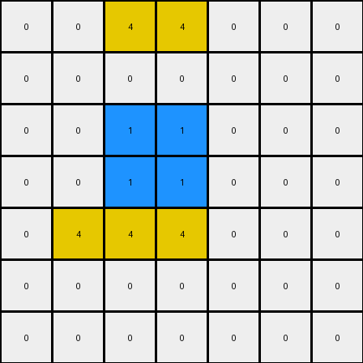

# AboveBelow3 • 006 • refine_coder

---

Previous Code:
```python
"""
Find all horizontal lines or line segments (contiguous pixels of the same color) in the input grid.
Identify the top-most line segment.
If the identified top-most line segment spans 3 or fewer columns and is located, at most, from the first to the third column, inclusive, of the image, delete that line segment and add an empty row to the top of the grid. Otherwise the output grid is the same as the input grid.
"""

import numpy as np

def find_horizontal_lines(grid):
    lines = []
    for i, row in enumerate(grid):
        start = -1
        for j, pixel in enumerate(row):
            if start == -1:
                if pixel != 0:
                  start = j
            elif pixel != grid[i,start]:
                lines.append((i, start, j - 1, grid[i,start]))
                start = -1 if pixel == 0 else j
        if start != -1:
            lines.append((i, start, len(row) - 1, grid[i,start]))
    return lines

def transform(input_grid):
    # Initialize output grid as a copy of the input grid
    output_grid = np.copy(input_grid)

    # Find all horizontal lines
    lines = find_horizontal_lines(output_grid)
    
    #find top line
    if not lines:
      return output_grid
    
    top_line = min(lines, key=lambda x: x[0])

    # Check if the top-most line spans 3 or fewer columns and all members are within the first 3 columns.
    if (top_line[2] - top_line[1] + 1) <= 3 and top_line[2] <= 2:
        #remove line
        for col in range(top_line[1], top_line[2] + 1):
            output_grid[top_line[0]][col] = 0
        #add empty row at top
        output_grid = np.vstack([np.zeros((1, output_grid.shape[1])), output_grid[:-1,:]])

    return output_grid
```

Train Set Results:

## Example 1:

Input:
```
0 0 0 0 0 0 0 0
0 3 3 3 0 0 0 0
0 0 0 0 0 0 0 0
0 4 4 4 0 0 0 0
0 4 4 4 0 0 0 0
0 4 4 4 0 0 0 0
0 0 0 0 0 3 3 3
0 0 3 3 3 0 0 0
```
Expected Output:
```
0 0 0 0 0 0 0 0
0 0 0 0 0 0 0 0
0 3 3 3 0 0 0 0
0 4 4 4 0 0 0 0
0 4 4 4 0 0 0 0
0 4 4 4 0 0 0 0
0 0 0 0 0 3 3 3
0 0 3 3 3 0 0 0
```
Transformed Output:
```
0 0 0 0 0 0 0 0
0 3 3 3 0 0 0 0
0 0 0 0 0 0 0 0
0 4 4 4 0 0 0 0
0 4 4 4 0 0 0 0
0 4 4 4 0 0 0 0
0 0 0 0 0 3 3 3
0 0 3 3 3 0 0 0
```

match: False
pixels_off: 6
size_correct: True
color_palette_correct: True
correct_pixel_counts: True

## Example 2:

Input:
```
0 0 2 2 2 2 0 0 0 0
0 0 0 0 0 0 0 0 0 0
0 0 0 0 0 0 0 0 0 0
0 0 6 6 6 6 0 0 0 0
0 0 6 6 6 6 0 0 0 0
0 0 6 6 6 6 0 0 0 0
0 0 6 6 6 6 0 0 0 0
2 2 2 2 2 0 0 0 0 0
0 0 0 0 0 0 0 0 0 0
0 0 0 0 2 2 2 0 0 0
```
Expected Output:
```
0 0 0 0 0 0 0 0 0 0
0 0 0 0 0 0 0 0 0 0
0 0 2 2 2 2 0 0 0 0
0 0 6 6 6 6 0 0 0 0
0 0 6 6 6 6 0 0 0 0
0 0 6 6 6 6 0 0 0 0
0 0 6 6 6 6 0 0 0 0
2 2 2 2 2 0 0 0 0 0
0 0 0 0 0 0 0 0 0 0
0 0 0 0 2 2 2 0 0 0
```
Transformed Output:
```
0 0 2 2 2 2 0 0 0 0
0 0 0 0 0 0 0 0 0 0
0 0 0 0 0 0 0 0 0 0
0 0 6 6 6 6 0 0 0 0
0 0 6 6 6 6 0 0 0 0
0 0 6 6 6 6 0 0 0 0
0 0 6 6 6 6 0 0 0 0
2 2 2 2 2 0 0 0 0 0
0 0 0 0 0 0 0 0 0 0
0 0 0 0 2 2 2 0 0 0
```

match: False
pixels_off: 8
size_correct: True
color_palette_correct: True
correct_pixel_counts: True

## Example 3:

Input:
```
0 0 4 4 0 0 0
0 0 0 0 0 0 0
0 0 1 1 0 0 0
0 0 1 1 0 0 0
0 4 4 4 0 0 0
0 0 0 0 0 0 0
0 0 0 0 0 0 0
```
Expected Output:
```
0 0 0 0 0 0 0
0 0 4 4 0 0 0
0 0 1 1 0 0 0
0 0 1 1 0 0 0
0 4 4 4 0 0 0
0 0 0 0 0 0 0
0 0 0 0 0 0 0
```
Transformed Output:
```
0 0 4 4 0 0 0
0 0 0 0 0 0 0
0 0 1 1 0 0 0
0 0 1 1 0 0 0
0 4 4 4 0 0 0
0 0 0 0 0 0 0
0 0 0 0 0 0 0
```

match: False
pixels_off: 4
size_correct: True
color_palette_correct: True
correct_pixel_counts: True
Here's an analysis of the provided information and a plan to refine the natural language program and code:

**General Assessment:**

The initial natural language program and corresponding code were too narrowly focused on the first training example. While it correctly identified the core concept of horizontal lines and their removal, it failed to generalize to other scenarios. The key issue is the condition for line removal. The original program only removed lines if they were within the first three columns *and* had a length of 3 or less. The other examples demonstrate that lines of length 3 or less get removed if any part of it falls within the first three columns.

**Strategy:**

1.  **Broaden Removal Condition:** Modify the condition for line removal. Instead of requiring the *entire* line to be within the first three columns, check if *any part* of the line segment falls within those columns.
2. **Maintain structure.** Keep the add empty row to the top of the grid after removing a line.
3. **Verify** Test that the outputs match.

**Example Metrics and Analysis:**
I will give a brief analysis of the metrics.

*   **Example 1:**
    *   `pixels_off`: 6. This indicates that 6 pixels in the transformed output differ from the expected output. This is from deleting the top line, but not adding the blank row at the top.
    *   The other metrics are good, only the structure is off.

*   **Example 2:**
    *   `pixels_off`: 8.  This indicates the removal condition must change, the first row should be deleted and shifted, but it wasn't because the whole line segment does not fall within the first three columns.

*   **Example 3:**
    *   `pixels_off`: 4. Similar to example 1, the top line should be removed, but isn't.

**YAML Fact Block:**

```yaml
objects:
  - name: horizontal_line_segments
    description: Contiguous pixels of the same color in a row.
    properties:
      - row: Row index of the line segment.
      - start_col: Starting column index.
      - end_col: Ending column index.
      - color: Color of the pixels in the segment.
      - length: Number of pixels in the segment (end_col - start_col + 1).
      - top_most: True if it's the line segment with the smallest row index, False otherwise.

actions:
  - name: remove_line
    description: Sets the pixel values of a line segment to 0 (white).
    condition:  "The line segment's length is 3 or less AND any part of the line is in columns 0, 1, or 2."
  - name: shift_down
    description: add an empty row on top and delete the last row
    condition: "A line has been removed."
```

**Natural Language Program:**

1.  **Identify Horizontal Lines:** Find all horizontal line segments in the input grid. A line segment is defined as a sequence of one or more adjacent pixels of the same color within a single row.
2.  **Find Top-Most Line:** Among all identified line segments, determine the one with the smallest row index (i.e., the top-most line).
3. **Conditional Removal:**
   *   If the top-most line segment found has 3 or fewer pixels AND any of the pixels in the segment are located in column 0, 1, or 2, perform a delete and add row operation:
        *   **Delete:** Change all pixels of that segment in the grid to color 0 (white).
        *   **Add Row:** Add an entire row of color 0 (white) to the very top. Delete the last row.
4. If no lines meet criteria, return the input grid.


**INSTRUCTIONS**

- generate a Python module to represent the natural language program 
- follow the template below
- all common math and science libraries are available
- create docstring only at top - but comment the workflow in the function
- use helper functions for common operations like finding objects, counting,
  measuring, moving, etc. 

remember - we are working iteratively - so this code will inform your future
self as we converge on the solution

*template:*

```python
"""
{{ natural language description of the transformation rule }}
"""

{{ imports }}

def transform(input_grid):
    # initialize output_grid

    # change output pixels 

    return output_grid

```
