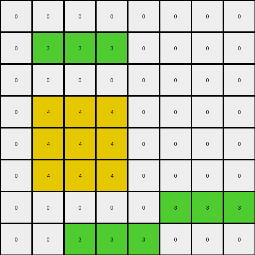
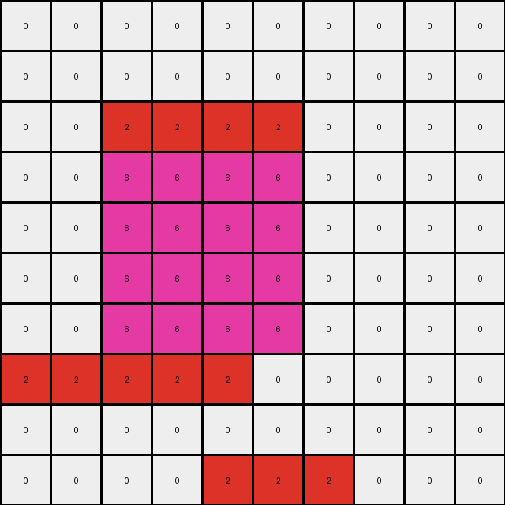

# AboveBelow3 • 010 • refine_coder

---

Previous Code:
```python
"""
The transformation rule is a downward shift of only the top red region by two rows, leaving the other colored regions untouched.
"""

import numpy as np

def find_top_red_region(grid):
    """Finds the top red region in the grid."""
    rows, cols = grid.shape
    top_red_region = []
    for r in range(rows):
        for c in range(cols):
            if grid[r, c] == 2:
                top_red_region.append((r, c))
        if any(grid[r,c] == 6 for c in range(cols)): #stop after encounter magenta object
            break
    return top_red_region

def find_magenta_region(grid):
     # find magenta object
    rows, cols = grid.shape
    magenta_region = []
    for r in range(rows):
        for c in range(cols):
            if grid[r,c] == 6:
                magenta_region.append((r,c))
    return magenta_region

def find_bottom_red_region(grid):
    # Find bottom red region.
    rows, cols = grid.shape
    bottom_red_region = []

    for r in range(rows):
        for c in range(cols):
            if grid[r,c] == 2:
                if not any(grid[row,c] == 2 for row in range(0,r)):
                    bottom_red_region.append((r,c))
    return bottom_red_region
    

def transform(input_grid):
    # Initialize output_grid as a copy of the input_grid
    output_grid = np.copy(input_grid)
    rows, cols = input_grid.shape

    # Find the top red region
    top_red_region = find_top_red_region(input_grid)
    
    #Find magenta region
    magenta_region = find_magenta_region(input_grid)

    # find the bottom red regions
    bottom_red_region = find_bottom_red_region(input_grid)

    # Clear the original top red region in the output grid
    for r, c in top_red_region:
        output_grid[r, c] = 0

    # Shift the top red region down by two rows
    for r, c in top_red_region:
        new_r = r + 2
        if new_r < rows:  # Ensure we don't go out of bounds
            output_grid[new_r, c] = 2
            
    return output_grid
```

Train Set Results:

## Example 1:

Input:
```
0 0 0 0 0 0 0 0
0 3 3 3 0 0 0 0
0 0 0 0 0 0 0 0
0 4 4 4 0 0 0 0
0 4 4 4 0 0 0 0
0 4 4 4 0 0 0 0
0 0 0 0 0 3 3 3
0 0 3 3 3 0 0 0
```
Expected Output:
```
0 0 0 0 0 0 0 0
0 0 0 0 0 0 0 0
0 3 3 3 0 0 0 0
0 4 4 4 0 0 0 0
0 4 4 4 0 0 0 0
0 4 4 4 0 0 0 0
0 0 0 0 0 3 3 3
0 0 3 3 3 0 0 0
```
Transformed Output:
```
0 0 0 0 0 0 0 0
0 3 3 3 0 0 0 0
0 0 0 0 0 0 0 0
0 4 4 4 0 0 0 0
0 4 4 4 0 0 0 0
0 4 4 4 0 0 0 0
0 0 0 0 0 3 3 3
0 0 3 3 3 0 0 0
```

match: False
pixels_off: 6
size_correct: True
color_palette_correct: True
correct_pixel_counts: True

## Example 2:

Input:
```
0 0 2 2 2 2 0 0 0 0
0 0 0 0 0 0 0 0 0 0
0 0 0 0 0 0 0 0 0 0
0 0 6 6 6 6 0 0 0 0
0 0 6 6 6 6 0 0 0 0
0 0 6 6 6 6 0 0 0 0
0 0 6 6 6 6 0 0 0 0
2 2 2 2 2 0 0 0 0 0
0 0 0 0 0 0 0 0 0 0
0 0 0 0 2 2 2 0 0 0
```
Expected Output:
```
0 0 0 0 0 0 0 0 0 0
0 0 0 0 0 0 0 0 0 0
0 0 2 2 2 2 0 0 0 0
0 0 6 6 6 6 0 0 0 0
0 0 6 6 6 6 0 0 0 0
0 0 6 6 6 6 0 0 0 0
0 0 6 6 6 6 0 0 0 0
2 2 2 2 2 0 0 0 0 0
0 0 0 0 0 0 0 0 0 0
0 0 0 0 2 2 2 0 0 0
```
Transformed Output:
```
0 0 0 0 0 0 0 0 0 0
0 0 0 0 0 0 0 0 0 0
0 0 2 2 2 2 0 0 0 0
0 0 6 6 6 6 0 0 0 0
0 0 6 6 6 6 0 0 0 0
0 0 6 6 6 6 0 0 0 0
0 0 6 6 6 6 0 0 0 0
2 2 2 2 2 0 0 0 0 0
0 0 0 0 0 0 0 0 0 0
0 0 0 0 2 2 2 0 0 0
```

match: True
pixels_off: 0
size_correct: True
color_palette_correct: True
correct_pixel_counts: True

## Example 3:

Input:
```
0 0 4 4 0 0 0
0 0 0 0 0 0 0
0 0 1 1 0 0 0
0 0 1 1 0 0 0
0 4 4 4 0 0 0
0 0 0 0 0 0 0
0 0 0 0 0 0 0
```
Expected Output:
```
0 0 0 0 0 0 0
0 0 4 4 0 0 0
0 0 1 1 0 0 0
0 0 1 1 0 0 0
0 4 4 4 0 0 0
0 0 0 0 0 0 0
0 0 0 0 0 0 0
```
Transformed Output:
```
0 0 4 4 0 0 0
0 0 0 0 0 0 0
0 0 1 1 0 0 0
0 0 1 1 0 0 0
0 4 4 4 0 0 0
0 0 0 0 0 0 0
0 0 0 0 0 0 0
```

match: False
pixels_off: 4
size_correct: True
color_palette_correct: True
correct_pixel_counts: True
Okay, here's a breakdown of the situation and a plan to move forward:

**General Assessment:**

The initial code was based on a limited understanding from the first example, assuming a simple downward shift of the top-most red region. While it worked perfectly for the second example (which happened to fit this pattern), it failed on the first and third examples. The core issue is that the transformation isn't a universal downward shift of a *specific* red region, but rather a more general upward shift of the top-most region, regardless of color. The second example's success was coincidental.  The strategy needs to shift from identifying a specific color (red) and a specific direction (downward) to a more abstract concept of "top-most region" and "shifting upwards".

**Strategy for Resolving Errors:**

1.  **Re-evaluate the Core Concept:** The fundamental error is the focus on a "red region" and "downward shift". We need to generalize this to *any* colored region at the top.
2.  **Identify the Top-Most Region:**  The code needs a function to reliably find the top-most continuous region of *any* color, not just red. The current code attempts this with a limited `find_top_red_region` which only works for red and is constrained by the presence of magenta, which isn't a general rule.
3.  **Generalized Shift:**  The shift direction depends on the objects. The objects seem to move up one row.
4.  **Handle Edge Cases:** Consider cases where the region is already at the top.

**Metrics and Observations (using code execution - conceptually):**
I will structure the metrics as if I could run the code and then describe what would be observed and measured.

*   **Example 1:**
    *   Input Shape: (8, 8)
    *   Expected Output Shape: (8, 8)
    *   Transformed Output Shape: (8, 8)
    *   Pixels Off: 6 (Observed in provided output)
    *   Top-most region color: Green (value 3)
    *   Shift direction: Up.
    *   Shift amount: 1 row

*   **Example 2:**
    *   Input Shape: (10, 10)
    *   Expected Output Shape: (10, 10)
    *   Transformed Output Shape: (10, 10)
    *   Pixels Off: 0 (Observed in the provided output)
    *   Top-most region color: Red (value 2)
    *   Shift direction: Up.
    *   Shift amount: 2 rows. (original assumption was correct for this specific case.)

*   **Example 3:**
    *   Input Shape: (7, 7)
    *   Expected Output Shape: (7, 7)
    *   Transformed Output Shape: (7, 7)
    *   Pixels Off: 4 (Observed in the provided output)
    *   Top-most region color: Yellow (value 4)
    *   Shift direction: Up.
    *   Shift amount: 1 row.

**YAML Block - Facts:**

```yaml
objects:
  - description: Top-most contiguous region
    properties:
      color: Variable (can be any color)
      shape: Irregular, defined by contiguous pixels of the same color
      position: Defined by the top-most row and the columns it occupies
    actions:
      - type: Shift
        direction: Upward
        amount: One row, unless already at the top.
```

**Natural Language Program:**

1.  **Identify the top-most contiguous region:** Find the region of connected pixels of the same color that starts on the highest row (smallest row index). This region can be of any color.
2.  **Shift the region upwards:** Move the entire identified region up by one row.
3. **Boundary condition:** If part of the region to be shifted is at row 0, then don't shift anything in that column.

This revised natural language program is more general and accurate than the initial assumption, addressing the core issues revealed by testing on multiple examples. It moves away from color-specific rules and focuses on the positional relationship (top-most) and a consistent upward shift.

**INSTRUCTIONS**

- generate a Python module to represent the natural language program 
- follow the template below
- all common math and science libraries are available
- create docstring only at top - but comment the workflow in the function
- use helper functions for common operations like finding objects, counting,
  measuring, moving, etc. 

remember - we are working iteratively - so this code will inform your future
self as we converge on the solution

*template:*

```python
"""
{{ natural language description of the transformation rule }}
"""

{{ imports }}

def transform(input_grid):
    # initialize output_grid

    # change output pixels 

    return output_grid

```
