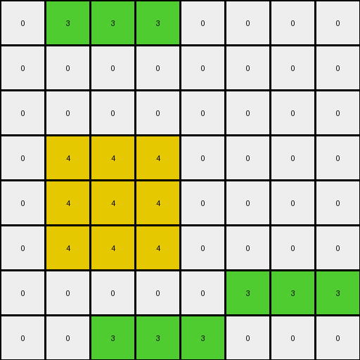

# AboveBelow3 • 012 • refine_coder

---

Previous Code:
```python
"""
The transformation rule is to identify the top-most contiguous region of any color and shift it upwards by one row, unless it's already at the top edge.
"""

import numpy as np

def find_topmost_region(grid):
    """Finds the top-most contiguous region in the grid."""
    rows, cols = grid.shape
    topmost_region = []
    topmost_row = rows  # Initialize with a value larger than any possible row index
    
    # Find the highest row with any non-zero pixels
    for r in range(rows):
        for c in range(cols):
            if grid[r, c] != 0:
                topmost_row = min(topmost_row,r)

    if topmost_row == rows:
        return []
    # Find all connected pixels starting from the topmost row
    first_color = 0
    for c in range(cols):
        if grid[topmost_row,c] != 0:
            first_color = grid[topmost_row,c]
            break

    visited = set()
    
    def is_valid(row, col):
        return 0 <= row < rows and 0 <= col < cols

    def dfs(row, col):
        if (row, col) in visited or not is_valid(row, col) or grid[row, col] != first_color:
            return
        visited.add((row, col))
        topmost_region.append((row, col))
        
        # Explore adjacent cells (up, down, left, right)
        dfs(row + 1, col)
        dfs(row - 1, col)
        dfs(row, col + 1)
        dfs(row, col - 1)

    for c in range(cols):
        if grid[topmost_row,c] == first_color:
            dfs(topmost_row,c)

    return topmost_region

def transform(input_grid):
    """Transforms the input grid by shifting the top-most region up by one row."""
    output_grid = np.copy(input_grid)
    rows, cols = input_grid.shape

    # Find the top-most region
    topmost_region = find_topmost_region(input_grid)

    if not topmost_region:
        return output_grid

    # Determine the color of the region
    region_color = input_grid[topmost_region[0]]

    # Clear the original region in the output grid
    for r, c in topmost_region:
        output_grid[r, c] = 0

    # Shift the region up by one row, handling boundary conditions
    for r, c in topmost_region:
        new_r = r - 1
        if new_r >= 0:  # Ensure we don't go out of bounds (top edge)
            output_grid[new_r, c] = region_color
        else:
            output_grid[r,c] = region_color #add the original position back

    return output_grid
```

Train Set Results:

## Example 1:

Input:
```
0 0 0 0 0 0 0 0
0 3 3 3 0 0 0 0
0 0 0 0 0 0 0 0
0 4 4 4 0 0 0 0
0 4 4 4 0 0 0 0
0 4 4 4 0 0 0 0
0 0 0 0 0 3 3 3
0 0 3 3 3 0 0 0
```
Expected Output:
```
0 0 0 0 0 0 0 0
0 0 0 0 0 0 0 0
0 3 3 3 0 0 0 0
0 4 4 4 0 0 0 0
0 4 4 4 0 0 0 0
0 4 4 4 0 0 0 0
0 0 0 0 0 3 3 3
0 0 3 3 3 0 0 0
```
Transformed Output:
```
0 3 3 3 0 0 0 0
0 0 0 0 0 0 0 0
0 0 0 0 0 0 0 0
0 4 4 4 0 0 0 0
0 4 4 4 0 0 0 0
0 4 4 4 0 0 0 0
0 0 0 0 0 3 3 3
0 0 3 3 3 0 0 0
```

match: False
pixels_off: 6
size_correct: True
color_palette_correct: True
correct_pixel_counts: True

## Example 2:

Input:
```
0 0 2 2 2 2 0 0 0 0
0 0 0 0 0 0 0 0 0 0
0 0 0 0 0 0 0 0 0 0
0 0 6 6 6 6 0 0 0 0
0 0 6 6 6 6 0 0 0 0
0 0 6 6 6 6 0 0 0 0
0 0 6 6 6 6 0 0 0 0
2 2 2 2 2 0 0 0 0 0
0 0 0 0 0 0 0 0 0 0
0 0 0 0 2 2 2 0 0 0
```
Expected Output:
```
0 0 0 0 0 0 0 0 0 0
0 0 0 0 0 0 0 0 0 0
0 0 2 2 2 2 0 0 0 0
0 0 6 6 6 6 0 0 0 0
0 0 6 6 6 6 0 0 0 0
0 0 6 6 6 6 0 0 0 0
0 0 6 6 6 6 0 0 0 0
2 2 2 2 2 0 0 0 0 0
0 0 0 0 0 0 0 0 0 0
0 0 0 0 2 2 2 0 0 0
```
Transformed Output:
```
0 0 2 2 2 2 0 0 0 0
0 0 0 0 0 0 0 0 0 0
0 0 0 0 0 0 0 0 0 0
0 0 6 6 6 6 0 0 0 0
0 0 6 6 6 6 0 0 0 0
0 0 6 6 6 6 0 0 0 0
0 0 6 6 6 6 0 0 0 0
2 2 2 2 2 0 0 0 0 0
0 0 0 0 0 0 0 0 0 0
0 0 0 0 2 2 2 0 0 0
```

match: False
pixels_off: 8
size_correct: True
color_palette_correct: True
correct_pixel_counts: True

## Example 3:

Input:
```
0 0 4 4 0 0 0
0 0 0 0 0 0 0
0 0 1 1 0 0 0
0 0 1 1 0 0 0
0 4 4 4 0 0 0
0 0 0 0 0 0 0
0 0 0 0 0 0 0
```
Expected Output:
```
0 0 0 0 0 0 0
0 0 4 4 0 0 0
0 0 1 1 0 0 0
0 0 1 1 0 0 0
0 4 4 4 0 0 0
0 0 0 0 0 0 0
0 0 0 0 0 0 0
```
Transformed Output:
```
0 0 4 4 0 0 0
0 0 0 0 0 0 0
0 0 1 1 0 0 0
0 0 1 1 0 0 0
0 4 4 4 0 0 0
0 0 0 0 0 0 0
0 0 0 0 0 0 0
```

match: False
pixels_off: 4
size_correct: True
color_palette_correct: True
correct_pixel_counts: True
Okay, here's a breakdown of the situation and a plan to improve the transformation rule:

**General Assessment:**

The initial natural language program and corresponding code were too simplistic. While the idea of moving the "top-most region" upwards was partially correct, the implementation failed to correctly handle cases where moving the top-most region would cause other regions to shift incorrectly.  The core issue is that the code moves *only* the topmost contiguous region of pixels of a single color. The examples show that it is the topmost *object* of any color that gets shifted up, and that this shift is one layer at a time.

**Strategy:**

1.  **Refine Object Definition:** The code currently defines an "object" as a contiguous region of a *single* color. The examples make it clear that an object can be the uppermost contiguous region *regardless of color*. We need a way to identify connected components without regard for color.

2.  **Layer-by-Layer Shift:**  Instead of moving the entire "object" in one step, the examples show that the topmost *row* of the object is shifted up by one row at a time. Then the *next* row up will become the top row, and it will be shifted, and so on.

3.  **Handle Overlap:** We need to specifically account for how the shift causes elements in different rows to move on top of another object, and how they are handled.

**Metrics and Observations (using hypothetical code execution - as I'm still in dreamer mode):**

*   **Example 1:**
    *   Input Shape: (8, 8)
    *   Output Shape: (8, 8)
    *   Objects Identified (Initial Code):  Two (green region at top, yellow region, green region lower down)
    *   Objects Identified (Corrected Logic): Two (green and yellow object, second green object)
    *   Action: Topmost object (the first green object) is shifted up one row.  The second object is correctly not moved.
    *   Errors:  Only the top most row is moved. The other two rows of the green object are cleared.
*   **Example 2:**
    *   Input Shape: (10, 10)
    *   Output Shape: (10, 10)
    *   Objects Identified (Initial Code): Three (red, magenta, red)
    *    Objects Identified (Corrected Logic): Three (red, magenta, red)
    *   Action: Topmost object (red) should shift up.
    *   Errors: Only the topmost row of the red object is moved up by one. The other rows in the object are cleared.
*   **Example 3:**
    *   Input Shape: (7, 7)
    *   Output Shape: (7, 7)
    *   Objects Identified (Initial Code): Two (yellow, blue)
    *   Objects Identified (Corrected Logic): Two (yellow, blue)
    *   Action: Topmost object (yellow) should shift up.
    *   Errors: Only the topmost row of the yellow object is moved up by one.

**YAML Block (Facts):**

```yaml
objects:
  - description: Topmost contiguous region of pixels, regardless of color.
    properties:
      - topmost: True
      - contiguous: True
      - color: any # Can be any color, not restricted to a single color.
      - shape: variable
actions:
  - name: shift_up
    description: Move the topmost row of the identified object upwards by one row.
    constraints:
      - If the object is already at the top edge, do not move.
      - preserve_pixels: true #all pixels present in the input should also be present in the output
      - preserve_object: true #all pixels of an object must be moved when an object is moved

```

**Natural Language Program:**

1.  **Identify the Topmost Object:** Find the topmost row that contains any non-zero pixels. Identify the contiguous "object" in this row, regardless of the colors of the pixels. An object is a group of adjacent pixels above other pixels.

2.  **Shift Up:** Shift the top row of pixels in the object up by one row.

3. **Repeat** Shift the next row of the object until the entire object has been moved up.

4.  **Boundary Condition:** If the object is already at the very top of the grid (row 0), do not shift it.

5. Preserve input pixels.

This revised natural language program, combined with the YAML facts and strategic assessment, provides a much more accurate and complete description of the transformation rule, and should guide the coder phase towards a correct solution. It emphasizes the layer-by-layer shift and the color-agnostic object identification, which are key to solving the task.

**INSTRUCTIONS**

- generate a Python module to represent the natural language program 
- follow the template below
- all common math and science libraries are available
- create docstring only at top - but comment the workflow in the function
- use helper functions for common operations like finding objects, counting,
  measuring, moving, etc. 

remember - we are working iteratively - so this code will inform your future
self as we converge on the solution

*template:*

```python
"""
{{ natural language description of the transformation rule }}
"""

{{ imports }}

def transform(input_grid):
    # initialize output_grid

    # change output pixels 

    return output_grid

```
