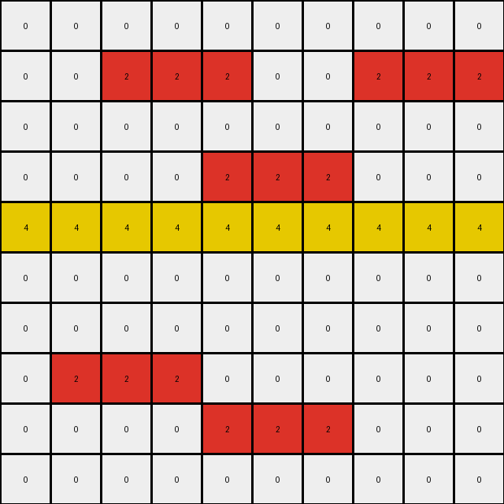

# AboveBelow4 • 005 • refine_dreamer

---


Previous Code:
```python
"""
1.  **Identify All Stripes:** Locate all horizontal and vertical stripes of any color. A stripe is a contiguous sequence of pixels of the same color along a row or column.
2.  **Find Intersections:** Determine the points (pixels) where stripes of *different* colors intersect. An intersection occurs where a pixel in one stripe is in the same row or column as a pixel of another stripe of a *different* color.
3. **Prioritize Change:** The input grid can be considered to have two types
   of stripes, background, and foreground. All the foreground stripes, at a minimum, should have intersections.
4.  **Color Replacement:** At each intersection point identified in step 2, change the color of the intersecting pixel of the background stripe *to the color of the foreground object*.
5. **Preserve other:** All other pixels should not be changed.
"""

import numpy as np

def find_stripes(grid, orientation):
    stripes = []
    if orientation == "horizontal":
        for i, row in enumerate(grid):
            stripe_start = None
            current_color = None
            for j, pixel in enumerate(row):
                if stripe_start is None:
                    stripe_start = j
                    current_color = pixel
                elif pixel != current_color:
                    stripes.append((i, stripe_start, i, j - 1, current_color))
                    stripe_start = j
                    current_color = pixel
            if stripe_start is not None:
                stripes.append((i, stripe_start, i, len(row) - 1, current_color))
    elif orientation == "vertical":
        for j in range(grid.shape[1]):
            stripe_start = None
            current_color = None
            for i, pixel in enumerate(grid[:, j]):
                if stripe_start is None:
                    stripe_start = i
                    current_color = pixel
                elif pixel != current_color:
                    stripes.append((stripe_start, j, i - 1, j, current_color))
                    stripe_start = i
                    current_color = pixel
            if stripe_start is not None:
                stripes.append((stripe_start, j, grid.shape[0] - 1, j, current_color))
    return stripes

def find_all_stripes(grid):
    horizontal_stripes = find_stripes(grid, "horizontal")
    vertical_stripes = find_stripes(grid, "vertical")
    return horizontal_stripes + vertical_stripes

def find_intersections(stripes):
    intersections = []
    for i in range(len(stripes)):
        for j in range(i + 1, len(stripes)):
            s1_start_row, s1_start_col, s1_end_row, s1_end_col, s1_color = stripes[i]
            s2_start_row, s2_start_col, s2_end_row, s2_end_col, s2_color = stripes[j]

            if s1_color == s2_color:
                continue

            if s1_start_row == s1_end_row:  # s1 horizontal
                if s2_start_row == s2_end_row:  # s2 horizontal
                    pass
                else:  # s2 vertical
                    if s2_start_col >= s1_start_col and s2_start_col <= s1_end_col and s1_start_row >= s2_start_row and s1_start_row <= s2_end_row:
                        intersections.append(((s1_start_row, s2_start_col), s1_color, s2_color))
            else:  # s1 vertical
                if s2_start_row == s2_end_row:  # s2 horizontal
                    if s1_start_col >= s2_start_col and s1_start_col <= s2_end_col and s2_start_row >= s1_start_row and s2_start_row <= s1_end_row:
                         intersections.append(((s2_start_row, s1_start_col), s1_color, s2_color))
                else: #s2 vertical
                  pass
    return intersections
  
def get_background_foreground(all_stripes, intersections):

    # all stripes that intersect are foreground
    foreground_colors = set()
    for intersection in intersections:
      (_, color1, color2) = intersection
      foreground_colors.add(color1)
      foreground_colors.add(color2)
    
    # assume first non-foreground stripe is background if it exists
    background_color = None
    for stripe in all_stripes:
      (row, col, _, _, color) = stripe
      if color not in foreground_colors:
        background_color = color
        break;

    return background_color, list(foreground_colors)

def transform(input_grid):
    # initialize output_grid
    grid = np.array(input_grid)
    output_grid = np.copy(grid)

    # Find all stripes
    all_stripes = find_all_stripes(grid)

    # Find intersection points
    intersections = find_intersections(all_stripes)

    background_color, foreground_colors = get_background_foreground(all_stripes, intersections)


    # change output pixels
    for intersection in intersections:
        (row, col), color1, color2 = intersection

        # determine which is the forground object by comparing colors
        if color1 == background_color:
          output_grid[row, col] = color2
        elif color2 == background_color:
          output_grid[row, col] = color1
        # if neither color is background - then use the first stripe color

    return output_grid
```

Train Set Results:

## Example 1:

Input:
```
0 0 0 0 0 0 0 0 0 0
0 0 2 2 2 0 0 2 2 2
0 0 0 0 0 0 0 0 0 0
0 0 0 0 2 2 2 0 0 0
4 4 4 4 4 4 4 4 4 4
0 0 0 0 0 0 0 0 0 0
0 0 0 0 0 0 0 0 0 0
0 2 2 2 0 0 0 0 0 0
0 0 0 0 2 2 2 0 0 0
0 0 0 0 0 0 0 0 0 0
```
Expected Output:
```
0 0 0 0 0 0 0 0 0 0
0 0 4 2 2 0 0 4 2 2
0 0 0 0 0 0 0 0 0 0
0 0 0 0 4 2 2 0 0 0
4 4 4 4 4 4 4 4 4 4
0 0 0 0 0 0 0 0 0 0
0 0 0 0 0 0 0 0 0 0
0 2 2 4 0 0 0 0 0 0
0 0 0 0 2 2 4 0 0 0
0 0 0 0 0 0 0 0 0 0
```
Transformed Output:
```
0 0 0 0 0 0 0 0 0 0
0 0 2 2 2 0 0 2 2 2
0 0 0 0 0 0 0 0 0 0
0 0 0 0 2 2 2 0 0 0
4 4 4 4 4 4 4 4 4 4
0 0 0 0 0 0 0 0 0 0
0 0 0 0 0 0 0 0 0 0
0 2 2 2 0 0 0 0 0 0
0 0 0 0 2 2 2 0 0 0
0 0 0 0 0 0 0 0 0 0
```

match: False
pixels_off: 5
size_correct: True
color_palette_correct: True
correct_pixel_counts: False

## Example 2:

Input:
```
0 0 3 3 3 0 0 0 0 0 0 0
0 0 0 0 0 0 0 3 3 3 0 0
6 6 6 6 6 6 6 6 6 6 6 6
0 0 0 0 0 0 0 0 0 0 0 0
0 0 0 0 0 0 0 0 0 0 0 0
0 0 0 0 0 0 3 3 3 3 3 3
0 0 0 0 0 0 0 0 0 0 0 0
0 0 0 0 0 0 0 0 0 0 0 0
0 0 0 0 0 0 0 0 0 0 0 0
```
Expected Output:
```
0 0 6 3 3 0 0 0 0 0 0 0
0 0 0 0 0 0 0 6 3 3 0 0
6 6 6 6 6 6 6 6 6 6 6 6
0 0 0 0 0 0 0 0 0 0 0 0
0 0 0 0 0 0 0 0 0 0 0 0
0 0 0 0 0 0 3 3 3 3 3 6
0 0 0 0 0 0 0 0 0 0 0 0
0 0 0 0 0 0 0 0 0 0 0 0
0 0 0 0 0 0 0 0 0 0 0 0
```
Transformed Output:
```
0 0 3 3 3 0 0 0 0 0 0 0
0 0 0 0 0 0 0 3 3 3 0 0
6 6 6 6 6 6 6 6 6 6 6 6
0 0 0 0 0 0 0 0 0 0 0 0
0 0 0 0 0 0 0 0 0 0 0 0
0 0 0 0 0 0 3 3 3 3 3 3
0 0 0 0 0 0 0 0 0 0 0 0
0 0 0 0 0 0 0 0 0 0 0 0
0 0 0 0 0 0 0 0 0 0 0 0
```

match: False
pixels_off: 3
size_correct: True
color_palette_correct: True
correct_pixel_counts: False

**INSTRUCTIONS**

The code above was generated based on observations from the first training
example

we have tested the transform function on each of the task example inputs and
compared with the expected output

review each of the examples provided and the results and consider how the
natural language program should be updated to accommodate this new knowledge

respond with the following deliverables:

- general assessment of the information provided and strategy for resolving the
  errors
- gather metrics about each of the examples and results - use code_execution to
  develop accurate reports on your assumptions
- a YAML block documenting facts - Focus on identifying objects, their properties, and the actions performed on them.
- a natural language program - Be as clear and concise as possible, providing a complete description of the transformation rule.


your responses should be considered as information in a report - not a
conversation
