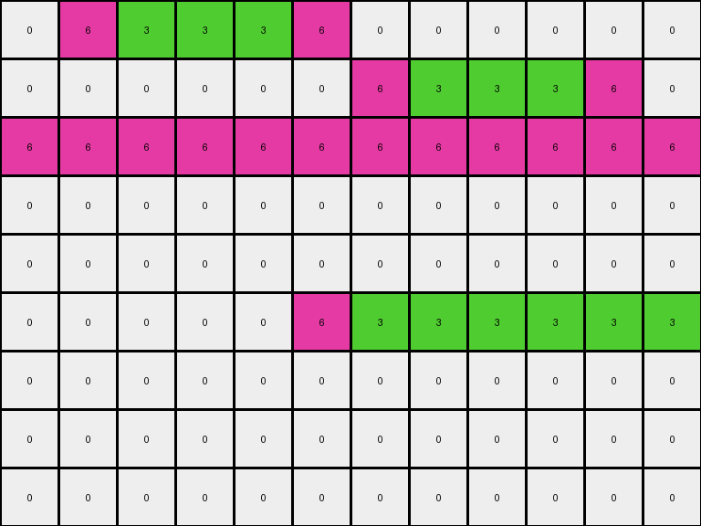

# AboveBelow4 • 009 • refine_dreamer

---


Previous Code:
```python
"""
Identifies regions of color 3 (green) in the input grid and inserts color 6 (magenta)
to the immediate horizontal neighbors (left and right) if the neighbor is not already 3 or 6.
If color 3 is at the edge, add 6 only to available side.
The central magenta region remains unchanged.
"""

import numpy as np

def get_horizontal_neighbors(grid, r, c):
    """Gets the valid horizontal neighbors of a cell."""
    neighbors = []
    rows, cols = grid.shape
    if c > 0:
        neighbors.append((r, c - 1))  # Left neighbor
    if c < cols - 1:
        neighbors.append((r, c + 1))  # Right neighbor
    return neighbors

def transform(input_grid):
    """Transforms the input grid according to the described rule."""
    output_grid = np.copy(input_grid)
    rows, cols = input_grid.shape

    # Iterate through the grid to find green pixels (3)
    for r in range(rows):
        for c in range(cols):
            if input_grid[r, c] == 3:
                neighbors = get_horizontal_neighbors(input_grid, r, c)
                for nr, nc in neighbors:
                    # Check if the neighbor is not green or magenta, then set to magenta
                    if input_grid[nr, nc] != 3 and input_grid[nr,nc] != 6:
                        output_grid[nr, nc] = 6

    return output_grid
```

Train Set Results:

## Example 1:

Input:
```
0 0 0 0 0 0 0 0 0 0
0 0 2 2 2 0 0 2 2 2
0 0 0 0 0 0 0 0 0 0
0 0 0 0 2 2 2 0 0 0
4 4 4 4 4 4 4 4 4 4
0 0 0 0 0 0 0 0 0 0
0 0 0 0 0 0 0 0 0 0
0 2 2 2 0 0 0 0 0 0
0 0 0 0 2 2 2 0 0 0
0 0 0 0 0 0 0 0 0 0
```
Expected Output:
```
0 0 0 0 0 0 0 0 0 0
0 0 4 2 2 0 0 4 2 2
0 0 0 0 0 0 0 0 0 0
0 0 0 0 4 2 2 0 0 0
4 4 4 4 4 4 4 4 4 4
0 0 0 0 0 0 0 0 0 0
0 0 0 0 0 0 0 0 0 0
0 2 2 4 0 0 0 0 0 0
0 0 0 0 2 2 4 0 0 0
0 0 0 0 0 0 0 0 0 0
```
Transformed Output:
```
0 0 0 0 0 0 0 0 0 0
0 0 2 2 2 0 0 2 2 2
0 0 0 0 0 0 0 0 0 0
0 0 0 0 2 2 2 0 0 0
4 4 4 4 4 4 4 4 4 4
0 0 0 0 0 0 0 0 0 0
0 0 0 0 0 0 0 0 0 0
0 2 2 2 0 0 0 0 0 0
0 0 0 0 2 2 2 0 0 0
0 0 0 0 0 0 0 0 0 0
```

match: False
pixels_off: 5
size_correct: True
color_palette_correct: True
correct_pixel_counts: False

## Example 2:

Input:
```
0 0 3 3 3 0 0 0 0 0 0 0
0 0 0 0 0 0 0 3 3 3 0 0
6 6 6 6 6 6 6 6 6 6 6 6
0 0 0 0 0 0 0 0 0 0 0 0
0 0 0 0 0 0 0 0 0 0 0 0
0 0 0 0 0 0 3 3 3 3 3 3
0 0 0 0 0 0 0 0 0 0 0 0
0 0 0 0 0 0 0 0 0 0 0 0
0 0 0 0 0 0 0 0 0 0 0 0
```
Expected Output:
```
0 0 6 3 3 0 0 0 0 0 0 0
0 0 0 0 0 0 0 6 3 3 0 0
6 6 6 6 6 6 6 6 6 6 6 6
0 0 0 0 0 0 0 0 0 0 0 0
0 0 0 0 0 0 0 0 0 0 0 0
0 0 0 0 0 0 3 3 3 3 3 6
0 0 0 0 0 0 0 0 0 0 0 0
0 0 0 0 0 0 0 0 0 0 0 0
0 0 0 0 0 0 0 0 0 0 0 0
```
Transformed Output:
```
0 6 3 3 3 6 0 0 0 0 0 0
0 0 0 0 0 0 6 3 3 3 6 0
6 6 6 6 6 6 6 6 6 6 6 6
0 0 0 0 0 0 0 0 0 0 0 0
0 0 0 0 0 0 0 0 0 0 0 0
0 0 0 0 0 6 3 3 3 3 3 3
0 0 0 0 0 0 0 0 0 0 0 0
0 0 0 0 0 0 0 0 0 0 0 0
0 0 0 0 0 0 0 0 0 0 0 0
```

match: False
pixels_off: 8
size_correct: True
color_palette_correct: True
correct_pixel_counts: False

**INSTRUCTIONS**

The code above was generated based on observations from the first training
example

we have tested the transform function on each of the task example inputs and
compared with the expected output

review each of the examples provided and the results and consider how the
natural language program should be updated to accommodate this new knowledge

respond with the following deliverables:

- general assessment of the information provided and strategy for resolving the
  errors
- gather metrics about each of the examples and results - use code_execution to
  develop accurate reports on your assumptions
- a YAML block documenting facts - Focus on identifying objects, their properties, and the actions performed on them.
- a natural language program - Be as clear and concise as possible, providing a complete description of the transformation rule.


your responses should be considered as information in a report - not a
conversation
