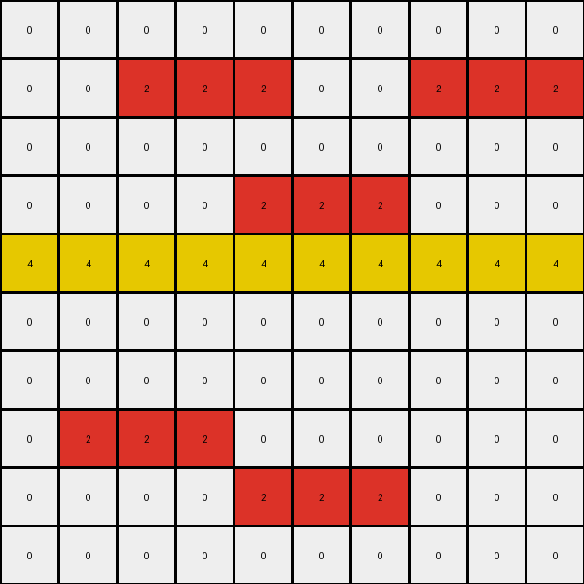

# AboveBelow4 • 011 • refine_dreamer

---

Previous Code:
```python
"""
1. Identify Objects: Divide the input grid into distinct objects, where each object is a contiguous region of pixels of the same color.
2. Find Border Pixels: For each object, identify its border pixels. In this case, a border pixel is defined as a pixel within the object that has a horizontal neighbor (left or right) *that is part of a different object or the edge of the grid*.
3. Determine Trigger and Insert Colors: From the training set inputs and outputs, locate pairs of pixels that are horizontally adjacent. One pixel from each pair will be the *trigger*, and the other will be the *insert*. Record all unique trigger, insert pairs.
4. Conditional Insertion:
    * Iterate through all trigger, insert color pairs found in step 3.
    * Locate the border pixels of each object in the input_grid.
    * If a border pixel is a trigger color, check its immediate horizontal neighbors.
        *  If a horizontal neighbor is not the same as either the *trigger* or *insert* color, change that neighboring pixel's color to the *insert* color.
"""

import numpy as np
from collections import deque

def find_objects(grid):
    """Finds all contiguous objects in a grid."""
    rows, cols = grid.shape
    visited = set()
    objects = []

    def bfs(r, c, color):
        """Performs breadth-first search to find contiguous pixels of the same color."""
        obj = []
        queue = deque([(r, c)])
        visited.add((r, c))

        while queue:
            row, col = queue.popleft()
            obj.append((row, col))

            for dr, dc in [(0, 1), (0, -1), (1, 0), (-1, 0)]:
                nr, nc = row + dr, col + dc
                if 0 <= nr < rows and 0 <= nc < cols and (nr, nc) not in visited and grid[nr, nc] == color:
                    queue.append((nr, nc))
                    visited.add((nr, nc))
        return obj

    for r in range(rows):
        for c in range(cols):
            if (r, c) not in visited:
                obj = bfs(r, c, grid[r, c])
                objects.append(obj)
    return objects

def find_horizontal_border_pixels(grid, object_pixels):
    """Finds border pixels with horizontal neighbors of a different color."""
    border_pixels = []
    rows, cols = grid.shape
    for r, c in object_pixels:
        # Check left neighbor
        if c > 0 and grid[r, c - 1] != grid[r, c]:
            border_pixels.append((r, c))
            continue  # Avoid double-counting
        # Check right neighbor
        if c < cols - 1 and grid[r, c + 1] != grid[r, c]:
            border_pixels.append((r, c))
    return border_pixels

def get_trigger_insert_pairs(input_grid, output_grid):
    """
    Identifies pairs of (trigger_color, insert_color) based on horizontal adjacency
    changes between the input and output grids.
    """

    rows, cols = input_grid.shape
    pairs = set()

    for r in range(rows):
        for c in range(cols):
            # Check right neighbor
            if c < cols - 1:
                if input_grid[r,c] != output_grid[r,c] or input_grid[r, c+1] != output_grid[r,c+1]:
                    # something changed here
                    if input_grid[r,c] != input_grid[r,c+1]:
                        # different colors
                        if input_grid[r,c] == output_grid[r,c] and input_grid[r,c+1] != output_grid[r,c+1]:
                            # right changed
                            pairs.add( (input_grid[r,c], output_grid[r,c+1]) )
                        if input_grid[r,c+1] == output_grid[r,c+1] and input_grid[r,c] != output_grid[r,c]:
                            # left changed
                            pairs.add( (input_grid[r,c+1], output_grid[r,c]))

    return pairs

def transform(input_grid, input_grid_2=None, output_grid_2=None): # Added extra example grids
    """Transforms the input grid according to the described rule."""
    output_grid = np.copy(input_grid)
    rows, cols = input_grid.shape

    # 1. Find Objects
    objects = find_objects(input_grid)

    # 2. Determine Trigger-Insert Pairs (using both examples)
    trigger_insert_pairs = get_trigger_insert_pairs(input_grid, output_grid)
    if input_grid_2 is not None and output_grid_2 is not None:
         pairs2 = get_trigger_insert_pairs(input_grid_2, output_grid_2)
         trigger_insert_pairs = trigger_insert_pairs.union(pairs2)

    # 3. Iterate and apply transformations
    for obj in objects:
        # 3a. Find Horizontal Border Pixels
        border_pixels = find_horizontal_border_pixels(input_grid, obj)

        # 3b. Apply insertion rules
        for trigger_color, insert_color in trigger_insert_pairs:
            for r, c in border_pixels:
                if input_grid[r, c] == trigger_color:
                    # Check left neighbor
                    if c > 0 and input_grid[r, c - 1] != trigger_color and input_grid[r, c - 1] != insert_color:
                        output_grid[r, c - 1] = insert_color
                    # Check right neighbor
                    if c < cols - 1 and input_grid[r, c + 1] != trigger_color and input_grid[r, c + 1] != insert_color:
                        output_grid[r, c + 1] = insert_color

    return output_grid
```

Train Set Results:

## Example 1:

Input:
```
0 0 0 0 0 0 0 0 0 0
0 0 2 2 2 0 0 2 2 2
0 0 0 0 0 0 0 0 0 0
0 0 0 0 2 2 2 0 0 0
4 4 4 4 4 4 4 4 4 4
0 0 0 0 0 0 0 0 0 0
0 0 0 0 0 0 0 0 0 0
0 2 2 2 0 0 0 0 0 0
0 0 0 0 2 2 2 0 0 0
0 0 0 0 0 0 0 0 0 0
```
Expected Output:
```
0 0 0 0 0 0 0 0 0 0
0 0 4 2 2 0 0 4 2 2
0 0 0 0 0 0 0 0 0 0
0 0 0 0 4 2 2 0 0 0
4 4 4 4 4 4 4 4 4 4
0 0 0 0 0 0 0 0 0 0
0 0 0 0 0 0 0 0 0 0
0 2 2 4 0 0 0 0 0 0
0 0 0 0 2 2 4 0 0 0
0 0 0 0 0 0 0 0 0 0
```
Transformed Output:
```
0 0 0 0 0 0 0 0 0 0
0 0 2 2 2 0 0 2 2 2
0 0 0 0 0 0 0 0 0 0
0 0 0 0 2 2 2 0 0 0
4 4 4 4 4 4 4 4 4 4
0 0 0 0 0 0 0 0 0 0
0 0 0 0 0 0 0 0 0 0
0 2 2 2 0 0 0 0 0 0
0 0 0 0 2 2 2 0 0 0
0 0 0 0 0 0 0 0 0 0
```

match: False
pixels_off: 5
size_correct: True
color_palette_correct: True
correct_pixel_counts: False

## Example 2:

Input:
```
0 0 3 3 3 0 0 0 0 0 0 0
0 0 0 0 0 0 0 3 3 3 0 0
6 6 6 6 6 6 6 6 6 6 6 6
0 0 0 0 0 0 0 0 0 0 0 0
0 0 0 0 0 0 0 0 0 0 0 0
0 0 0 0 0 0 3 3 3 3 3 3
0 0 0 0 0 0 0 0 0 0 0 0
0 0 0 0 0 0 0 0 0 0 0 0
0 0 0 0 0 0 0 0 0 0 0 0
```
Expected Output:
```
0 0 6 3 3 0 0 0 0 0 0 0
0 0 0 0 0 0 0 6 3 3 0 0
6 6 6 6 6 6 6 6 6 6 6 6
0 0 0 0 0 0 0 0 0 0 0 0
0 0 0 0 0 0 0 0 0 0 0 0
0 0 0 0 0 0 3 3 3 3 3 6
0 0 0 0 0 0 0 0 0 0 0 0
0 0 0 0 0 0 0 0 0 0 0 0
0 0 0 0 0 0 0 0 0 0 0 0
```
Transformed Output:
```
0 0 3 3 3 0 0 0 0 0 0 0
0 0 0 0 0 0 0 3 3 3 0 0
6 6 6 6 6 6 6 6 6 6 6 6
0 0 0 0 0 0 0 0 0 0 0 0
0 0 0 0 0 0 0 0 0 0 0 0
0 0 0 0 0 0 3 3 3 3 3 3
0 0 0 0 0 0 0 0 0 0 0 0
0 0 0 0 0 0 0 0 0 0 0 0
0 0 0 0 0 0 0 0 0 0 0 0
```

match: False
pixels_off: 3
size_correct: True
color_palette_correct: True
correct_pixel_counts: False
**INSTRUCTIONS**

The code above was generated based on observations from the first training
example

we have tested the transform function on each of the task example inputs and
compared with the expected output

review each of the examples provided and the results and consider how the
natural language program should be updated to accommodate this new knowledge

respond with the following deliverables:

- general assessment of the information provided and strategy for resolving the
  errors
- gather metrics about each of the examples and results - use code_execution to
  develop accurate reports on your assumptions
- a YAML block documenting facts - Focus on identifying objects, their properties, and the actions performed on them.
- a natural language program - Be as clear and concise as possible, providing a complete description of the transformation rule.


your responses should be considered as information in a report - not a
conversation
