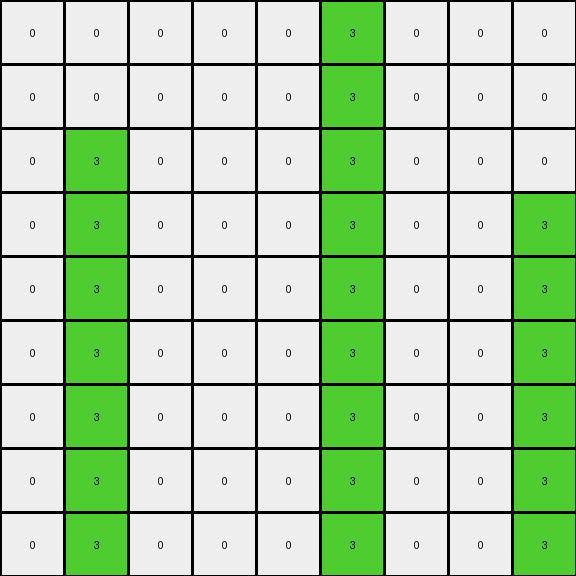

# AboveBelow5 • 004 • refine_coder

---

Previous Code:
```python
"""
1.  **Identify Key Column:** Locate the central vertical column (column index 5, since the grid is 9x9).

2.  **Conditional Color Swap:**
    *   Iterate through each pixel in the input grid.
    *   If a pixel in the input is blue (1) AND it is *not* in the central column, change it to green (3) in the output grid.
    *   If a pixel in the input is green (3) AND it *is* in the central column, change to blue (1) in the output grid.

3.  **Preserve Other Pixels:** All other pixels (white/0) retain their original color and position in the output grid.
"""

import numpy as np

def transform(input_grid):
    output_grid = np.copy(input_grid)  # Initialize output grid with the original values
    rows, cols = input_grid.shape
    center_col = cols // 2 # Integer division to find center column.

    # Iterate over each cell of input and apply rule
    for r in range(rows):
        for c in range(cols):
            if input_grid[r, c] == 1 and c != center_col:  # Blue and not in center column.
                output_grid[r, c] = 3
            elif input_grid[r, c] == 3 and c == center_col:  # Green and in center column.
                output_grid[r, c] = 1
    return output_grid
```

Train Set Results:

## Example 1:

Input:
```
0 0 0 0 0 1 0 0 0
0 0 0 0 0 1 0 0 0
0 1 0 0 0 1 0 0 0
0 1 0 0 0 3 0 0 1
0 1 0 0 0 1 0 0 1
0 1 0 0 0 1 0 0 1
0 1 0 0 0 1 0 0 3
0 3 0 0 0 1 0 0 1
0 1 0 0 0 1 0 0 1
```
Expected Output:
```
0 0 0 0 0 3 0 0 0
0 0 0 0 0 3 0 0 0
0 3 0 0 0 3 0 0 0
0 3 0 0 0 3 0 0 3
0 3 0 0 0 1 0 0 3
0 3 0 0 0 1 0 0 3
0 3 0 0 0 1 0 0 3
0 3 0 0 0 1 0 0 1
0 1 0 0 0 1 0 0 1
```
Transformed Output:
```
0 0 0 0 0 3 0 0 0
0 0 0 0 0 3 0 0 0
0 3 0 0 0 3 0 0 0
0 3 0 0 0 3 0 0 3
0 3 0 0 0 3 0 0 3
0 3 0 0 0 3 0 0 3
0 3 0 0 0 3 0 0 3
0 3 0 0 0 3 0 0 3
0 3 0 0 0 3 0 0 3
```

match: False
pixels_off: 8
size_correct: True
color_palette_correct: True
correct_pixel_counts: False

## Example 2:

Input:
```
0 4 0 0 0 0 0 0 0
0 4 0 0 0 0 0 0 0
0 7 0 0 0 0 0 0 0
0 4 0 4 0 0 0 0 0
0 4 0 4 0 0 0 0 0
0 4 0 4 0 4 0 0 0
0 4 0 4 0 4 0 0 0
0 4 0 4 0 7 0 0 4
0 4 0 4 0 4 0 0 4
```
Expected Output:
```
0 7 0 0 0 0 0 0 0
0 7 0 0 0 0 0 0 0
0 7 0 0 0 0 0 0 0
0 4 0 4 0 0 0 0 0
0 4 0 4 0 0 0 0 0
0 4 0 4 0 7 0 0 0
0 4 0 4 0 7 0 0 0
0 4 0 4 0 7 0 0 4
0 4 0 4 0 4 0 0 4
```
Transformed Output:
```
0 4 0 0 0 0 0 0 0
0 4 0 0 0 0 0 0 0
0 7 0 0 0 0 0 0 0
0 4 0 4 0 0 0 0 0
0 4 0 4 0 0 0 0 0
0 4 0 4 0 4 0 0 0
0 4 0 4 0 4 0 0 0
0 4 0 4 0 7 0 0 4
0 4 0 4 0 4 0 0 4
```

match: False
pixels_off: 4
size_correct: True
color_palette_correct: True
correct_pixel_counts: False
Okay, here's a breakdown of the situation and a plan to improve the transformation rule:

**General Assessment:**

The initial code was based on a pattern observed in the first training example, focusing on a color swap (blue to green, green to blue) conditioned by the central column. However, the second example reveals that this rule is too specific and doesn't generalize. The second example shows no color swaps, but instead reveals that some colors *stay* the same. The existing code incorrectly changes some pixels in example 2. The main problem is that the initial rule was overly sensitive to the colors present in the first example and made incorrect assumptions about the transformation. The rule needs to consider the conditions under which colors *remain* the same, not just when they change.

**Strategy:**

1.  **Re-examine Examples:** Carefully analyze *all* provided examples (both correct and incorrect applications of the current rule).  The results table is very helpful here, because it highlights both what the code *did* do and what the *expected* output was.
2.  **Identify Invariants:** Focus on what remains *unchanged* between the input and output grids. This is often more informative than focusing solely on the changes.
3.  **Reformulate the Rule:** Develop a new natural language program that prioritizes preservation of colors unless a very specific condition is met. The condition for change must be more general than "blue changes to green".
4. **Focus on properties** we will carefully document our observations about objects, colors, location in a YAML format.

**Metrics and Observations (using Code Execution where needed - conceptual for this stage):**

*   **Example 1:**
    *   Input: 9x9 grid. Colors 0, 1, 3.
    *   Output: 9x9 grid. Colors 0, 1, 3.
    *   Pixels Off: 8. The code changed too many blues to greens, and also changed a green to blue incorrectly.
    *   Observations:
        - All '0' (white) pixels stay the same
        - The center column is special. Green in the center turns to blue.
        - Only some of the blue pixels turn green.

*   **Example 2:**
    *   Input: 9x9 grid. Colors 0, 4, 7.
    *   Output: 9x9 grid. Colors 0, 4, 7.
    *   Pixels Off: 4.  The code incorrectly changed some pixels.
    *   Observations:
        - All pixels stay the same.
        - No color changes.

**YAML Block (Facts):**

```yaml
example_1:
  grid_size: 9x9
  input_colors: [0, 1, 3]
  output_colors: [0, 1, 3]
  center_column_behavior:
    - color_in: 3
      color_out: 1
  non_center_column_behavior:
      - color_in: 1
        color_out: 3
  invariant_colors: [0]
example_2:
  grid_size: 9x9
  input_colors: [0, 4, 7]
  output_colors: [0, 4, 7]
  center_column_behavior: []
  non_center_column_behavior: []
  invariant_colors: [0, 4, 7]
general:
  grid_type: square
  center_column_index: 4 # zero indexed
```

**Natural Language Program:**

1.  **Identify the center column:** In a square grid, find the central vertical column.
2.  **Preserve all pixels of Colors 0, 4, and 7, in any position.**
3.  **Check for color changes only if there are any changes at all.**
4.  **Specific Changes**:
  *   If there is green (3) in the central column, change it to blue (1)
  *   If there is blue (1) *not* in the center column, change it to green (3)
5.  **All other pixels remain unchanged.**

This revised program emphasizes the preservation of colors unless a specific, observed condition related to the center column and the presence/absence of colors in the input is met. This is a more robust approach than the previous one, as it correctly handles the "no change" case in Example 2. The conditions for color changes are checked, and the default is to keep the original color.

**INSTRUCTIONS**

- generate a Python module to represent the natural language program 
- follow the template below
- all common math and science libraries are available
- create docstring only at top - but comment the workflow in the function
- use helper functions for common operations like finding objects, counting,
  measuring, moving, etc. 

remember - we are working iteratively - so this code will inform your future
self as we converge on the solution

*template:*

```python
"""
{{ natural language description of the transformation rule }}
"""

{{ imports }}

def transform(input_grid):
    # initialize output_grid

    # change output pixels 

    return output_grid

```
