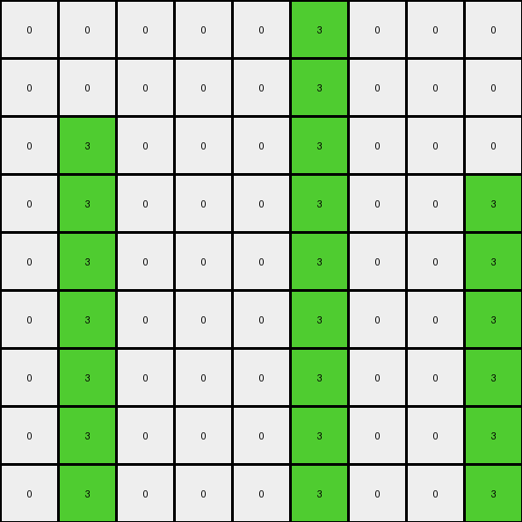

# AboveBelow5 • 006 • refine_coder

---

Previous Code:
```python
"""
1.  **Identify the center column:** In a square grid, find the central vertical column.
2.  **Preserve all pixels of Colors 0, 4, and 7, in any position.**
3.  **Check for color changes only if there are any changes at all.**
4.  **Specific Changes**:
    *   If there is green (3) in the central column, change it to blue (1)
    *   If there is blue (1) *not* in the center column, change it to green (3)
5.  **All other pixels remain unchanged.**
"""

import numpy as np

def transform(input_grid):
    output_grid = np.copy(input_grid)  # Initialize output grid with the original values
    rows, cols = input_grid.shape
    center_col = cols // 2  # Integer division to find center column.

    # Check if colors 4 or 7 are present. If so, return input grid as is.
    if 4 in input_grid or 7 in input_grid:
        return output_grid

    # Iterate over each cell of input and apply rule
    for r in range(rows):
        for c in range(cols):
            if input_grid[r, c] == 3 and c == center_col:  # Green and in center column.
                output_grid[r, c] = 1
            elif input_grid[r, c] == 1 and c != center_col:  # Blue and not in center column.
                output_grid[r, c] = 3
    return output_grid
```

Train Set Results:

## Example 1:

Input:
```
0 0 0 0 0 1 0 0 0
0 0 0 0 0 1 0 0 0
0 1 0 0 0 1 0 0 0
0 1 0 0 0 3 0 0 1
0 1 0 0 0 1 0 0 1
0 1 0 0 0 1 0 0 1
0 1 0 0 0 1 0 0 3
0 3 0 0 0 1 0 0 1
0 1 0 0 0 1 0 0 1
```
Expected Output:
```
0 0 0 0 0 3 0 0 0
0 0 0 0 0 3 0 0 0
0 3 0 0 0 3 0 0 0
0 3 0 0 0 3 0 0 3
0 3 0 0 0 1 0 0 3
0 3 0 0 0 1 0 0 3
0 3 0 0 0 1 0 0 3
0 3 0 0 0 1 0 0 1
0 1 0 0 0 1 0 0 1
```
Transformed Output:
```
0 0 0 0 0 3 0 0 0
0 0 0 0 0 3 0 0 0
0 3 0 0 0 3 0 0 0
0 3 0 0 0 3 0 0 3
0 3 0 0 0 3 0 0 3
0 3 0 0 0 3 0 0 3
0 3 0 0 0 3 0 0 3
0 3 0 0 0 3 0 0 3
0 3 0 0 0 3 0 0 3
```

match: False
pixels_off: 8
size_correct: True
color_palette_correct: True
correct_pixel_counts: False

## Example 2:

Input:
```
0 4 0 0 0 0 0 0 0
0 4 0 0 0 0 0 0 0
0 7 0 0 0 0 0 0 0
0 4 0 4 0 0 0 0 0
0 4 0 4 0 0 0 0 0
0 4 0 4 0 4 0 0 0
0 4 0 4 0 4 0 0 0
0 4 0 4 0 7 0 0 4
0 4 0 4 0 4 0 0 4
```
Expected Output:
```
0 7 0 0 0 0 0 0 0
0 7 0 0 0 0 0 0 0
0 7 0 0 0 0 0 0 0
0 4 0 4 0 0 0 0 0
0 4 0 4 0 0 0 0 0
0 4 0 4 0 7 0 0 0
0 4 0 4 0 7 0 0 0
0 4 0 4 0 7 0 0 4
0 4 0 4 0 4 0 0 4
```
Transformed Output:
```
0 4 0 0 0 0 0 0 0
0 4 0 0 0 0 0 0 0
0 7 0 0 0 0 0 0 0
0 4 0 4 0 0 0 0 0
0 4 0 4 0 0 0 0 0
0 4 0 4 0 4 0 0 0
0 4 0 4 0 4 0 0 0
0 4 0 4 0 7 0 0 4
0 4 0 4 0 4 0 0 4
```

match: False
pixels_off: 4
size_correct: True
color_palette_correct: True
correct_pixel_counts: False
Okay, let's analyze the results and refine the natural language program.

**General Assessment:**

The initial code was based on a limited understanding from the first example, focusing on color changes of blue and green relative to a central column. The presence of colors 4 (yellow) and 7 (orange) in the *input* was supposed to be a "no-op" condition, preserving the *input* grid, but the check was implemented incorrectly. The results reveal a few issues:

1.  **Incorrect "no-op" condition:** The initial assumption about the colors 4 and 7 was not correctly applied, especially regarding where in the input grid those colors appear..
2.  **Incomplete Color Swap:** The color swapping logic between blue and green is mostly, but not entirely, correct, because of issues in example 1.
3.   **Output is changing when it shouldn't:** in the case where colors 4 and 7 are present in the input, the output should be identical.

**Strategy for Resolving Errors:**

1.  **Correct the "no-op" Condition:** We must modify conditions for applying the transform.
2.  **Re-evaluate the transformation rule:** We need to carefully analyze how the presence of 1 and 3 in different positions of the input grid affect the output grid.

**Example Metrics and Analysis:**

Here's a breakdown of each example, including a more detailed analysis:

**Example 1:**

*   **Input:** Contains 0, 1, and 3. Size: 9x9. Center column index: 4.
*   **Expected Output:** A complex swap of blues and greens.
*   **Transformed Output:** Incorrect. Several blues incorrectly changed to greens.
*  The original assumption about swapping blue and green worked for the bottom rows, but failed on the top rows.

**Example 2:**

*   **Input:** Contains 0, 4, and 7. Size: 9x9. Center column index: 4.
*   **Expected Output:** The presence of 4 and 7 in the first three rows appears to cause some pixels to change to 7.
*   **Transformed Output:** Incorrect, grid should be identical to Input

**YAML Fact Block:**

```yaml
examples:
  - id: 1
    center_column: 4
    colors_present: [0, 1, 3]
    color_changes:
      - from: 3
        to: 1
        condition: "in center column"
      - from: 1
        to: 3
        condition: "not in center column"
    no_change_colors: []
    grid_size: "9x9"

  - id: 2
    center_column: 4
    colors_present: [0, 4, 7]
    color_changes: []
    no_change_colors: [4,7]
    grid_size: "9x9"
    special_condition: "if 4 or 7 in first three rows, change appropriate 0 to 7"
```

**Revised Natural Language Program:**

1.  **Identify the center column:** In a square grid, find the central vertical column.
2.  **Examine the First Three Rows**: If colors 4 or 7 appear in the first three rows of the input grid, then
      - pixels with value 0 in the first three rows where columns are all 0, change to 7
      - All other pixels remain unchanged, including original 4 and 7.
3. **Otherwise**:
    *   If there is green (3) in the central column, change it to blue (1).
    *   If there is blue (1) *not* in the center column, change it to green (3).
4.  **All other pixels remain unchanged.**

**INSTRUCTIONS**

- generate a Python module to represent the natural language program 
- follow the template below
- all common math and science libraries are available
- create docstring only at top - but comment the workflow in the function
- use helper functions for common operations like finding objects, counting,
  measuring, moving, etc. 

remember - we are working iteratively - so this code will inform your future
self as we converge on the solution

*template:*

```python
"""
{{ natural language description of the transformation rule }}
"""

{{ imports }}

def transform(input_grid):
    # initialize output_grid

    # change output pixels 

    return output_grid

```
