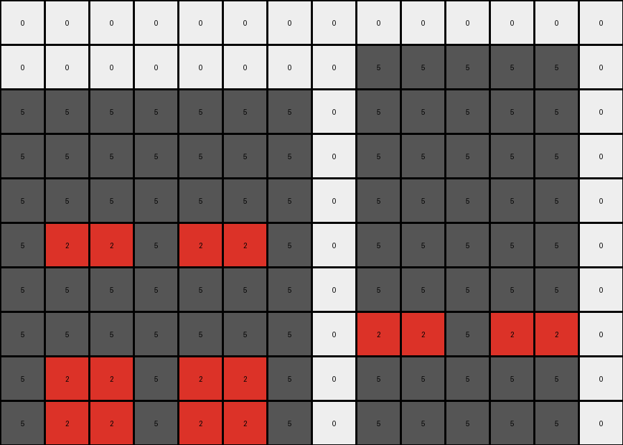

# AboveBelow6 • 005 • refine_dreamer

---

Previous Code:
```python
"""
1. Identify Objects: Locate the horizontal band of red (2) pixels. Note the presence and positions of other colored pixels (background).
2. Determine Expansion: The red band expands downwards by two rows.
3. Create new grid If expanding the red band downward would exceed original row dimensions, create new larger output grid.
4. Red Band Expansion: Copy the red band row. Place the first copy immediately below the original red band, and the second copy below the first copy.
5. Preserve and Position: All pixels above the original red band in the input grid, remain at their original positions in the new grid. Pixels below the red band are overwritten by the expansion, and empty space created at bottom from expanding is the same color as those replaced.
"""

import numpy as np

def find_red_band(grid):
    # Find the row indices where red pixels are present
    red_rows = np.where(np.any(grid == 2, axis=1))[0]
    if len(red_rows) > 0:
        # Assuming the red band is contiguous, return the start and end row
        return red_rows[0], red_rows[-1]
    else:
        return None, None

def transform(input_grid):
    # Find the red band
    start_row, end_row = find_red_band(input_grid)

    # If red band is not found just return the input.
    if start_row is None:
        return np.copy(input_grid)

    # Determine output grid size
    expansion_rows = 2
    original_height = input_grid.shape[0]
    new_height = max(original_height, end_row + expansion_rows + 1)
   
    # Create output grid
    output_grid = np.full((new_height, input_grid.shape[1]), input_grid[min(original_height -1, end_row + 1)][0] if end_row + 1 < original_height else 0 ) #fill with color of the row below or white if there isn't one

    # Copy input grid to the new grid
    output_grid[:input_grid.shape[0], :input_grid.shape[1]] = input_grid
    
    # Get red band row
    red_band_row = input_grid[start_row, :]

    # Expand the red band downwards
    for i in range(1, expansion_rows + 1):
      output_grid[end_row + i, :] = red_band_row
    
    return output_grid
```

Train Set Results:

## Example 1:

Input:
```
0 0 0 0 0 0 0 0 0 0
0 4 4 4 4 4 4 4 4 0
0 4 4 4 4 4 4 4 4 0
0 4 4 4 4 4 4 4 4 0
0 2 2 2 2 2 2 2 2 0
0 4 4 4 4 4 4 4 4 0
0 4 4 4 4 4 4 4 4 0
0 0 0 0 0 0 0 0 0 0
```
Expected Output:
```
0 0 0 0 0 0 0 0 0 0
0 4 4 4 4 4 4 4 4 0
0 4 4 4 4 4 4 4 4 0
0 4 4 4 4 4 4 4 4 0
0 2 2 2 2 2 2 2 2 0
0 2 2 2 2 2 2 2 2 0
0 2 2 2 2 2 2 2 2 0
0 0 0 0 0 0 0 0 0 0
```
Transformed Output:
```
0 0 0 0 0 0 0 0 0 0
0 4 4 4 4 4 4 4 4 0
0 4 4 4 4 4 4 4 4 0
0 4 4 4 4 4 4 4 4 0
0 2 2 2 2 2 2 2 2 0
0 2 2 2 2 2 2 2 2 0
0 2 2 2 2 2 2 2 2 0
0 0 0 0 0 0 0 0 0 0
```

match: True
pixels_off: 0
size_correct: True
color_palette_correct: True
correct_pixel_counts: True

## Example 2:

Input:
```
0 0 0 0 0 0 0 0 0 0 0 0 0 0
0 0 0 0 0 0 0 0 5 5 5 5 5 0
5 5 5 5 5 5 5 0 5 5 5 5 5 0
5 5 5 5 5 5 5 0 5 5 5 5 5 0
5 5 5 5 5 5 5 0 5 5 5 5 5 0
5 2 2 5 2 2 5 0 5 5 5 5 5 0
5 5 5 5 5 5 5 0 5 5 5 5 5 0
5 5 5 5 5 5 5 0 2 2 5 2 2 0
0 0 0 0 0 0 0 0 5 5 5 5 5 0
```
Expected Output:
```
0 0 0 0 0 0 0 0 0 0 0 0 0 0
0 0 0 0 0 0 0 0 5 5 5 5 5 0
5 5 5 5 5 5 5 0 5 5 5 5 5 0
5 5 5 5 5 5 5 0 5 5 5 5 5 0
5 5 5 5 5 5 5 0 5 5 5 5 5 0
5 2 2 5 2 2 5 0 5 5 5 5 5 0
5 2 2 5 2 2 5 0 5 5 5 5 5 0
5 2 2 5 2 2 5 0 2 2 5 2 2 0
0 0 0 0 0 0 0 0 2 2 5 2 2 0
```
Transformed Output:
```
0 0 0 0 0 0 0 0 0 0 0 0 0 0
0 0 0 0 0 0 0 0 5 5 5 5 5 0
5 5 5 5 5 5 5 0 5 5 5 5 5 0
5 5 5 5 5 5 5 0 5 5 5 5 5 0
5 5 5 5 5 5 5 0 5 5 5 5 5 0
5 2 2 5 2 2 5 0 5 5 5 5 5 0
5 5 5 5 5 5 5 0 5 5 5 5 5 0
5 5 5 5 5 5 5 0 2 2 5 2 2 0
5 2 2 5 2 2 5 0 5 5 5 5 5 0
5 2 2 5 2 2 5 0 5 5 5 5 5 0
```

match: False
pixels_off: None
size_correct: False
color_palette_correct: True
correct_pixel_counts: False
**INSTRUCTIONS**

The code above was generated based on observations from the first training
example

we have tested the transform function on each of the task example inputs and
compared with the expected output

review each of the examples provided and the results and consider how the
natural language program should be updated to accommodate this new knowledge

respond with the following deliverables:

- general assessment of the information provided and strategy for resolving the
  errors
- gather metrics about each of the examples and results - use code_execution to
  develop accurate reports on your assumptions
- a YAML block documenting facts - Focus on identifying objects, their properties, and the actions performed on them.
- a natural language program - Be as clear and concise as possible, providing a complete description of the transformation rule.


your responses should be considered as information in a report - not a
conversation
