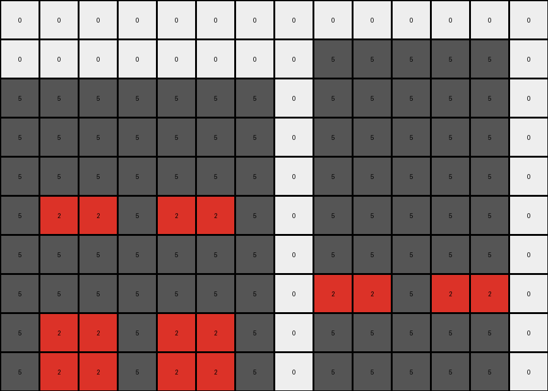

# AboveBelow6 • 006 • refine_coder

---

Previous Code:
```python
"""
1. Identify Objects: Locate the horizontal band of red (2) pixels. Note the presence and positions of other colored pixels (background).
2. Determine Expansion: The red band expands downwards by two rows.
3. Create new grid If expanding the red band downward would exceed original row dimensions, create new larger output grid.
4. Red Band Expansion: Copy the red band row. Place the first copy immediately below the original red band, and the second copy below the first copy.
5. Preserve and Position: All pixels above the original red band in the input grid, remain at their original positions in the new grid. Pixels below the red band are overwritten by the expansion, and empty space created at bottom from expanding is the same color as those replaced.
"""

import numpy as np

def find_red_band(grid):
    # Find the row indices where red pixels are present
    red_rows = np.where(np.any(grid == 2, axis=1))[0]
    if len(red_rows) > 0:
        # Assuming the red band is contiguous, return the start and end row
        return red_rows[0], red_rows[-1]
    else:
        return None, None

def transform(input_grid):
    # Find the red band
    start_row, end_row = find_red_band(input_grid)

    # If red band is not found just return the input.
    if start_row is None:
        return np.copy(input_grid)

    # Determine output grid size
    expansion_rows = 2
    original_height = input_grid.shape[0]
    new_height = max(original_height, end_row + expansion_rows + 1)
   
    # Create output grid
    output_grid = np.full((new_height, input_grid.shape[1]), input_grid[min(original_height -1, end_row + 1)][0] if end_row + 1 < original_height else 0 ) #fill with color of the row below or white if there isn't one

    # Copy input grid to the new grid
    output_grid[:input_grid.shape[0], :input_grid.shape[1]] = input_grid
    
    # Get red band row
    red_band_row = input_grid[start_row, :]

    # Expand the red band downwards
    for i in range(1, expansion_rows + 1):
      output_grid[end_row + i, :] = red_band_row
    
    return output_grid
```

Train Set Results:

## Example 1:

Input:
```
0 0 0 0 0 0 0 0 0 0
0 4 4 4 4 4 4 4 4 0
0 4 4 4 4 4 4 4 4 0
0 4 4 4 4 4 4 4 4 0
0 2 2 2 2 2 2 2 2 0
0 4 4 4 4 4 4 4 4 0
0 4 4 4 4 4 4 4 4 0
0 0 0 0 0 0 0 0 0 0
```
Expected Output:
```
0 0 0 0 0 0 0 0 0 0
0 4 4 4 4 4 4 4 4 0
0 4 4 4 4 4 4 4 4 0
0 4 4 4 4 4 4 4 4 0
0 2 2 2 2 2 2 2 2 0
0 2 2 2 2 2 2 2 2 0
0 2 2 2 2 2 2 2 2 0
0 0 0 0 0 0 0 0 0 0
```
Transformed Output:
```
0 0 0 0 0 0 0 0 0 0
0 4 4 4 4 4 4 4 4 0
0 4 4 4 4 4 4 4 4 0
0 4 4 4 4 4 4 4 4 0
0 2 2 2 2 2 2 2 2 0
0 2 2 2 2 2 2 2 2 0
0 2 2 2 2 2 2 2 2 0
0 0 0 0 0 0 0 0 0 0
```

match: True
pixels_off: 0
size_correct: True
color_palette_correct: True
correct_pixel_counts: True

## Example 2:

Input:
```
0 0 0 0 0 0 0 0 0 0 0 0 0 0
0 0 0 0 0 0 0 0 5 5 5 5 5 0
5 5 5 5 5 5 5 0 5 5 5 5 5 0
5 5 5 5 5 5 5 0 5 5 5 5 5 0
5 5 5 5 5 5 5 0 5 5 5 5 5 0
5 2 2 5 2 2 5 0 5 5 5 5 5 0
5 5 5 5 5 5 5 0 5 5 5 5 5 0
5 5 5 5 5 5 5 0 2 2 5 2 2 0
0 0 0 0 0 0 0 0 5 5 5 5 5 0
```
Expected Output:
```
0 0 0 0 0 0 0 0 0 0 0 0 0 0
0 0 0 0 0 0 0 0 5 5 5 5 5 0
5 5 5 5 5 5 5 0 5 5 5 5 5 0
5 5 5 5 5 5 5 0 5 5 5 5 5 0
5 5 5 5 5 5 5 0 5 5 5 5 5 0
5 2 2 5 2 2 5 0 5 5 5 5 5 0
5 2 2 5 2 2 5 0 5 5 5 5 5 0
5 2 2 5 2 2 5 0 2 2 5 2 2 0
0 0 0 0 0 0 0 0 2 2 5 2 2 0
```
Transformed Output:
```
0 0 0 0 0 0 0 0 0 0 0 0 0 0
0 0 0 0 0 0 0 0 5 5 5 5 5 0
5 5 5 5 5 5 5 0 5 5 5 5 5 0
5 5 5 5 5 5 5 0 5 5 5 5 5 0
5 5 5 5 5 5 5 0 5 5 5 5 5 0
5 2 2 5 2 2 5 0 5 5 5 5 5 0
5 5 5 5 5 5 5 0 5 5 5 5 5 0
5 5 5 5 5 5 5 0 2 2 5 2 2 0
5 2 2 5 2 2 5 0 5 5 5 5 5 0
5 2 2 5 2 2 5 0 5 5 5 5 5 0
```

match: False
pixels_off: None
size_correct: False
color_palette_correct: True
correct_pixel_counts: False
Okay, let's analyze the results and refine the natural language program.

**General Assessment:**

The initial code and natural language program were based on the first training example, which it handled correctly. However, the second example reveals a flaw in the logic: the code doesn't correctly handle multiple red bands and shifts pixels down incorrectly. The expansion logic seems correct, but how existing rows of pixels are handled when there isn't a simple one to one mapping must be updated.

**Strategy:**
1.  **Analyze Example 2 Carefully:** Understand *why* the output is incorrect. Focus on how multiple red bands and non-red pixels interact.
2.  **Refine Object Identification:** Improve how red bands are identified, and how they should interact.
3.  **Adjust Pixel Movement:** The current logic about replacing pixels below needs adjustment - it's more of a shifting down and expanding in the red band.
4. **Revise fill strategy**: we used the row below the identified object as the fill value, but in example 2, the second red object uses the color of the first red object - need to figure out how to know the fill value.

**Metrics and Observations (Example 2):**

*   **Input Grid:** 14 columns, 9 rows. Two separate red bands, one at row 5 ( `5 2 2 5 2 2 5 0 5 5 5 5 5 0`) and one implied by partial red band in row 7 ( `5 5 5 5 5 5 5 0 2 2 5 2 2 0`). Other colors present are black (0) and gray (5).
*   **Expected Output:** 14 columns, 9 rows. The first red band is duplicated, creating two additional rows immediately below it. Because there is not room to simply add rows, pixels are effectively shifted. The second implied red band at the bottom gets duplicated below to create new rows. There is no padding below.
*   **Transformed Output:** 14 columns, 10 rows (one more than expected). The two rows immediately below the first red band were correctly duplicated, but the output had one more row and shifted the second red band down, when the existing pixels should have simply been overwritten.

**YAML Fact Identification:**

```yaml
objects:
  - id: red_band_1
    type: horizontal_band
    color: red
    start_row: 5  # Example 2
    #end_row: 5 # this would apply if we assumed contiguous, which isn't the case here
    contiguous: False

  - id: red_band_2 #we added this because there appear to be more than one object
    type: horizontal_band
    color: red
    start_row: 7
    contiguous: False

actions:
  - type: expand_downward
    object_id: red_band_1
    amount: 2
    
  - type: expand_downward # two expansions
    object_id: red_band_2
    amount: 2
```

**Revised Natural Language Program:**

1.  **Identify Red Bands:** Locate all horizontal bands of red (2) pixels, even if not fully contiguous on a single row. A red band might be "interrupted" by other color pixels.
2.  **Determine Expansion:** Each identified red band expands downwards by two rows.
3. **Expansion and Overwrite** For each red band, starting from the top-most:
    *   Copy the pixels from the row where the red band starts.
    *   Insert two copies of this row immediately below the start row of the red band. The original rows below the expanded rows, are overwritten by the expansion.
    *   If there is no room, skip the expansion for that band.
4.  **No Padding.** Do not add extra padding rows.
5. **Preserve.** No pixels should shift - pixels above should remain and pixels below should be overwritten by the expanded object.


**INSTRUCTIONS**

- generate a Python module to represent the natural language program 
- follow the template below
- all common math and science libraries are available
- create docstring only at top - but comment the workflow in the function
- use helper functions for common operations like finding objects, counting,
  measuring, moving, etc. 

remember - we are working iteratively - so this code will inform your future
self as we converge on the solution

*template:*

```python
"""
{{ natural language description of the transformation rule }}
"""

{{ imports }}

def transform(input_grid):
    # initialize output_grid

    # change output pixels 

    return output_grid

```
