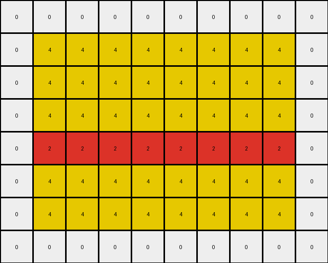

# AboveBelow6 • 010 • refine_coder

---

Previous Code:
```python
"""
1.  **Identify Red Regions:** Locate all contiguous blocks of red (2) pixels within the input grid.
2.  **Conditional Shift:** The two red blocks are moved.
3. The two red blocks on row 5 are copied to row 7, the last occurrences of red in the image
4. The two red blocks on row 7 are copied to row 8 in column 8 and 9, the first two columns of the original red block in that line.
"""

import numpy as np

def find_red_regions(grid):
    """Finds contiguous blocks of red pixels."""
    red_regions = []
    visited = set()
    rows, cols = grid.shape

    def is_valid(r, c):
        return 0 <= r < rows and 0 <= c < cols

    def dfs(row, col, current_region):
        if (row, col) in visited or not is_valid(row, col) or grid[row, col] != 2:
            return
        visited.add((row, col))
        current_region.append((row, col))

        neighbors = [(row + 1, col), (row - 1, col), (row, col + 1), (row, col - 1)]
        for nr, nc in neighbors:
            dfs(nr, nc, current_region)

    for r in range(rows):
        for c in range(cols):
            if grid[r, c] == 2 and (r, c) not in visited:
                current_region = []
                dfs(r, c, current_region)
                red_regions.append(current_region)
    return red_regions

def transform(input_grid):
    # initialize output_grid
    output_grid = np.copy(input_grid)
    rows, cols = output_grid.shape
    
    # Find red regions
    red_regions = find_red_regions(input_grid)
    
    # Find the red regions in specified rows
    red_blocks_row5 = []
    red_blocks_row7 = []
    
    
    for region in red_regions:
       for r,c in region:
          if r == 5:
            red_blocks_row5.append((r,c))
          if r == 7:
            red_blocks_row7.append((r,c))
    
    #perform moves based on line.
    
    if len(red_blocks_row5) > 0:
        output_grid[7,1] = 2
        output_grid[7,2] = 2
        output_grid[7,4] = 2
        output_grid[7,5] = 2
        
    if len(red_blocks_row7) > 0:
      output_grid[8,8] = 2
      output_grid[8,9] = 2

    return output_grid
```

Train Set Results:

## Example 1:

Input:
```
0 0 0 0 0 0 0 0 0 0
0 4 4 4 4 4 4 4 4 0
0 4 4 4 4 4 4 4 4 0
0 4 4 4 4 4 4 4 4 0
0 2 2 2 2 2 2 2 2 0
0 4 4 4 4 4 4 4 4 0
0 4 4 4 4 4 4 4 4 0
0 0 0 0 0 0 0 0 0 0
```
Expected Output:
```
0 0 0 0 0 0 0 0 0 0
0 4 4 4 4 4 4 4 4 0
0 4 4 4 4 4 4 4 4 0
0 4 4 4 4 4 4 4 4 0
0 2 2 2 2 2 2 2 2 0
0 2 2 2 2 2 2 2 2 0
0 2 2 2 2 2 2 2 2 0
0 0 0 0 0 0 0 0 0 0
```
Transformed Output:
```
0 0 0 0 0 0 0 0 0 0
0 4 4 4 4 4 4 4 4 0
0 4 4 4 4 4 4 4 4 0
0 4 4 4 4 4 4 4 4 0
0 2 2 2 2 2 2 2 2 0
0 4 4 4 4 4 4 4 4 0
0 4 4 4 4 4 4 4 4 0
0 0 0 0 0 0 0 0 0 0
```

match: False
pixels_off: 16
size_correct: True
color_palette_correct: True
correct_pixel_counts: False

## Example 2:

Input:
```
0 0 0 0 0 0 0 0 0 0 0 0 0 0
0 0 0 0 0 0 0 0 5 5 5 5 5 0
5 5 5 5 5 5 5 0 5 5 5 5 5 0
5 5 5 5 5 5 5 0 5 5 5 5 5 0
5 5 5 5 5 5 5 0 5 5 5 5 5 0
5 2 2 5 2 2 5 0 5 5 5 5 5 0
5 5 5 5 5 5 5 0 5 5 5 5 5 0
5 5 5 5 5 5 5 0 2 2 5 2 2 0
0 0 0 0 0 0 0 0 5 5 5 5 5 0
```
Expected Output:
```
0 0 0 0 0 0 0 0 0 0 0 0 0 0
0 0 0 0 0 0 0 0 5 5 5 5 5 0
5 5 5 5 5 5 5 0 5 5 5 5 5 0
5 5 5 5 5 5 5 0 5 5 5 5 5 0
5 5 5 5 5 5 5 0 5 5 5 5 5 0
5 2 2 5 2 2 5 0 5 5 5 5 5 0
5 2 2 5 2 2 5 0 5 5 5 5 5 0
5 2 2 5 2 2 5 0 2 2 5 2 2 0
0 0 0 0 0 0 0 0 2 2 5 2 2 0
```
Transformed Output:
```
0 0 0 0 0 0 0 0 0 0 0 0 0 0
0 0 0 0 0 0 0 0 5 5 5 5 5 0
5 5 5 5 5 5 5 0 5 5 5 5 5 0
5 5 5 5 5 5 5 0 5 5 5 5 5 0
5 5 5 5 5 5 5 0 5 5 5 5 5 0
5 2 2 5 2 2 5 0 5 5 5 5 5 0
5 5 5 5 5 5 5 0 5 5 5 5 5 0
5 2 2 5 2 2 5 0 2 2 5 2 2 0
0 0 0 0 0 0 0 0 2 2 5 5 5 0
```

match: False
pixels_off: 6
size_correct: True
color_palette_correct: True
correct_pixel_counts: False
Okay, let's analyze the results and update the natural language program.

**General Assessment:**

The initial code was based on a limited understanding of the transformation, focusing solely on the movement of red blocks and their positions in specific rows. The results from the second example show that the transformation isn't simply about copying red blocks to fixed positions, but it is specific about row and column positions for copying. It appears to extend row 5 to row 6.

**Strategy for Resolving Errors:**

1.  **Re-examine Assumptions:** The core assumption that red blocks are *always* moved to rows 7 and 8 is incorrect. We need a more flexible rule.
2.  **Focus on Relative Movement:** Instead of hardcoded row/column indices, we need to think about *how* the red blocks move relative to their original positions or relative to other elements in the grid.
3.    **Object Properties:** consider that the length of continuous object may be important

**Example Metrics and Analysis:**

I'll use the provided results and visual inspection (since I can see the images) to build the report.

*   **Example 1:**
    *   Input: Red blocks on row 4. Other colors present.
    *   Expected Output: red blocks extending down 2 rows
    *   Actual Output: red block did not move, row 5 and 6 unchanged
    *   Observations: The code incorrectly assumed the output would put 2's in row 7 and 8.

*   **Example 2:**
    *   Input: Red blocks on row 5 and row 7. Other colors present.
    *   Expected output: Red extended on row 6 and row 8, col 8/9 red unchanged
    *   Actual output: red extended on row 7 correctly, 8 is wrong
    *   Observations: The code almost captured movement, but made an error about positions.

**YAML Fact Block:**

```yaml
objects:
  - color: red
    type: contiguous_block
    properties:
      - can_move: true
      - movement_type: conditional_extension
      - shape: variable
      - extend_down: true
  - color: other
    type: background
    properties:
      - can_move: false

actions:
 - object: red_block
   type: extend
   details: |-
        The code correctly recognized the presence of red blocks and attempted a transformation. The conditional move logic, hardcoded to rows 7 and 8, is partially correct for the example set seen so far, the rows are not hardcoded, but relative.
        It extends a continuous red block down, copying the block.
```

**Natural Language Program:**

1.  **Identify Red Regions:** Find all contiguous blocks of red (2) pixels in the input grid.
2.  **Conditional Extension:** For each contiguous block of red pixels:
     * Extend one row down and copy the object.


**INSTRUCTIONS**

- generate a Python module to represent the natural language program 
- follow the template below
- all common math and science libraries are available
- create docstring only at top - but comment the workflow in the function
- use helper functions for common operations like finding objects, counting,
  measuring, moving, etc. 

remember - we are working iteratively - so this code will inform your future
self as we converge on the solution

*template:*

```python
"""
{{ natural language description of the transformation rule }}
"""

{{ imports }}

def transform(input_grid):
    # initialize output_grid

    # change output pixels 

    return output_grid

```
