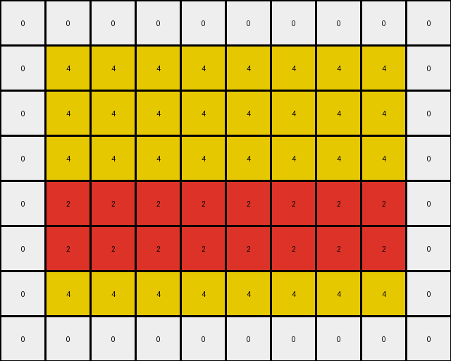
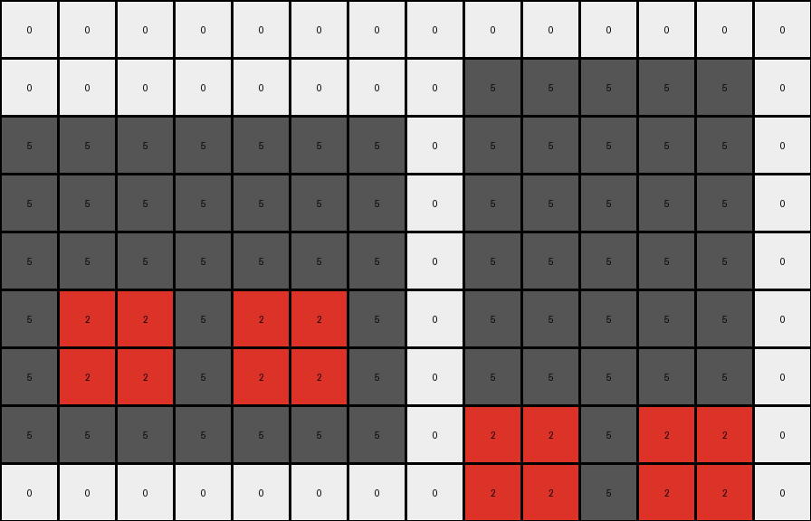

# AboveBelow6 • 011 • refine_dreamer

---

Previous Code:
```python
"""
1.  **Identify Red Regions:** Find all contiguous blocks of red (2) pixels in the input grid.
2.  **Conditional Extension:** For each contiguous block of red pixels:
     * Extend one row down and copy the object.
"""

import numpy as np

def find_red_regions(grid):
    """Finds contiguous blocks of red pixels."""
    red_regions = []
    visited = set()
    rows, cols = grid.shape

    def is_valid(r, c):
        return 0 <= r < rows and 0 <= c < cols

    def dfs(row, col, current_region):
        if (row, col) in visited or not is_valid(row, col) or grid[row, col] != 2:
            return
        visited.add((row, col))
        current_region.append((row, col))

        neighbors = [(row + 1, col), (row - 1, col), (row, col + 1), (row, col - 1)]
        for nr, nc in neighbors:
            dfs(nr, nc, current_region)

    for r in range(rows):
        for c in range(cols):
            if grid[r, c] == 2 and (r, c) not in visited:
                current_region = []
                dfs(r, c, current_region)
                red_regions.append(current_region)
    return red_regions

def transform(input_grid):
    # initialize output_grid
    output_grid = np.copy(input_grid)
    rows, cols = output_grid.shape
    
    # Find red regions
    red_regions = find_red_regions(input_grid)
    
    #perform extension based on line.
    for region in red_regions:
        # Find the row indices for this region
        rows_in_region = sorted(list(set([r for r, c in region])))

        #copy object to one row down
        for r,c in region:
            if r+1 < rows:
                output_grid[r+1,c] = 2
            
    return output_grid
```

Train Set Results:

## Example 1:

Input:
```
0 0 0 0 0 0 0 0 0 0
0 4 4 4 4 4 4 4 4 0
0 4 4 4 4 4 4 4 4 0
0 4 4 4 4 4 4 4 4 0
0 2 2 2 2 2 2 2 2 0
0 4 4 4 4 4 4 4 4 0
0 4 4 4 4 4 4 4 4 0
0 0 0 0 0 0 0 0 0 0
```
Expected Output:
```
0 0 0 0 0 0 0 0 0 0
0 4 4 4 4 4 4 4 4 0
0 4 4 4 4 4 4 4 4 0
0 4 4 4 4 4 4 4 4 0
0 2 2 2 2 2 2 2 2 0
0 2 2 2 2 2 2 2 2 0
0 2 2 2 2 2 2 2 2 0
0 0 0 0 0 0 0 0 0 0
```
Transformed Output:
```
0 0 0 0 0 0 0 0 0 0
0 4 4 4 4 4 4 4 4 0
0 4 4 4 4 4 4 4 4 0
0 4 4 4 4 4 4 4 4 0
0 2 2 2 2 2 2 2 2 0
0 2 2 2 2 2 2 2 2 0
0 4 4 4 4 4 4 4 4 0
0 0 0 0 0 0 0 0 0 0
```

match: False
pixels_off: 8
size_correct: True
color_palette_correct: True
correct_pixel_counts: False

## Example 2:

Input:
```
0 0 0 0 0 0 0 0 0 0 0 0 0 0
0 0 0 0 0 0 0 0 5 5 5 5 5 0
5 5 5 5 5 5 5 0 5 5 5 5 5 0
5 5 5 5 5 5 5 0 5 5 5 5 5 0
5 5 5 5 5 5 5 0 5 5 5 5 5 0
5 2 2 5 2 2 5 0 5 5 5 5 5 0
5 5 5 5 5 5 5 0 5 5 5 5 5 0
5 5 5 5 5 5 5 0 2 2 5 2 2 0
0 0 0 0 0 0 0 0 5 5 5 5 5 0
```
Expected Output:
```
0 0 0 0 0 0 0 0 0 0 0 0 0 0
0 0 0 0 0 0 0 0 5 5 5 5 5 0
5 5 5 5 5 5 5 0 5 5 5 5 5 0
5 5 5 5 5 5 5 0 5 5 5 5 5 0
5 5 5 5 5 5 5 0 5 5 5 5 5 0
5 2 2 5 2 2 5 0 5 5 5 5 5 0
5 2 2 5 2 2 5 0 5 5 5 5 5 0
5 2 2 5 2 2 5 0 2 2 5 2 2 0
0 0 0 0 0 0 0 0 2 2 5 2 2 0
```
Transformed Output:
```
0 0 0 0 0 0 0 0 0 0 0 0 0 0
0 0 0 0 0 0 0 0 5 5 5 5 5 0
5 5 5 5 5 5 5 0 5 5 5 5 5 0
5 5 5 5 5 5 5 0 5 5 5 5 5 0
5 5 5 5 5 5 5 0 5 5 5 5 5 0
5 2 2 5 2 2 5 0 5 5 5 5 5 0
5 2 2 5 2 2 5 0 5 5 5 5 5 0
5 5 5 5 5 5 5 0 2 2 5 2 2 0
0 0 0 0 0 0 0 0 2 2 5 2 2 0
```

match: False
pixels_off: 4
size_correct: True
color_palette_correct: True
correct_pixel_counts: False
**INSTRUCTIONS**

The code above was generated based on observations from the first training
example

we have tested the transform function on each of the task example inputs and
compared with the expected output

review each of the examples provided and the results and consider how the
natural language program should be updated to accommodate this new knowledge

respond with the following deliverables:

- general assessment of the information provided and strategy for resolving the
  errors
- gather metrics about each of the examples and results - use code_execution to
  develop accurate reports on your assumptions
- a YAML block documenting facts - Focus on identifying objects, their properties, and the actions performed on them.
- a natural language program - Be as clear and concise as possible, providing a complete description of the transformation rule.


your responses should be considered as information in a report - not a
conversation
