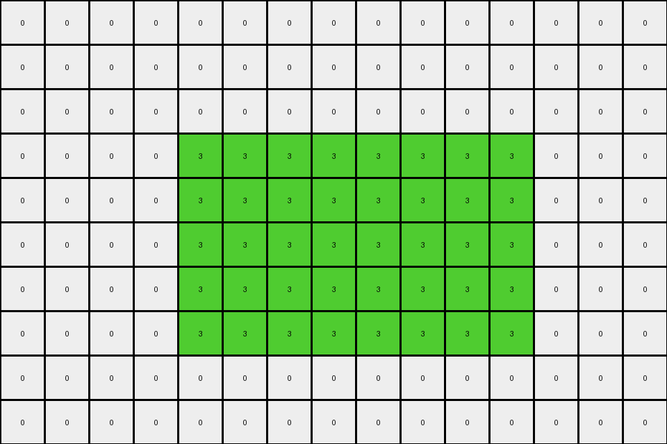

# AboveBelow7 • 004 • refine_coder

---

Previous Code:
```python
"""
The transformation rule is to swap the vertical positions of a yellow rectangle and a green U-shape within the grid, while preserving their shapes and keeping the white background unchanged.
"""

import numpy as np

def find_object(grid, color, shape_type):
    """
    Finds an object of specified color and shape type in the grid.
    Returns a list of (row, col) coordinates of the object's pixels.
    """
    coords = []
    if shape_type == "rectangle":
        rows, cols = np.where(grid == color)
        if len(rows) > 0:
            min_row, max_row = np.min(rows), np.max(rows)
            min_col, max_col = np.min(cols), np.max(cols)
            for r in range(min_row, max_row + 1):
                for c in range(min_col, max_col + 1):
                    coords.append((r, c))
    elif shape_type == "U-shape":
        rows, cols = np.where(grid == color)
        if len(rows) > 0:
            min_row, max_row = np.min(rows), np.max(rows)
            min_col, max_col = np.min(cols), np.max(cols)
            for r in range(min_row, max_row + 1):
                for c in range(min_col, max_col + 1):
                    coords.append((r, c)) # Add all points for now, refine U-shape detection later if needed
    return coords

def transform(input_grid):
    # Initialize output grid as a copy of the input grid
    output_grid = np.copy(input_grid)

    # Find the yellow rectangle
    yellow_coords = find_object(input_grid, 4, "rectangle")

    # Find the green U-shape
    green_coords = find_object(input_grid, 3, "U-shape")
    
    # Clear the original positions of the yellow rectangle and green structure in the output grid
    for r, c in yellow_coords:
        output_grid[r, c] = 0
    for r, c in green_coords:
        output_grid[r, c] = 0        

    # Calculate the vertical shift needed for swapping
    yellow_min_row = min(r for r, c in yellow_coords)
    green_min_row = min(r for r, c in green_coords)
    shift = green_min_row - yellow_min_row

    # Move yellow rectangle down
    for r, c in yellow_coords:
        output_grid[r + shift, c] = 4

    # move the green structure up
    shift = yellow_min_row - green_min_row
    for r, c in green_coords:
        output_grid[r + shift, c] = 3


    return output_grid
```

Train Set Results:

## Example 1:

Input:
```
0 0 0 0 0 0 0 0 0 0 0 0 0 0 0
0 0 0 0 0 0 0 0 0 0 0 0 0 0 0
0 0 0 0 0 0 0 0 0 0 0 0 0 0 0
0 0 0 0 4 4 4 4 4 4 4 4 0 0 0
0 0 0 0 3 3 3 3 3 3 3 3 0 0 0
0 0 0 0 3 0 0 0 0 0 0 3 0 0 0
0 0 0 0 3 0 0 0 0 0 0 3 0 0 0
0 0 0 0 3 0 0 0 0 0 0 3 0 0 0
0 0 0 0 3 3 3 3 3 3 3 3 0 0 0
0 0 0 0 0 0 0 0 0 0 0 0 0 0 0
```
Expected Output:
```
0 0 0 0 0 0 0 0 0 0 0 0 0 0 0
0 0 0 0 0 0 0 0 0 0 0 0 0 0 0
0 0 0 0 0 0 0 0 0 0 0 0 0 0 0
0 0 0 0 0 0 0 0 0 0 0 0 0 0 0
0 0 0 0 3 3 3 3 3 3 3 3 0 0 0
0 0 0 0 3 0 0 0 0 0 0 3 0 0 0
0 0 0 0 3 0 0 0 0 0 0 3 0 0 0
0 0 0 0 3 0 0 0 0 0 0 3 0 0 0
0 0 0 0 3 3 3 3 3 3 3 3 0 0 0
0 0 0 0 4 4 4 4 4 4 4 4 0 0 0
```
Transformed Output:
```
0 0 0 0 0 0 0 0 0 0 0 0 0 0 0
0 0 0 0 0 0 0 0 0 0 0 0 0 0 0
0 0 0 0 0 0 0 0 0 0 0 0 0 0 0
0 0 0 0 3 3 3 3 3 3 3 3 0 0 0
0 0 0 0 3 3 3 3 3 3 3 3 0 0 0
0 0 0 0 3 3 3 3 3 3 3 3 0 0 0
0 0 0 0 3 3 3 3 3 3 3 3 0 0 0
0 0 0 0 3 3 3 3 3 3 3 3 0 0 0
0 0 0 0 0 0 0 0 0 0 0 0 0 0 0
0 0 0 0 0 0 0 0 0 0 0 0 0 0 0
```

match: False
pixels_off: 42
size_correct: True
color_palette_correct: True
correct_pixel_counts: False

## Example 2:

Input:
```
0 0 0 8 8 0 0 0 0 0 0 0
0 0 8 8 8 8 0 0 0 8 0 0
0 8 8 8 8 8 8 0 8 8 8 0
0 2 2 2 2 2 2 0 2 2 2 0
0 2 0 0 0 0 2 0 2 0 2 0
0 2 0 0 0 0 2 0 2 0 2 0
0 2 0 0 0 0 2 0 2 0 2 0
0 2 0 0 0 0 2 0 2 2 2 0
0 2 2 2 2 2 2 0 0 0 0 0
0 0 0 0 0 0 0 0 0 0 0 0
0 0 0 0 0 0 0 0 0 0 0 0
0 0 0 0 0 0 0 0 0 0 0 0
0 0 0 0 0 0 0 0 0 0 0 0
0 0 0 0 0 0 0 0 0 0 0 0
```
Expected Output:
```
0 0 0 0 0 0 0 0 0 0 0 0
0 0 0 0 0 0 0 0 0 0 0 0
0 0 0 0 0 0 0 0 0 0 0 0
0 2 2 2 2 2 2 0 2 2 2 0
0 2 0 0 0 0 2 0 2 0 2 0
0 2 0 0 0 0 2 0 2 0 2 0
0 2 0 0 0 0 2 0 2 0 2 0
0 2 0 0 0 0 2 0 2 2 2 0
0 2 2 2 2 2 2 0 0 8 0 0
0 0 0 8 8 0 0 0 8 8 8 0
0 0 8 8 8 8 0 0 0 0 0 0
0 8 8 8 8 8 8 0 0 0 0 0
0 0 0 0 0 0 0 0 0 0 0 0
0 0 0 0 0 0 0 0 0 0 0 0
```
match: ERROR: min() arg is an empty sequence
pixels_off: None
size_correct: None
color_palette_correct: None
correct_pixel_counts: None
Okay, let's analyze the results and refine the natural language program.

**General Assessment:**

The initial strategy of swapping the vertical positions of the yellow rectangle and green U-shape was on the right track, but the implementation has several issues:

1.  **Incorrect Object Identification (Especially U-shape):** The `find_object` function, particularly for the "U-shape," simply identifies all pixels of the specified color. It doesn't distinguish the actual shape. This is evident in Example 1, where the green pixels are spread across the entire row instead of maintaining the U-shape.
2.  **Error in Example 2:** The code throws an error because it likely fails to find either a yellow rectangle or a green U-shape, leading to an empty sequence when calculating `min_row`. This suggests that the code should handle cases where an object might be missing. Example 2 swaps a yellow rectangle and red 'U'.
3. **Object Definition and overlap:** The code does not define the U shape well and overlaps it with other objects of the same color.

**Strategy for Resolution:**

1.  **Improve Object Identification:** Refine the `find_object` function to correctly identify rectangles and U-shapes. This will involve checking for contiguity and specific spatial relationships between pixels. Consider adding parameters to ensure the identified object is connected.
2.  **Handle Missing Objects:** Add error handling or default behavior to the `transform` function to gracefully handle cases where one or both of the target objects are not found.
3.  **Generalized Object Colors**: Account for different colors in different examples (green and red).
4. **Precise Swapping:** Ensure the swapping logic maintains the original shapes and only affects the target objects.

**Example Metrics and Analysis:**

Here's a breakdown of each example:

*   **Example 1:**
    *   **Input:** Yellow rectangle and green U-shape.
    *   **Expected Output:** Positions swapped.
    *   **Actual Output:** Green pixels spread across rows.
    *   **Issues:** Incorrect U-shape identification, incorrect swapping logic (spreading green).
    *  Object Identification did a poor job of identifying the u-shape.

*   **Example 2:**
    *   **Input:** Yellow rectangle and red U-shape.
    *   **Expected Output:** Positions swapped.
    *   **Actual Output:** Error: `min() arg is an empty sequence`
    *   **Issues:** Object not found (either yellow rectangle or red "U").

**YAML Facts:**

```yaml
objects:
  - name: rectangle_1
    color: yellow  # Example 1: yellow, Example 2: yellow
    shape: rectangle
    properties:
      - contiguous: true
      - top_left: [row, col] # To be determined during code execution
      - bottom_right: [row, col] # To be determined
  - name: u_shape_1
    color: dynamic  # Example 1: green, Example 2: red
    shape: u-shape
    properties:
      - contiguous: true # pixels are connected
      - open_side: top # the U opens towards the top.
      - top_left: [row, col]
      - bottom_right: [row, col]

actions:
  - type: swap_vertical_position
    objects: [rectangle_1, u_shape_1]
    description: Swap the vertical positions of the rectangle and the U-shape, maintaining their original shapes.
```

**Natural Language Program:**

1.  **Identify Objects:**
    *   Find a rectangle object (contiguous block of pixels of the same color). Record its color, top-left, and bottom-right coordinates.
    *   Find a U-shaped object (contiguous block of pixels forming a 'U' shape, opening upwards). Record its color, and bounding box. The color may vary.
2.  **Handle Missing Objects:**
    *   If either the rectangle or the U-shape is not found, return the input grid unchanged.
3. **Determine new position:**
    * Find the top most row of the rectangle.
    * Find the top most row of the U-shape.
4.  **Swap Positions:**
    *   Clear the original positions of both objects in the output grid.
    *   Redraw the rectangle at the original vertical position of the U-shape.
    *   Redraw the U-shape at the original vertical position of the rectangle.
5.  **Preserve Other Pixels:**
    * Ensure all other pixels in the grid remain unchanged.

This improved natural language program provides a much more robust and accurate description of the transformation, addressing the observed issues. It also includes more specific instructions.

**INSTRUCTIONS**

- generate a Python module to represent the natural language program 
- follow the template below
- all common math and science libraries are available
- create docstring only at top - but comment the workflow in the function
- use helper functions for common operations like finding objects, counting,
  measuring, moving, etc. 

remember - we are working iteratively - so this code will inform your future
self as we converge on the solution

*template:*

```python
"""
{{ natural language description of the transformation rule }}
"""

{{ imports }}

def transform(input_grid):
    # initialize output_grid

    # change output pixels 

    return output_grid

```
