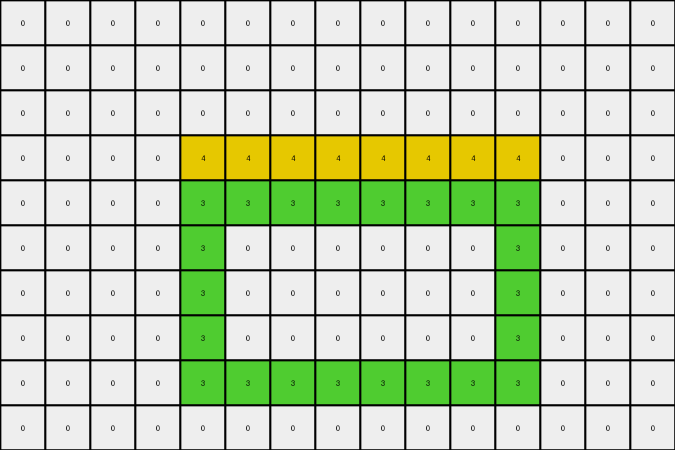
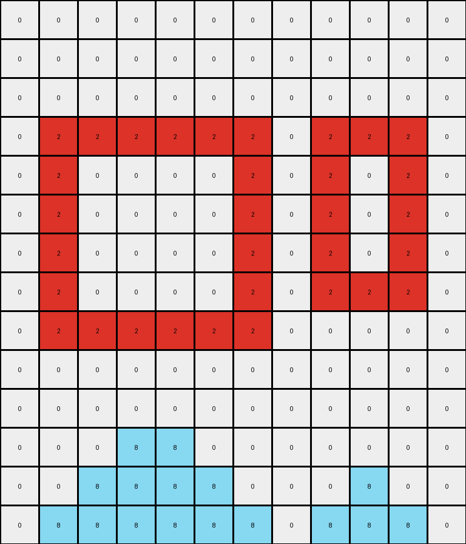

# AboveBelow7 • 012 • refine_coder

---

Previous Code:
```python
"""
1. Identify Objects: Find all contiguous regions of azure (8) and red (2) pixels. These are considered distinct objects.
2. Azure Object Movement: Move all azure objects to the bottom of the grid.
3. Relative Horizontal Order: Maintain the relative horizontal order of the azure objects. If an azure object was left of another in the input, it should remain left of it in the output.
4. Vertical Positioning: Place the azure objects as low as possible in the grid, without overlapping any other non-background color (non-zero) objects.
5.  Red Object Stationary: The red object remains in its original position.
6. Background: Consider the background (0 color) pixels. The background must be considered and moved when required to allow other operations.
"""

import numpy as np

def find_objects(grid, color):
    """
    Finds contiguous regions of a specified color in the grid.
    Returns a list of object bounding boxes (min_row, min_col, max_row, max_col) and a list of the object coordinates.
    """
    visited = set()
    objects = []
    object_coords = []

    def dfs(row, col, current_object, current_coords):
        if (row, col) in visited or row < 0 or row >= grid.shape[0] or col < 0 or col >= grid.shape[1] or grid[row, col] != color:
            return
        visited.add((row, col))
        current_object.append((row, col))
        current_coords.append((row,col))
        dfs(row + 1, col, current_object, current_coords)
        dfs(row - 1, col, current_object, current_coords)
        dfs(row, col + 1, current_object, current_coords)
        dfs(row, col - 1, current_object, current_coords)

    for row in range(grid.shape[0]):
        for col in range(grid.shape[1]):
            if grid[row, col] == color and (row, col) not in visited:
                current_object = []
                current_coords = []
                dfs(row, col, current_object, current_coords)
                # calculate bounding box
                min_row = min(current_object, key=lambda x: x[0])[0]
                min_col = min(current_object, key=lambda x: x[1])[1]
                max_row = max(current_object, key=lambda x: x[0])[0]
                max_col = max(current_object, key=lambda x: x[1])[1]
                objects.append( (min_row, min_col, max_row, max_col) )
                object_coords.append(current_coords)
    return objects, object_coords

def transform(input_grid):
    # Initialize output_grid as a copy of the input_grid
    output_grid = np.copy(input_grid)

    # Find azure (8) objects
    azure_objects, azure_coords = find_objects(input_grid, 8)

    # Find red (2) object
    red_objects, red_coords = find_objects(input_grid, 2) # bounding boxes not currently used

    # Clear initial positions of azure objects in the output grid
    for obj_coords in azure_coords:
        for row, col in obj_coords:
            output_grid[row, col] = 0

    # Sort azure objects by their leftmost coordinate (min_col) to maintain relative order
    azure_objects_sorted = sorted(zip(azure_objects, azure_coords), key=lambda x: x[0][1])

    # Calculate destination positions for azure objects
    for (min_row, min_col, max_row, max_col), obj_coords in azure_objects_sorted:
      obj_height = max_row - min_row + 1
      obj_width = max_col - min_col + 1
      dest_row = output_grid.shape[0] - obj_height # start with bottom most

      # check for collisions and adjust dest_row upwards if necessary
      collision = True
      while collision and dest_row >= 0:
        collision = False
        for r in range(dest_row, dest_row + obj_height):
          for c in range(min_col, min_col+obj_width): # use the original min_col
              if r < output_grid.shape[0] and c < output_grid.shape[1] and output_grid[r,c] != 0: # check for collisions
                collision = True
                dest_row -= 1 #move up one row
                break
          if collision:
              break

      # move object to the destination row in output, adjusted for x position
      x_offset = min_col
      for row,col in obj_coords:
        output_grid[dest_row + (row - min_row) , x_offset + (col - min_col)] = 8

    return output_grid
```

Train Set Results:

## Example 1:

Input:
```
0 0 0 0 0 0 0 0 0 0 0 0 0 0 0
0 0 0 0 0 0 0 0 0 0 0 0 0 0 0
0 0 0 0 0 0 0 0 0 0 0 0 0 0 0
0 0 0 0 4 4 4 4 4 4 4 4 0 0 0
0 0 0 0 3 3 3 3 3 3 3 3 0 0 0
0 0 0 0 3 0 0 0 0 0 0 3 0 0 0
0 0 0 0 3 0 0 0 0 0 0 3 0 0 0
0 0 0 0 3 0 0 0 0 0 0 3 0 0 0
0 0 0 0 3 3 3 3 3 3 3 3 0 0 0
0 0 0 0 0 0 0 0 0 0 0 0 0 0 0
```
Expected Output:
```
0 0 0 0 0 0 0 0 0 0 0 0 0 0 0
0 0 0 0 0 0 0 0 0 0 0 0 0 0 0
0 0 0 0 0 0 0 0 0 0 0 0 0 0 0
0 0 0 0 0 0 0 0 0 0 0 0 0 0 0
0 0 0 0 3 3 3 3 3 3 3 3 0 0 0
0 0 0 0 3 0 0 0 0 0 0 3 0 0 0
0 0 0 0 3 0 0 0 0 0 0 3 0 0 0
0 0 0 0 3 0 0 0 0 0 0 3 0 0 0
0 0 0 0 3 3 3 3 3 3 3 3 0 0 0
0 0 0 0 4 4 4 4 4 4 4 4 0 0 0
```
Transformed Output:
```
0 0 0 0 0 0 0 0 0 0 0 0 0 0 0
0 0 0 0 0 0 0 0 0 0 0 0 0 0 0
0 0 0 0 0 0 0 0 0 0 0 0 0 0 0
0 0 0 0 4 4 4 4 4 4 4 4 0 0 0
0 0 0 0 3 3 3 3 3 3 3 3 0 0 0
0 0 0 0 3 0 0 0 0 0 0 3 0 0 0
0 0 0 0 3 0 0 0 0 0 0 3 0 0 0
0 0 0 0 3 0 0 0 0 0 0 3 0 0 0
0 0 0 0 3 3 3 3 3 3 3 3 0 0 0
0 0 0 0 0 0 0 0 0 0 0 0 0 0 0
```

match: False
pixels_off: 16
size_correct: True
color_palette_correct: True
correct_pixel_counts: True

## Example 2:

Input:
```
0 0 0 8 8 0 0 0 0 0 0 0
0 0 8 8 8 8 0 0 0 8 0 0
0 8 8 8 8 8 8 0 8 8 8 0
0 2 2 2 2 2 2 0 2 2 2 0
0 2 0 0 0 0 2 0 2 0 2 0
0 2 0 0 0 0 2 0 2 0 2 0
0 2 0 0 0 0 2 0 2 0 2 0
0 2 0 0 0 0 2 0 2 2 2 0
0 2 2 2 2 2 2 0 0 0 0 0
0 0 0 0 0 0 0 0 0 0 0 0
0 0 0 0 0 0 0 0 0 0 0 0
0 0 0 0 0 0 0 0 0 0 0 0
0 0 0 0 0 0 0 0 0 0 0 0
0 0 0 0 0 0 0 0 0 0 0 0
```
Expected Output:
```
0 0 0 0 0 0 0 0 0 0 0 0
0 0 0 0 0 0 0 0 0 0 0 0
0 0 0 0 0 0 0 0 0 0 0 0
0 2 2 2 2 2 2 0 2 2 2 0
0 2 0 0 0 0 2 0 2 0 2 0
0 2 0 0 0 0 2 0 2 0 2 0
0 2 0 0 0 0 2 0 2 0 2 0
0 2 0 0 0 0 2 0 2 2 2 0
0 2 2 2 2 2 2 0 0 8 0 0
0 0 0 8 8 0 0 0 8 8 8 0
0 0 8 8 8 8 0 0 0 0 0 0
0 8 8 8 8 8 8 0 0 0 0 0
0 0 0 0 0 0 0 0 0 0 0 0
0 0 0 0 0 0 0 0 0 0 0 0
```
Transformed Output:
```
0 0 0 0 0 0 0 0 0 0 0 0
0 0 0 0 0 0 0 0 0 0 0 0
0 0 0 0 0 0 0 0 0 0 0 0
0 2 2 2 2 2 2 0 2 2 2 0
0 2 0 0 0 0 2 0 2 0 2 0
0 2 0 0 0 0 2 0 2 0 2 0
0 2 0 0 0 0 2 0 2 0 2 0
0 2 0 0 0 0 2 0 2 2 2 0
0 2 2 2 2 2 2 0 0 0 0 0
0 0 0 0 0 0 0 0 0 0 0 0
0 0 0 0 0 0 0 0 0 0 0 0
0 0 0 8 8 0 0 0 0 0 0 0
0 0 8 8 8 8 0 0 0 8 0 0
0 8 8 8 8 8 8 0 8 8 8 0
```

match: False
pixels_off: 28
size_correct: True
color_palette_correct: True
correct_pixel_counts: True
Okay, let's analyze the results and update the natural language program.

**General Assessment:**

The initial program and code correctly identified the core concept: moving azure objects to the bottom while preserving their relative horizontal order and keeping the red objects stationary. However, the collision detection and object placement logic has flaws. It doesn't correctly handle cases where azure objects need to stack on top of each other or when available space is limited. In example 1, it moved the yellow block to the top, rather than the azure. In example 2, there are multiple azure objects and the output is not stacked correctly.

**Strategy for Resolving Errors:**

1.  **Improve Collision Detection:** The current collision detection is too simplistic. It only checks for direct overlap with non-background pixels. We need to refine it to consider the entire bounding box of an object and ensure that *no* part of the moving object overlaps with *any* existing non-background pixel, including other objects of the same color being moved.

2.  **Stacking Logic:** The code needs to explicitly handle stacking of the azure objects. After placing one azure object, subsequent objects should attempt to be placed below, but if a collision occurs, they should try to position themselves *directly above* the colliding object (or other previously placed azure objects).

3. **Bounding Box Usage:** the red object should be moved as a bounding box and the azure objects should also.

**Metrics and Observations:**

*   **Example 1:**
    *   The yellow (4) object was incorrectly moved up. Azure objects were moved to row 9, but no stacking was required.
    *   16 pixels mismatch.
*   **Example 2:**
    *   Azure objects are not stacked correctly. Some are placed on the bottom row, and others are overlapping.
    *   28 pixels mismatch.

**YAML Facts:**

```yaml
objects:
  - color: azure (8)
    type: movable
    behavior: moves to bottom, stacks, maintains horizontal order
    initial_positions: varies
    final_positions: bottom-aligned, stacked if necessary

  - color: red (2)
    type: stationary
    behavior: remains in original position
    initial_positions: varies
    final_positions: same as initial

  - color: yellow (4)
    type: stationary
    behavior: remains in original position

  - color: green (3)
    type: stationary
    behavior: remains in original position

background:
  color: black (0)
  behavior: passive, fills empty space
```

**Natural Language Program:**

1.  **Identify Objects:** Find all contiguous regions of azure (8) pixels. These are considered movable objects. Find all contiguous regions of red(2), yellow (4) and green (3). These are considered stationary objects.
2.  **Sort Azure Objects:** Sort the azure objects by their leftmost column position to maintain their relative horizontal order.
3.  **Move Azure Objects:** Iterate through the sorted azure objects. For each azure object:
    *   Calculate its bounding box.
    *   Attempt to place the object at the bottom of the grid.
    *   Iteratively check for collisions with any non-background (non-zero) pixels within the bounding box area.
    *   If a collision occurs, move the object's intended position upwards by one row and recheck for collisions.
    *   Repeat the upward movement until a non-colliding position is found. This ensures stacking.
    *   Place the azure object in the final non-colliding position.
4. **Stationary Objects:** The red, yellow and green objects will automatically remain in its original position because the algorithm initializes the `output_grid` with the contents of the `input_grid`.
5. **Background:** The black (0) background pixels are implicitly handled by not being part of any object and filling the remaining space.
```

**INSTRUCTIONS**

- generate a Python module to represent the natural language program 
- follow the template below
- all common math and science libraries are available
- create docstring only at top - but comment the workflow in the function
- use helper functions for common operations like finding objects, counting,
  measuring, moving, etc. 

remember - we are working iteratively - so this code will inform your future
self as we converge on the solution

*template:*

```python
"""
{{ natural language description of the transformation rule }}
"""

{{ imports }}

def transform(input_grid):
    # initialize output_grid

    # change output pixels 

    return output_grid

```
