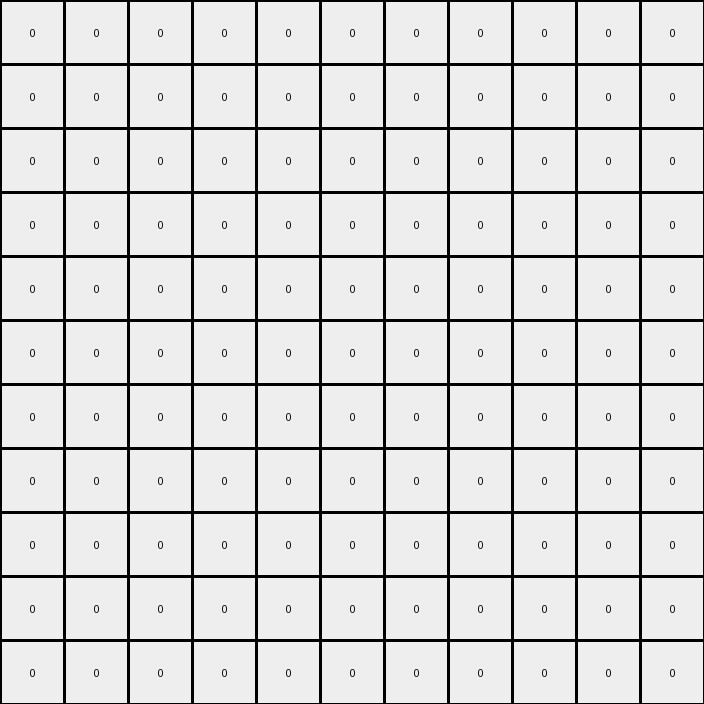
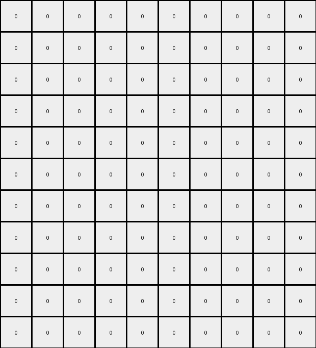

# AboveBelow8 • 003 • refine_dreamer

---

Previous Code:
```python
"""
Isolates a pre-existing vertical azure (8) column within the input grid, 
setting all other pixels to grey (0).
"""

import numpy as np

def find_vertical_column(grid, color):
    """
    Finds the x-coordinate of a vertical column of the specified color.
    Returns -1 if no such column is found.
    """
    height, width = grid.shape
    for x in range(width):
        is_column = True
        for y in range(height):
            if grid[y, x] != color:
                is_column = False
                break
        if is_column:
            return x
    return -1

def transform(input_grid):
    """
    Transforms the input grid by isolating the azure column and setting
    all other pixels to grey.
    """
    # Initialize the output grid with all grey pixels.
    output_grid = np.zeros_like(input_grid)

    # Find the x-coordinate of the azure (8) column.
    azure_column_x = find_vertical_column(input_grid, 8)

    # If an azure column is found, copy it to the output grid.
    if azure_column_x != -1:
        height = input_grid.shape[0]
        for y in range(height):
            output_grid[y, azure_column_x] = 8

    return output_grid
```

Train Set Results:

## Example 1:

Input:
```
0 0 0 0 0 0 0 0 0 0 0 0 0
0 0 0 0 0 0 0 0 0 0 0 0 0
0 0 0 0 0 0 0 0 0 0 0 0 0
0 3 8 8 3 3 3 3 3 3 3 3 0
0 3 3 8 3 3 3 3 3 3 3 3 0
0 6 6 8 6 6 6 6 6 6 6 6 0
0 6 6 8 6 6 6 6 6 6 6 6 0
0 7 7 8 8 8 7 7 7 7 7 7 0
0 7 7 7 7 8 7 7 7 7 7 7 0
0 4 4 4 4 8 8 4 4 4 4 4 0
0 4 4 4 4 4 8 8 8 8 4 4 0
```
Expected Output:
```
0 0 0 0 0 0 0 0 0 0 0 0 0
0 0 0 0 0 0 0 0 0 0 0 0 0
0 0 0 0 0 0 0 0 0 0 0 0 0
0 0 0 0 0 0 0 0 0 0 0 0 0
0 0 0 0 0 0 0 0 0 0 0 0 0
0 0 0 8 0 0 0 0 0 0 0 0 0
0 0 0 8 0 0 0 0 0 0 0 0 0
0 0 0 8 8 8 0 0 0 0 0 0 0
0 0 0 0 0 8 0 0 0 0 0 0 0
0 0 0 0 0 8 8 0 0 0 0 0 0
0 0 0 0 0 0 8 8 8 8 0 0 0
```
Transformed Output:
```
0 0 0 0 0 0 0 0 0 0 0 0 0
0 0 0 0 0 0 0 0 0 0 0 0 0
0 0 0 0 0 0 0 0 0 0 0 0 0
0 0 0 0 0 0 0 0 0 0 0 0 0
0 0 0 0 0 0 0 0 0 0 0 0 0
0 0 0 0 0 0 0 0 0 0 0 0 0
0 0 0 0 0 0 0 0 0 0 0 0 0
0 0 0 0 0 0 0 0 0 0 0 0 0
0 0 0 0 0 0 0 0 0 0 0 0 0
0 0 0 0 0 0 0 0 0 0 0 0 0
0 0 0 0 0 0 0 0 0 0 0 0 0
```

match: False
pixels_off: 12
size_correct: True
color_palette_correct: True
correct_pixel_counts: False

## Example 2:

Input:
```
3 3 3 3 8 8 8 8 8 8 3
3 3 3 3 8 3 3 3 3 3 3
2 2 2 2 8 8 8 8 2 2 2
2 2 2 2 2 2 2 8 2 2 2
7 7 7 7 7 7 7 8 7 7 7
7 7 7 7 7 7 7 8 7 7 7
7 7 7 7 8 8 8 8 7 7 7
9 9 9 8 8 9 9 9 9 9 9
1 1 1 8 1 1 1 1 1 1 1
1 1 1 8 8 1 1 1 1 1 1
1 1 1 1 8 8 8 1 1 1 1
```
Expected Output:
```
0 0 0 0 0 0 0 0 0 0 0
0 0 0 0 0 0 0 0 0 0 0
0 0 0 0 8 8 8 8 0 0 0
0 0 0 0 0 0 0 8 0 0 0
0 0 0 0 0 0 0 8 0 0 0
0 0 0 0 0 0 0 8 0 0 0
0 0 0 0 8 8 8 8 0 0 0
0 0 0 8 8 0 0 0 0 0 0
0 0 0 8 0 0 0 0 0 0 0
0 0 0 8 8 0 0 0 0 0 0
0 0 0 0 8 8 8 0 0 0 0
```
Transformed Output:
```
0 0 0 0 0 0 0 0 0 0 0
0 0 0 0 0 0 0 0 0 0 0
0 0 0 0 0 0 0 0 0 0 0
0 0 0 0 0 0 0 0 0 0 0
0 0 0 0 0 0 0 0 0 0 0
0 0 0 0 0 0 0 0 0 0 0
0 0 0 0 0 0 0 0 0 0 0
0 0 0 0 0 0 0 0 0 0 0
0 0 0 0 0 0 0 0 0 0 0
0 0 0 0 0 0 0 0 0 0 0
0 0 0 0 0 0 0 0 0 0 0
```

match: False
pixels_off: 19
size_correct: True
color_palette_correct: True
correct_pixel_counts: False

## Example 3:

Input:
```
0 0 0 0 0 0 0 0 0 0
0 3 8 8 8 3 3 3 3 0
0 3 3 3 8 3 3 3 3 0
0 3 8 8 8 3 3 3 3 0
0 3 8 3 3 3 3 3 3 0
0 3 8 3 3 3 3 3 3 0
0 1 8 8 1 1 1 1 1 0
0 1 1 8 1 1 1 1 1 0
0 1 1 8 8 8 8 1 1 0
0 1 1 1 1 1 8 1 1 0
0 0 0 0 0 0 0 0 0 0
```
Expected Output:
```
0 0 0 0 0 0 0 0 0 0
0 0 0 0 0 0 0 0 0 0
0 0 0 0 0 0 0 0 0 0
0 0 0 0 0 0 0 0 0 0
0 0 0 0 0 0 0 0 0 0
0 0 0 0 0 0 0 0 0 0
0 0 8 8 0 0 0 0 0 0
0 0 0 8 0 0 0 0 0 0
0 0 0 8 8 8 8 0 0 0
0 0 0 0 0 0 8 0 0 0
0 0 0 0 0 0 0 0 0 0
```
Transformed Output:
```
0 0 0 0 0 0 0 0 0 0
0 0 0 0 0 0 0 0 0 0
0 0 0 0 0 0 0 0 0 0
0 0 0 0 0 0 0 0 0 0
0 0 0 0 0 0 0 0 0 0
0 0 0 0 0 0 0 0 0 0
0 0 0 0 0 0 0 0 0 0
0 0 0 0 0 0 0 0 0 0
0 0 0 0 0 0 0 0 0 0
0 0 0 0 0 0 0 0 0 0
0 0 0 0 0 0 0 0 0 0
```

match: False
pixels_off: 8
size_correct: True
color_palette_correct: True
correct_pixel_counts: False
**INSTRUCTIONS**

The code above was generated based on observations from the first training
example

we have tested the transform function on each of the task example inputs and
compared with the expected output

review each of the examples provided and the results and consider how the
natural language program should be updated to accommodate this new knowledge

respond with the following deliverables:

- general assessment of the information provided and strategy for resolving the
  errors
- gather metrics about each of the examples and results - use code_execution to
  develop accurate reports on your assumptions
- a YAML block documenting facts - Focus on identifying objects, their properties, and the actions performed on them.
- a natural language program - Be as clear and concise as possible, providing a complete description of the transformation rule.


your responses should be considered as information in a report - not a
conversation
