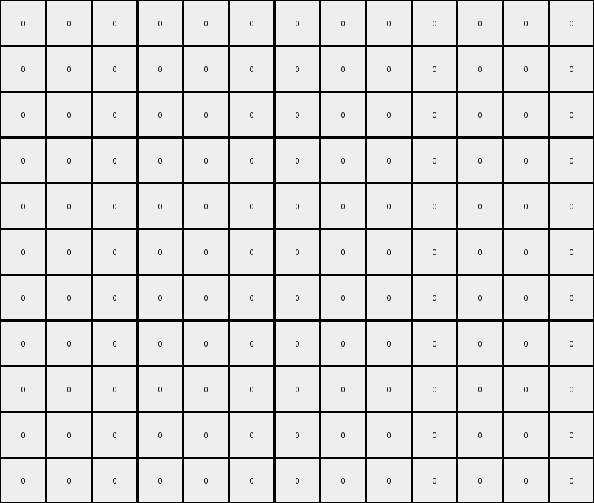
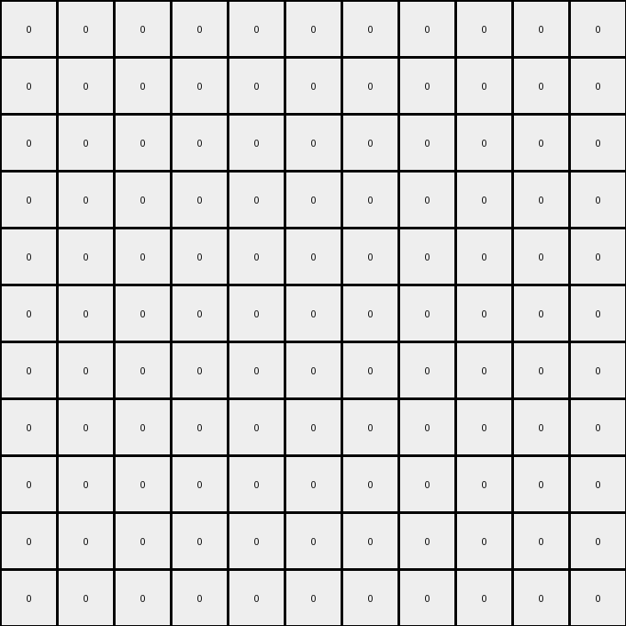

# AboveBelow8 • 004 • refine_coder

---

Previous Code:
```python
"""
Isolates a pre-existing vertical azure (8) column within the input grid, 
setting all other pixels to grey (0).
"""

import numpy as np

def find_vertical_column(grid, color):
    """
    Finds the x-coordinate of a vertical column of the specified color.
    Returns -1 if no such column is found.
    """
    height, width = grid.shape
    for x in range(width):
        is_column = True
        for y in range(height):
            if grid[y, x] != color:
                is_column = False
                break
        if is_column:
            return x
    return -1

def transform(input_grid):
    """
    Transforms the input grid by isolating the azure column and setting
    all other pixels to grey.
    """
    # Initialize the output grid with all grey pixels.
    output_grid = np.zeros_like(input_grid)

    # Find the x-coordinate of the azure (8) column.
    azure_column_x = find_vertical_column(input_grid, 8)

    # If an azure column is found, copy it to the output grid.
    if azure_column_x != -1:
        height = input_grid.shape[0]
        for y in range(height):
            output_grid[y, azure_column_x] = 8

    return output_grid
```

Train Set Results:

## Example 1:

Input:
```
0 0 0 0 0 0 0 0 0 0 0 0 0
0 0 0 0 0 0 0 0 0 0 0 0 0
0 0 0 0 0 0 0 0 0 0 0 0 0
0 3 8 8 3 3 3 3 3 3 3 3 0
0 3 3 8 3 3 3 3 3 3 3 3 0
0 6 6 8 6 6 6 6 6 6 6 6 0
0 6 6 8 6 6 6 6 6 6 6 6 0
0 7 7 8 8 8 7 7 7 7 7 7 0
0 7 7 7 7 8 7 7 7 7 7 7 0
0 4 4 4 4 8 8 4 4 4 4 4 0
0 4 4 4 4 4 8 8 8 8 4 4 0
```
Expected Output:
```
0 0 0 0 0 0 0 0 0 0 0 0 0
0 0 0 0 0 0 0 0 0 0 0 0 0
0 0 0 0 0 0 0 0 0 0 0 0 0
0 0 0 0 0 0 0 0 0 0 0 0 0
0 0 0 0 0 0 0 0 0 0 0 0 0
0 0 0 8 0 0 0 0 0 0 0 0 0
0 0 0 8 0 0 0 0 0 0 0 0 0
0 0 0 8 8 8 0 0 0 0 0 0 0
0 0 0 0 0 8 0 0 0 0 0 0 0
0 0 0 0 0 8 8 0 0 0 0 0 0
0 0 0 0 0 0 8 8 8 8 0 0 0
```
Transformed Output:
```
0 0 0 0 0 0 0 0 0 0 0 0 0
0 0 0 0 0 0 0 0 0 0 0 0 0
0 0 0 0 0 0 0 0 0 0 0 0 0
0 0 0 0 0 0 0 0 0 0 0 0 0
0 0 0 0 0 0 0 0 0 0 0 0 0
0 0 0 0 0 0 0 0 0 0 0 0 0
0 0 0 0 0 0 0 0 0 0 0 0 0
0 0 0 0 0 0 0 0 0 0 0 0 0
0 0 0 0 0 0 0 0 0 0 0 0 0
0 0 0 0 0 0 0 0 0 0 0 0 0
0 0 0 0 0 0 0 0 0 0 0 0 0
```

match: False
pixels_off: 12
size_correct: True
color_palette_correct: True
correct_pixel_counts: False

## Example 2:

Input:
```
3 3 3 3 8 8 8 8 8 8 3
3 3 3 3 8 3 3 3 3 3 3
2 2 2 2 8 8 8 8 2 2 2
2 2 2 2 2 2 2 8 2 2 2
7 7 7 7 7 7 7 8 7 7 7
7 7 7 7 7 7 7 8 7 7 7
7 7 7 7 8 8 8 8 7 7 7
9 9 9 8 8 9 9 9 9 9 9
1 1 1 8 1 1 1 1 1 1 1
1 1 1 8 8 1 1 1 1 1 1
1 1 1 1 8 8 8 1 1 1 1
```
Expected Output:
```
0 0 0 0 0 0 0 0 0 0 0
0 0 0 0 0 0 0 0 0 0 0
0 0 0 0 8 8 8 8 0 0 0
0 0 0 0 0 0 0 8 0 0 0
0 0 0 0 0 0 0 8 0 0 0
0 0 0 0 0 0 0 8 0 0 0
0 0 0 0 8 8 8 8 0 0 0
0 0 0 8 8 0 0 0 0 0 0
0 0 0 8 0 0 0 0 0 0 0
0 0 0 8 8 0 0 0 0 0 0
0 0 0 0 8 8 8 0 0 0 0
```
Transformed Output:
```
0 0 0 0 0 0 0 0 0 0 0
0 0 0 0 0 0 0 0 0 0 0
0 0 0 0 0 0 0 0 0 0 0
0 0 0 0 0 0 0 0 0 0 0
0 0 0 0 0 0 0 0 0 0 0
0 0 0 0 0 0 0 0 0 0 0
0 0 0 0 0 0 0 0 0 0 0
0 0 0 0 0 0 0 0 0 0 0
0 0 0 0 0 0 0 0 0 0 0
0 0 0 0 0 0 0 0 0 0 0
0 0 0 0 0 0 0 0 0 0 0
```

match: False
pixels_off: 19
size_correct: True
color_palette_correct: True
correct_pixel_counts: False

## Example 3:

Input:
```
0 0 0 0 0 0 0 0 0 0
0 3 8 8 8 3 3 3 3 0
0 3 3 3 8 3 3 3 3 0
0 3 8 8 8 3 3 3 3 0
0 3 8 3 3 3 3 3 3 0
0 3 8 3 3 3 3 3 3 0
0 1 8 8 1 1 1 1 1 0
0 1 1 8 1 1 1 1 1 0
0 1 1 8 8 8 8 1 1 0
0 1 1 1 1 1 8 1 1 0
0 0 0 0 0 0 0 0 0 0
```
Expected Output:
```
0 0 0 0 0 0 0 0 0 0
0 0 0 0 0 0 0 0 0 0
0 0 0 0 0 0 0 0 0 0
0 0 0 0 0 0 0 0 0 0
0 0 0 0 0 0 0 0 0 0
0 0 0 0 0 0 0 0 0 0
0 0 8 8 0 0 0 0 0 0
0 0 0 8 0 0 0 0 0 0
0 0 0 8 8 8 8 0 0 0
0 0 0 0 0 0 8 0 0 0
0 0 0 0 0 0 0 0 0 0
```
Transformed Output:
```
0 0 0 0 0 0 0 0 0 0
0 0 0 0 0 0 0 0 0 0
0 0 0 0 0 0 0 0 0 0
0 0 0 0 0 0 0 0 0 0
0 0 0 0 0 0 0 0 0 0
0 0 0 0 0 0 0 0 0 0
0 0 0 0 0 0 0 0 0 0
0 0 0 0 0 0 0 0 0 0
0 0 0 0 0 0 0 0 0 0
0 0 0 0 0 0 0 0 0 0
0 0 0 0 0 0 0 0 0 0
```

match: False
pixels_off: 8
size_correct: True
color_palette_correct: True
correct_pixel_counts: False
Here's an assessment of the provided information and a strategy for resolving the errors, along with the requested deliverables:

**General Assessment and Strategy**

The initial code was designed to isolate a pre-existing vertical azure (8) column and set all other pixels to grey (0). However, it fails on all three training examples. The core issue is that the code *only* preserves a *complete* vertical column of the specified color. It does not consider partial columns or multiple sections of a column, and does not allow for the case where the column does not span the entire height of the grid. The strategy should be to make the column finding logic more robust, it should preserve all sections of a vertical azure column, regardless of contiguity of the column or the surrounding pixels.

**Example Metrics and Analysis**

Here's a breakdown of each example, analyzing the discrepancies between the expected and transformed outputs:

*   **Example 1:** The expected output shows an azure column that is not a complete column, and varies in height between the top and bottom sections. The transformed output is all grey because no complete azure column exists.
*   **Example 2:** Similar to Example 1, the azure sections of the expected output are partial columns that change height.
*   **Example 3:** Same column height errors, but the azure 'column' does not have consistent positioning.

**YAML Fact Block**

```yaml
task_id: 002
examples:
  - example_id: 1
    input_objects:
      - object_id: 1
        type: mixed_color_region
        color: varied
        shape: irregular
        azure_column_segments:
          - x: 2, y_start: 3, y_end: 3
          - x: 3, y_start: 3, y_end: 6
          - x: 4, y_start: 7, y_end: 7
          - x: 5, y_start: 8, y_end: 9
          - x: 6, y_start: 10, y_end: 10

    output_objects:
      - object_id: 1
        type: azure_column_segment
        color: 8
        shape: vertical_line
        positions:
          - x: 2, y: 7
          - x: 3, y: 8
          - x: 3, y: 9
          - x: 3, y: 10
    transformation:
      type: extract_and_position
      description: Extract vertical azure column segments, preserving the segments x-position. Other pixels are set to grey.
      details: >
          extract the azure column segments from a larger region and maintain their
          x positions and heights. set all non-azure pixels in the output to
          grey.

  - example_id: 2
    input_objects:
      - object_id: 1
        type: mixed_color_region
        color: varied
        shape: irregular
    output_objects:
      - object_id: 2
        type: azure_column_segments
        color: 8
    transformation:
      type: extract_and_position
      description: Extract vertical azure column segments, preserving the segments x-position. Other pixels are set to grey.
      details: >
          extract the azure column segments from a larger region and maintain their
          x positions and heights. set all non-azure pixels in the output to
          grey.

  - example_id: 3
    input_objects:
      - object_id: 1
        type: mixed_color_region
        color: varied
        shape: irregular
    output_objects:
      - object_id: 3
        type: azure_column_segment
        color: 8
    transformation:
      type: extract_and_position
      description: Extract vertical azure column segments, preserving the segments x-position. Other pixels are set to grey.
      details: >
          extract the azure column segments from a larger region and maintain their
          x positions and heights. set all non-azure pixels in the output to
          grey.
```

**Natural Language Program**

1.  **Identify Azure Pixels:** Iterate through the input grid, and identify all pixels that are azure (color code 8).
2.  **Vertical Column Segments:** For each azure pixel, determine if they are part of an existing column segment. A segment can be a single pixel, or multiple contiguous vertical pixels.
3.  **Preserve and Position:** Copy each azure pixel to the same x, y coordinate in the output grid.
4.  **Set Background:** All other pixels in the output grid that do not contain an azure pixel should be set to grey (color code 0).

The key improvement in this natural language program is identifying, preserving, and positioning *all* azure pixels. This will ensure that only parts of columns are preserved and reconstructed correctly, while maintaining original x, y positions.

**INSTRUCTIONS**

- generate a Python module to represent the natural language program 
- follow the template below
- all common math and science libraries are available
- create docstring only at top - but comment the workflow in the function
- use helper functions for common operations like finding objects, counting,
  measuring, moving, etc. 

remember - we are working iteratively - so this code will inform your future
self as we converge on the solution

*template:*

```python
"""
{{ natural language description of the transformation rule }}
"""

{{ imports }}

def transform(input_grid):
    # initialize output_grid

    # change output pixels 

    return output_grid

```
