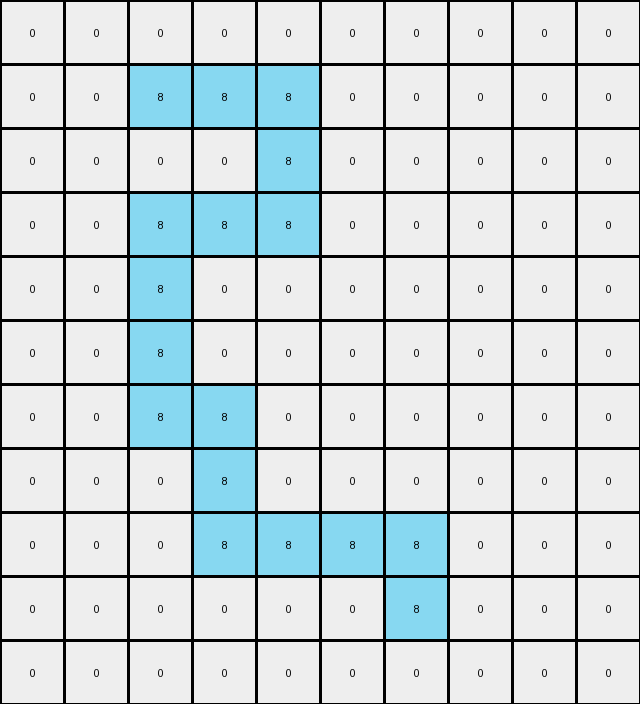

# AboveBelow8 • 010 • refine_coder

---

Previous Code:
```python
"""
The program filters the input grid, keeping only the azure (8) pixels and setting all other pixels to white (0).
"""

import numpy as np

def transform(input_grid):
    """
    Transforms the input grid by keeping only pixels of color 8 and setting others to 0.

    Args:
        input_grid (list of lists): The input grid represented as a 2D list.

    Returns:
        list of lists: The transformed grid.
    """
    # Initialize the output grid with the same dimensions as the input grid, filled with 0s.
    output_grid = np.zeros_like(input_grid)

    # Iterate through the input grid.
    for row_index, row in enumerate(input_grid):
        for col_index, pixel_value in enumerate(row):
            # Check if the pixel's color is 8 (azure).
            if pixel_value == 8:
                # If it is, keep the pixel's value in the output grid.
                output_grid[row_index, col_index] = 8

    return output_grid
```

Train Set Results:

## Example 1:

Input:
```
0 0 0 0 0 0 0 0 0 0 0 0 0
0 0 0 0 0 0 0 0 0 0 0 0 0
0 0 0 0 0 0 0 0 0 0 0 0 0
0 3 8 8 3 3 3 3 3 3 3 3 0
0 3 3 8 3 3 3 3 3 3 3 3 0
0 6 6 8 6 6 6 6 6 6 6 6 0
0 6 6 8 6 6 6 6 6 6 6 6 0
0 7 7 8 8 8 7 7 7 7 7 7 0
0 7 7 7 7 8 7 7 7 7 7 7 0
0 4 4 4 4 8 8 4 4 4 4 4 0
0 4 4 4 4 4 8 8 8 8 4 4 0
```
Expected Output:
```
0 0 0 0 0 0 0 0 0 0 0 0 0
0 0 0 0 0 0 0 0 0 0 0 0 0
0 0 0 0 0 0 0 0 0 0 0 0 0
0 0 0 0 0 0 0 0 0 0 0 0 0
0 0 0 0 0 0 0 0 0 0 0 0 0
0 0 0 8 0 0 0 0 0 0 0 0 0
0 0 0 8 0 0 0 0 0 0 0 0 0
0 0 0 8 8 8 0 0 0 0 0 0 0
0 0 0 0 0 8 0 0 0 0 0 0 0
0 0 0 0 0 8 8 0 0 0 0 0 0
0 0 0 0 0 0 8 8 8 8 0 0 0
```
Transformed Output:
```
0 0 0 0 0 0 0 0 0 0 0 0 0
0 0 0 0 0 0 0 0 0 0 0 0 0
0 0 0 0 0 0 0 0 0 0 0 0 0
0 0 8 8 0 0 0 0 0 0 0 0 0
0 0 0 8 0 0 0 0 0 0 0 0 0
0 0 0 8 0 0 0 0 0 0 0 0 0
0 0 0 8 0 0 0 0 0 0 0 0 0
0 0 0 8 8 8 0 0 0 0 0 0 0
0 0 0 0 0 8 0 0 0 0 0 0 0
0 0 0 0 0 8 8 0 0 0 0 0 0
0 0 0 0 0 0 8 8 8 8 0 0 0
```

match: False
pixels_off: 3
size_correct: True
color_palette_correct: True
correct_pixel_counts: False

## Example 2:

Input:
```
3 3 3 3 8 8 8 8 8 8 3
3 3 3 3 8 3 3 3 3 3 3
2 2 2 2 8 8 8 8 2 2 2
2 2 2 2 2 2 2 8 2 2 2
7 7 7 7 7 7 7 8 7 7 7
7 7 7 7 7 7 7 8 7 7 7
7 7 7 7 8 8 8 8 7 7 7
9 9 9 8 8 9 9 9 9 9 9
1 1 1 8 1 1 1 1 1 1 1
1 1 1 8 8 1 1 1 1 1 1
1 1 1 1 8 8 8 1 1 1 1
```
Expected Output:
```
0 0 0 0 0 0 0 0 0 0 0
0 0 0 0 0 0 0 0 0 0 0
0 0 0 0 8 8 8 8 0 0 0
0 0 0 0 0 0 0 8 0 0 0
0 0 0 0 0 0 0 8 0 0 0
0 0 0 0 0 0 0 8 0 0 0
0 0 0 0 8 8 8 8 0 0 0
0 0 0 8 8 0 0 0 0 0 0
0 0 0 8 0 0 0 0 0 0 0
0 0 0 8 8 0 0 0 0 0 0
0 0 0 0 8 8 8 0 0 0 0
```
Transformed Output:
```
0 0 0 0 8 8 8 8 8 8 0
0 0 0 0 8 0 0 0 0 0 0
0 0 0 0 8 8 8 8 0 0 0
0 0 0 0 0 0 0 8 0 0 0
0 0 0 0 0 0 0 8 0 0 0
0 0 0 0 0 0 0 8 0 0 0
0 0 0 0 8 8 8 8 0 0 0
0 0 0 8 8 0 0 0 0 0 0
0 0 0 8 0 0 0 0 0 0 0
0 0 0 8 8 0 0 0 0 0 0
0 0 0 0 8 8 8 0 0 0 0
```

match: False
pixels_off: 7
size_correct: True
color_palette_correct: True
correct_pixel_counts: False

## Example 3:

Input:
```
0 0 0 0 0 0 0 0 0 0
0 3 8 8 8 3 3 3 3 0
0 3 3 3 8 3 3 3 3 0
0 3 8 8 8 3 3 3 3 0
0 3 8 3 3 3 3 3 3 0
0 3 8 3 3 3 3 3 3 0
0 1 8 8 1 1 1 1 1 0
0 1 1 8 1 1 1 1 1 0
0 1 1 8 8 8 8 1 1 0
0 1 1 1 1 1 8 1 1 0
0 0 0 0 0 0 0 0 0 0
```
Expected Output:
```
0 0 0 0 0 0 0 0 0 0
0 0 0 0 0 0 0 0 0 0
0 0 0 0 0 0 0 0 0 0
0 0 0 0 0 0 0 0 0 0
0 0 0 0 0 0 0 0 0 0
0 0 0 0 0 0 0 0 0 0
0 0 8 8 0 0 0 0 0 0
0 0 0 8 0 0 0 0 0 0
0 0 0 8 8 8 8 0 0 0
0 0 0 0 0 0 8 0 0 0
0 0 0 0 0 0 0 0 0 0
```
Transformed Output:
```
0 0 0 0 0 0 0 0 0 0
0 0 8 8 8 0 0 0 0 0
0 0 0 0 8 0 0 0 0 0
0 0 8 8 8 0 0 0 0 0
0 0 8 0 0 0 0 0 0 0
0 0 8 0 0 0 0 0 0 0
0 0 8 8 0 0 0 0 0 0
0 0 0 8 0 0 0 0 0 0
0 0 0 8 8 8 8 0 0 0
0 0 0 0 0 0 8 0 0 0
0 0 0 0 0 0 0 0 0 0
```

match: False
pixels_off: 9
size_correct: True
color_palette_correct: True
correct_pixel_counts: False
Okay, let's analyze the results and update the natural language program.

**General Assessment:**

The initial code was too simplistic. It correctly identified the importance of the azure (8) color but failed to accurately represent the transformation. The primary issue is that the code keeps *all* azure pixels, regardless of their context. The expected outputs show that azure pixels are sometimes removed, implying a more complex rule based on the arrangement or context of the azure pixels. We need to identify *which* azure pixels are retained and which are set to white(0).

**Strategy:**

1.  **Detailed Comparison:** Carefully examine the input, expected output, and transformed output for each example. Focus on where the transformed output differs from the expected output. Look for patterns in the *location* or *surrounding* of incorrect pixels.
2.  **Hypothesis Refinement:** Based on the comparison, adjust the hypothesis about the transformation rule. Consider spatial relationships (adjacency, containment) between azure and other colored pixels. It looks like the transformation removes azure pixels in some situations.
3. **Revise Natural Language Program:** rewrite a clear, testable, and complete natural language program.

**Metrics and Observations:**

Here are some observations, along with checking some details:

*   **Example 1:**
    *   Input has multiple colors. Azure (8) appears in different arrangements: single pixels, horizontal lines, and within larger shapes of other colors.
    *   The transformed output incorrectly retains some isolated azure pixels and edges of azure lines.
    *   Pixels off: 3

*   **Example 2:**
    *   Input has azure (8) in different shapes.
    *   The error pattern is similar to Example 1: some azure pixels, especially on the edges, are incorrectly kept.
    *   Pixels off: 7

*   **Example 3:**
    *   Input has a mix of azure (8) and other color blocks.
    *   The error is consistent. Some azure, especially parts that connect to other colors, are incorrectly preserved.
    *   Pixels Off: 9

**YAML Fact Identification:**

```yaml
examples:
  - example_id: 1
    input_objects:
      - color: 8
        description: horizontal lines and single pixels
      - color: 3
        description: surrounding object
      - color: 6
        description: surrounding object
      - color: 7
        description: surrounding object
      - color: 4
        description: surrounding object

    output_objects:
      - color: 8
        description:  interior lines, interior pixels

  - example_id: 2
    input_objects:
      - color: 8
        description: horizontal lines and single pixels
      - color: 3, 2, 7, 9, 1
        description: surrounding objects, different shapes

    output_objects:
      - color: 8
        description: interior points and shapes

  - example_id: 3
    input_objects:
      - color: 8
        description: lines, single pixels
      - color: 3, 1
        description: surrounding shapes
    output_objects:
       - color: 8
         description: interior lines and shapes
```

**Natural Language Program:**

1.  **Identify Azure Pixels:** Iterate through each pixel of the input grid and locate all pixels that are azure (color 8).

2.  **Determine Interior Azure:** For each azure pixel, check its immediate neighbors (up, down, left, right - not diagonal).

3.  **Preserve or Clear:** If *all* four neighboring pixels are *also* azure (8), then keep the pixel as azure (8) in the output grid. Otherwise, set the pixel to white (0) in the output grid. All non-azure pixels should also be set to white (0)

In summary, the transformation only preserves *interior* azure pixels, where "interior" is defined as being surrounded on all four cardinal directions by other azure pixels. All other pixels are set to white.

**INSTRUCTIONS**

- generate a Python module to represent the natural language program 
- follow the template below
- all common math and science libraries are available
- create docstring only at top - but comment the workflow in the function
- use helper functions for common operations like finding objects, counting,
  measuring, moving, etc. 

remember - we are working iteratively - so this code will inform your future
self as we converge on the solution

*template:*

```python
"""
{{ natural language description of the transformation rule }}
"""

{{ imports }}

def transform(input_grid):
    # initialize output_grid

    # change output pixels 

    return output_grid

```
