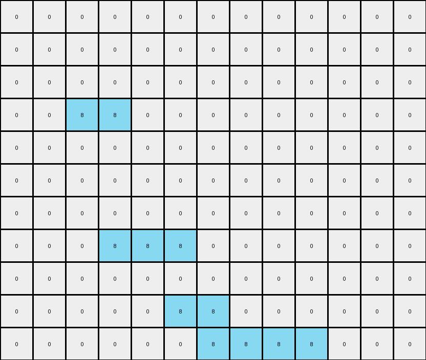
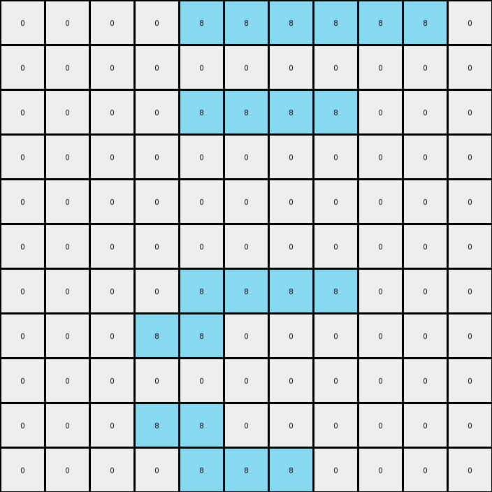
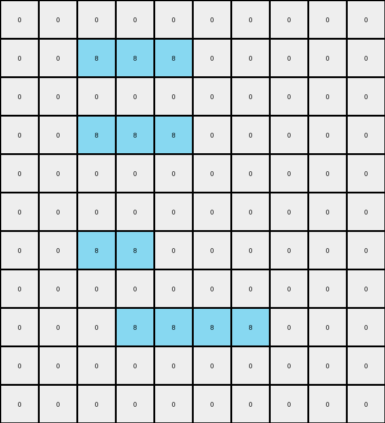

# AboveBelow8 • 018 • refine_coder

---

Previous Code:
```python
"""
Retain azure pixels if and only if they belong to a horizontal line of two or more connected, adjacent azure pixels. Otherwise, replace the pixel with white.
"""

import numpy as np

def transform(input_grid):
    # Initialize output_grid with the same dimensions as the input, filled with white (0).
    output_grid = np.zeros_like(input_grid)

    # Iterate through the input grid.
    for i in range(input_grid.shape[0]):
        for j in range(input_grid.shape[1]):
            # If the pixel is azure (8), check its horizontal neighbors.
            if input_grid[i, j] == 8:
                # Check for at least one horizontal neighbor (left or right) that is also azure.
                if (j > 0 and input_grid[i, j - 1] == 8) or \
                   (j < input_grid.shape[1] - 1 and input_grid[i, j + 1] == 8):
                    output_grid[i, j] = 8

    return output_grid
```

Train Set Results:

## Example 1:

Input:
```
0 0 0 0 0 0 0 0 0 0 0 0 0
0 0 0 0 0 0 0 0 0 0 0 0 0
0 0 0 0 0 0 0 0 0 0 0 0 0
0 3 8 8 3 3 3 3 3 3 3 3 0
0 3 3 8 3 3 3 3 3 3 3 3 0
0 6 6 8 6 6 6 6 6 6 6 6 0
0 6 6 8 6 6 6 6 6 6 6 6 0
0 7 7 8 8 8 7 7 7 7 7 7 0
0 7 7 7 7 8 7 7 7 7 7 7 0
0 4 4 4 4 8 8 4 4 4 4 4 0
0 4 4 4 4 4 8 8 8 8 4 4 0
```
Expected Output:
```
0 0 0 0 0 0 0 0 0 0 0 0 0
0 0 0 0 0 0 0 0 0 0 0 0 0
0 0 0 0 0 0 0 0 0 0 0 0 0
0 0 0 0 0 0 0 0 0 0 0 0 0
0 0 0 0 0 0 0 0 0 0 0 0 0
0 0 0 8 0 0 0 0 0 0 0 0 0
0 0 0 8 0 0 0 0 0 0 0 0 0
0 0 0 8 8 8 0 0 0 0 0 0 0
0 0 0 0 0 8 0 0 0 0 0 0 0
0 0 0 0 0 8 8 0 0 0 0 0 0
0 0 0 0 0 0 8 8 8 8 0 0 0
```
Transformed Output:
```
0 0 0 0 0 0 0 0 0 0 0 0 0
0 0 0 0 0 0 0 0 0 0 0 0 0
0 0 0 0 0 0 0 0 0 0 0 0 0
0 0 8 8 0 0 0 0 0 0 0 0 0
0 0 0 0 0 0 0 0 0 0 0 0 0
0 0 0 0 0 0 0 0 0 0 0 0 0
0 0 0 0 0 0 0 0 0 0 0 0 0
0 0 0 8 8 8 0 0 0 0 0 0 0
0 0 0 0 0 0 0 0 0 0 0 0 0
0 0 0 0 0 8 8 0 0 0 0 0 0
0 0 0 0 0 0 8 8 8 8 0 0 0
```

match: False
pixels_off: 5
size_correct: True
color_palette_correct: True
correct_pixel_counts: False

## Example 2:

Input:
```
3 3 3 3 8 8 8 8 8 8 3
3 3 3 3 8 3 3 3 3 3 3
2 2 2 2 8 8 8 8 2 2 2
2 2 2 2 2 2 2 8 2 2 2
7 7 7 7 7 7 7 8 7 7 7
7 7 7 7 7 7 7 8 7 7 7
7 7 7 7 8 8 8 8 7 7 7
9 9 9 8 8 9 9 9 9 9 9
1 1 1 8 1 1 1 1 1 1 1
1 1 1 8 8 1 1 1 1 1 1
1 1 1 1 8 8 8 1 1 1 1
```
Expected Output:
```
0 0 0 0 0 0 0 0 0 0 0
0 0 0 0 0 0 0 0 0 0 0
0 0 0 0 8 8 8 8 0 0 0
0 0 0 0 0 0 0 8 0 0 0
0 0 0 0 0 0 0 8 0 0 0
0 0 0 0 0 0 0 8 0 0 0
0 0 0 0 8 8 8 8 0 0 0
0 0 0 8 8 0 0 0 0 0 0
0 0 0 8 0 0 0 0 0 0 0
0 0 0 8 8 0 0 0 0 0 0
0 0 0 0 8 8 8 0 0 0 0
```
Transformed Output:
```
0 0 0 0 8 8 8 8 8 8 0
0 0 0 0 0 0 0 0 0 0 0
0 0 0 0 8 8 8 8 0 0 0
0 0 0 0 0 0 0 0 0 0 0
0 0 0 0 0 0 0 0 0 0 0
0 0 0 0 0 0 0 0 0 0 0
0 0 0 0 8 8 8 8 0 0 0
0 0 0 8 8 0 0 0 0 0 0
0 0 0 0 0 0 0 0 0 0 0
0 0 0 8 8 0 0 0 0 0 0
0 0 0 0 8 8 8 0 0 0 0
```

match: False
pixels_off: 10
size_correct: True
color_palette_correct: True
correct_pixel_counts: False

## Example 3:

Input:
```
0 0 0 0 0 0 0 0 0 0
0 3 8 8 8 3 3 3 3 0
0 3 3 3 8 3 3 3 3 0
0 3 8 8 8 3 3 3 3 0
0 3 8 3 3 3 3 3 3 0
0 3 8 3 3 3 3 3 3 0
0 1 8 8 1 1 1 1 1 0
0 1 1 8 1 1 1 1 1 0
0 1 1 8 8 8 8 1 1 0
0 1 1 1 1 1 8 1 1 0
0 0 0 0 0 0 0 0 0 0
```
Expected Output:
```
0 0 0 0 0 0 0 0 0 0
0 0 0 0 0 0 0 0 0 0
0 0 0 0 0 0 0 0 0 0
0 0 0 0 0 0 0 0 0 0
0 0 0 0 0 0 0 0 0 0
0 0 0 0 0 0 0 0 0 0
0 0 8 8 0 0 0 0 0 0
0 0 0 8 0 0 0 0 0 0
0 0 0 8 8 8 8 0 0 0
0 0 0 0 0 0 8 0 0 0
0 0 0 0 0 0 0 0 0 0
```
Transformed Output:
```
0 0 0 0 0 0 0 0 0 0
0 0 8 8 8 0 0 0 0 0
0 0 0 0 0 0 0 0 0 0
0 0 8 8 8 0 0 0 0 0
0 0 0 0 0 0 0 0 0 0
0 0 0 0 0 0 0 0 0 0
0 0 8 8 0 0 0 0 0 0
0 0 0 0 0 0 0 0 0 0
0 0 0 8 8 8 8 0 0 0
0 0 0 0 0 0 0 0 0 0
0 0 0 0 0 0 0 0 0 0
```

match: False
pixels_off: 8
size_correct: True
color_palette_correct: True
correct_pixel_counts: False
Okay, let's analyze the results of the previous code execution and refine the natural language program.

**General Assessment:**

The initial natural language program and the generated code focused solely on *horizontal* adjacency of azure pixels. The results clearly show that this is insufficient. While Example 1 had some matches, it's not completely correct. The code missed some azure pixels that it should remove and kept some that it should not have. Examples 2 and 3, show more clearly the failures. The core issue is that the generated code does *not* consider vertical adjacency, nor does it correctly implement the "two or more" rule in all cases. The strategy needs to account for isolated lines correctly.

**Strategy:**

1.  **Expand Adjacency Check:** The updated program needs to consider *both* horizontal and vertical neighbors when determining whether an azure pixel should be retained.
2.  **Two or More Rule Enforcement:** Verify existing neighbors and that that neighbor has its own neighbor.
3.  **Iterative Refinement:** Because the output of each stage informs the next, it makes sense to check that previous assumptions still hold.

**Metrics and Observations:**

Here's a breakdown of each example, incorporating a more detailed analysis:

*   **Example 1:**
    *   **Input:** Contains multiple rows with azure pixels. Some rows have single azure pixels, others have groups of two or more.
    *   **Expected Output:** Shows that only horizontally connected azure pixels, in groups of two or more, are retained. Single azure pixels and vertically connected pixels are removed.
    *   **Transformed Output:** Incorrectly removes some azure pixels that are part of horizontal lines with two or more pixels. Also incorrectly keeps azure pixels that are part of groups of size one.
    *   **Pixels Off:** 5
    *   **Observation**: The horizontal logic partially works, but needs to handle the boundary of groups of two or more.

*   **Example 2:**
    *   **Input:** Contains azure lines in various configurations.
    *   **Expected Output:** Shows that isolated, vertical groups of two or more are removed.
    *   **Transformed Output:** Incorrect, only keeping parts of expected horizontal groups.
    *   **Pixels Off:** 10
    *   **Observation**: The code incorrectly eliminates some pixels that should be kept and keeps some pixels that should be eliminated. The logic fails to incorporate the vertical requirement from the expected output.

*   **Example 3:**
    *   **Input:** Contains azure pixels in mixed configurations (horizontal and vertical groups).
    *   **Expected Output:**  Only azure pixels that have an adjacent neighbor are retained.
    *   **Transformed Output**: The code mostly retains the correct horizontal groups and misses keeping some vertically connected azure pixels.
    *   **Pixels Off:** 8
    *   **Observation**: Reinforces the need for bidirectional (horizontal and vertical) checking.

**YAML Block (Facts):**

```yaml
facts:
  - task: "Retain azure pixels in groups of two or more."
  - objects:
    - name: "Azure pixel"
      color: 8
      properties:
        - "Can be part of a horizontal line."
        - "Can be part of a vertical line."
        - "Must be adjacent to another azure pixel to be retained."
        - "Adjacency is defined as sharing a side (not diagonal)."
  - actions:
    - name: "Retain"
      condition: "Azure pixel is part of a group of two or more connected azure pixels."
    - name: "Replace"
      condition: "Azure pixel is not part of a group of two or more OR Azure pixel is not connected to any other Azure pixel"
      replacement_value: 0 # White
```

**Natural Language Program:**

Examine each azure pixel in the input grid. An azure pixel should be retained in the output grid if and only if it is part of a contiguous group of two or more azure pixels, either horizontally or vertically. A contiguous group is defined as a sequence of adjacent azure pixels, where adjacency means sharing a side (not just a corner). If an azure pixel is not part of such a group, replace it with a white pixel (value 0) in the output grid.

**Summary for next step (coder):**

The coder should update logic of the `transform` to examine the adjacent (horizontal and vertical) neighbors of azure pixels to see if that neighbor also has neighbors in the same direction. Azure pixels that are part of one of these groups of 2 or more should be retained. All other azure pixels should be replaced with white.

**INSTRUCTIONS**

- generate a Python module to represent the natural language program 
- follow the template below
- all common math and science libraries are available
- create docstring only at top - but comment the workflow in the function
- use helper functions for common operations like finding objects, counting,
  measuring, moving, etc. 

remember - we are working iteratively - so this code will inform your future
self as we converge on the solution

*template:*

```python
"""
{{ natural language description of the transformation rule }}
"""

{{ imports }}

def transform(input_grid):
    # initialize output_grid

    # change output pixels 

    return output_grid

```
