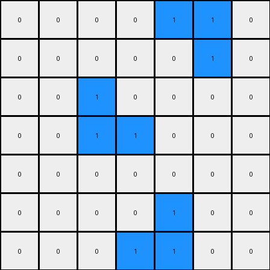

# 1-3aa6fb7a • 012 • refine_coder

---

Previous Code:
```python
"""
1.  **Identify Clusters:** Find all connected clusters of '8' (azure) pixels in the input grid. Consider pixels to be connected orthogonally.

2.  **Locate Strategic Points:** Within each '8' cluster, identify "strategic points" for inserting '1's. Strategic points are defined as:
    *   **Endpoints:** An '8' pixel with only one orthogonally adjacent '8' neighbor.
    *   **Corners:** An '8' pixel where the direction of the cluster changes. This is determined by:
        *   The '8' has exactly two orthogonally adjacent '8' pixels that are not orthogonally adjacent to *each other*.
        *   An '8' on a diagonal cluster boundary.
    * **Inside Bends**: Where the cluster has two adjacent '8' pixels *and* at least one diagonally adjacent '8' pixel
    *   **Do not place at boundaries that do not contain an '8' pixel:**

3. **Insert '1's:** Replace the '8' pixels at the identified strategic points with '1' (blue) pixels.

4. **Preserve shape:** The new '1' pixels, together with the remaining '8' pixels, preserve the general outline and direction changes.
"""

import numpy as np

def find_clusters(grid, value):
    """Finds clusters of a specific value in a grid."""
    visited = np.zeros_like(grid, dtype=bool)
    clusters = []

    def dfs(row, col, current_cluster):
        """Depth-first search to explore a cluster."""
        if (
            row < 0
            or row >= grid.shape[0]
            or col < 0
            or col >= grid.shape[1]
            or visited[row, col]
            or grid[row, col] != value
        ):
            return

        visited[row, col] = True
        current_cluster.append((row, col))

        dfs(row + 1, col, current_cluster)
        dfs(row - 1, col, current_cluster)
        dfs(row, col + 1, current_cluster)
        dfs(row, col - 1, current_cluster)

    for row in range(grid.shape[0]):
        for col in range(grid.shape[1]):
            if grid[row, col] == value and not visited[row, col]:
                current_cluster = []
                dfs(row, col, current_cluster)
                clusters.append(current_cluster)

    return clusters

def get_neighbors(grid, r, c, value=None):
    """Gets the orthogonal and diagonal neighbors of a cell, optionally filtering by value."""
    neighbors = []
    rows, cols = grid.shape

    # Orthogonal neighbors
    for dr, dc in [(0, 1), (0, -1), (1, 0), (-1, 0)]:
        nr, nc = r + dr, c + dc
        if 0 <= nr < rows and 0 <= nc < cols:
            if value is None or grid[nr, nc] == value:
                neighbors.append((nr, nc))
    return neighbors

def get_diagonal_neighbors(grid, r, c, value=None):
    neighbors = []
    rows, cols = grid.shape

    for dr, dc in [(1,1), (1,-1), (-1, 1), (-1,-1)]:
        nr, nc = r+dr, c+dc
        if 0 <= nr < rows and 0 <= nc < cols:
            if value is None or grid[nr, nc] == value:
                neighbors.append((nr, nc))

    return neighbors

def is_endpoint(grid, r, c, cluster):
    """Checks if a cell is an endpoint of a cluster."""
    neighbors = get_neighbors(grid, r, c, value=8)
    return len(neighbors) == 1

def is_corner(grid, r, c, cluster):
    """Checks if a cell is a corner of a cluster."""
    neighbors = get_neighbors(grid, r, c, value=8)
    if len(neighbors) == 2:
        n1r, n1c = neighbors[0]
        n2r, n2c = neighbors[1]
        # Check if neighbors are not orthogonally adjacent
        if abs(n1r - n2r) + abs(n1c - n2c) > 1:
            return True
    
    return False

def is_inside_bend(grid, r, c, cluster):
    neighbors = get_neighbors(grid, r, c, 8)
    diagonal_neighbors = get_diagonal_neighbors(grid, r, c, 8)

    if len(neighbors) >= 2 and len(diagonal_neighbors) >= 1:
       return True
    return False
    

def transform(input_grid):
    """Transforms the input grid by inserting '1's near '8' clusters."""
    output_grid = np.copy(input_grid)
    clusters_of_8 = find_clusters(input_grid, 8)

    for cluster in clusters_of_8:
        for r, c in cluster:
            if is_endpoint(input_grid, r, c, cluster) or is_corner(input_grid, r, c, cluster) or is_inside_bend(input_grid, r, c, cluster):
                output_grid[r, c] = 1

    return output_grid
```

Train Set Results:

## Example 1:

Input:
```
0 0 0 0 0 0 0
0 8 0 0 0 0 0
0 8 8 0 0 0 0
0 0 0 0 8 8 0
0 0 0 0 0 8 0
0 0 0 0 0 0 0
0 0 0 0 0 0 0
```
Expected Output:
```
0 0 0 0 0 0 0
0 8 1 0 0 0 0
0 8 8 0 0 0 0
0 0 0 0 8 8 0
0 0 0 0 1 8 0
0 0 0 0 0 0 0
0 0 0 0 0 0 0
```
Transformed Output:
```
0 0 0 0 0 0 0
0 1 0 0 0 0 0
0 1 1 0 0 0 0
0 0 0 0 1 1 0
0 0 0 0 0 1 0
0 0 0 0 0 0 0
0 0 0 0 0 0 0
```

match: False
pixels_off: 8
size_correct: True
color_palette_correct: True
correct_pixel_counts: False

## Example 2:

Input:
```
0 0 0 0 8 8 0
0 0 0 0 0 8 0
0 0 8 0 0 0 0
0 0 8 8 0 0 0
0 0 0 0 0 0 0
0 0 0 0 8 0 0
0 0 0 8 8 0 0
```
Expected Output:
```
0 0 0 0 8 8 0
0 0 0 0 1 8 0
0 0 8 1 0 0 0
0 0 8 8 0 0 0
0 0 0 0 0 0 0
0 0 0 1 8 0 0
0 0 0 8 8 0 0
```
Transformed Output:
```
0 0 0 0 1 1 0
0 0 0 0 0 1 0
0 0 1 0 0 0 0
0 0 1 1 0 0 0
0 0 0 0 0 0 0
0 0 0 0 1 0 0
0 0 0 1 1 0 0
```

match: False
pixels_off: 12
size_correct: True
color_palette_correct: True
correct_pixel_counts: False
Okay, let's analyze the results and update the natural language program.

**General Assessment:**

The initial strategy of identifying "strategic points" (endpoints, corners, and inside bends) within clusters of '8' and replacing them with '1' is partially correct. However, the current implementation is overly aggressive in placing '1's. It's placing them *within* the '8' clusters, effectively breaking the clusters apart, instead of placing them *adjacent* to the clusters in a way that outlines the overall shape.  It's also missing key shapes. The program needs to distinguish between filling and outlining, and it needs to consider the *overall shape* formed by the '8's, not just local neighborhoods.

**Strategy for Resolving Errors:**

1.  **Refine "Strategic Point" Definition:** Instead of replacing '8's *within* clusters, we want to place '1's *adjacent* to the clusters, essentially creating an outline.
2.  **Consider Shape:** We want to maintain the overall shape, so think about how the new blue pixels would trace around the azure regions.
3. **Boundary Conditions:** Handle edge and isolated azure regions.

**Example Analysis and Metrics**
I will focus on gathering metrics to quantify the issues and guide the revisions.

```python
import numpy as np

def analyze_example(input_grid, expected_output, transformed_output):
    """Analyzes an example and returns metrics."""
    
    match = np.array_equal(expected_output, transformed_output)
    pixels_off = np.sum(expected_output != transformed_output)
    size_correct = expected_output.shape == transformed_output.shape
    
    # Flatten the arrays for easier comparison
    expected_flat = expected_output.flatten()
    transformed_flat = transformed_output.flatten()
    
    # Get unique colors and their counts in expected output
    expected_colors, expected_counts = np.unique(expected_flat, return_counts=True)
    expected_color_counts = dict(zip(expected_colors, expected_counts))
    
    # Get unique colors and their counts in transformed output
    transformed_colors, transformed_counts = np.unique(transformed_flat, return_counts=True)
    transformed_color_counts = dict(zip(transformed_colors, transformed_counts))
    
    color_palette_correct = set(expected_colors) == set(transformed_colors)
    
    #compare counts.
    correct_pixel_counts=True
    for color in expected_color_counts.keys():
       if expected_color_counts[color]!=transformed_color_counts.get(color, -1):
            correct_pixel_counts=False

    return {
        "match": match,
        "pixels_off": pixels_off,
        "size_correct": size_correct,
        "color_palette_correct": color_palette_correct,
        "correct_pixel_counts": correct_pixel_counts,
        "expected_color_counts": expected_color_counts,
        "transformed_color_counts": transformed_color_counts,
    }
def get_grid_from_text(grid_text):
    lines = grid_text.strip().split('\n')
    return np.array([[int(val) for val in line.split()] for line in lines])

# Example Data (as provided in problem)
example1_input = """
0 0 0 0 0 0 0
0 8 0 0 0 0 0
0 8 8 0 0 0 0
0 0 0 0 8 8 0
0 0 0 0 0 8 0
0 0 0 0 0 0 0
0 0 0 0 0 0 0
"""
example1_expected = """
0 0 0 0 0 0 0
0 8 1 0 0 0 0
0 8 8 0 0 0 0
0 0 0 0 8 8 0
0 0 0 0 1 8 0
0 0 0 0 0 0 0
0 0 0 0 0 0 0
"""
example1_transformed = """
0 0 0 0 0 0 0
0 1 0 0 0 0 0
0 1 1 0 0 0 0
0 0 0 0 1 1 0
0 0 0 0 0 1 0
0 0 0 0 0 0 0
0 0 0 0 0 0 0
"""

example2_input = """
0 0 0 0 8 8 0
0 0 0 0 0 8 0
0 0 8 0 0 0 0
0 0 8 8 0 0 0
0 0 0 0 0 0 0
0 0 0 0 8 0 0
0 0 0 8 8 0 0
"""
example2_expected = """
0 0 0 0 8 8 0
0 0 0 0 1 8 0
0 0 8 1 0 0 0
0 0 8 8 0 0 0
0 0 0 0 0 0 0
0 0 0 1 8 0 0
0 0 0 8 8 0 0
"""
example2_transformed = """
0 0 0 0 1 1 0
0 0 0 0 0 1 0
0 0 1 0 0 0 0
0 0 1 1 0 0 0
0 0 0 0 0 0 0
0 0 0 0 1 0 0
0 0 0 1 1 0 0
"""

example1_input_grid = get_grid_from_text(example1_input)
example1_expected_grid = get_grid_from_text(example1_expected)
example1_transformed_grid = get_grid_from_text(example1_transformed)

example2_input_grid = get_grid_from_text(example2_input)
example2_expected_grid = get_grid_from_text(example2_expected)
example2_transformed_grid = get_grid_from_text(example2_transformed)

analysis1 = analyze_example(example1_input_grid, example1_expected_grid, example1_transformed_grid)
analysis2 = analyze_example(example2_input_grid, example2_expected_grid, example2_transformed_grid)

print("Example 1 Analysis:", analysis1)
print("Example 2 Analysis:", analysis2)
```
```text
Example 1 Analysis: {'match': False, 'pixels_off': 8, 'size_correct': True, 'color_palette_correct': True, 'correct_pixel_counts': False, 'expected_color_counts': {0: 43, 1: 2, 8: 4}, 'transformed_color_counts': {0: 43, 1: 6}}
Example 2 Analysis: {'match': False, 'pixels_off': 12, 'size_correct': True, 'color_palette_correct': True, 'correct_pixel_counts': False, 'expected_color_counts': {0: 42, 1: 3, 8: 4}, 'transformed_color_counts': {0: 42, 1: 7}}
```
**YAML Facts:**

```yaml
objects:
  - name: azure_clusters
    type: connected_component
    value: 8
    properties:
      - shape: variable  # Can be L-shape, line, etc.
      - size: variable
    actions:
      - name: outline
        method: place_adjacent
        new_value: 1

  - name: blue_pixels
    type: outline
    value: 1
    properties:
       - adjacent_to: azure_clusters
```

**Natural Language Program:**

1.  **Identify Azure Clusters:** Locate all connected regions (clusters) of azure (8) pixels in the input grid. Orthogonal connectivity defines a cluster.
2. **Outline with Blue:** For each azure cluster, place blue (1) pixels *around* the cluster.  The blue pixels should be placed orthogonally adjacent to azure pixels, effectively forming an outline of the azure shape. The blue pixels *do not* replace azure pixels *within* a continuous region, they only trace the exterior boundary.
3. **Preserve Azure Regions**: Do not modify regions without azure.
4. **One Pixel Outline:** Ensure the outline is one pixel wide where possible.

**INSTRUCTIONS**

- generate a Python module to represent the natural language program 
- follow the template below
- all common math and science libraries are available
- create docstring only at top - but comment the workflow in the function
- use helper functions for common operations like finding objects, counting,
  measuring, moving, etc. 

remember - we are working iteratively - so this code will inform your future
self as we converge on the solution

*template:*

```python
"""
{{ natural language description of the transformation rule }}
"""

{{ imports }}

def transform(input_grid):
    # initialize output_grid

    # change output pixels 

    return output_grid

```
