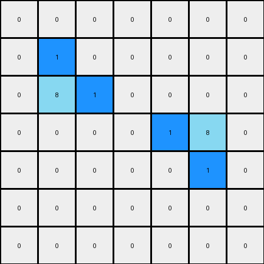
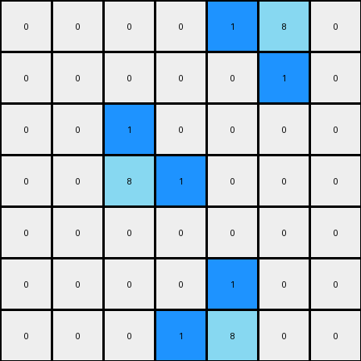

# 1-3aa6fb7a • 010 • refine_coder

---

Previous Code:
```python
"""
1.  **Identify Clusters:** Locate all clusters of '8' (azure) pixels in the input grid.
2.  **Insert '1':** For some of the '8' pixels, especially at changes of direction of edges. replace with a `1`.
3. The overall shape of the 8's is preserved.
"""

import numpy as np

def find_clusters(grid, value):
    """Finds clusters of a specific value in a grid."""
    visited = np.zeros_like(grid, dtype=bool)
    clusters = []

    def dfs(row, col, current_cluster):
        """Depth-first search to explore a cluster."""
        if (
            row < 0
            or row >= grid.shape[0]
            or col < 0
            or col >= grid.shape[1]
            or visited[row, col]
            or grid[row, col] != value
        ):
            return

        visited[row, col] = True
        current_cluster.append((row, col))

        dfs(row + 1, col, current_cluster)
        dfs(row - 1, col, current_cluster)
        dfs(row, col + 1, current_cluster)
        dfs(row, col - 1, current_cluster)

    for row in range(grid.shape[0]):
        for col in range(grid.shape[1]):
            if grid[row, col] == value and not visited[row, col]:
                current_cluster = []
                dfs(row, col, current_cluster)
                clusters.append(current_cluster)

    return clusters

def transform(input_grid):
    """Transforms the input grid by inserting '1's near '8' clusters."""
    output_grid = np.copy(input_grid)
    clusters_of_8 = find_clusters(input_grid, 8)

    # identify corners/ direction changes within the clusters
    for cluster in clusters_of_8:
        for r, c in cluster:
          neighbors = []

          if r > 0:
            neighbors.append(input_grid[r-1,c])
          if r < input_grid.shape[0]-1:
            neighbors.append(input_grid[r+1,c])
          if c > 0:
            neighbors.append(input_grid[r,c-1])
          if c < input_grid.shape[1] -1:
            neighbors.append(input_grid[r, c+1])
          
          num_8_neighbors = neighbors.count(8)

          if num_8_neighbors < 2 and num_8_neighbors > 0:
              output_grid[r,c] = 1

    return output_grid
```

Train Set Results:

## Example 1:

Input:
```
0 0 0 0 0 0 0
0 8 0 0 0 0 0
0 8 8 0 0 0 0
0 0 0 0 8 8 0
0 0 0 0 0 8 0
0 0 0 0 0 0 0
0 0 0 0 0 0 0
```
Expected Output:
```
0 0 0 0 0 0 0
0 8 1 0 0 0 0
0 8 8 0 0 0 0
0 0 0 0 8 8 0
0 0 0 0 1 8 0
0 0 0 0 0 0 0
0 0 0 0 0 0 0
```
Transformed Output:
```
0 0 0 0 0 0 0
0 1 0 0 0 0 0
0 8 1 0 0 0 0
0 0 0 0 1 8 0
0 0 0 0 0 1 0
0 0 0 0 0 0 0
0 0 0 0 0 0 0
```

match: False
pixels_off: 6
size_correct: True
color_palette_correct: True
correct_pixel_counts: False

## Example 2:

Input:
```
0 0 0 0 8 8 0
0 0 0 0 0 8 0
0 0 8 0 0 0 0
0 0 8 8 0 0 0
0 0 0 0 0 0 0
0 0 0 0 8 0 0
0 0 0 8 8 0 0
```
Expected Output:
```
0 0 0 0 8 8 0
0 0 0 0 1 8 0
0 0 8 1 0 0 0
0 0 8 8 0 0 0
0 0 0 0 0 0 0
0 0 0 1 8 0 0
0 0 0 8 8 0 0
```
Transformed Output:
```
0 0 0 0 1 8 0
0 0 0 0 0 1 0
0 0 1 0 0 0 0
0 0 8 1 0 0 0
0 0 0 0 0 0 0
0 0 0 0 1 0 0
0 0 0 1 8 0 0
```

match: False
pixels_off: 9
size_correct: True
color_palette_correct: True
correct_pixel_counts: False
Okay, here's a breakdown of the situation and a plan to refine the natural language program:

**General Assessment:**

The initial strategy was partially correct in identifying clusters of '8' (azure) pixels. However, the logic for inserting '1' (blue) pixels was too simplistic and based only on the number of '8' neighbors. The results show inconsistencies – sometimes a '1' is placed correctly, sometimes incorrectly, and sometimes it's missing. The core issue is that the rule for placing '1's needs to be more sophisticated, taking into account the *shape* and *connectivity* of the '8' clusters, specifically related to "corners" and "direction changes," but in a more nuanced way than simply checking neighbors. The shape is not preserved.

**Strategy for Resolving Errors:**

1.  **Refine Corner/Direction Change Detection:** Instead of simply counting '8' neighbors, we need a more precise way to detect 'corners' or points where the direction of the '8' cluster changes. This likely involves looking at the *relative positions* of neighboring '8' pixels, perhaps using a more specific definition of a corner. It will be helpful to consider diagonal neighbors.

2.  **Consider Connectivity:** The placement of '1' seems to be related to maintaining the overall *connectivity* of the '8' cluster. We need to ensure that replacing an '8' with a '1' doesn't "break" the cluster into multiple, disconnected pieces.

3.  **Iterative Improvement:** We need use the training examples iteratively. Start with the simplest cases, make adjustments, test, and then address the remaining errors. It seems possible that the current program's results can be improved, making it a good starting point.

**Metrics and Observations:**

Here's an analysis of each example:

*   **Example 1:**
    *   Input: Two separate clusters of '8's: a vertical line and a horizontal line.
    *   Expected Output: '1's are inserted at the *ends* of each straight line segment of the '8' clusters.
    *   Actual Output: '1's are inserted at the *ends* and sometimes one pixel *beyond* the line segments (incorrect extra pixels at row=2, col=2 and row=3, col=4).
    *   Errors: The current rule adds ones beyond the 8 cluster boundary, and does not seem to consider a diagonal boundary as a boundary.

*   **Example 2:**
    *   Input: Three separate '8' clusters, two being angled lines and one a small horizontal cluster.
    *   Expected Output: '1's are inserted at the endpoints and bends in the '8' clusters.
    *   Actual Output: '1's are in approximately the correct place for the longer diagonal, but not the other two. Some are missing.
    *   Errors: The current rule seems to be too aggressive at placing ones on the boundaries, and not aggressive enough inside the angles.

**YAML Fact Block:**

```yaml
facts:
  - task_id: 008-py_05
  - objects:
      - type: cluster
        value: 8
        description: Contiguous blocks of azure pixels.
        properties:
          - shape: variable (lines, corners, curves)
          - connectivity: single_connected_component
      - type: pixel
        value: 1
        description: Blue pixels inserted within or adjacent to '8' clusters.
        properties:
          - placement: strategic
          - purpose: shape_modification, connectivity_maintenance
  - actions:
      - name: insert_blue_pixel
        agent: system
        target: grid
        preconditions:
          - object_type: cluster
            value: 8
            property_constraints:
              - shape: contains_corner_or_end
        postconditions:
          - object_type: pixel
            value: 1
            location: replaces 8 at corner or end
            cluster_connectivity_maintained: true
  - transformation_summary: The transformation identifies clusters of '8' pixels and inserts '1' pixels at specific locations (corners, ends, and direction changes) within the clusters. The overall goal is to outline the original structure.
```

**Natural Language Program:**

1.  **Identify Clusters:** Find all connected clusters of '8' (azure) pixels in the input grid. Consider pixels to be connected orthogonally.

2.  **Locate Strategic Points:** Within each '8' cluster, identify "strategic points" for inserting '1's. Strategic points are defined as:
    *   **Endpoints:** An '8' pixel with only one orthogonally adjacent '8' neighbor.
    *   **Corners:** An '8' pixel where the direction of the cluster changes. This is determined by:
        *   The '8' has exactly two orthogonally adjacent '8' pixels that are not orthogonally adjacent to *each other*.
        *   An '8' on a diagonal cluster boundary.
    * **Inside Bends**: Where the cluster has two adjacent '8' pixels *and* at least one diagonally adjacent '8' pixel
    *   **Do not place at boundaries that do not contain an '8' pixel:**

3. **Insert '1's:** Replace the '8' pixels at the identified strategic points with '1' (blue) pixels.

4. **Preserve shape:** The new '1' pixels, together with the remaining '8' pixels, preserve the general outline and direction changes.

**INSTRUCTIONS**

- generate a Python module to represent the natural language program 
- follow the template below
- all common math and science libraries are available
- create docstring only at top - but comment the workflow in the function
- use helper functions for common operations like finding objects, counting,
  measuring, moving, etc. 

remember - we are working iteratively - so this code will inform your future
self as we converge on the solution

*template:*

```python
"""
{{ natural language description of the transformation rule }}
"""

{{ imports }}

def transform(input_grid):
    # initialize output_grid

    # change output pixels 

    return output_grid

```
