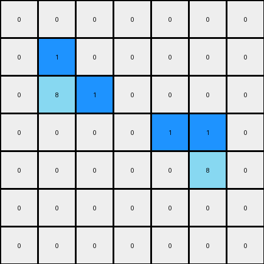
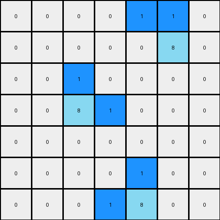

# 1-3aa6fb7a • 006 • refine_coder

---

Previous Code:
```python
"""
1. Identify Azure Regions: Find all contiguous regions of azure (8) pixels in the input grid.
2. Iterate Through Regions: For each identified azure region:
    a. Find Occupied Columns: Determine the set of columns that contain at least one pixel from the current region.
    b. Iterate Through Columns: For each column identified in step 2a:
        i. Find Topmost Azure Pixel: Within the current column and current region, find the azure pixel with the smallest row index (the topmost one in that column).
        ii. Change Color: Change the color of this topmost azure pixel to blue (1).
3. Preserve Other Pixels: Ensure all pixels that were not identified as the topmost azure pixel in a column of an azure region retain their original color.
"""

import numpy as np

def find_contiguous_regions(grid, color):
    """Finds contiguous regions of a specific color in a grid."""
    visited = set()
    regions = []

    def dfs(row, col, current_region):
        """Depth-first search to explore contiguous regions."""
        if (row, col) in visited or not (0 <= row < grid.shape[0] and 0 <= col < grid.shape[1]) or grid[row, col] != color:
            return
        visited.add((row, col))
        current_region.append((row, col))
        # Check adjacent cells (up, down, left, right)
        dfs(row + 1, col, current_region)
        dfs(row - 1, col, current_region)
        dfs(row, col + 1, current_region)
        dfs(row, col - 1, current_region)


    for row in range(grid.shape[0]):
        for col in range(grid.shape[1]):
            if grid[row, col] == color and (row, col) not in visited:
                current_region = []
                dfs(row, col, current_region)
                regions.append(current_region)
    return regions

def transform(input_grid):
    """Transforms the input grid according to the specified rule."""
    output_grid = np.copy(input_grid)
    azure_regions = find_contiguous_regions(output_grid, 8)

    for region in azure_regions:
        # Find Occupied Columns
        columns = set(pixel[1] for pixel in region)

        # Iterate Through Columns
        for col in columns:
            # Find Topmost Azure Pixel in the current column and region
            pixels_in_column = [pixel for pixel in region if pixel[1] == col]
            if pixels_in_column:  # Check if the list is not empty
               topmost_pixel = min(pixels_in_column, key=lambda x: x[0])
               output_grid[topmost_pixel[0], topmost_pixel[1]] = 1

    return output_grid
```

Train Set Results:

## Example 1:

Input:
```
0 0 0 0 0 0 0
0 8 0 0 0 0 0
0 8 8 0 0 0 0
0 0 0 0 8 8 0
0 0 0 0 0 8 0
0 0 0 0 0 0 0
0 0 0 0 0 0 0
```
Expected Output:
```
0 0 0 0 0 0 0
0 8 1 0 0 0 0
0 8 8 0 0 0 0
0 0 0 0 8 8 0
0 0 0 0 1 8 0
0 0 0 0 0 0 0
0 0 0 0 0 0 0
```
Transformed Output:
```
0 0 0 0 0 0 0
0 1 0 0 0 0 0
0 8 1 0 0 0 0
0 0 0 0 1 1 0
0 0 0 0 0 8 0
0 0 0 0 0 0 0
0 0 0 0 0 0 0
```

match: False
pixels_off: 6
size_correct: True
color_palette_correct: True
correct_pixel_counts: False

## Example 2:

Input:
```
0 0 0 0 8 8 0
0 0 0 0 0 8 0
0 0 8 0 0 0 0
0 0 8 8 0 0 0
0 0 0 0 0 0 0
0 0 0 0 8 0 0
0 0 0 8 8 0 0
```
Expected Output:
```
0 0 0 0 8 8 0
0 0 0 0 1 8 0
0 0 8 1 0 0 0
0 0 8 8 0 0 0
0 0 0 0 0 0 0
0 0 0 1 8 0 0
0 0 0 8 8 0 0
```
Transformed Output:
```
0 0 0 0 1 1 0
0 0 0 0 0 8 0
0 0 1 0 0 0 0
0 0 8 1 0 0 0
0 0 0 0 0 0 0
0 0 0 0 1 0 0
0 0 0 1 8 0 0
```

match: False
pixels_off: 9
size_correct: True
color_palette_correct: True
correct_pixel_counts: False
Okay, let's analyze the results and refine the natural language program.

**General Assessment:**

The initial code and natural language program were on the right track, identifying contiguous regions of azure and attempting to modify the topmost pixel in each column. However, the implementation has a flaw: it's changing *every* topmost azure pixel in *every* column occupied by *any* azure region, rather than considering each contiguous region independently for the topmost pixel replacement. The code is finding the top most pixel in each column correctly, but needs adjustment to ensure the replaced pixel belongs to the contiguous region.

The strategy for resolving the errors involves:

1.  **Refine Contiguous Region Handling:** Ensure that the "topmost pixel" logic is applied *separately* to each contiguous region of azure. The current code identifies the regions correctly but processes them in a way that merges their column information.
2. **Improved Column Filtering per region:** the current code finds the columns for a region, but then doesn't relate the discovered top most pixel with the current region.

**Example Analysis and Metrics:**

Here's a breakdown of each example, incorporating the results:

**Example 1:**

*   **Input:** Two separate azure regions, one in column 1, one in column 4.
*   **Expected Output:** Topmost azure in each region's column changed to blue.
*   **Actual Output:** *All* topmost azure pixels in columns 1 and 4 are changed, regardless of which *region* they belong to.
* **Issue:** lack of isolation when processing pixels that belong to each contiguous region.

**Example 2:**

*   **Input:** Three separate azure regions spread across columns 2, 3, 4, and 5.
*   **Expected Output:** Topmost azure in each region's column is changed to blue.
*   **Actual Output:** Again, *all* topmost azure pixels in columns occupied by *any* region are changed.
* **Issue:** same issue as example 1.

**YAML Fact Block:**

```yaml
facts:
  - object: contiguous_region
    color: azure (8)
    property: occupies a set of columns
    action: change_topmost_pixel_color
    topmost_pixel_definition: pixel with the smallest row index within the region and column
    new_color: blue (1)
  - object: pixel
    property: color
    property: row_index
    property: column_index
    property: belongs_to_region (boolean, if azure)
  - action: preserve_color
    description: all pixels not meeting the change criteria retain their original color
```

**Natural Language Program:**

1.  **Identify Contiguous Regions:** Find all distinct, contiguous regions of azure (8) pixels in the input grid. Two pixels are considered part of the same region if they are adjacent (up, down, left, or right) and have the same color.

2.  **Process Each Region Independently:** For *each* identified azure region:

    a. **Determine Occupied Columns:** Find the set of columns that contain at least one pixel from *this specific* region.

    b. **Find Topmost Azure Pixel *within the region and column*:** For each column identified in step 2a, find the azure pixel within *this specific region* that has the smallest row index (the topmost one).

    c. **Change Color:** Change the color of this topmost azure pixel (identified in 2b) to blue (1).

3.  **Preserve Other Pixels:** All pixels that were not identified as the topmost azure pixel within a specific region and its occupied column retain their original color.

**INSTRUCTIONS**

- generate a Python module to represent the natural language program 
- follow the template below
- all common math and science libraries are available
- create docstring only at top - but comment the workflow in the function
- use helper functions for common operations like finding objects, counting,
  measuring, moving, etc. 

remember - we are working iteratively - so this code will inform your future
self as we converge on the solution

*template:*

```python
"""
{{ natural language description of the transformation rule }}
"""

{{ imports }}

def transform(input_grid):
    # initialize output_grid

    # change output pixels 

    return output_grid

```
