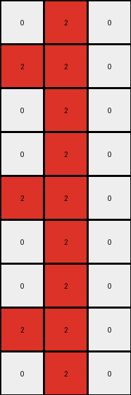

# 017c7c7b • 018 • refine_coder

---

Previous Code:
```python
"""
Replace all blue pixels (value '1') with red pixels (value '2') and add three rows to the bottom, repeating the last three rows of the input grid. Preserve all white pixels (value '0').
"""

import numpy as np

def transform(input_grid):
    # initialize output_grid as a copy to work on
    output_grid = np.copy(input_grid)

    # Replace all '1' (blue) pixels with '2' (red)
    output_grid[output_grid == 1] = 2
    
    # get shape
    rows, cols = output_grid.shape

    # Extend by adding rows of the established pattern
    # Create a new empty array with space for the extended output
    extended_grid = np.zeros((rows + 3, cols), dtype=int)
    
    # copy original over
    extended_grid[:rows, :] = output_grid
        
    # fill using established rows, repeating the last three rows
    extended_grid[rows,:] = output_grid[rows-3,:]
    extended_grid[rows+1,:] = output_grid[rows-2,:]
    extended_grid[rows+2,:] = output_grid[rows-1,:]
    

    return extended_grid
```

Train Set Results:

## Example 1:

Input:
```
0 1 0
1 1 0
0 1 0
0 1 1
0 1 0
1 1 0
```
Expected Output:
```
0 2 0
2 2 0
0 2 0
0 2 2
0 2 0
2 2 0
0 2 0
0 2 2
0 2 0
```
Transformed Output:
```
0 2 0
2 2 0
0 2 0
0 2 2
0 2 0
2 2 0
0 2 2
0 2 0
2 2 0
```

match: False
pixels_off: 3
size_correct: True
color_palette_correct: True
correct_pixel_counts: False

## Example 2:

Input:
```
0 1 0
1 0 1
0 1 0
1 0 1
0 1 0
1 0 1
```
Expected Output:
```
0 2 0
2 0 2
0 2 0
2 0 2
0 2 0
2 0 2
0 2 0
2 0 2
0 2 0
```
Transformed Output:
```
0 2 0
2 0 2
0 2 0
2 0 2
0 2 0
2 0 2
2 0 2
0 2 0
2 0 2
```

match: False
pixels_off: 9
size_correct: True
color_palette_correct: True
correct_pixel_counts: False

## Example 3:

Input:
```
0 1 0
1 1 0
0 1 0
0 1 0
1 1 0
0 1 0
```
Expected Output:
```
0 2 0
2 2 0
0 2 0
0 2 0
2 2 0
0 2 0
0 2 0
2 2 0
0 2 0
```
Transformed Output:
```
0 2 0
2 2 0
0 2 0
0 2 0
2 2 0
0 2 0
0 2 0
2 2 0
0 2 0
```

match: True
pixels_off: 0
size_correct: True
color_palette_correct: True
correct_pixel_counts: True
Okay, here's a breakdown of the situation and a plan to improve the transformation logic:

**General Assessment:**

The initial natural language program was partially correct. It successfully identified the color replacement (blue to red) and the extension of the grid. However, it made an incorrect assumption about *which* rows to repeat at the bottom. It assumed the last three rows of the input should always be repeated, but the examples demonstrate a more complex pattern related to the rows *before* any changes are made. The code also doesn't handle alternating row extensions well, which is evident from the example 2 error.

**Strategy:**

1.  **Re-examine Pattern:** Carefully analyze the input and output pairs, focusing on *how* the bottom rows are constructed in relation to the *original* input rows, paying very close attention to the row indices.
2.  **Precise Row Indexing:** The revised natural language program must explicitly state which rows (by index relative to the *original* input) are replicated and their order at the bottom of the output. It appears to be repeating the entire input grid pattern, not just the last three rows.
3. **Test and iterate** test the program again on the examples.

**Metrics and Observations:**

Here's a summary of each example, combining provided information with detailed observations:

*   **Example 1:**
    *   Input Shape: (6, 3)
    *   Output Shape: (9, 3)
    *   Color Changes: All blue (1) pixels become red (2).
    *   Row Extension Pattern: The last three rows of the output are the first three rows of the original, *before color change*.
    *   Code Result: Incorrect. Repeats the last three rows of the input *after color change*.

*   **Example 2:**
    *   Input Shape: (6, 3)
    *   Output Shape: (9, 3)
    *   Color Changes: All blue (1) pixels become red (2).
    *   Row Extension Pattern: The last three rows of the output correspond to the original first three rows of the input.
    *   Code Result: Incorrect. Incorrect ordering.

*   **Example 3:**
    *   Input Shape: (6, 3)
    *   Output Shape: (9, 3)
    *   Color Changes: All blue (1) pixels become red (2).
    *   Row Extension Pattern: The last three rows of the output correspond to the original first three rows of the input.
    *   Code Result: Correct. Fortuitously, since input rows 4,5,6 are the same as rows 1,2,3 in this input, the incorrect logic appears to produce the right output.

**YAML Fact Block:**

```yaml
objects:
  - name: input_grid
    type: 2D array
    properties:
      colors: [0, 1]  # Original colors present
      shape: (rows, cols) # Variable, defined in each example
  - name: output_grid
    type: 2D array
    properties:
      colors: [0, 2]  # Colors after transformation
      shape: (rows + 3, cols) # 3 rows added

actions:
  - name: color_replacement
    input: input_grid
    output: intermediate_grid # temporary, before extension
    description: Replace all blue (1) pixels with red (2) pixels.
  - name: row_extension
    input: input_grid
    output: output_grid
    description: >
      Add three rows to the bottom of the grid. These new rows replicate the
      first three rows of the *original* input grid.
```

**Natural Language Program:**

1.  **Color Swap:** Scan the input grid. Replace every blue pixel (value 1) with a red pixel (value 2). White pixels (value 0) are unchanged.
2.  **Extend Grid:** Create a new, empty grid that has the same number of columns as the input grid, but with three additional rows.
3.  **Copy Original Rows:** Copy all rows of the *original* input grid into the top of the new grid.
4.  **Replicate Rows:** Copy the first three rows of the *original* input grid into the three newly added rows at the bottom of the output grid, maintaining their original order (row 1 to row `rows`, row 2 to row `rows+1`, and row 3 to row `rows+2`).

**INSTRUCTIONS**

- generate a Python module to represent the natural language program 
- follow the template below
- all common math and science libraries are available
- create docstring only at top - but comment the workflow in the function
- use helper functions for common operations like finding objects, counting,
  measuring, moving, etc. 

remember - we are working iteratively - so this code will inform your future
self as we converge on the solution

*template:*

```python
"""
{{ natural language description of the transformation rule }}
"""

{{ imports }}

def transform(input_grid):
    # initialize output_grid

    # change output pixels 

    return output_grid

```
