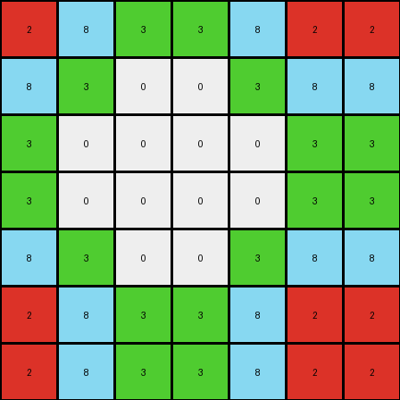
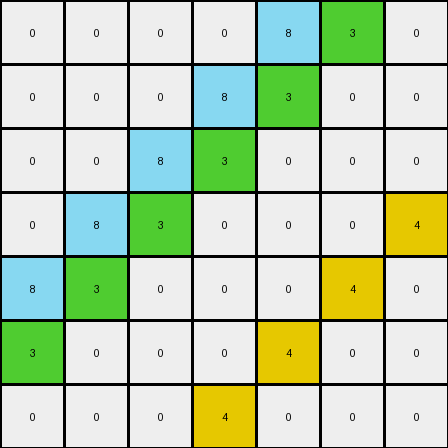

# 05269061 • 003 • refine_dreamer

---

Previous Code:
```python
"""
The transformation identifies a core pattern in the input grid (the top-left 3x3 block of non-zero pixels) and replicates it across the output grid. The replication involves a horizontal mirroring every 3 columns, and a vertical mirroring every 3 rows.
"""

import numpy as np

def get_core_pattern(input_grid):
    """Extracts the core non-zero pattern from the input grid."""
    # Convert to numpy array for easier manipulation
    input_array = np.array(input_grid)

    # Find the boundaries of the non-zero region.
    rows, cols = np.where(input_array != 0)
    
    if len(rows) == 0:  # Handle empty input or all-zero input
        return input_array, 0

    max_row, max_col = np.max(rows), np.max(cols)
     
    # Assuming top-left corner alignment; size = max row/col index.
    size = max(max_row, max_col) + 1    
    core_pattern = input_array[:size, :size]
    return core_pattern.tolist(), size

def transform(input_grid):
    """Transforms the input grid according to the mirroring and replication rules."""
    core_pattern, size = get_core_pattern(input_grid)
    
    if size==0:
        return input_grid
        
    output_grid = []
    
    # Build output by replicating and mirroring pattern
    for i in range(len(input_grid)):
      row = []
      for j in range(len(input_grid[0])):
        
        # Calculate indices for core pattern, with mirroring.
        pattern_row = i % size
        pattern_col = j % size

        # Calculate if this cell is within reversed block
        row_block = i // size
        col_block = j // size

        # Reverse index within block if in an odd numbered block.
        if col_block % 2 == 1:
            pattern_col = size - 1 - pattern_col
        if row_block % 2 == 1:
            pattern_row = size - 1 - pattern_row

        row.append(core_pattern[pattern_row][pattern_col])
      output_grid.append(row)

    return output_grid
```

Train Set Results:

## Example 1:

Input:
```
2 8 3 0 0 0 0
8 3 0 0 0 0 0
3 0 0 0 0 0 0
0 0 0 0 0 0 0
0 0 0 0 0 0 0
0 0 0 0 0 0 0
0 0 0 0 0 0 0
```
Expected Output:
```
2 8 3 2 8 3 2
8 3 2 8 3 2 8
3 2 8 3 2 8 3
2 8 3 2 8 3 2
8 3 2 8 3 2 8
3 2 8 3 2 8 3
2 8 3 2 8 3 2
```
Transformed Output:
```
2 8 3 3 8 2 2
8 3 0 0 3 8 8
3 0 0 0 0 3 3
3 0 0 0 0 3 3
8 3 0 0 3 8 8
2 8 3 3 8 2 2
2 8 3 3 8 2 2
```

match: False
pixels_off: 27
size_correct: True
color_palette_correct: False
correct_pixel_counts: False

## Example 2:

Input:
```
0 0 0 0 0 0 0
0 0 0 0 0 0 0
0 0 0 0 0 0 1
0 0 0 0 0 1 2
0 0 0 0 1 2 4
0 0 0 1 2 4 0
0 0 1 2 4 0 0
```
Expected Output:
```
2 4 1 2 4 1 2
4 1 2 4 1 2 4
1 2 4 1 2 4 1
2 4 1 2 4 1 2
4 1 2 4 1 2 4
1 2 4 1 2 4 1
2 4 1 2 4 1 2
```
Transformed Output:
```
0 0 0 0 0 0 0
0 0 0 0 0 0 0
0 0 0 0 0 0 1
0 0 0 0 0 1 2
0 0 0 0 1 2 4
0 0 0 1 2 4 0
0 0 1 2 4 0 0
```

match: False
pixels_off: 37
size_correct: True
color_palette_correct: False
correct_pixel_counts: False

## Example 3:

Input:
```
0 0 0 0 8 3 0
0 0 0 8 3 0 0
0 0 8 3 0 0 0
0 8 3 0 0 0 4
8 3 0 0 0 4 0
3 0 0 0 4 0 0
0 0 0 4 0 0 0
```
Expected Output:
```
4 8 3 4 8 3 4
8 3 4 8 3 4 8
3 4 8 3 4 8 3
4 8 3 4 8 3 4
8 3 4 8 3 4 8
3 4 8 3 4 8 3
4 8 3 4 8 3 4
```
Transformed Output:
```
0 0 0 0 8 3 0
0 0 0 8 3 0 0
0 0 8 3 0 0 0
0 8 3 0 0 0 4
8 3 0 0 0 4 0
3 0 0 0 4 0 0
0 0 0 4 0 0 0
```

match: False
pixels_off: 34
size_correct: True
color_palette_correct: False
correct_pixel_counts: False
**INSTRUCTIONS**

The code above was generated based on observations from the first training
example

we have tested the transform function on each of the task example inputs and
compared with the expected output

review each of the examples provided and the results and consider how the
natural language program should be updated to accommodate this new knowledge

respond with the following deliverables:

- general assessment of the information provided and strategy for resolving the
  errors
- gather metrics about each of the examples and results - use code_execution to
  develop accurate reports on your assumptions
- a YAML block documenting facts - Focus on identifying objects, their properties, and the actions performed on them.
- a natural language program - Be as clear and concise as possible, providing a complete description of the transformation rule.


your responses should be considered as information in a report - not a
conversation
