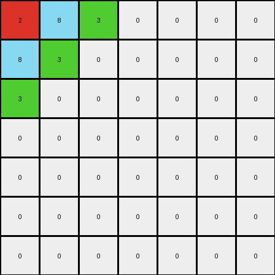
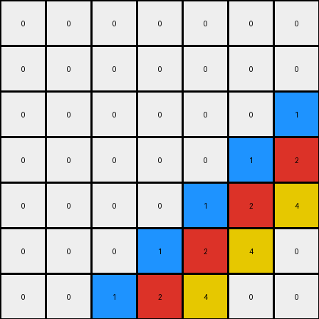
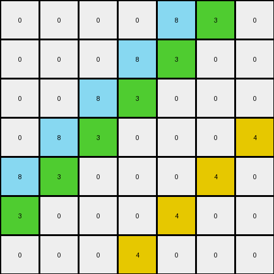

# 05269061 • 005 • refine_dreamer

---


Previous Code:
```python
"""
1.  **Identify the Repeating Pattern:** Examine the input grid to find the smallest square block of pixels that, when mirrored both horizontally and vertically, can generate the entire output grid. This block may not always be in the top-left corner and might not be immediately obvious by looking at the bounds of non-zero pixels.
2.  **Determine Core Pattern Size:** The dimensions of the repeating square block identified in Step 1 constitute the core pattern's size.
3.  **Mirror and Replicate:** Create the output grid by replicating the core pattern.  For each cell in the output grid:
    *   Calculate the corresponding row and column indices within the core pattern using the modulo operator (`%`) with the core pattern size.
    *   Determine if the current output cell falls within a mirrored section.  Divide the output row and column indices by the core pattern size (integer division). If the result is odd, the corresponding dimension (row or column) is mirrored.
    *   If a dimension is mirrored, invert the core pattern index for that dimension by subtracting it from the core pattern size minus 1.
    *   Copy the pixel value from the calculated core pattern indices to the output grid cell.
"""

import numpy as np

def find_repeating_pattern(input_grid):
    """Finds the smallest repeating square pattern."""
    input_array = np.array(input_grid)
    rows, cols = input_array.shape

    # Iterate through possible pattern sizes
    for size in range(1, min(rows, cols) + 1):
        # Extract top-left block as potential pattern
        potential_pattern = input_array[:size, :size]
        
        valid_pattern = True
        # Check if this pattern can reconstruct the entire grid
        for i in range(rows):
            for j in range(cols):
                pattern_row = i % size
                pattern_col = j % size

                row_block = i // size
                col_block = j // size
                
                if col_block % 2 == 1:
                    pattern_col = size - 1 - pattern_col
                if row_block % 2 == 1:
                    pattern_row = size - 1 - pattern_row
                    
                if input_array[i, j] != 0 and potential_pattern[pattern_row, pattern_col] == 0:
                  valid_pattern = False
                  break
                if input_array[i, j] != potential_pattern[pattern_row, pattern_col] and potential_pattern[pattern_row, pattern_col] != 0:
                    valid_pattern = False
                    break
            if not valid_pattern:
              break
        
        if valid_pattern:
            return potential_pattern.tolist(), size

    return input_grid, min(rows,cols) # Fallback: Return original grid if no pattern is found.

def transform(input_grid):
    """Transforms the input grid by identifying and replicating a mirrored pattern."""
    
    # Identify Repeating Pattern and Determine size
    core_pattern, size = find_repeating_pattern(input_grid)
    
    # Convert pattern to numpy array.
    core_pattern = np.array(core_pattern)
    
    # initialize output_grid
    output_grid = []

    # Build output by replicating and mirroring pattern
    for i in range(len(input_grid)):
      row = []
      for j in range(len(input_grid[0])):
        
        # Calculate indices for core pattern, with mirroring.
        pattern_row = i % size
        pattern_col = j % size

        # Calculate if this cell is within reversed block
        row_block = i // size
        col_block = j // size

        # Reverse index within block if in an odd numbered block.
        if col_block % 2 == 1:
            pattern_col = size - 1 - pattern_col
        if row_block % 2 == 1:
            pattern_row = size - 1 - pattern_row

        row.append(core_pattern[pattern_row, pattern_col])
      output_grid.append(row)

    return output_grid
```

Train Set Results:

## Example 1:

Input:
```
2 8 3 0 0 0 0
8 3 0 0 0 0 0
3 0 0 0 0 0 0
0 0 0 0 0 0 0
0 0 0 0 0 0 0
0 0 0 0 0 0 0
0 0 0 0 0 0 0
```
Expected Output:
```
2 8 3 2 8 3 2
8 3 2 8 3 2 8
3 2 8 3 2 8 3
2 8 3 2 8 3 2
8 3 2 8 3 2 8
3 2 8 3 2 8 3
2 8 3 2 8 3 2
```
Transformed Output:
```
2 8 3 0 0 0 0
8 3 0 0 0 0 0
3 0 0 0 0 0 0
0 0 0 0 0 0 0
0 0 0 0 0 0 0
0 0 0 0 0 0 0
0 0 0 0 0 0 0
```

match: False
pixels_off: 43
size_correct: True
color_palette_correct: False
correct_pixel_counts: False

## Example 2:

Input:
```
0 0 0 0 0 0 0
0 0 0 0 0 0 0
0 0 0 0 0 0 1
0 0 0 0 0 1 2
0 0 0 0 1 2 4
0 0 0 1 2 4 0
0 0 1 2 4 0 0
```
Expected Output:
```
2 4 1 2 4 1 2
4 1 2 4 1 2 4
1 2 4 1 2 4 1
2 4 1 2 4 1 2
4 1 2 4 1 2 4
1 2 4 1 2 4 1
2 4 1 2 4 1 2
```
Transformed Output:
```
0 0 0 0 0 0 0
0 0 0 0 0 0 0
0 0 0 0 0 0 1
0 0 0 0 0 1 2
0 0 0 0 1 2 4
0 0 0 1 2 4 0
0 0 1 2 4 0 0
```

match: False
pixels_off: 37
size_correct: True
color_palette_correct: False
correct_pixel_counts: False

## Example 3:

Input:
```
0 0 0 0 8 3 0
0 0 0 8 3 0 0
0 0 8 3 0 0 0
0 8 3 0 0 0 4
8 3 0 0 0 4 0
3 0 0 0 4 0 0
0 0 0 4 0 0 0
```
Expected Output:
```
4 8 3 4 8 3 4
8 3 4 8 3 4 8
3 4 8 3 4 8 3
4 8 3 4 8 3 4
8 3 4 8 3 4 8
3 4 8 3 4 8 3
4 8 3 4 8 3 4
```
Transformed Output:
```
0 0 0 0 8 3 0
0 0 0 8 3 0 0
0 0 8 3 0 0 0
0 8 3 0 0 0 4
8 3 0 0 0 4 0
3 0 0 0 4 0 0
0 0 0 4 0 0 0
```

match: False
pixels_off: 34
size_correct: True
color_palette_correct: False
correct_pixel_counts: False

**INSTRUCTIONS**

The code above was generated based on observations from the first training
example

we have tested the transform function on each of the task example inputs and
compared with the expected output

review each of the examples provided and the results and consider how the
natural language program should be updated to accommodate this new knowledge

respond with the following deliverables:

- general assessment of the information provided and strategy for resolving the
  errors
- gather metrics about each of the examples and results - use code_execution to
  develop accurate reports on your assumptions
- a YAML block documenting facts - Focus on identifying objects, their properties, and the actions performed on them.
- a natural language program - Be as clear and concise as possible, providing a complete description of the transformation rule.


your responses should be considered as information in a report - not a
conversation
