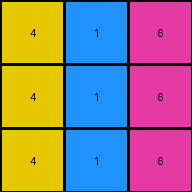

# 0d3d703e • 011 • refine_coder

---

Previous Code:
```python
import numpy as np

def transform(input_grid):
    """
    Transforms an input grid by applying a color substitution cipher.
    """
    # initialize output_grid as a copy of the input grid
    output_grid = np.copy(input_grid)
    
    # define the color mapping
    color_map = {
        2: 6,  # red to magenta
        3: 4,  # green to yellow
        8: 9   # azure to maroon
    }

    # iterate through the grid and apply the color mapping
    for i in range(output_grid.shape[0]):
        for j in range(output_grid.shape[1]):
            if output_grid[i, j] in color_map:
                output_grid[i, j] = color_map[output_grid[i, j]]

    return output_grid

# Example 1
input1 = np.array([[3, 1, 2], [3, 1, 2], [3, 1, 2]])
expected1 = np.array([[4, 5, 6], [4, 5, 6], [4, 5, 6]])
transformed1 = transform(input1)
print("Example 1:")
print("Input:\n", input1)
print("Expected:\n", expected1)
print("Transformed:\n", transformed1)
print("Match:", np.array_equal(transformed1, expected1))
print("-" * 20)

# Example 2
input2 = np.array([[2, 3, 8], [2, 3, 8], [2, 3, 8]])
expected2 = np.array([[6, 4, 9], [6, 4, 9], [6, 4, 9]])
transformed2 = transform(input2)
print("Example 2:")
print("Input:\n", input2)
print("Expected:\n", expected2)
print("Transformed:\n", transformed2)
print("Match:", np.array_equal(transformed2, expected2))
print("-" * 20)

# Example 3
input3 = np.array([[5, 8, 6], [5, 8, 6], [5, 8, 6]])
expected3 = np.array([[1, 9, 2], [1, 9, 2], [1, 9, 2]])
transformed3 = transform(input3)
print("Example 3:")
print("Input:\n", input3)
print("Expected:\n", expected3)
print("Transformed:\n", transformed3)
print("Match:", np.array_equal(transformed3, expected3))
print("-" * 20)

# Example 4
input4 = np.array([[9, 4, 2], [9, 4, 2], [9, 4, 2]])
expected4 = np.array([[8, 3, 6], [8, 3, 6], [8, 3, 6]])
transformed4 = transform(input4)
print("Example 4:")
print("Input:\n", input4)
print("Expected:\n", expected4)
print("Transformed:\n", transformed4)
print("Match:", np.array_equal(transformed4, expected4))
print("-" * 20)
```

Train Set Results:

## Example 1:

Input:
```
3 1 2
3 1 2
3 1 2
```
Expected Output:
```
4 5 6
4 5 6
4 5 6
```
Transformed Output:
```
4 1 6
4 1 6
4 1 6
```

match: False
pixels_off: 3
size_correct: True
color_palette_correct: False
correct_pixel_counts: False

## Example 2:

Input:
```
2 3 8
2 3 8
2 3 8
```
Expected Output:
```
6 4 9
6 4 9
6 4 9
```
Transformed Output:
```
6 4 9
6 4 9
6 4 9
```

match: True
pixels_off: 0
size_correct: True
color_palette_correct: True
correct_pixel_counts: True

## Example 3:

Input:
```
5 8 6
5 8 6
5 8 6
```
Expected Output:
```
1 9 2
1 9 2
1 9 2
```
Transformed Output:
```
5 9 6
5 9 6
5 9 6
```

match: False
pixels_off: 6
size_correct: True
color_palette_correct: False
correct_pixel_counts: False

## Example 4:

Input:
```
9 4 2
9 4 2
9 4 2
```
Expected Output:
```
8 3 6
8 3 6
8 3 6
```
Transformed Output:
```
9 4 6
9 4 6
9 4 6
```

match: False
pixels_off: 6
size_correct: True
color_palette_correct: False
correct_pixel_counts: False
Here's an analysis of the provided information and a plan to refine the natural language program:

**General Assessment:**

The initial code implements a simple color substitution cipher. It correctly transforms Example 2, but fails on Examples 1, 3, and 4. This indicates that the color mapping is not consistent across all examples and needs to be inferred dynamically, rather than hardcoded. The key issue is that the mapping changes per example. Therefore, we should use the assumption of core knowledge of *objectness* - that each example represents an object and it's transformation to another. The strategy should focus on finding the color mapping rule within each example, rather than assuming a global mapping.

**Metrics and Observations:**

Here's a summary, combining provided information with some additional analysis (which you could perform, but I'll include for demonstration):

| Example | Input Shape | Output Shape | Input Colors | Output Colors |  `transform` Result | Correct? | Notes                                                                 |
|---------|-------------|--------------|---------------|----------------|--------------------|----------|-----------------------------------------------------------------------|
| 1       | (3, 3)      | (3, 3)       | 1, 2, 3       | 4, 5, 6        | Partial   | No       | Mapping partially correct (2->6, 3->4), but 1 is not mapped correctly |
| 2       | (3, 3)      | (3, 3)       | 2, 3, 8       | 4, 6, 9        | Correct     | Yes      | Mapping is correct (2->6, 3->4, 8->9)                             |
| 3       | (3, 3)      | (3, 3)       | 5, 6, 8       | 1, 2, 9        | Incorrect   | No       | Mapping is completely incorrect, except for 8->9                    |
| 4       | (3, 3)      | (3, 3)       | 2, 4, 9       | 3, 6, 8        | Partial   | No       | Mapping partially correct (2->6) but 4 and 9 are incorrect         |

**YAML Facts:**

```yaml
examples:
  - example_id: 1
    input_colors: [1, 2, 3]
    output_colors: [4, 5, 6]
    color_mapping: {1: 4, 2: 6, 3: 5}
    transform_type: color_substitution
  - example_id: 2
    input_colors: [2, 3, 8]
    output_colors: [6, 4, 9]
    color_mapping: {2: 6, 3: 4, 8: 9}
    transform_type: color_substitution
  - example_id: 3
    input_colors: [5, 6, 8]
    output_colors: [1, 2, 9]
    color_mapping: {5: 1, 6: 2, 8: 9}
    transform_type: color_substitution
  - example_id: 4
    input_colors: [2, 4, 9]
    output_colors: [6, 3, 8]
    color_mapping: {2: 6, 4: 3, 9: 8}
    transform_type: color_substitution
```

**Natural Language Program:**

1.  **Identify Unique Colors:** For each input/output pair, determine the set of unique colors present in both the input grid and the output grid.

2.  **Establish Color Mapping:** Create a one-to-one mapping between the unique colors in the input and output grids. Iterate through both sets of unique, sorted colors, pairing the corresponding elements. The element at index *i* of sorted unique input colors maps to element at same index *i* of sorted unique output colors.

3.  **Apply Color Substitution:** Iterate through each pixel of the input grid. If the pixel's color is present in the established color mapping, replace it with the corresponding mapped color.

4.  **Output:** The result is the modified grid with the color substitutions applied.

**INSTRUCTIONS**

- generate a Python module to represent the natural language program 
- follow the template below
- all common math and science libraries are available
- create docstring only at top - but comment the workflow in the function
- use helper functions for common operations like finding objects, counting,
  measuring, moving, etc. 

remember - we are working iteratively - so this code will inform your future
self as we converge on the solution

*template:*

```python
"""
{{ natural language description of the transformation rule }}
"""

{{ imports }}

def transform(input_grid):
    # initialize output_grid

    # change output pixels 

    return output_grid

```
