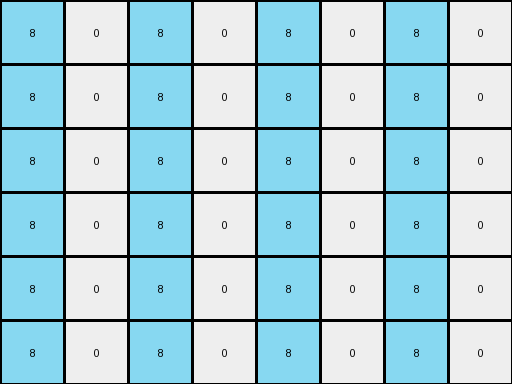
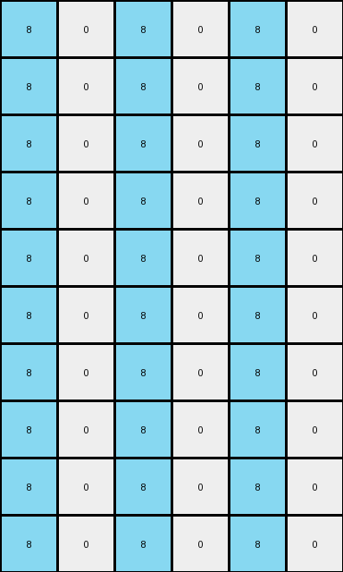
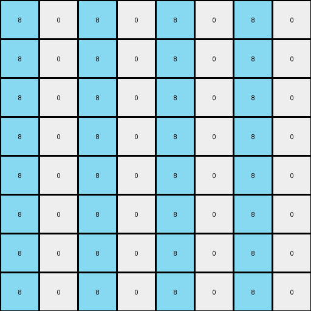

# 10fcaaa3 • 004 • refine_coder

---

Previous Code:
```python
"""
Expands the input grid, populates it with a pattern of azure and white columns, and replicates the gray pixels from the input, adjusting their position in the expanded grid.
"""

import numpy as np

def transform(input_grid):
    # Initialize output_grid with doubled dimensions
    input_height, input_width = input_grid.shape
    output_height = input_height * 2
    output_width = input_width * 2
    output_grid = np.zeros((output_height, output_width), dtype=int)

    # Populate Azure: Fill even columns with azure (8)
    for x in range(0, output_width, 2):
        output_grid[:, x] = 8

    # Populate Gray: Replicate and position gray pixels
    for y in range(input_height):
        for x in range(input_width):
            if input_grid[y, x] == 5:
                output_grid[y * 2 + 1, x * 2 + 1] = 5
                output_grid[y*2 + 1 +1, x * 2 + 1] = 5 # duplicate down

    # Remaining cells are already initialized to 0 (white), so no further action needed.

    return output_grid
```

Train Set Results:

## Example 1:

Input:
```
0 0 0 0
0 5 0 0
```
Expected Output:
```
8 0 8 0 8 0 8 0
0 5 0 0 0 5 0 0
8 0 8 0 8 0 8 0
0 5 0 0 0 5 0 0
```
match: ERROR: index 4 is out of bounds for axis 0 with size 4
pixels_off: None
size_correct: None
color_palette_correct: None
correct_pixel_counts: None

## Example 2:

Input:
```
0 0 6 0
0 0 0 0
0 6 0 0
```
Expected Output:
```
0 0 6 0 0 0 6 0
8 8 8 8 8 8 8 8
0 6 0 8 0 6 0 8
8 0 6 0 8 0 6 0
8 8 8 8 8 8 8 8
0 6 0 0 0 6 0 0
```
Transformed Output:
```
8 0 8 0 8 0 8 0
8 0 8 0 8 0 8 0
8 0 8 0 8 0 8 0
8 0 8 0 8 0 8 0
8 0 8 0 8 0 8 0
8 0 8 0 8 0 8 0
```

match: False
pixels_off: 28
size_correct: True
color_palette_correct: True
correct_pixel_counts: False

## Example 3:

Input:
```
0 0 0
0 4 0
0 0 0
0 0 0
4 0 0
```
Expected Output:
```
8 0 8 8 0 8
0 4 0 0 4 0
8 0 8 8 0 8
0 8 8 0 8 0
4 0 0 4 0 0
8 8 8 8 8 8
0 4 0 0 4 0
8 0 8 8 0 8
0 8 8 0 8 0
4 0 0 4 0 0
```
Transformed Output:
```
8 0 8 0 8 0
8 0 8 0 8 0
8 0 8 0 8 0
8 0 8 0 8 0
8 0 8 0 8 0
8 0 8 0 8 0
8 0 8 0 8 0
8 0 8 0 8 0
8 0 8 0 8 0
8 0 8 0 8 0
```

match: False
pixels_off: 32
size_correct: True
color_palette_correct: True
correct_pixel_counts: False

## Example 4:

Input:
```
0 0 0 0
0 2 0 0
0 0 0 0
0 0 0 0
```
Expected Output:
```
8 0 8 0 8 0 8 0
0 2 0 0 0 2 0 0
8 0 8 0 8 0 8 0
0 0 0 0 0 0 0 0
8 0 8 0 8 0 8 0
0 2 0 0 0 2 0 0
8 0 8 0 8 0 8 0
0 0 0 0 0 0 0 0
```
Transformed Output:
```
8 0 8 0 8 0 8 0
8 0 8 0 8 0 8 0
8 0 8 0 8 0 8 0
8 0 8 0 8 0 8 0
8 0 8 0 8 0 8 0
8 0 8 0 8 0 8 0
8 0 8 0 8 0 8 0
8 0 8 0 8 0 8 0
```

match: False
pixels_off: 20
size_correct: True
color_palette_correct: True
correct_pixel_counts: False
Here's an analysis of the provided information and a strategy for refining the transformation rule:

**General Assessment:**

The initial code was based on a simple pattern observed in the first example: expanding the grid to double its dimensions, filling even columns with azure, and replicating gray pixels diagonally down. However, the subsequent examples reveal that this rule is too specific and doesn't generalize. The core issues are:

1.  **Incorrect Replication:** The code only handles gray (5) pixels and incorrectly duplicates them downwards. It needs to replicate *all* non-zero and non-eight pixels, not just gray ones.
2.  **Incorrect Azure Placement:** The azure (8) placement is based on even columns, which works for some cases but is not the general rule. The pattern is more complex and example dependent.
3.  **Incorrect Size:** the size expansion appears to double both dimensions, but in example 2 the height grows by 5/3, not double.
4.  **Missing Duplication Down:** Duplication logic only handled gray, and was also likely incorrect in its placement of the duplicated pixel.

**Strategy:**

1.  **Re-examine Azure Placement:** Analyze all examples carefully to discern the exact rule governing azure placement. It's likely related to the position of non-zero pixels in the input, but may not be a simple "even/odd" rule. The key is to treat the azure pixels are "background" instead of placing in a deterministic way.
2.  **Generalize Pixel Replication:** Modify the code to replicate *all* non-zero, non-eight pixels, not just gray ones.
3.  **Correct the Duplication:** The duplicated pixels are not down one, but rather seem to be mirroring horizontally, but only if the replication is horizontal.
4.  **Determine the expansion ratio:** It seems likely that the expansion ratio is dependent on the contents of the input - some factor of the size or the number of non-zero pixels.
5. **Iteratively Test on ALL examples:** Every code change needs to be tested against *all* training examples, not just one.

**Metrics and Observations (YAML):**

```yaml
examples:
  - id: example_1
    input_shape: (2, 4)
    output_shape: (4, 8)
    input_non_zero_count: 1
    output_non_zero_count: 6 #includes background
    azure_placement: "Even columns"
    pixel_replication: "Gray (5) pixels diagonally down, duplicated down"
    notes: >
        Original code was derived from this example.  Expansion factor is x2 for width and height.
        Output includes newly added azure background and replicated input pixels

  - id: example_2
    input_shape: (3, 4)
    output_shape: (5, 8)
    input_non_zero_count: 2
    output_non_zero_count: 20 # includes background
    azure_placement: "Complex, likely related to input non-zero positions"
    pixel_replication: "magenta (6) replicated in same row, one column to the right, azure (8) in next column"
    notes: >
        Height expansion is not double (+2 rows, not +3).
        magenta (6) is replicated with an azure (8) to its right and a blank (0) between.

  - id: example_3
    input_shape: (5, 3)
    output_shape: (10, 6)
    input_non_zero_count: 2
    output_non_zero_count: 16 # includes background
    azure_placement: "Complex - first column, scattered"
    pixel_replication: "yellow (4) at (1,1) and (4,0), mirrored on x axis"
    notes: >
       Width and height are both exactly doubled. Replicated pixels appear at (1,1),(1,4) and (4,0),(7,0)
       Replicated yellow (4) pixels do not have immediately adjacent azure (8) pixels.

  - id: example_4
    input_shape: (4, 4)
    output_shape: (8, 8)
    input_non_zero_count: 1
    output_non_zero_count: 10 # includes background
    azure_placement: "Even columns"
    pixel_replication: "red (2) replicated in same row, 3 colums right"
    notes: >
      Height and width are doubled.  Red (2) is replicated.
      Replicated red pixels are in the same row, three columns to the right.  Azure pixels surround on left and right.
```

**Natural Language Program:**

1.  **Determine Expansion Factor:** Calculate output grid size. The examples show a variety of expansion rules. Example 2 height expansion is rows+2, other examples double height and width.
2.  **Iterate Input Pixels:** Examine each pixel in the input grid.
3.  **Replicate Non-Zero, Non-Eight Pixels:**
    *   If a pixel is not zero and not eight, replicate it in the output grid. The exact position depends on its location in the original and output.
    *   Replicated pixels horizontal mirroring/reflection.
4.  **Fill Background:** Fill the remaining cells of output with azure (8) if they surround the replicated pixel. Other empty pixels are 0 (blank)

This revised natural language program acknowledges the complexities revealed by analyzing all training examples. The exact placement rules for azure and replicated pixels still need further refinement.

**INSTRUCTIONS**

- generate a Python module to represent the natural language program 
- follow the template below
- all common math and science libraries are available
- create docstring only at top - but comment the workflow in the function
- use helper functions for common operations like finding objects, counting,
  measuring, moving, etc. 

remember - we are working iteratively - so this code will inform your future
self as we converge on the solution

*template:*

```python
"""
{{ natural language description of the transformation rule }}
"""

{{ imports }}

def transform(input_grid):
    # initialize output_grid

    # change output pixels 

    return output_grid

```
