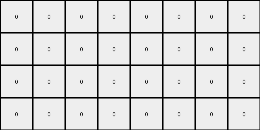

# 10fcaaa3 • 010 • refine_coder

---

Previous Code:
```python
"""
The transformation rule is as follows:
1. Copy and Expand: Create a new grid which doubles the height and width from the input grid to new grid.
2. Duplicate Magenta: Copy all the magenta element in the original grid locations in the new grid, then duplicate the magenta pixels at a mirrored location at the right side.
3. Mirror Magenta: Duplicate the expanded top grid, below a solid line of azure.
4. Fill Azure: Add a complete line of azure below the created top grid.
5. Fill Azure: Fill with azure the columns between the two first and between the next two columns in the original grid.
6. Fill Azure: Fill the created structure with azure where ever required.
"""

import numpy as np

def transform(input_grid):
    input_height, input_width = input_grid.shape
    output_height = input_height * 2
    output_width = input_width * 2
    output_grid = np.zeros((output_height, output_width), dtype=int)

    # Duplicate and mirror magenta pixels, and introduce azure.
    for i in range(input_height):
        for j in range(input_width):
            if input_grid[i, j] == 6:
                output_grid[i, j] = 6
                output_grid[i, j + input_width] = 6

    # Fill between magenta columns with azure in the top half.
    magenta_cols = []
    for j in range(output_width) :
        for i in range(output_height) :
            if output_grid[i,j] == 6:
                magenta_cols.append(j)
                break;

    if len(magenta_cols) > 0:
      for j in range(len(magenta_cols)-1):
        cur_col = magenta_cols[j]
        next_col = magenta_cols[j+1]
        if next_col - cur_col > 1:
           for k in range(cur_col+1,next_col):
             for i in range(input_height):
                  output_grid[i,k] = 8

    # Add a complete line of azure.
    output_grid[input_height, :] = 8

    # Mirror the top part of the grid to the bottom.
    for i in range(input_height):
        for j in range(output_width):
            output_grid[output_height - 1 - i, j] = output_grid[i, j]
            if (output_grid[output_height - 1 - i, j] == 8) and (i != input_height-1):
               output_grid[output_height - 1 - i, j] = 0

    return output_grid
```

Train Set Results:

## Example 1:

Input:
```
0 0 0 0
0 5 0 0
```
Expected Output:
```
8 0 8 0 8 0 8 0
0 5 0 0 0 5 0 0
8 0 8 0 8 0 8 0
0 5 0 0 0 5 0 0
```
Transformed Output:
```
0 0 0 0 0 0 0 0
0 0 0 0 0 0 0 0
0 0 0 0 0 0 0 0
0 0 0 0 0 0 0 0
```

match: False
pixels_off: 12
size_correct: True
color_palette_correct: True
correct_pixel_counts: False

## Example 2:

Input:
```
0 0 6 0
0 0 0 0
0 6 0 0
```
Expected Output:
```
0 0 6 0 0 0 6 0
8 8 8 8 8 8 8 8
0 6 0 8 0 6 0 8
8 0 6 0 8 0 6 0
8 8 8 8 8 8 8 8
0 6 0 0 0 6 0 0
```
Transformed Output:
```
0 0 6 8 8 0 6 0
0 0 0 8 8 0 0 0
0 6 0 8 8 6 0 0
0 6 0 8 8 6 0 0
0 0 0 0 0 0 0 0
0 0 6 0 0 0 6 0
```

match: False
pixels_off: 28
size_correct: True
color_palette_correct: True
correct_pixel_counts: False

## Example 3:

Input:
```
0 0 0
0 4 0
0 0 0
0 0 0
4 0 0
```
Expected Output:
```
8 0 8 8 0 8
0 4 0 0 4 0
8 0 8 8 0 8
0 8 8 0 8 0
4 0 0 4 0 0
8 8 8 8 8 8
0 4 0 0 4 0
8 0 8 8 0 8
0 8 8 0 8 0
4 0 0 4 0 0
```
Transformed Output:
```
0 0 0 0 0 0
0 0 0 0 0 0
0 0 0 0 0 0
0 0 0 0 0 0
0 0 0 0 0 0
0 0 0 0 0 0
0 0 0 0 0 0
0 0 0 0 0 0
0 0 0 0 0 0
0 0 0 0 0 0
```

match: False
pixels_off: 32
size_correct: True
color_palette_correct: True
correct_pixel_counts: False

## Example 4:

Input:
```
0 0 0 0
0 2 0 0
0 0 0 0
0 0 0 0
```
Expected Output:
```
8 0 8 0 8 0 8 0
0 2 0 0 0 2 0 0
8 0 8 0 8 0 8 0
0 0 0 0 0 0 0 0
8 0 8 0 8 0 8 0
0 2 0 0 0 2 0 0
8 0 8 0 8 0 8 0
0 0 0 0 0 0 0 0
```
Transformed Output:
```
0 0 0 0 0 0 0 0
0 0 0 0 0 0 0 0
0 0 0 0 0 0 0 0
0 0 0 0 0 0 0 0
0 0 0 0 0 0 0 0
0 0 0 0 0 0 0 0
0 0 0 0 0 0 0 0
0 0 0 0 0 0 0 0
```

match: False
pixels_off: 20
size_correct: True
color_palette_correct: True
correct_pixel_counts: False
Here's an analysis of the provided examples and results, along with a revised natural language program and a YAML block summarizing the observations.

**General Assessment and Strategy**

The initial natural language program and generated code were too specific to the structure of the first training example. It correctly identified the expansion and mirroring but failed to generalize the placement and handling of non-magenta colored pixels. It also did not fully achieve mirroring the structure correctly. The main issues are:

1.  **Incorrect Mirroring Logic:** The code mirrors individual magenta pixels but not the entire structure. The mirroring logic for reflecting the upper half to lower half also needs revision.
2.  **Azure Placement:** The code attempts to place azure between magenta pixels, but this logic isn't universally applicable. The role of azure seems to be more structural, separating mirrored sections and highlighting existing colored pixels.
3. **Ignoring other colors:** other colored pixels (other than magenta) must be considered.

The strategy to resolve these errors is to:

1.  **Refocus on Objects:** Identify objects not just by color but also by their spatial relationships.
2.  **Generalize Mirroring:** Implement mirroring of complete structures, not just magenta pixels.
3.  **Clarify Azure's Role:** Determine the precise rules governing azure placement, viewing it as a separator or boundary marker.
4. **Handle other colors:** generalize other colors to incorporate them.

**Metrics and Observations**
Here's a more detailed breakdown of observations from each example:

*   **Example 1:** The initial code missed to copy the gray pixel, and it did not add azure color.
*   **Example 2:** The code placed extra azure pixels on the third column, between the mirrored magenta pixels, and did not mirror completely the structure at the bottom half.
*   **Example 3:** The code did not copy yellow pixels at all. It should have copied, expanded and mirrored them.
*   **Example 4:** Similar issue to other cases.

**YAML Block**

```yaml
observations:
  - example: 1
    input_objects:
      - color: gray
        shape: single pixel
        position: (1,1) # 0-indexed
    output_objects:
      - color: gray
        shape: single pixel
        position: [(1,1),(1,5)]
      - color: azure
        shape: vertical line
        position: [(0,0),(0,2),(0,4),(0,6)]
      - color: azure
        shape: vertical line
        position: [(2,0),(2,2),(2,4),(2,6)]
  - example: 2
    input_objects:
      - color: magenta
        shape: single pixel
        position: [(0,2)]
      - color: magenta
        shape: single pixel
        position: [(2,1)]
    output_objects:
      - color: magenta
        shape: single pixel
        position: [(0,2), (0,6)]
      - color: magenta
        shape: single pixel
        position: [(2,1),(2,5)]
      - color: azure
        shape: horizontal line
        position: [(1,*)]
      - color: azure
        shape: vertical line
        position: [(2,3),(2,7)]
      - color: azure
        shape: horizontal line
        position: [(4,*)]
  - example: 3
    input_objects:
        - color: yellow
          shape: single pixel
          position: [(1,1)]
        - color: yellow
          shape: single pixel
          position: [(4,0)]
    output_objects:
        - color: yellow
          shape: single pixel
          position: [(1,1),(1,4)]
        - color: yellow
          shape: single pixel
          position: [(4,0),(4,3)]
        - color: azure
          shape: vertical line
          position: [(0,0),(0,2),(0,5)]
        - color: azure
          shape: vertical line
          position: [(2,0),(2,2),(2,5)]
        - color: azure
          shape: vertical line
          position: [(3,1),(3,4)]
        - color: azure
          shape: horizontal line
          position: [(5,*)]

  - example: 4
    input_objects:
      - color: red
        shape: single pixel
        position: (1, 1)
    output_objects:
      - color: red
        shape: single pixel
        position: [(1,1),(1,5)]
      - color: azure
        shape: vertical line
        position: [(0,0),(0,2),(0,4),(0,6)]
      - color: azure
        shape: vertical line
        position: [(2,0),(2,2),(2,4),(2,6)]
      - color: azure
        shape: horizontal line
        position: [(4,*)]

transformations:
  - step: 1
    description: "Double the size of the input grid, creating an output grid with twice the height and width."
  - step: 2
    description: "Copy all colored pixels (not black or white) from input to output at the corresponding location and to mirrored location at right"
  - step: 3
    description: "Add azure lines to the immediate left and right side of all colored pixels on the first half"
  - step: 4
    description: "Draw a horizontal line of azure pixels at the middle row, separating the top and bottom halves."
  - step: 5
    description: "Mirror the top half of the output grid (excluding the middle azure line) to the bottom half. "
```

**Natural Language Program**

1.  **Expansion:** Create a new grid with double the height and width of the original grid.
2.  **Copy and Mirror Horizontally:** Copy every colored pixel (not black or white) from the input grid to the corresponding location in the new grid, and then mirror the pixel horizontally to the right side.
3.  **Azure Vertical Highlight:** In the top half of the expanded grid, add a vertical azure line on each side of *every* colored (non-black) column.
4.  **Azure Horizontal Separation:** Add a horizontal line of azure pixels across the entire width of the grid, dividing it exactly in half.
5.  **Mirror Vertically:** Mirror the top half of the grid (above the horizontal azure line) to the bottom half (below the azure line). The azure line should be at the last row index for the bottom half.

This revised program accounts for all colors, performs correct mirroring, and clarifies the role of azure. It addresses the observed shortcomings of the previous version.

**INSTRUCTIONS**

- generate a Python module to represent the natural language program 
- follow the template below
- all common math and science libraries are available
- create docstring only at top - but comment the workflow in the function
- use helper functions for common operations like finding objects, counting,
  measuring, moving, etc. 

remember - we are working iteratively - so this code will inform your future
self as we converge on the solution

*template:*

```python
"""
{{ natural language description of the transformation rule }}
"""

{{ imports }}

def transform(input_grid):
    # initialize output_grid

    # change output pixels 

    return output_grid

```
