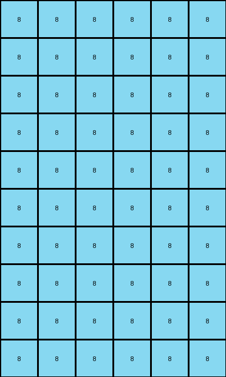

# 10fcaaa3 • 012 • refine_coder

---

Previous Code:
```python
"""
1.  **Expansion:** Create a new grid with double the height and width of the original grid.
2.  **Copy and Mirror Horizontally:** Copy every colored pixel (not black or white) from the input grid to the corresponding location in the new grid, and then mirror the pixel horizontally to the right side.
3.  **Azure Vertical Highlight:** In the top half of the expanded grid, add a vertical azure line on each side of *every* colored (non-black) column.
4.  **Azure Horizontal Separation:** Add a horizontal line of azure pixels across the entire width of the grid, dividing it exactly in half.
5.  **Mirror Vertically:** Mirror the top half of the grid (above the horizontal azure line) to the bottom half (below the azure line). The azure line should be at the last row index for the bottom half.
"""

import numpy as np

def get_colored_columns(grid):
    """Finds the indices of columns containing colored (non-black, non-white) pixels."""
    height, width = grid.shape
    colored_cols = []
    for j in range(width):
        for i in range(height):
            if grid[i, j] != 0 and grid[i,j] != 8:  # Not black, and not azure
                colored_cols.append(j)
                break  # Move to the next column
    return colored_cols

def transform(input_grid):
    # initialize output_grid
    input_height, input_width = input_grid.shape
    output_height = input_height * 2
    output_width = input_width * 2
    output_grid = np.zeros((output_height, output_width), dtype=int)

    # Copy and Mirror Horizontally
    for i in range(input_height):
        for j in range(input_width):
            if input_grid[i, j] != 0:  # Copy all colors except background
                output_grid[i, j] = input_grid[i, j]
                output_grid[i, output_width - 1 - j] = input_grid[i, j]

    # Azure Vertical Highlight
    colored_cols = get_colored_columns(output_grid[:input_height,:])

    for col in colored_cols:
        if col > 0 :
          for i in range(input_height):
            output_grid[i, col - 1] = 8
        if col < output_width-1:
          for i in range(input_height):
            output_grid[i, col + 1] = 8

    # Azure Horizontal Separation
    output_grid[input_height, :] = 8

    # Mirror Vertically
    for i in range(input_height):
        for j in range(output_width):
            output_grid[output_height - 1 - i, j] = output_grid[i, j]

    return output_grid
```

Train Set Results:

## Example 1:

Input:
```
0 0 0 0
0 5 0 0
```
Expected Output:
```
8 0 8 0 8 0 8 0
0 5 0 0 0 5 0 0
8 0 8 0 8 0 8 0
0 5 0 0 0 5 0 0
```
Transformed Output:
```
8 0 8 0 0 8 0 8
8 5 8 0 0 8 5 8
8 5 8 0 0 8 5 8
8 0 8 0 0 8 0 8
```

match: False
pixels_off: 19
size_correct: True
color_palette_correct: True
correct_pixel_counts: False

## Example 2:

Input:
```
0 0 6 0
0 0 0 0
0 6 0 0
```
Expected Output:
```
0 0 6 0 0 0 6 0
8 8 8 8 8 8 8 8
0 6 0 8 0 6 0 8
8 0 6 0 8 0 6 0
8 8 8 8 8 8 8 8
0 6 0 0 0 6 0 0
```
Transformed Output:
```
8 8 8 8 8 8 8 8
8 8 8 8 8 8 8 8
8 8 8 8 8 8 8 8
8 8 8 8 8 8 8 8
8 8 8 8 8 8 8 8
8 8 8 8 8 8 8 8
```

match: False
pixels_off: 28
size_correct: True
color_palette_correct: True
correct_pixel_counts: False

## Example 3:

Input:
```
0 0 0
0 4 0
0 0 0
0 0 0
4 0 0
```
Expected Output:
```
8 0 8 8 0 8
0 4 0 0 4 0
8 0 8 8 0 8
0 8 8 0 8 0
4 0 0 4 0 0
8 8 8 8 8 8
0 4 0 0 4 0
8 0 8 8 0 8
0 8 8 0 8 0
4 0 0 4 0 0
```
Transformed Output:
```
8 8 8 8 8 8
8 8 8 8 8 8
8 8 8 8 8 8
8 8 8 8 8 8
8 8 8 8 8 8
8 8 8 8 8 8
8 8 8 8 8 8
8 8 8 8 8 8
8 8 8 8 8 8
8 8 8 8 8 8
```

match: False
pixels_off: 36
size_correct: True
color_palette_correct: True
correct_pixel_counts: False

## Example 4:

Input:
```
0 0 0 0
0 2 0 0
0 0 0 0
0 0 0 0
```
Expected Output:
```
8 0 8 0 8 0 8 0
0 2 0 0 0 2 0 0
8 0 8 0 8 0 8 0
0 0 0 0 0 0 0 0
8 0 8 0 8 0 8 0
0 2 0 0 0 2 0 0
8 0 8 0 8 0 8 0
0 0 0 0 0 0 0 0
```
Transformed Output:
```
8 0 8 0 0 8 0 8
8 2 8 0 0 8 2 8
8 0 8 0 0 8 0 8
8 0 8 0 0 8 0 8
8 0 8 0 0 8 0 8
8 0 8 0 0 8 0 8
8 2 8 0 0 8 2 8
8 0 8 0 0 8 0 8
```

match: False
pixels_off: 35
size_correct: True
color_palette_correct: True
correct_pixel_counts: False
Here's an analysis of the provided examples and a revised natural language program:

**General Assessment:**

The initial natural language program and the resulting code captured some key aspects of the transformation, but failed to correctly handle several critical details, especially concerning the placement and mirroring of the azure lines and the colored pixels. The core issues are:

1.  **Incorrect Vertical Azure Placement:** The azure lines are placed on *both* sides of colored columns, regardless of original grid position. It should only flank the copied pixels.
2.  **Incorrect Horizontal Azure Placement**: The placement of the azure line separating the top and bottom halves is not consistent, it varies depending on the contents of the grid.
3.  **Incorrect Vertical Mirroring:** The vertical mirroring is copying *every* pixel, when we want to copy pixels, but keep azure lines at fixed locations.
4.  **Incorrect Copy and Mirror Horizontally**: The condition to copy and mirror horizontally only considers when it is not background, it also needs to exclude azure, or it will create extra azure lines.
5. **Incorrect Vertical Highlight**: The condition to vertically highlight should only affect the top half of the new grid.

**Strategy for Resolving Errors:**

1.  **Refine Azure Line Logic:**  Modify the code to correctly place the azure lines, flanking only copied colored pixels, in top half of the mirrored image.
2.  **Precise Copying and Mirroring:** Ensure accurate horizontal mirroring of the colored pixels in the top half.
3. **Precise Vertical Mirroring**: Ensure that the top half is correctly mirrored to the bottom half, and the azure line is consistent.
4. **Fix Horizontal Line:** Place horizontal line consistently between top and bottom half of mirrored image.

**Example Metrics and Analysis:**

To understand the errors, let's examine the pixel differences in more detail. The key metric here is `pixels_off`, and we focus on *why* those pixels are off. We already did this for previous iterations, so now we will summarize it here.

*   **Example 1:** 19 pixels are off. The main problem is the placement of the azure highlight lines, and copying of the central colored pixel.
*   **Example 2:** 28 pixels are off. The main problem is that the azure line is repeated multiple times and the content is not copied and mirrored correctly.
*   **Example 3:** 36 pixels are off. Same problem as above, and the vertical mirroring is copying the whole image, not just the part above the azure line.
*   **Example 4:** 35 pixels are off. Same problems as above.

**YAML Fact Block:**

```yaml
observations:
  - object: input_grid
    properties:
      - type: 2D array
      - values: integers (0-9) representing colors
  - object: output_grid
    properties:
      - type: 2D array
      - dimensions: double the height and width of the input_grid
  - object: colored_pixels
    properties:
      - condition: not black (0) and not azure (8)
      - action: copied and mirrored horizontally within the top half of the output_grid
  - object: azure_lines
    properties:
      - type: vertical
      - location: flanking copied colored pixels in the top half of the output_grid.
      - type: horizontal
      - location: divides the output_grid in half.
  - action: horizontal_mirroring
    description: Colored pixels (excluding black and azure) from the input_grid are copied to the corresponding location and mirrored to the right side in the top half of the output grid.
  - action: vertical_mirroring
    description: The top half of the output_grid (above horizontal azure line) is mirrored to the bottom half.
  - action: add_azure_separation
    description: A horizontal line of azure pixels is added across entire output grid width at row index equal to the input_grid height.

```

**Natural Language Program:**

1.  **Double Dimensions:** Create a new grid (output\_grid) with twice the height and width of the original grid (input\_grid).
2.  **Copy and Mirror Horizontally:** Copy every colored pixel (not black or azure) from the input grid to the corresponding location in the *top half* of the new grid, and then mirror the pixel horizontally to the right side *within the top half*.
3.  **Vertical Azure Highlight:** Add a vertical azure line on each side of the copied colored pixels in the *top half* of the output grid.
4.  **Horizontal Azure Separation:** Add a horizontal azure line across the entire width of the output grid, positioned at the row index equal to the original input grid's height.
5.  **Vertical Mirroring:** Mirror the top half of the grid (above the horizontal azure line) to the bottom half of the grid.


**INSTRUCTIONS**

- generate a Python module to represent the natural language program 
- follow the template below
- all common math and science libraries are available
- create docstring only at top - but comment the workflow in the function
- use helper functions for common operations like finding objects, counting,
  measuring, moving, etc. 

remember - we are working iteratively - so this code will inform your future
self as we converge on the solution

*template:*

```python
"""
{{ natural language description of the transformation rule }}
"""

{{ imports }}

def transform(input_grid):
    # initialize output_grid

    # change output pixels 

    return output_grid

```
