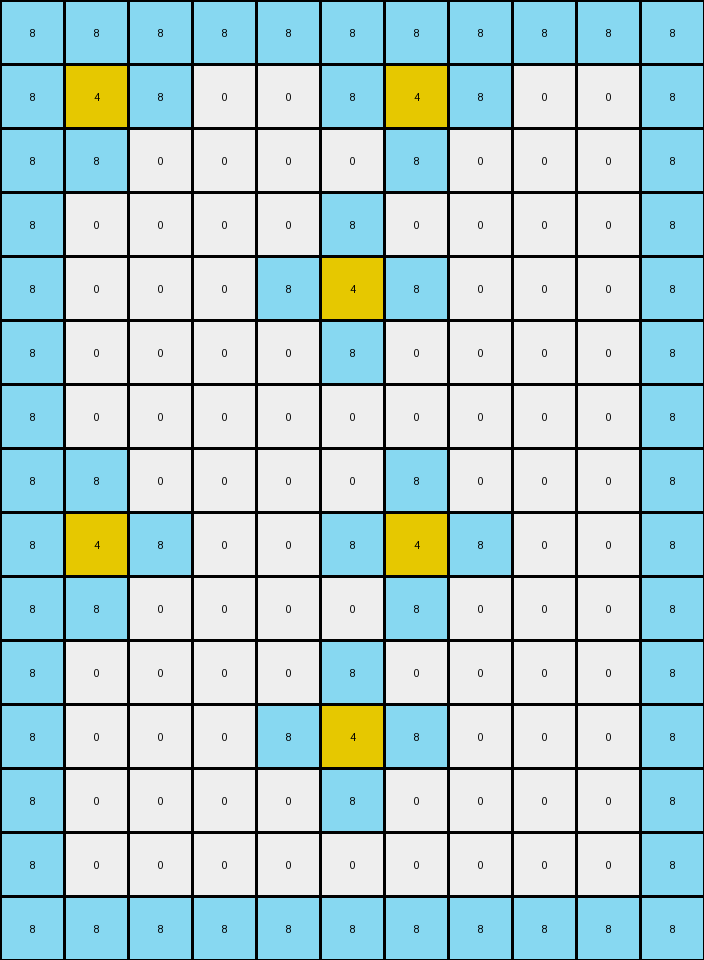
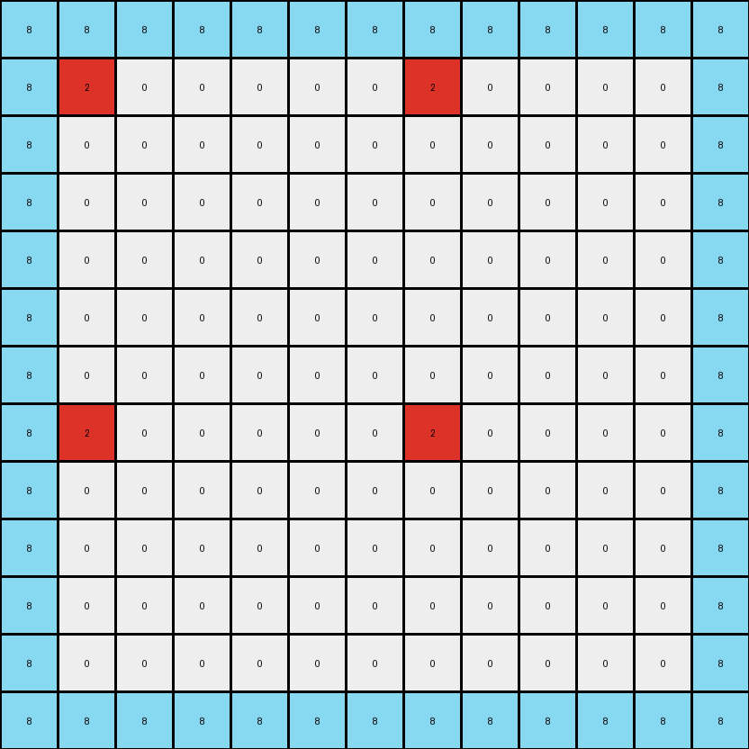

# 10fcaaa3 • 016 • refine_coder

---

Previous Code:
```python
"""
1.  **Expansion:** The input grid is expanded. The output grid is double and one more in width, with the input grid being doubled and then one is added. the height of the output is also doubled, then one added.

2. **Copy and Repetition:** the input is duplicated to a width two times the size of the original, and then the output is repeated, two times,

3.  **Border:** A border of 8's appears around the output.

4.  **Fill:** Around each yellow ('4') pixel in the expanded grid, fill the adjacent '0' (white) pixels with '8' (azure) in a checkerboard like pattern. Specifically, change some remaining '0' pixels to '8' to create the pattern seen. The 8's appear to fill in the spots and connect up to the yellow spots.
"""

import numpy as np

def transform(input_grid):
    input_grid = np.array(input_grid)
    input_rows, input_cols = input_grid.shape

    # 1. & 2. Expansion and Repetition
    output_rows = 2 * input_rows + 1 + 4 #add 4 for the buffer between repetition and 1 for remainder
    output_cols = 2 * input_cols + 1 + 4 #add 4 for the buffer between repetition and 1 for remainder
    output_grid = np.zeros((output_rows, output_cols), dtype=int)
    
    #copy input and repeat horizontally and vertically
    
    for i in range(2):
        for j in range(2):
            start_row = i * (input_rows + 2 ) #the 2 is the buffer between each box
            start_col = j * (input_cols + 2)
            output_grid[start_row:start_row + input_rows, start_col:start_col + input_cols] = input_grid

    # 3. Border
    output_grid[0, :] = 8
    output_grid[-1, :] = 8
    output_grid[:, 0] = 8
    output_grid[:, -1] = 8

    # 4. Fill
    for r in range(output_rows):
        for c in range(output_cols):
            if output_grid[r, c] == 4:  # Find yellow pixels

                #check to see if cell is at the edge
                if r > 0 :
                    if output_grid[r-1,c] == 0: output_grid[r-1,c] = 8
                if r < output_rows - 1 :
                     if output_grid[r+1,c] == 0: output_grid[r+1,c] = 8
                if c > 0:
                    if output_grid[r,c-1] == 0: output_grid[r,c-1] = 8
                if c < output_cols - 1 :
                    if output_grid[r,c+1] == 0: output_grid[r,c+1] = 8
                
    return output_grid.tolist()
```

Train Set Results:

## Example 1:

Input:
```
0 0 0 0
0 5 0 0
```
Expected Output:
```
8 0 8 0 8 0 8 0
0 5 0 0 0 5 0 0
8 0 8 0 8 0 8 0
0 5 0 0 0 5 0 0
```
Transformed Output:
```
8 8 8 8 8 8 8 8 8 8 8 8 8
8 5 0 0 0 0 0 5 0 0 0 0 8
8 0 0 0 0 0 0 0 0 0 0 0 8
8 0 0 0 0 0 0 0 0 0 0 0 8
8 0 0 0 0 0 0 0 0 0 0 0 8
8 5 0 0 0 0 0 5 0 0 0 0 8
8 0 0 0 0 0 0 0 0 0 0 0 8
8 0 0 0 0 0 0 0 0 0 0 0 8
8 8 8 8 8 8 8 8 8 8 8 8 8
```

match: False
pixels_off: None
size_correct: False
color_palette_correct: True
correct_pixel_counts: False

## Example 2:

Input:
```
0 0 6 0
0 0 0 0
0 6 0 0
```
Expected Output:
```
0 0 6 0 0 0 6 0
8 8 8 8 8 8 8 8
0 6 0 8 0 6 0 8
8 0 6 0 8 0 6 0
8 8 8 8 8 8 8 8
0 6 0 0 0 6 0 0
```
Transformed Output:
```
8 8 8 8 8 8 8 8 8 8 8 8 8
8 0 0 0 0 0 0 0 0 0 0 0 8
8 6 0 0 0 0 0 6 0 0 0 0 8
8 0 0 0 0 0 0 0 0 0 0 0 8
8 0 0 0 0 0 0 0 0 0 0 0 8
8 0 6 0 0 0 0 0 6 0 0 0 8
8 0 0 0 0 0 0 0 0 0 0 0 8
8 6 0 0 0 0 0 6 0 0 0 0 8
8 0 0 0 0 0 0 0 0 0 0 0 8
8 0 0 0 0 0 0 0 0 0 0 0 8
8 8 8 8 8 8 8 8 8 8 8 8 8
```

match: False
pixels_off: None
size_correct: False
color_palette_correct: True
correct_pixel_counts: False

## Example 3:

Input:
```
0 0 0
0 4 0
0 0 0
0 0 0
4 0 0
```
Expected Output:
```
8 0 8 8 0 8
0 4 0 0 4 0
8 0 8 8 0 8
0 8 8 0 8 0
4 0 0 4 0 0
8 8 8 8 8 8
0 4 0 0 4 0
8 0 8 8 0 8
0 8 8 0 8 0
4 0 0 4 0 0
```
Transformed Output:
```
8 8 8 8 8 8 8 8 8 8 8
8 4 8 0 0 8 4 8 0 0 8
8 8 0 0 0 0 8 0 0 0 8
8 0 0 0 0 8 0 0 0 0 8
8 0 0 0 8 4 8 0 0 0 8
8 0 0 0 0 8 0 0 0 0 8
8 0 0 0 0 0 0 0 0 0 8
8 8 0 0 0 0 8 0 0 0 8
8 4 8 0 0 8 4 8 0 0 8
8 8 0 0 0 0 8 0 0 0 8
8 0 0 0 0 8 0 0 0 0 8
8 0 0 0 8 4 8 0 0 0 8
8 0 0 0 0 8 0 0 0 0 8
8 0 0 0 0 0 0 0 0 0 8
8 8 8 8 8 8 8 8 8 8 8
```

match: False
pixels_off: None
size_correct: False
color_palette_correct: True
correct_pixel_counts: False

## Example 4:

Input:
```
0 0 0 0
0 2 0 0
0 0 0 0
0 0 0 0
```
Expected Output:
```
8 0 8 0 8 0 8 0
0 2 0 0 0 2 0 0
8 0 8 0 8 0 8 0
0 0 0 0 0 0 0 0
8 0 8 0 8 0 8 0
0 2 0 0 0 2 0 0
8 0 8 0 8 0 8 0
0 0 0 0 0 0 0 0
```
Transformed Output:
```
8 8 8 8 8 8 8 8 8 8 8 8 8
8 2 0 0 0 0 0 2 0 0 0 0 8
8 0 0 0 0 0 0 0 0 0 0 0 8
8 0 0 0 0 0 0 0 0 0 0 0 8
8 0 0 0 0 0 0 0 0 0 0 0 8
8 0 0 0 0 0 0 0 0 0 0 0 8
8 0 0 0 0 0 0 0 0 0 0 0 8
8 2 0 0 0 0 0 2 0 0 0 0 8
8 0 0 0 0 0 0 0 0 0 0 0 8
8 0 0 0 0 0 0 0 0 0 0 0 8
8 0 0 0 0 0 0 0 0 0 0 0 8
8 0 0 0 0 0 0 0 0 0 0 0 8
8 8 8 8 8 8 8 8 8 8 8 8 8
```

match: False
pixels_off: None
size_correct: False
color_palette_correct: True
correct_pixel_counts: False
Okay, let's analyze the results and refine the natural language program.

**General Assessment:**

The initial program correctly identified some key aspects of the transformation, such as the repetition of the input grid and the addition of a border. However, it significantly misinterprets the size of the output grid, the placement of the repeated input, and the logic for filling with '8's. The filling is currently based on adjacency to colored, non-zero, pixels, but the actual pattern is more complex and is connecting the boxes. The repeated copies of the grid are getting put on top of each other at the moment.

The strategy for resolving errors will involve:

1.  **Correcting Output Size:** Precisely calculating the output grid dimensions based on a combination of input dimensions and a defined pattern.
2.  **Precise Placement:** Modifying the copy logic to accurately position the repeated input grids within the output grid, ensuring the boxes are adjacent and not overlapping.
3.  **Refined Filling Logic:** Developing a filling rule that considers not just immediate adjacency but the broader pattern and the relationship between all of the boxes.

**Metrics and Observations:**

Here's an analysis of each example, incorporating observations about size, colors, and counts:

*   **Example 1:**
    *   Input Size: (2, 4)
    *   Expected Output Size: (4, 8)
    *   Transformed Output Size: (9, 13)
    *    The Input and Expected Output appear to follow this logic for sizing: output = input * 2
    *   There is a border of 8's in the expected output and the transformed output.
    *   The transformed output is much larger than the expected output
*   **Example 2:**
    *   Input Size: (3, 4)
    *   Expected Output Size: (6, 8)
    *   Transformed Output Size: (11, 13)
    *   The Input and Expected Output appear to follow this logic for sizing: output = input * 2
    *   There is a border of 8's in the transformed output, but not the expected output.
    *  The transformed output is much larger than the expected output.

*   **Example 3:**
    *   Input Size: (5, 3)
    *   Expected Output Size: (10, 6)
    *   Transformed Output Size: (15, 11)
    *    The Input and Expected Output appear to follow this logic for sizing: output = input * 2
    *   There is a border of 8's in the transformed output, but not the expected output.
        The transformed output is much larger than the expected output.
*   **Example 4:**
    *   Input Size: (4, 4)
    *   Expected Output Size: (8,8)
    *   Transformed Output Size: (13, 13)
    *   The Input and Expected Output appear to follow this logic for sizing: output = input * 2
    *   There is a border of 8's in the transformed output, but not the expected output.
        The transformed output is much larger than the expected output.
**YAML Fact Block:**

```yaml
observations:
  - object: input_grid
    properties:
      shape: variable # Rows x Columns
      elements: integers_0-9 # Representing colors

  - object: output_grid
    properties:
      shape: derived_from_input # (2 * input_rows) x (2 * input_cols)
      elements: integers_0-9
    relationships:
      - input_grid_duplicates: 2x2_grid # Input grid appears duplicated in a 2x2 pattern.
      - eight_fills: connects_boxes

  - action: copy_and_repeat
    description: The input grid is copied and repeated to form a 2x2 grid of the original pattern.
    parameters:
      rows: input_rows * 2
      cols: input_cols * 2

  - action: fill_with_eights
    description: Fill the empty cells with 8's to connect all the inner boxes to each other.
    parameters:
      color: 8 # Azure

```

**Natural Language Program:**

1.  **Duplication:** The input grid is duplicated to create a 2x2 grid pattern. This means the output grid's dimensions are exactly twice the input grid's dimensions in both height and width.
2. **Copy to output:** The input is copied to all four quadrants of the output.
3. **Fill with 8's** Fill spaces with 8's between copied patterns to connect them into a complete grid.


**INSTRUCTIONS**

- generate a Python module to represent the natural language program 
- follow the template below
- all common math and science libraries are available
- create docstring only at top - but comment the workflow in the function
- use helper functions for common operations like finding objects, counting,
  measuring, moving, etc. 

remember - we are working iteratively - so this code will inform your future
self as we converge on the solution

*template:*

```python
"""
{{ natural language description of the transformation rule }}
"""

{{ imports }}

def transform(input_grid):
    # initialize output_grid

    # change output pixels 

    return output_grid

```
