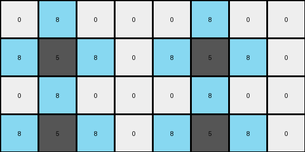
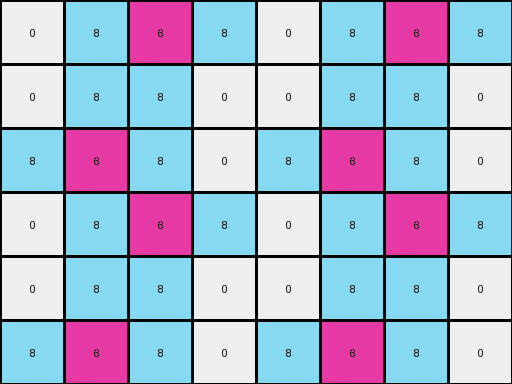
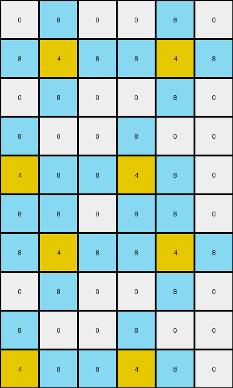
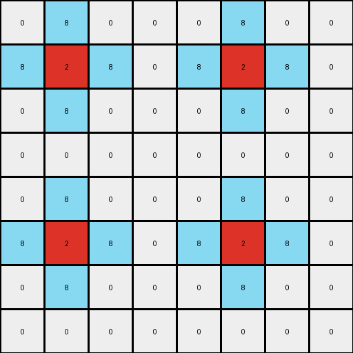

# 10fcaaa3 • 017 • refine_dreamer

---

Previous Code:
```python
"""
1.  **Duplication:** The input grid is duplicated to create a 2x2 grid pattern. This means the output grid's dimensions are exactly twice the input grid's dimensions in both height and width.
2. **Copy to output:** The input is copied to all four quadrants of the output.
3. **Fill with 8's** Fill spaces with 8's between copied patterns to connect them into a complete grid.
"""

import numpy as np

def transform(input_grid):
    input_grid = np.array(input_grid)
    input_rows, input_cols = input_grid.shape

    # 1. Duplication: Calculate output grid size.
    output_rows = 2 * input_rows
    output_cols = 2 * input_cols
    output_grid = np.zeros((output_rows, output_cols), dtype=int)

    # 2. Copy to output: Copy the input grid to the four quadrants.
    for i in range(2):
        for j in range(2):
            start_row = i * input_rows
            start_col = j * input_cols
            output_grid[start_row:start_row + input_rows, start_col:start_col + input_cols] = input_grid

    # 3. Fill with 8's: Connect with 8's.
    for r in range(output_rows):
        for c in range(output_cols):
             if output_grid[r, c] == 0:
                if r > 0 and (output_grid[r-1,c] != 0 and output_grid[r-1,c] != 8) :
                    output_grid[r,c] = 8
                elif r < output_rows -1 and (output_grid[r+1,c] != 0 and output_grid[r+1,c] != 8) :
                    output_grid[r,c] = 8
                elif c > 0 and (output_grid[r,c-1] != 0 and output_grid[r,c-1] != 8):
                    output_grid[r,c] = 8
                elif c < output_cols -1 and (output_grid[r,c+1] != 0 and output_grid[r,c+1] != 8):
                    output_grid[r,c] = 8
                

    return output_grid.tolist()
```

Train Set Results:

## Example 1:

Input:
```
0 0 0 0
0 5 0 0
```
Expected Output:
```
8 0 8 0 8 0 8 0
0 5 0 0 0 5 0 0
8 0 8 0 8 0 8 0
0 5 0 0 0 5 0 0
```
Transformed Output:
```
0 8 0 0 0 8 0 0
8 5 8 0 8 5 8 0
0 8 0 0 0 8 0 0
8 5 8 0 8 5 8 0
```

match: False
pixels_off: 20
size_correct: True
color_palette_correct: True
correct_pixel_counts: False

## Example 2:

Input:
```
0 0 6 0
0 0 0 0
0 6 0 0
```
Expected Output:
```
0 0 6 0 0 0 6 0
8 8 8 8 8 8 8 8
0 6 0 8 0 6 0 8
8 0 6 0 8 0 6 0
8 8 8 8 8 8 8 8
0 6 0 0 0 6 0 0
```
Transformed Output:
```
0 8 6 8 0 8 6 8
0 8 8 0 0 8 8 0
8 6 8 0 8 6 8 0
0 8 6 8 0 8 6 8
0 8 8 0 0 8 8 0
8 6 8 0 8 6 8 0
```

match: False
pixels_off: 28
size_correct: True
color_palette_correct: True
correct_pixel_counts: False

## Example 3:

Input:
```
0 0 0
0 4 0
0 0 0
0 0 0
4 0 0
```
Expected Output:
```
8 0 8 8 0 8
0 4 0 0 4 0
8 0 8 8 0 8
0 8 8 0 8 0
4 0 0 4 0 0
8 8 8 8 8 8
0 4 0 0 4 0
8 0 8 8 0 8
0 8 8 0 8 0
4 0 0 4 0 0
```
Transformed Output:
```
0 8 0 0 8 0
8 4 8 8 4 8
0 8 0 0 8 0
8 0 0 8 0 0
4 8 8 4 8 0
8 8 0 8 8 0
8 4 8 8 4 8
0 8 0 0 8 0
8 0 0 8 0 0
4 8 8 4 8 0
```

match: False
pixels_off: 44
size_correct: True
color_palette_correct: True
correct_pixel_counts: False

## Example 4:

Input:
```
0 0 0 0
0 2 0 0
0 0 0 0
0 0 0 0
```
Expected Output:
```
8 0 8 0 8 0 8 0
0 2 0 0 0 2 0 0
8 0 8 0 8 0 8 0
0 0 0 0 0 0 0 0
8 0 8 0 8 0 8 0
0 2 0 0 0 2 0 0
8 0 8 0 8 0 8 0
0 0 0 0 0 0 0 0
```
Transformed Output:
```
0 8 0 0 0 8 0 0
8 2 8 0 8 2 8 0
0 8 0 0 0 8 0 0
0 0 0 0 0 0 0 0
0 8 0 0 0 8 0 0
8 2 8 0 8 2 8 0
0 8 0 0 0 8 0 0
0 0 0 0 0 0 0 0
```

match: False
pixels_off: 32
size_correct: True
color_palette_correct: True
correct_pixel_counts: True
**INSTRUCTIONS**

The code above was generated based on observations from the first training
example

we have tested the transform function on each of the task example inputs and
compared with the expected output

review each of the examples provided and the results and consider how the
natural language program should be updated to accommodate this new knowledge

respond with the following deliverables:

- general assessment of the information provided and strategy for resolving the
  errors
- gather metrics about each of the examples and results - use code_execution to
  develop accurate reports on your assumptions
- a YAML block documenting facts - Focus on identifying objects, their properties, and the actions performed on them.
- a natural language program - Be as clear and concise as possible, providing a complete description of the transformation rule.


your responses should be considered as information in a report - not a
conversation
