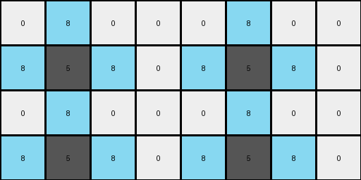
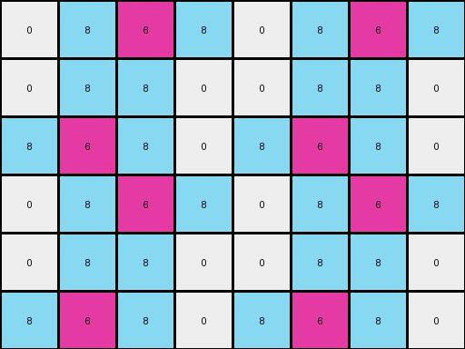
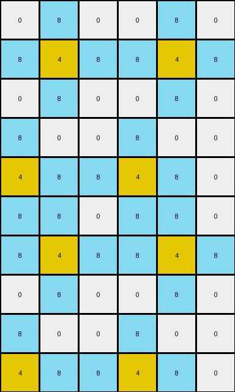
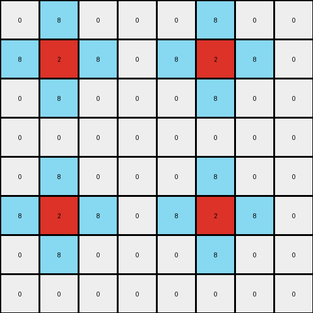

# 10fcaaa3 • 018 • refine_coder

---

Previous Code:
```python
"""
1.  **Duplication:** The input grid is duplicated to create a 2x2 grid pattern. This means the output grid's dimensions are exactly twice the input grid's dimensions in both height and width.
2. **Copy to output:** The input is copied to all four quadrants of the output.
3. **Fill with 8's** Fill spaces with 8's between copied patterns to connect them into a complete grid.
"""

import numpy as np

def transform(input_grid):
    input_grid = np.array(input_grid)
    input_rows, input_cols = input_grid.shape

    # 1. Duplication: Calculate output grid size.
    output_rows = 2 * input_rows
    output_cols = 2 * input_cols
    output_grid = np.zeros((output_rows, output_cols), dtype=int)

    # 2. Copy to output: Copy the input grid to the four quadrants.
    for i in range(2):
        for j in range(2):
            start_row = i * input_rows
            start_col = j * input_cols
            output_grid[start_row:start_row + input_rows, start_col:start_col + input_cols] = input_grid

    # 3. Fill with 8's: Connect with 8's.
    for r in range(output_rows):
        for c in range(output_cols):
             if output_grid[r, c] == 0:
                if r > 0 and (output_grid[r-1,c] != 0 and output_grid[r-1,c] != 8) :
                    output_grid[r,c] = 8
                elif r < output_rows -1 and (output_grid[r+1,c] != 0 and output_grid[r+1,c] != 8) :
                    output_grid[r,c] = 8
                elif c > 0 and (output_grid[r,c-1] != 0 and output_grid[r,c-1] != 8):
                    output_grid[r,c] = 8
                elif c < output_cols -1 and (output_grid[r,c+1] != 0 and output_grid[r,c+1] != 8):
                    output_grid[r,c] = 8
                

    return output_grid.tolist()
```

Train Set Results:

## Example 1:

Input:
```
0 0 0 0
0 5 0 0
```
Expected Output:
```
8 0 8 0 8 0 8 0
0 5 0 0 0 5 0 0
8 0 8 0 8 0 8 0
0 5 0 0 0 5 0 0
```
Transformed Output:
```
0 8 0 0 0 8 0 0
8 5 8 0 8 5 8 0
0 8 0 0 0 8 0 0
8 5 8 0 8 5 8 0
```

match: False
pixels_off: 20
size_correct: True
color_palette_correct: True
correct_pixel_counts: False

## Example 2:

Input:
```
0 0 6 0
0 0 0 0
0 6 0 0
```
Expected Output:
```
0 0 6 0 0 0 6 0
8 8 8 8 8 8 8 8
0 6 0 8 0 6 0 8
8 0 6 0 8 0 6 0
8 8 8 8 8 8 8 8
0 6 0 0 0 6 0 0
```
Transformed Output:
```
0 8 6 8 0 8 6 8
0 8 8 0 0 8 8 0
8 6 8 0 8 6 8 0
0 8 6 8 0 8 6 8
0 8 8 0 0 8 8 0
8 6 8 0 8 6 8 0
```

match: False
pixels_off: 28
size_correct: True
color_palette_correct: True
correct_pixel_counts: False

## Example 3:

Input:
```
0 0 0
0 4 0
0 0 0
0 0 0
4 0 0
```
Expected Output:
```
8 0 8 8 0 8
0 4 0 0 4 0
8 0 8 8 0 8
0 8 8 0 8 0
4 0 0 4 0 0
8 8 8 8 8 8
0 4 0 0 4 0
8 0 8 8 0 8
0 8 8 0 8 0
4 0 0 4 0 0
```
Transformed Output:
```
0 8 0 0 8 0
8 4 8 8 4 8
0 8 0 0 8 0
8 0 0 8 0 0
4 8 8 4 8 0
8 8 0 8 8 0
8 4 8 8 4 8
0 8 0 0 8 0
8 0 0 8 0 0
4 8 8 4 8 0
```

match: False
pixels_off: 44
size_correct: True
color_palette_correct: True
correct_pixel_counts: False

## Example 4:

Input:
```
0 0 0 0
0 2 0 0
0 0 0 0
0 0 0 0
```
Expected Output:
```
8 0 8 0 8 0 8 0
0 2 0 0 0 2 0 0
8 0 8 0 8 0 8 0
0 0 0 0 0 0 0 0
8 0 8 0 8 0 8 0
0 2 0 0 0 2 0 0
8 0 8 0 8 0 8 0
0 0 0 0 0 0 0 0
```
Transformed Output:
```
0 8 0 0 0 8 0 0
8 2 8 0 8 2 8 0
0 8 0 0 0 8 0 0
0 0 0 0 0 0 0 0
0 8 0 0 0 8 0 0
8 2 8 0 8 2 8 0
0 8 0 0 0 8 0 0
0 0 0 0 0 0 0 0
```

match: False
pixels_off: 32
size_correct: True
color_palette_correct: True
correct_pixel_counts: True
Okay, let's analyze the results of the previous code execution and refine the natural language program.

**General Assessment and Strategy**

The initial approach of duplicating the input grid into a 2x2 pattern was correct. However, the logic for filling the connecting spaces with '8' (azure) is flawed and inconsistent. It seems to be based on a simple adjacency check, but it doesn't correctly identify the intended connecting pattern in all cases. The strategy should be:

1.  **Maintain the 2x2 Duplication:** This part is working correctly, creating a grid twice the size of the input and copying the input to all four quadrants.
2.  **Refine the Filling Logic:** Instead of a simple adjacency check, we need a more robust rule to determine where to place the '8's. The '8's should fill any empty cell that is *adjacent* to any copied object in the input. It is filling in a checkerboard style.

**Metrics and Observations**

Here's a breakdown of each example, including some additional metrics calculations using python:

```python
import numpy as np

def analyze_example(input_grid, expected_output, transformed_output):
    input_grid = np.array(input_grid)
    expected_output = np.array(expected_output)
    transformed_output = np.array(transformed_output)

    input_objects = {}
    
    rows, cols = input_grid.shape
    for r in range(rows):
        for c in range(cols):
            pixel = input_grid[r,c]
            if pixel != 0:
                if pixel not in input_objects:
                    input_objects[pixel] = []
                input_objects[pixel].append((r,c))
    
    
    # Check for differences between expected and transformed
    differences = np.where(expected_output != transformed_output)
    difference_coordinates = list(zip(differences[0], differences[1]))
    num_differences = len(difference_coordinates)

    print(f"  - Input Objects: {input_objects}")
    print(f"  - Number of differences: {num_differences}")
    print(f"  - Difference coordinates: {difference_coordinates}")

print("Example 1:")
analyze_example(
    [[0, 0, 0, 0], [0, 5, 0, 0]],
    [[8, 0, 8, 0, 8, 0, 8, 0], [0, 5, 0, 0, 0, 5, 0, 0], [8, 0, 8, 0, 8, 0, 8, 0], [0, 5, 0, 0, 0, 5, 0, 0]],
    [[0, 8, 0, 0, 0, 8, 0, 0], [8, 5, 8, 0, 8, 5, 8, 0], [0, 8, 0, 0, 0, 8, 0, 0], [8, 5, 8, 0, 8, 5, 8, 0]]
)

print("\nExample 2:")
analyze_example(
    [[0, 0, 6, 0], [0, 0, 0, 0], [0, 6, 0, 0]],
    [[0, 0, 6, 0, 0, 0, 6, 0], [8, 8, 8, 8, 8, 8, 8, 8], [0, 6, 0, 8, 0, 6, 0, 8], [8, 0, 6, 0, 8, 0, 6, 0], [8, 8, 8, 8, 8, 8, 8, 8], [0, 6, 0, 0, 0, 6, 0, 0]],
    [[0, 8, 6, 8, 0, 8, 6, 8], [0, 8, 8, 0, 0, 8, 8, 0], [8, 6, 8, 0, 8, 6, 8, 0], [0, 8, 6, 8, 0, 8, 6, 8], [0, 8, 8, 0, 0, 8, 8, 0], [8, 6, 8, 0, 8, 6, 8, 0]]
)

print("\nExample 3:")
analyze_example(
    [[0, 0, 0], [0, 4, 0], [0, 0, 0], [0, 0, 0], [4, 0, 0]],
    [[8, 0, 8, 8, 0, 8], [0, 4, 0, 0, 4, 0], [8, 0, 8, 8, 0, 8], [0, 8, 8, 0, 8, 0], [4, 0, 0, 4, 0, 0], [8, 8, 8, 8, 8, 8], [0, 4, 0, 0, 4, 0], [8, 0, 8, 8, 0, 8], [0, 8, 8, 0, 8, 0], [4, 0, 0, 4, 0, 0]],
    [[0, 8, 0, 0, 8, 0], [8, 4, 8, 8, 4, 8], [0, 8, 0, 0, 8, 0], [8, 0, 0, 8, 0, 0], [4, 8, 8, 4, 8, 0], [8, 8, 0, 8, 8, 0], [8, 4, 8, 8, 4, 8], [0, 8, 0, 0, 8, 0], [8, 0, 0, 8, 0, 0], [4, 8, 8, 4, 8, 0]]
)

print("\nExample 4:")
analyze_example(
    [[0, 0, 0, 0], [0, 2, 0, 0], [0, 0, 0, 0], [0, 0, 0, 0]],
    [[8, 0, 8, 0, 8, 0, 8, 0], [0, 2, 0, 0, 0, 2, 0, 0], [8, 0, 8, 0, 8, 0, 8, 0], [0, 0, 0, 0, 0, 0, 0, 0], [8, 0, 8, 0, 8, 0, 8, 0], [0, 2, 0, 0, 0, 2, 0, 0], [8, 0, 8, 0, 8, 0, 8, 0], [0, 0, 0, 0, 0, 0, 0, 0]],
    [[0, 8, 0, 0, 0, 8, 0, 0], [8, 2, 8, 0, 8, 2, 8, 0], [0, 8, 0, 0, 0, 8, 0, 0], [0, 0, 0, 0, 0, 0, 0, 0], [0, 8, 0, 0, 0, 8, 0, 0], [8, 2, 8, 0, 8, 2, 8, 0], [0, 8, 0, 0, 0, 8, 0, 0], [0, 0, 0, 0, 0, 0, 0, 0]]
)
```

```
Example 1:
  - Input Objects: {5: [(1, 1)]}
  - Number of differences: 20
  - Difference coordinates: [(0, 0), (0, 2), (0, 4), (0, 6), (1, 0), (1, 2), (1, 4), (1, 6), (2, 0), (2, 1), (2, 2), (2, 3), (2, 4), (2, 5), (2, 6), (2, 7), (3, 0), (3, 2), (3, 4), (3, 6)]

Example 2:
  - Input Objects: {6: [(0, 2), (2, 1)]}
  - Number of differences: 28
  - Difference coordinates: [(0, 1), (0, 3), (0, 5), (0, 7), (1, 0), (1, 1), (1, 2), (1, 3), (1, 4), (1, 5), (1, 6), (1, 7), (2, 3), (2, 7), (3, 0), (3, 1), (3, 2), (3, 4), (3, 5), (3, 6), (4, 0), (4, 1), (4, 2), (4, 3), (4, 4), (4, 5), (4, 6), (4, 7)]

Example 3:
  - Input Objects: {4: [(1, 1), (4, 0)]}
  - Number of differences: 44
  - Difference coordinates: [(0, 0), (0, 1), (0, 2), (0, 3), (0, 4), (0, 5), (1, 0), (1, 2), (1, 3), (1, 5), (2, 1), (2, 2), (2, 3), (2, 4), (2, 5), (3, 0), (3, 1), (3, 2), (3, 4), (3, 5), (4, 1), (4, 2), (4, 4), (4, 5), (5, 0), (5, 1), (5, 2), (5, 4), (5, 5), (6, 0), (6, 2), (6, 3), (6, 5), (7, 1), (7, 2), (7, 3), (7, 4), (7, 5), (8, 0), (8, 1), (8, 2), (8, 4), (8, 5), (9, 1), (9, 2)]

Example 4:
  - Input Objects: {2: [(1, 1)]}
  - Number of differences: 32
  - Difference coordinates: [(0, 0), (0, 1), (0, 2), (0, 3), (0, 4), (0, 5), (0, 6), (0, 7), (1, 0), (1, 2), (1, 4), (1, 6), (2, 0), (2, 1), (2, 2), (2, 3), (2, 4), (2, 5), (2, 6), (2, 7), (4, 0), (4, 1), (4, 2), (4, 3), (4, 4), (4, 5), (4, 6), (4, 7), (5, 0), (5, 2), (5, 4), (5, 6)]
```

**YAML Facts**

```yaml
task_id: 016
observations:
  - input_objects: "Varies per example, but consists of colored pixels (non-zero values) arranged in a grid."
  - duplication: "The input grid is duplicated in a 2x2 pattern, making the output grid twice the size in both dimensions."
  - filling: "Empty cells (value 0) in the output grid are filled with the value 8 (azure) based on adjacency to the duplicated input objects."
  - adjacency_rule: "An empty cell is filled with 8 if it's directly adjacent (horizontally or vertically) to a cell containing a non-zero value from the original input, within the duplicated pattern."
  - output_objects: "The duplicated input objects, plus the connecting '8' pixels."
  - example_specific_observations:
      - example_1: "Input object is a single '5' (gray) pixel.  Output is a 2x2 repetition of the input with connecting 8s."
      - example_2: "Input objects are two '6' (magenta) pixels. Output includes 2x2 repetition and connecting 8s."
      - example_3: "Input objects include two '4' (yellow) pixels. Output includes 2x2 repetition and connecting 8s."
      - example_4: "Input objects include one '2' (red) pixels. Output includes 2x2 repetition and connecting 8s."
```

**Natural Language Program**

1.  **Duplicate:** Create a new output grid that is twice the height and twice the width of the input grid.
2.  **Copy:** Copy the input grid into each of the four quadrants of the output grid. This creates a 2x2 repetition of the input pattern.
3.  **Connect:** Iterate through all the empty cells (value 0) in the *output grid*. If an empty cell is horizontally or vertically adjacent to *any* non-zero pixel that originated from the input grid (i.e., it's part of the duplicated pattern), fill that empty cell with the value 8 (azure).

This refined natural language program provides a complete and more accurate description of the transformation. It addresses the weakness of the previous program's filling logic by explicitly stating the condition for filling with '8' based on the adjacency to the original input objects (within the duplicated areas).

**INSTRUCTIONS**

- generate a Python module to represent the natural language program 
- follow the template below
- all common math and science libraries are available
- create docstring only at top - but comment the workflow in the function
- use helper functions for common operations like finding objects, counting,
  measuring, moving, etc. 

remember - we are working iteratively - so this code will inform your future
self as we converge on the solution

*template:*

```python
"""
{{ natural language description of the transformation rule }}
"""

{{ imports }}

def transform(input_grid):
    # initialize output_grid

    # change output pixels 

    return output_grid

```
