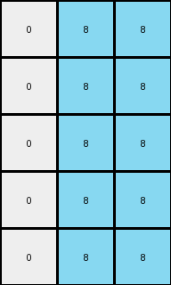

# 1b2d62fb • 005 • refine_dreamer

---


Previous Code:
```python
"""
1.  **Find the Vertical Blue Line:** Locate the column index of the vertical line of blue (1) pixels in the input grid.

2.  **Identify Rows with Azure:** Find all rows in the *input* grid that contain one or more azure (8) pixels.

3.  **Determine Output Grid Height:** The output grid's height equals the number of rows identified in step 2, plus additional padding rows as needed.

4.  **Create the Output Grid:** Initialize an output grid of dimensions *height* (from step 3) x 3, filled with white (0) pixels.

5.  **Map Azure Pixels:** For each row in the *input* grid that contains azure pixels:
    *   Find the horizontal distance (number of columns) between each Azure pixel and the blue line.
    *   In the corresponding row of the *output grid*, if the azure pixel is to the left of the blue line set a pixel at column 0. if the azure pixel is to the right of the blue line, set column 2. If the azure pixel is at the blue line column: set column 1.

6. **Return Output Grid:** The resulting output grid is the transformed output.
"""

import numpy as np

def find_vertical_line(grid, color):
    rows, cols = grid.shape
    for j in range(cols):
        if all(grid[i,j] == color for i in range(rows)):
            return j
    return -1

def find_azure_rows(grid):
    rows, _ = grid.shape
    azure_rows = []
    for i in range(rows):
        if 8 in grid[i]:
            azure_rows.append(i)
    return azure_rows

def transform(input_grid):
    input_grid = np.array(input_grid)
    rows, cols = input_grid.shape

    # Find the vertical blue line.
    blue_line_col = find_vertical_line(input_grid, 1)

    # Find rows containing azure pixels.
    azure_rows = find_azure_rows(input_grid)

    # Determine output grid height.
    if len(azure_rows)==0:
        output_height = rows
    else:
        output_height = rows #len(azure_rows)
    # Create the output grid.
    output_grid = np.zeros((output_height, 3), dtype=int)

    # Map azure pixels to the output grid.
    if blue_line_col != -1:  # Ensure blue line exists
       
        output_row_index = 0
        for input_row_index in range(rows):
          if 8 in input_grid[input_row_index]:
            for col_index in range(cols):
                if input_grid[input_row_index, col_index] == 8:
                    if col_index < blue_line_col:
                        output_grid[input_row_index, 0] = 8
                    elif col_index > blue_line_col:
                        output_grid[input_row_index, 2] = 8
                    else:
                        output_grid[input_row_index, 1] = 8
          else:
            # copy non-azure rows to corresponding output row if blue exists
            if rows == output_height:
              if blue_line_col !=-1:
                output_grid[input_row_index,1] = 8
                output_grid[input_row_index,2] = 8


    return output_grid
```

Train Set Results:

## Example 1:

Input:
```
0 9 9 1 9 9 9
0 0 9 1 9 9 0
9 0 9 1 9 9 0
0 0 0 1 9 0 0
0 9 9 1 9 9 9
```
Expected Output:
```
0 0 0
0 0 0
0 0 0
0 8 8
0 0 0
```
Transformed Output:
```
0 8 8
0 8 8
0 8 8
0 8 8
0 8 8
```

match: False
pixels_off: 8
size_correct: True
color_palette_correct: True
correct_pixel_counts: False

## Example 2:

Input:
```
0 0 0 1 9 0 0
9 0 9 1 9 9 9
0 9 9 1 9 9 9
0 0 0 1 9 9 9
0 9 9 1 9 9 9
```
Expected Output:
```
0 8 8
0 0 0
0 0 0
0 0 0
0 0 0
```
Transformed Output:
```
0 8 8
0 8 8
0 8 8
0 8 8
0 8 8
```

match: False
pixels_off: 8
size_correct: True
color_palette_correct: True
correct_pixel_counts: False

## Example 3:

Input:
```
9 0 0 1 9 0 9
9 0 0 1 0 9 0
9 0 0 1 9 0 0
0 9 9 1 0 9 9
0 0 9 1 0 9 0
```
Expected Output:
```
0 8 0
0 0 8
0 8 8
8 0 0
8 0 0
```
Transformed Output:
```
0 8 8
0 8 8
0 8 8
0 8 8
0 8 8
```

match: False
pixels_off: 8
size_correct: True
color_palette_correct: True
correct_pixel_counts: False

## Example 4:

Input:
```
0 9 9 1 9 0 9
9 0 0 1 9 0 0
9 9 9 1 9 9 9
0 9 0 1 0 0 0
9 0 0 1 9 0 0
```
Expected Output:
```
0 0 0
0 8 8
0 0 0
8 0 8
0 8 8
```
Transformed Output:
```
0 8 8
0 8 8
0 8 8
0 8 8
0 8 8
```

match: False
pixels_off: 6
size_correct: True
color_palette_correct: True
correct_pixel_counts: False

## Example 5:

Input:
```
0 9 9 1 9 0 9
9 0 9 1 9 9 9
9 9 9 1 0 0 9
9 0 0 1 9 0 0
9 9 9 1 0 0 9
```
Expected Output:
```
0 0 0
0 0 0
0 0 0
0 8 8
0 0 0
```
Transformed Output:
```
0 8 8
0 8 8
0 8 8
0 8 8
0 8 8
```

match: False
pixels_off: 8
size_correct: True
color_palette_correct: True
correct_pixel_counts: False

**INSTRUCTIONS**

The code above was generated based on observations from the first training
example

we have tested the transform function on each of the task example inputs and
compared with the expected output

review each of the examples provided and the results and consider how the
natural language program should be updated to accommodate this new knowledge

respond with the following deliverables:

- general assessment of the information provided and strategy for resolving the
  errors
- gather metrics about each of the examples and results - use code_execution to
  develop accurate reports on your assumptions
- a YAML block documenting facts - Focus on identifying objects, their properties, and the actions performed on them.
- a natural language program - Be as clear and concise as possible, providing a complete description of the transformation rule.


your responses should be considered as information in a report - not a
conversation
