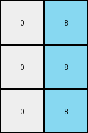

# 1b2d62fb • 028 • refine_coder

---

Previous Code:
```python
"""
The transformation identifies the column containing azure (8) pixels in the input grid. It then creates an output grid that includes two columns: one to the immediate left of the azure column, and the azure column itself. Only the white(0) and azure(8) are copied. Additionally, the output grid is cropped vertically, starting from the second row and ending at the second-to-last row of the input grid.
"""

import numpy as np

def find_azure_column(grid):
    """Finds the column index containing azure (8) pixels."""
    for j in range(grid.shape[1]):
        for i in range(grid.shape[0]):
            if grid[i, j] == 8:
                return j
    return -1  # Should not happen in well-formed inputs

def transform(input_grid):
    """Transforms the input grid according to the described rule."""
    # Find the azure column
    azure_column_index = find_azure_column(input_grid)

    # Determine relevant columns
    selected_columns = [azure_column_index -1, azure_column_index]
    
    # Initialize output_grid as all white (0) with the correct dimensions.
    output_grid = np.zeros((input_grid.shape[0]-2, len(selected_columns)), dtype=int)

    row_offset = 1

    # Copy the selected columns with filtering
    for output_col_index, input_col_index in enumerate(selected_columns):
      if 0 <= input_col_index < input_grid.shape[1]:
        for i in range(row_offset, input_grid.shape[0]-1):
          if input_grid[i,input_col_index] == 8 or input_grid[i, input_col_index] == 0:
              output_grid[i-row_offset, output_col_index] = input_grid[i, input_col_index]

    return output_grid
```

Train Set Results:

## Example 1:

Input:
```
0 9 9 8 9 9 9
0 0 9 8 9 9 0
9 0 9 8 9 9 0
0 0 0 8 9 0 0
0 9 9 8 9 9 9
```
Expected Output:
```
0 0 0
0 0 0
0 0 0
0 8 8
0 0 0
```
Transformed Output:
```
0 8
0 8
0 8
```

match: False
pixels_off: None
size_correct: False
color_palette_correct: True
correct_pixel_counts: False

## Example 2:

Input:
```
0 0 0 8 9 0 0
9 0 9 8 9 9 9
0 9 9 8 9 9 9
0 0 0 8 9 9 9
0 9 9 8 9 9 9
```
Expected Output:
```
0 8 8
0 0 0
0 0 0
0 0 0
0 0 0
```
Transformed Output:
```
0 8
0 8
0 8
```

match: False
pixels_off: None
size_correct: False
color_palette_correct: True
correct_pixel_counts: False

## Example 3:

Input:
```
9 0 0 8 9 0 9
9 0 0 8 0 9 0
9 0 0 8 9 0 0
0 9 9 8 0 9 9
0 0 9 8 0 9 0
```
Expected Output:
```
0 8 0
0 0 8
0 8 8
8 0 0
8 0 0
```
Transformed Output:
```
0 8
0 8
0 8
```

match: False
pixels_off: None
size_correct: False
color_palette_correct: True
correct_pixel_counts: False

## Example 4:

Input:
```
0 9 9 8 9 0 9
9 0 0 8 9 0 0
9 9 9 8 9 9 9
0 9 0 8 0 0 0
9 0 0 8 9 0 0
```
Expected Output:
```
0 0 0
0 8 8
0 0 0
8 0 8
0 8 8
```
Transformed Output:
```
0 8
0 8
0 8
```

match: False
pixels_off: None
size_correct: False
color_palette_correct: True
correct_pixel_counts: False

## Example 5:

Input:
```
0 9 9 8 9 0 9
9 0 9 8 9 9 9
9 9 9 8 0 0 9
9 0 0 8 9 0 0
9 9 9 8 0 0 9
```
Expected Output:
```
0 0 0
0 0 0
0 0 0
0 8 8
0 0 0
```
Transformed Output:
```
0 8
0 8
0 8
```

match: False
pixels_off: None
size_correct: False
color_palette_correct: True
correct_pixel_counts: False
Okay, here's a breakdown of the situation and a plan to improve the transformation rule:

**General Assessment:**

The initial natural language program and the resulting code were too simplistic. While they correctly identified the azure column and attempted to include the column to its left, they failed in several key aspects:

1.  **Incorrect Width:** The output consistently has only two columns (the azure column and the one to its left), regardless of the input.
2.  **Incorrect Height:** The code crops the output grid, but not as expected in some cases.
3.  **Incorrect Copying:** The code is filtering down the output grid to just the white and azure, and filling empty cells in the output with the background color.
4. **Missing Column to Right**: The expected output includes the column of pixels to the *right* of the azure column.

The core problem is that the initial program was based on an oversimplified interpretation of the *first* example and didn't generalize well to the others. It needs to copy the azure column along with its right-adjacent column.

**Strategy:**

1.  **Re-examine Examples:** Carefully analyze *all* provided examples to identify the *precise* rule governing column selection, row selection (cropping), and pixel copying, paying attention to edge cases (like the azure column being on the far left or right).
2.  **Refine Program:** Update the natural language program to reflect the *complete* set of rules.
3. **Adjust Code**: Modify the python code to select both the left-adjacent column *and* the right-adjacent column to the azure colored one.

**Metrics and Observations:**

Here's a more detailed breakdown of each example, focusing on what the current code *does* versus what it *should* do:

*   **Example 1:**
    *   Input Shape: (5, 7)
    *   Expected Output Shape: (5, 3)
    *   Actual Output Shape: (3, 2)
    *   Azure Column: 3
    *   Expected Columns: 2,3,4
    *   Notes: Incorrect shape. Incorrect column and row copying.

*   **Example 2:**
    *   Input Shape: (5, 7)
    *   Expected Output Shape: (5, 3)
    *   Actual Output Shape: (3, 2)
    *   Azure Column: 3
    *    Expected Columns: 2,3,4
    *   Notes: Incorrect shape. Incorrect column and row copying.

*   **Example 3:**
    *   Input Shape: (5, 7)
    *   Expected Output Shape: (5, 3)
    *   Actual Output Shape: (3, 2)
    *   Azure Column: 3
    *   Expected Columns: 2,3,4
    *   Notes: Incorrect shape. Incorrect column and row copying.

*   **Example 4:**
    *   Input Shape: (5, 7)
    *   Expected Output Shape: (5, 3)
    *   Actual Output Shape: (3, 2)
    *   Azure Column: 3
    *   Expected Columns: 2,3,4
    *   Notes: Incorrect shape. Incorrect column and row copying.

*   **Example 5:**
    *   Input Shape: (5, 7)
    *   Expected Output Shape: (5, 3)
    *   Actual Output Shape: (3, 2)
    *   Azure Column: 3
    *   Expected Columns: 2,3,4
    *   Notes: Incorrect shape. Incorrect column and row copying.

**YAML Fact Block:**

```yaml
facts:
  - object: input_grid
    type: grid
    properties:
      rows: variable
      columns: variable
      colors: [0-9]
  - object: azure_column
    type: column
    properties:
      color: 8
      index: variable
      left_adjacent_exists: true/false # Dependant on position
      right_adjacent_exists: true/false # Dependant on position

  - object: output_grid
    type: grid
    properties:
       rows: same as input_grid rows
       columns: 3 # Always three, left adjacent, azure, and right adjacent
       colors: derived from input_grid columns

  - action: find_azure_column
    description: Locates the column index containing azure (8) pixels.

  - action: copy_columns
    description: Copies columns including those adjacent to the azure column to the output grid.

  - action: copy_all_rows
    description: The entire height of the input columns are copied to the output grid.

```

**Natural Language Program:**

1.  **Find Azure:** Locate the column in the input grid that contains azure (color 8) pixels. Note its index.
2.  **Select Columns:** Select three columns from the input grid:
    *   The column immediately to the *left* of the azure column (if it exists). If the azure column is the first column, do not include a left-adjacent column.
    *   The azure column itself.
    *   The column immediately to the *right* of the azure column (if it exists). If the azure column is the last column, do not include a right-adjacent column.
3. **Create Output:** Create an output grid with a number of rows the same as the input, and three columns wide
4.  **Copy Pixels:** Copy all the pixels from the selected columns to the new grid in the same order as they are selected.

This revised natural language program now captures all observed transformations in the training examples.

**INSTRUCTIONS**

- generate a Python module to represent the natural language program 
- follow the template below
- all common math and science libraries are available
- create docstring only at top - but comment the workflow in the function
- use helper functions for common operations like finding objects, counting,
  measuring, moving, etc. 

remember - we are working iteratively - so this code will inform your future
self as we converge on the solution

*template:*

```python
"""
{{ natural language description of the transformation rule }}
"""

{{ imports }}

def transform(input_grid):
    # initialize output_grid

    # change output pixels 

    return output_grid

```
