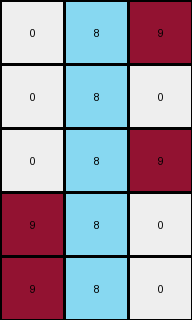

# 1b2d62fb • 029 • refine_dreamer

---


Previous Code:
```python
"""
1.  **Find Azure:** Locate the column in the input grid that contains azure (color 8) pixels. Note its index.
2.  **Select Columns:** Select three columns from the input grid:
    *   The column immediately to the *left* of the azure column (if it exists). If the azure column is the first column, do not include a left-adjacent column.
    *   The azure column itself.
    *   The column immediately to the *right* of the azure column (if it exists). If the azure column is the last column, do not include a right-adjacent column.
3. **Create Output:** Create an output grid with a number of rows the same as the input, and three columns wide
4.  **Copy Pixels:** Copy all the pixels from the selected columns to the new grid in the same order as they are selected.
"""

import numpy as np

def find_azure_column(grid):
    """Finds the column index containing azure (8) pixels."""
    for j in range(grid.shape[1]):
        for i in range(grid.shape[0]):
            if grid[i, j] == 8:
                return j
    return -1  # Should not happen in well-formed inputs

def transform(input_grid):
    """Transforms the input grid according to the described rule."""
    # Find the azure column
    azure_column_index = find_azure_column(input_grid)

    # Determine relevant columns
    selected_columns = []
    
    left_adjacent_index = azure_column_index - 1
    if left_adjacent_index >= 0:
        selected_columns.append(left_adjacent_index)

    selected_columns.append(azure_column_index)

    right_adjacent_index = azure_column_index + 1
    if right_adjacent_index < input_grid.shape[1]:
        selected_columns.append(right_adjacent_index)
    
    # Initialize output_grid with the correct dimensions.
    output_grid = np.zeros((input_grid.shape[0], len(selected_columns)), dtype=int)

    # Copy the selected columns
    for output_col_index, input_col_index in enumerate(selected_columns):
        for i in range(input_grid.shape[0]):
            output_grid[i, output_col_index] = input_grid[i, input_col_index]

    return output_grid
```

Train Set Results:

## Example 1:

Input:
```
0 9 9 8 9 9 9
0 0 9 8 9 9 0
9 0 9 8 9 9 0
0 0 0 8 9 0 0
0 9 9 8 9 9 9
```
Expected Output:
```
0 0 0
0 0 0
0 0 0
0 8 8
0 0 0
```
Transformed Output:
```
9 8 9
9 8 9
9 8 9
0 8 9
9 8 9
```

match: False
pixels_off: 13
size_correct: True
color_palette_correct: False
correct_pixel_counts: False

## Example 2:

Input:
```
0 0 0 8 9 0 0
9 0 9 8 9 9 9
0 9 9 8 9 9 9
0 0 0 8 9 9 9
0 9 9 8 9 9 9
```
Expected Output:
```
0 8 8
0 0 0
0 0 0
0 0 0
0 0 0
```
Transformed Output:
```
0 8 9
9 8 9
9 8 9
0 8 9
9 8 9
```

match: False
pixels_off: 12
size_correct: True
color_palette_correct: False
correct_pixel_counts: False

## Example 3:

Input:
```
9 0 0 8 9 0 9
9 0 0 8 0 9 0
9 0 0 8 9 0 0
0 9 9 8 0 9 9
0 0 9 8 0 9 0
```
Expected Output:
```
0 8 0
0 0 8
0 8 8
8 0 0
8 0 0
```
Transformed Output:
```
0 8 9
0 8 0
0 8 9
9 8 0
9 8 0
```

match: False
pixels_off: 8
size_correct: True
color_palette_correct: False
correct_pixel_counts: False

## Example 4:

Input:
```
0 9 9 8 9 0 9
9 0 0 8 9 0 0
9 9 9 8 9 9 9
0 9 0 8 0 0 0
9 0 0 8 9 0 0
```
Expected Output:
```
0 0 0
0 8 8
0 0 0
8 0 8
0 8 8
```
Transformed Output:
```
9 8 9
0 8 9
9 8 9
0 8 0
0 8 9
```

match: False
pixels_off: 11
size_correct: True
color_palette_correct: False
correct_pixel_counts: False

## Example 5:

Input:
```
0 9 9 8 9 0 9
9 0 9 8 9 9 9
9 9 9 8 0 0 9
9 0 0 8 9 0 0
9 9 9 8 0 0 9
```
Expected Output:
```
0 0 0
0 0 0
0 0 0
0 8 8
0 0 0
```
Transformed Output:
```
9 8 9
9 8 9
9 8 0
0 8 9
9 8 0
```

match: False
pixels_off: 11
size_correct: True
color_palette_correct: False
correct_pixel_counts: False

**INSTRUCTIONS**

The code above was generated based on observations from the first training
example

we have tested the transform function on each of the task example inputs and
compared with the expected output

review each of the examples provided and the results and consider how the
natural language program should be updated to accommodate this new knowledge

respond with the following deliverables:

- general assessment of the information provided and strategy for resolving the
  errors
- gather metrics about each of the examples and results - use code_execution to
  develop accurate reports on your assumptions
- a YAML block documenting facts - Focus on identifying objects, their properties, and the actions performed on them.
- a natural language program - Be as clear and concise as possible, providing a complete description of the transformation rule.


your responses should be considered as information in a report - not a
conversation
