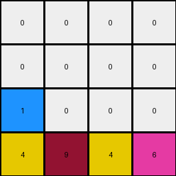
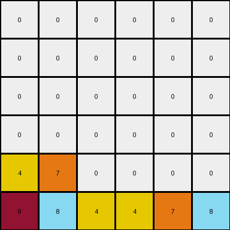
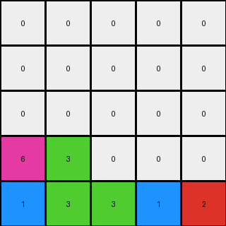

# 1e0a9b12 • 003 • refine_dreamer

---


Previous Code:
```python
"""
1. Identify non-zero pixels: Find all pixels in the input grid with values other than 0.
2. Preserve Order: Maintain the original order of these non-zero pixels as they appear from left-to-right, top-to-bottom in the input.
3. Move to Bottom: Move the identified non-zero pixels to the bottom-most available rows of the output grid. Fill the rows from left to right.
4. Fill Remaining: All other cells in output grid, not occupied are filled with 0.
"""

import numpy as np

def transform(input_grid):
    """
    Transforms the input grid by moving all non-zero pixels to the bottom,
    preserving their original order, and filling the remaining cells with zeros.
    """
    rows, cols = input_grid.shape
    output_grid = np.zeros_like(input_grid)
    non_zero_pixels = []

    # 1. Identify and store non-zero pixels with their original positions.
    for r in range(rows):
        for c in range(cols):
            if input_grid[r, c] != 0:
                non_zero_pixels.append((input_grid[r, c], r, c))

    # 2. (Order is implicitly preserved as we iterate row-by-row, then column by column)

    # 3. Move to the bottom.
    num_non_zero = len(non_zero_pixels)
    output_row = rows - 1
    output_col = 0
    for pixel_value, _, _ in non_zero_pixels:
        output_grid[output_row, output_col] = pixel_value
        output_col += 1
        if output_col == cols:
            output_col = 0
            output_row -= 1
            if output_row < 0:  # added to prevent going beyond boundary if there are many non-zero pixels
                break

    # 4. Fill the remaining (already done by initializing output_grid with zeros).
    return output_grid
```

Train Set Results:

## Example 1:

Input:
```
0 4 0 9
0 0 0 0
0 4 6 0
1 0 0 0
```
Expected Output:
```
0 0 0 0
0 0 0 0
0 4 0 0
1 4 6 9
```
Transformed Output:
```
0 0 0 0
0 0 0 0
1 0 0 0
4 9 4 6
```

match: False
pixels_off: 6
size_correct: True
color_palette_correct: True
correct_pixel_counts: True

## Example 2:

Input:
```
0 0 0 0 0 9
0 0 0 8 0 0
0 0 0 0 0 0
4 0 0 0 0 0
4 0 7 8 0 0
4 0 7 0 0 0
```
Expected Output:
```
0 0 0 0 0 0
0 0 0 0 0 0
0 0 0 0 0 0
4 0 0 0 0 0
4 0 7 8 0 0
4 0 7 8 0 9
```
Transformed Output:
```
0 0 0 0 0 0
0 0 0 0 0 0
0 0 0 0 0 0
0 0 0 0 0 0
4 7 0 0 0 0
9 8 4 4 7 8
```

match: False
pixels_off: 10
size_correct: True
color_palette_correct: True
correct_pixel_counts: True

## Example 3:

Input:
```
0 0 0 1 0
0 3 0 0 0
0 3 0 1 2
6 0 0 0 0
0 3 0 0 0
```
Expected Output:
```
0 0 0 0 0
0 0 0 0 0
0 3 0 0 0
0 3 0 1 0
6 3 0 1 2
```
Transformed Output:
```
0 0 0 0 0
0 0 0 0 0
0 0 0 0 0
6 3 0 0 0
1 3 3 1 2
```

match: False
pixels_off: 5
size_correct: True
color_palette_correct: True
correct_pixel_counts: True

**INSTRUCTIONS**

The code above was generated based on observations from the first training
example

we have tested the transform function on each of the task example inputs and
compared with the expected output

review each of the examples provided and the results and consider how the
natural language program should be updated to accommodate this new knowledge

respond with the following deliverables:

- general assessment of the information provided and strategy for resolving the
  errors
- gather metrics about each of the examples and results - use code_execution to
  develop accurate reports on your assumptions
- a YAML block documenting facts - Focus on identifying objects, their properties, and the actions performed on them.
- a natural language program - Be as clear and concise as possible, providing a complete description of the transformation rule.


your responses should be considered as information in a report - not a
conversation
