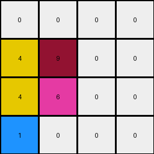
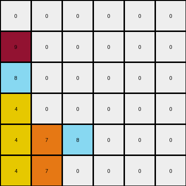
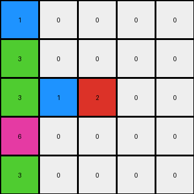

# 1e0a9b12 • 005 • refine_dreamer

---


Previous Code:
```python
"""
1.  **Identify Non-zero Pixels:** Locate all pixels within the input grid that have a value other than 0.
2.  **Preserve Row-wise Order:** Maintain the original left-to-right order of these non-zero pixels *as they appear within each row*.
3.  **Move to Bottom:** Move the identified non-zero pixels to the bottom-most available rows of the output grid.
4.  **Row-wise Filling:** When placing pixels in the output grid, prioritize filling the lowest available row. Within that row, place pixels from the same input row in their original order. If pixels from a higher input row need to be placed, and there are still empty positions on rows that had non-zero pixels on lower rows of input, fill the lowest of available rows.
5.  **Fill Remaining:** Fill any remaining cells in the output grid (those not occupied by moved non-zero pixels) with 0.
"""

import numpy as np

def transform(input_grid):
    """
    Transforms the input grid by moving all non-zero pixels to the bottom,
    preserving their original row-wise order, and filling the remaining
    cells with zeros.
    """
    rows, cols = input_grid.shape
    output_grid = np.zeros_like(input_grid)
    non_zero_pixels_by_row = [[] for _ in range(rows)]

    # 1. Identify and store non-zero pixels, preserving row and original order.
    for r in range(rows):
        for c in range(cols):
            if input_grid[r, c] != 0:
                non_zero_pixels_by_row[r].append((input_grid[r, c], c))

    # 2 & 3. Move to the bottom, maintaining row-wise order.
    output_row = rows - 1
    for row_pixels in reversed(non_zero_pixels_by_row):  # Iterate through original rows from bottom to top
        output_col_indices = [0] * rows # keeps track of where we are in the output for each row
        if not row_pixels:
            continue
        
        for pixel_value, original_col in sorted(row_pixels, key=lambda x: x[1]):
            #find output_col for the current output_row
            output_col = output_col_indices[output_row]
            while output_col < cols and output_grid[output_row, output_col] != 0:
              output_col += 1            
            
            if output_col < cols:            
                output_grid[output_row, output_col] = pixel_value
                output_col_indices[output_row] = output_col + 1 #increment for next time we use this output row
            else:
                #find the next available spot in higher rows
                curr_output_row = output_row - 1
                while curr_output_row >= 0:
                    output_col = output_col_indices[curr_output_row]
                    while output_col < cols and output_grid[curr_output_row, output_col] != 0:
                        output_col += 1
                    
                    if output_col < cols:
                        output_grid[curr_output_row, output_col] = pixel_value
                        output_col_indices[curr_output_row] = output_col + 1
                        break
                    else:
                      curr_output_row -= 1

        output_row -= 1
        if output_row < 0:
            break
        

    # 5. Fill the remaining (already done by initializing output_grid with zeros).
    return output_grid
```

Train Set Results:

## Example 1:

Input:
```
0 4 0 9
0 0 0 0
0 4 6 0
1 0 0 0
```
Expected Output:
```
0 0 0 0
0 0 0 0
0 4 0 0
1 4 6 9
```
Transformed Output:
```
0 0 0 0
4 9 0 0
4 6 0 0
1 0 0 0
```

match: False
pixels_off: 7
size_correct: True
color_palette_correct: True
correct_pixel_counts: True

## Example 2:

Input:
```
0 0 0 0 0 9
0 0 0 8 0 0
0 0 0 0 0 0
4 0 0 0 0 0
4 0 7 8 0 0
4 0 7 0 0 0
```
Expected Output:
```
0 0 0 0 0 0
0 0 0 0 0 0
0 0 0 0 0 0
4 0 0 0 0 0
4 0 7 8 0 0
4 0 7 8 0 9
```
Transformed Output:
```
0 0 0 0 0 0
9 0 0 0 0 0
8 0 0 0 0 0
4 0 0 0 0 0
4 7 8 0 0 0
4 7 0 0 0 0
```

match: False
pixels_off: 9
size_correct: True
color_palette_correct: True
correct_pixel_counts: True

## Example 3:

Input:
```
0 0 0 1 0
0 3 0 0 0
0 3 0 1 2
6 0 0 0 0
0 3 0 0 0
```
Expected Output:
```
0 0 0 0 0
0 0 0 0 0
0 3 0 0 0
0 3 0 1 0
6 3 0 1 2
```
Transformed Output:
```
1 0 0 0 0
3 0 0 0 0
3 1 2 0 0
6 0 0 0 0
3 0 0 0 0
```

match: False
pixels_off: 12
size_correct: True
color_palette_correct: True
correct_pixel_counts: True

**INSTRUCTIONS**

The code above was generated based on observations from the first training
example

we have tested the transform function on each of the task example inputs and
compared with the expected output

review each of the examples provided and the results and consider how the
natural language program should be updated to accommodate this new knowledge

respond with the following deliverables:

- general assessment of the information provided and strategy for resolving the
  errors
- gather metrics about each of the examples and results - use code_execution to
  develop accurate reports on your assumptions
- a YAML block documenting facts - Focus on identifying objects, their properties, and the actions performed on them.
- a natural language program - Be as clear and concise as possible, providing a complete description of the transformation rule.


your responses should be considered as information in a report - not a
conversation
