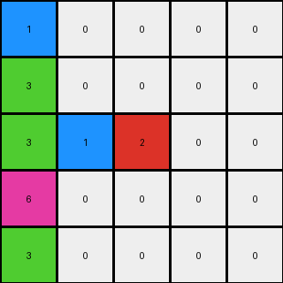

# 1e0a9b12 • 006 • refine_coder

---

Previous Code:
```python
"""
1.  **Identify Non-zero Pixels:** Locate all pixels within the input grid that have a value other than 0.
2.  **Preserve Row-wise Order:** Maintain the original left-to-right order of these non-zero pixels *as they appear within each row*.
3.  **Move to Bottom:** Move the identified non-zero pixels to the bottom-most available rows of the output grid.
4.  **Row-wise Filling:** When placing pixels in the output grid, prioritize filling the lowest available row. Within that row, place pixels from the same input row in their original order. If pixels from a higher input row need to be placed, and there are still empty positions on rows that had non-zero pixels on lower rows of input, fill the lowest of available rows.
5.  **Fill Remaining:** Fill any remaining cells in the output grid (those not occupied by moved non-zero pixels) with 0.
"""

import numpy as np

def transform(input_grid):
    """
    Transforms the input grid by moving all non-zero pixels to the bottom,
    preserving their original row-wise order, and filling the remaining
    cells with zeros.
    """
    rows, cols = input_grid.shape
    output_grid = np.zeros_like(input_grid)
    non_zero_pixels_by_row = [[] for _ in range(rows)]

    # 1. Identify and store non-zero pixels, preserving row and original order.
    for r in range(rows):
        for c in range(cols):
            if input_grid[r, c] != 0:
                non_zero_pixels_by_row[r].append((input_grid[r, c], c))

    # 2 & 3. Move to the bottom, maintaining row-wise order.
    output_row = rows - 1
    for row_pixels in reversed(non_zero_pixels_by_row):  # Iterate through original rows from bottom to top
        output_col_indices = [0] * rows # keeps track of where we are in the output for each row
        if not row_pixels:
            continue
        
        for pixel_value, original_col in sorted(row_pixels, key=lambda x: x[1]):
            #find output_col for the current output_row
            output_col = output_col_indices[output_row]
            while output_col < cols and output_grid[output_row, output_col] != 0:
              output_col += 1            
            
            if output_col < cols:            
                output_grid[output_row, output_col] = pixel_value
                output_col_indices[output_row] = output_col + 1 #increment for next time we use this output row
            else:
                #find the next available spot in higher rows
                curr_output_row = output_row - 1
                while curr_output_row >= 0:
                    output_col = output_col_indices[curr_output_row]
                    while output_col < cols and output_grid[curr_output_row, output_col] != 0:
                        output_col += 1
                    
                    if output_col < cols:
                        output_grid[curr_output_row, output_col] = pixel_value
                        output_col_indices[curr_output_row] = output_col + 1
                        break
                    else:
                      curr_output_row -= 1

        output_row -= 1
        if output_row < 0:
            break
        

    # 5. Fill the remaining (already done by initializing output_grid with zeros).
    return output_grid
```

Train Set Results:

## Example 1:

Input:
```
0 4 0 9
0 0 0 0
0 4 6 0
1 0 0 0
```
Expected Output:
```
0 0 0 0
0 0 0 0
0 4 0 0
1 4 6 9
```
Transformed Output:
```
0 0 0 0
4 9 0 0
4 6 0 0
1 0 0 0
```

match: False
pixels_off: 7
size_correct: True
color_palette_correct: True
correct_pixel_counts: True

## Example 2:

Input:
```
0 0 0 0 0 9
0 0 0 8 0 0
0 0 0 0 0 0
4 0 0 0 0 0
4 0 7 8 0 0
4 0 7 0 0 0
```
Expected Output:
```
0 0 0 0 0 0
0 0 0 0 0 0
0 0 0 0 0 0
4 0 0 0 0 0
4 0 7 8 0 0
4 0 7 8 0 9
```
Transformed Output:
```
0 0 0 0 0 0
9 0 0 0 0 0
8 0 0 0 0 0
4 0 0 0 0 0
4 7 8 0 0 0
4 7 0 0 0 0
```

match: False
pixels_off: 9
size_correct: True
color_palette_correct: True
correct_pixel_counts: True

## Example 3:

Input:
```
0 0 0 1 0
0 3 0 0 0
0 3 0 1 2
6 0 0 0 0
0 3 0 0 0
```
Expected Output:
```
0 0 0 0 0
0 0 0 0 0
0 3 0 0 0
0 3 0 1 0
6 3 0 1 2
```
Transformed Output:
```
1 0 0 0 0
3 0 0 0 0
3 1 2 0 0
6 0 0 0 0
3 0 0 0 0
```

match: False
pixels_off: 12
size_correct: True
color_palette_correct: True
correct_pixel_counts: True
Here's an analysis of the provided examples and results, along with a revised natural language program and a YAML block summarizing the observations:

**General Assessment:**

The initial natural language program and the resulting code have a fundamental flaw in how they handle the vertical positioning of pixels. The code attempts to maintain a separate "output_col_indices" for each row of the *output*, which is incorrect. It should instead preserve the original input order (within each row) and stack non-zero pixels at the bottom. The code also doesn't account for cases where multiple input rows might contribute to the same output row. The core issue is an incorrect understanding of how the "row-wise" preservation should interact with the "move to bottom" operation. The primary correction needed is to fill the *output* grid from the bottom up, processing each *input* row in its original order, but placing each pixel in the lowest available position in the output.

**Strategy for Resolving Errors:**

1.  **Correct the core logic:** Refocus on filling the output grid from the bottom-up.
2.  **Process Input Rows Sequentially:** Iterate through the input rows in their original order (top to bottom).
3.  **Within each row, process non-zero pixels:** Maintain the original left-to-right order of non-zero pixels within each input row.
4.  **Place in lowest available position:** For each pixel, find the lowest available row in the output grid *at the original column index*. If that position is occupied, move upwards until an empty cell is found.
5. **Simplify:** Remove the unnecessary `output_col_indices` complexity.

**Example Metrics and Analysis:**

We can derive a standard set of metrics from the results:

*   **Example:** Identifier (e.g., "Example 1")
*   **Input Size:** Dimensions of the input grid (rows x cols)
*   **Output Size:** Dimensions of the output grid (rows x cols) - should be the same
*   **Pixels Off:** Number of pixels in the transformed output that differ from the expected output.
*   **Size Correct:** Boolean, whether input and output sizes match.
*   **Color Palette Correct:** Boolean, whether only allowed colors are used
*   **Correct Pixel Counts**: Boolean - are the number of pixels for each color the same in expected and transformed

Here's a summary of the metrics for each provided example:

| Example    | Input Size | Output Size | Pixels Off | Size Correct | Color Palette Correct | Correct Pixel Counts |
| :--------- | :--------- | :---------- | :--------- | :----------- | :-------------------- | :------------------- |
| Example 1  | 4x4        | 4x4         | 7          | True         | True                  | True                 |
| Example 2  | 6x6        | 6x6         | 9          | True         | True                  | True                 |
| Example 3  | 5x5        | 5x5         | 12         | True         | True                  | True                 |

**YAML Block (Observations):**

```yaml
observations:
  - object: non_zero_pixels
    properties:
      - color: value from 1 to 9
      - original_row: row index in input grid
      - original_column: column index in input grid
    actions:
      - moved: from original position to the bottom-most available position in the output grid
      - order_preserved: within each row, original left-to-right order is maintained
  - object: zero_pixels
    properties:
      - color: 0
      - position: fills any cell not occupied by non-zero pixels
    actions:
      - fill: occupies remaining space in output grid

```

**Natural Language Program:**

1.  **Identify Non-zero Pixels:** Find all pixels in the input grid that are not zero. Note their color, original row, and original column.
2.  **Process Input Rows Sequentially:** Iterate through each row of the *input* grid, starting from the top row (row 0) and going down.
3.  **Preserve Intra-Row Order:** For each input row, process the non-zero pixels found in that row from left to right (original column order).
4. **Place at lowest available position:** For each non-zero pixel:
    - start at the *bottom* row of the output grid in the pixel's original column.
    - If the cell at that location in the output grid is empty (value 0), place the pixel there.
    - If the cell is occupied, move up one row at a time in the *same column* until you find an empty cell.  Place the pixel in that empty cell.
5.  **Implicit Zero Filling:** The output grid is implicitly filled with zeros as any remaining empty spaces will naturally contain zeros.

This improved natural language program directly addresses the identified issues by emphasizing bottom-up filling and correct order preservation.

**INSTRUCTIONS**

- generate a Python module to represent the natural language program 
- follow the template below
- all common math and science libraries are available
- create docstring only at top - but comment the workflow in the function
- use helper functions for common operations like finding objects, counting,
  measuring, moving, etc. 

remember - we are working iteratively - so this code will inform your future
self as we converge on the solution

*template:*

```python
"""
{{ natural language description of the transformation rule }}
"""

{{ imports }}

def transform(input_grid):
    # initialize output_grid

    # change output pixels 

    return output_grid

```
