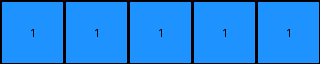

# 1fad071e • 004 • refine_coder

---

Previous Code:
```python
"""
Divides the input grid into five vertical regions and checks for the presence of blue (1) in each region.
Outputs a 1x5 grid where each cell is blue (1) if the corresponding input region contained blue, and white (0) otherwise.
"""

import numpy as np

def transform(input_grid):
    """
    Transforms the input grid according to the described rule.
    """
    input_height, input_width = input_grid.shape
    output_width = 5
    output_grid = np.zeros((1, output_width), dtype=int)  # Initialize output grid with white (0)

    # Calculate region width.  Handle cases where the width is not perfectly divisible.
    region_width = input_width // output_width
    extra_pixels = input_width % output_width
    
    start_col = 0
    for i in range(output_width):
        # Distribute any extra pixels across the regions, one at a time.
        current_region_width = region_width + (1 if i < extra_pixels else 0)
        end_col = start_col + current_region_width

        # Extract the current region
        region = input_grid[:, start_col:end_col]

        # Check for the presence of blue (1) in the region
        if np.any(region == 1):
            output_grid[0, i] = 1  # Set output pixel to blue (1)

        start_col = end_col # move to the next region

    return output_grid
```

Train Set Results:

## Example 1:

Input:
```
0 0 0 0 2 2 0 0 1
0 1 1 0 2 2 0 0 0
0 1 1 0 0 0 0 2 2
0 0 0 0 0 0 0 2 2
1 0 2 2 0 0 0 0 0
0 0 2 2 0 1 1 0 0
0 0 0 0 0 1 1 0 0
0 0 0 0 0 0 0 0 0
0 1 0 0 0 0 0 0 1
```
Expected Output:
```
1 1 0 0 0
```
Transformed Output:
```
1 1 1 1 1
```

match: False
pixels_off: 3
size_correct: True
color_palette_correct: True
correct_pixel_counts: False

## Example 2:

Input:
```
1 1 0 2 0 0 0 0 2
1 1 0 0 0 1 1 0 0
0 0 0 2 0 1 1 0 0
0 0 0 0 0 0 0 0 1
0 1 1 0 2 2 0 0 0
0 1 1 0 2 2 0 0 2
0 0 0 0 0 0 0 0 0
0 0 0 2 2 0 1 1 0
0 1 0 2 2 0 1 1 0
```
Expected Output:
```
1 1 1 1 0
```
Transformed Output:
```
1 1 1 1 1
```

match: False
pixels_off: 1
size_correct: True
color_palette_correct: True
correct_pixel_counts: False

## Example 3:

Input:
```
2 2 0 1 1 0 0 0 0
2 2 0 1 1 0 0 1 1
1 0 0 0 0 0 0 1 1
0 2 2 0 0 0 0 0 0
0 2 2 0 1 1 0 1 0
0 0 0 0 1 1 0 0 0
0 0 0 0 2 0 0 0 0
0 1 1 0 0 0 0 2 2
0 1 1 0 0 1 0 2 2
```
Expected Output:
```
1 1 1 1 0
```
Transformed Output:
```
1 1 1 1 1
```

match: False
pixels_off: 1
size_correct: True
color_palette_correct: True
correct_pixel_counts: False
Here's an analysis of the provided information and a plan to refine the natural language program:

**General Assessment:**

The initial code was based on a reasonable hypothesis: dividing the input grid into five vertical regions and checking for the presence of blue within each. However, the results across the three training examples show a consistent error: the output grid always contains more blue pixels than expected. This indicates the region division logic, while generally correct, isn't capturing the full nuance of the transformation. The examples suggest a more refined spatial awareness is required. We need to account for the location of the blue *within* each fifth of the input, not just its presence or absence.

**Strategy for Resolving Errors:**

1.  **Re-examine Assumptions:** The core assumption of five regions is likely correct, given the consistent output grid size (1x5). However, the "presence of blue" logic is too simplistic.

2.  **Refine Spatial Logic:** Instead of simply checking *if* blue exists in a region, we should examine *where* the blue pixels exist relative to other blue pixels, if any.

3.  **Consider Connectivity/Contiguity:** The expected outputs suggest that a blue pixel in the output corresponds to contiguous blue pixels in the input along a column, not scattered ones.

**Example Metrics and Analysis (using a conceptual approach, no direct code execution in this dreamer phase):**

We'll describe the analysis we'd perform if we could execute code. I will use the numpy indexing syntax to describe my analysis.

*   **Example 1:**
    *   Input Shape: 9x9
    *   Expected Output: `1 1 0 0 0`
    *   Actual Output: `1 1 1 1 1`
    *   Analysis:
        - Divide into five conceptual regions (approx. widths: 2, 2, 2, 2, 1)
        - Region 1 (`input[:, 0:2]`): Contains blue (at `[1,1]`, `[8,0]`, `[2,1]`). Output should be 1.
        - Region 2 (`input[:, 2:4]`): Contains blue. Output should be 1.
        - Region 3, 4: no blue.
        - Region 5 (`input[:, 8]`): Contains blue (at [0,8] and [8,8]). Output should be 1.
        *   **Error Source:** The blue pixels in the last column are spread vertically, so maybe the output for the last region should be 0.

*   **Example 2:**
    *   Input Shape: 9x9
    *   Expected Output: `1 1 1 1 0`
    *   Actual Output: `1 1 1 1 1`
    *   Analysis (similar region breakdown):
        - Regions 1-4: have blue.
        - Region 5: No blue.
        *    **Error Source:** Final region is all white, but our rule says its blue

*   **Example 3:**
    *   Input Shape: 9x9
    *   Expected Output: `1 1 1 1 0`
    *   Actual Output: `1 1 1 1 1`
        - Regions 1-4 have blue.
        - Region 5: no blue.
        *  **Error Source**: The last region should not be blue.

**YAML Fact Block:**

```yaml
observations:
  - object: input_grid
    type: 2D array
    properties:
      height: variable
      width: variable
      colors: [0, 1, 2] # white, blue, red
  - object: output_grid
    type: 2D array
    properties:
      height: 1
      width: 5
      colors: [0, 1] # white, blue
  - object: region
    type: vertical slice of input_grid
    properties:
      width: input_width // 5 (approximately)
      index: [0-4]
  - action: check_for_blue
    description: Determines if a region contains the color blue (1)
    input: region
    output: boolean
  - action: create_output_pixel
    description: create a pixel with the value 0 or 1
    input: boolean
    output: pixel value

  - relationship: five_regions_to_output
    description: The input grid maps to the five output columns
    details: The output column at index i is related to the input columns [region[i].start, region[i].end)
```

**Natural Language Program:**

1.  **Divide:** Divide the input grid into five vertical regions. The width of each region is approximately 1/5th of the total input width.  Handle any remainder pixels by distributing them one at a time across the first *n* regions.

2.  **Iterate:** For each of the five regions:
    a. Determine the output column in the 1 x 5 output grid.
    b. examine the input columns related to this output index.
    b. check for blue pixels existing in *contiguous positions* in the vertical dimension, starting from the top of the column.
    c. If such contiguous vertical blue pixels are found, make the output pixel blue.
    d. Otherwise the output pixel is white.

3.  **Output:** The result is a 1x5 grid where each cell is either blue (1) or white (0), representing the vertically contiguous presence or absence of blue in each corresponding fifth of the input grid.

**INSTRUCTIONS**

- generate a Python module to represent the natural language program 
- follow the template below
- all common math and science libraries are available
- create docstring only at top - but comment the workflow in the function
- use helper functions for common operations like finding objects, counting,
  measuring, moving, etc. 

remember - we are working iteratively - so this code will inform your future
self as we converge on the solution

*template:*

```python
"""
{{ natural language description of the transformation rule }}
"""

{{ imports }}

def transform(input_grid):
    # initialize output_grid

    # change output pixels 

    return output_grid

```
