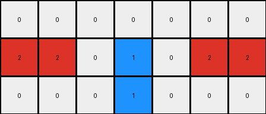
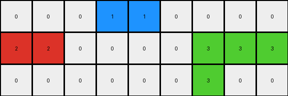
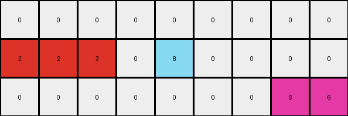
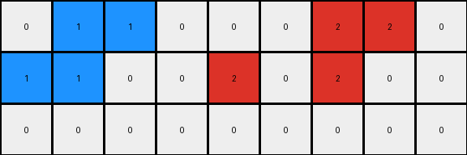

# 234bbc79 • 003 • refine_dreamer

---

Previous Code:
```python
"""
1. **Column Reduction:** The output grid has 7 columns while the input has 9. Columns 3 and 6 (counting from 0) of the input are removed.

2. **Color Replacement (5s):** All pixels with a value of '5' (gray) in the input grid are changed.

3. **Replacement Logic:**
   - Input '5' pixels directly above or below a '1' (blue) become '1' (blue).
   - Input '5' pixels adjacent to a '2' (red) become '2'(red) if the '5' is at the edge and a '2' exist.

4. **Other Pixels:** Pixels that are not '5' in the input grid retain their original values in the output grid, maintaining relative position after column removal.
"""

import numpy as np

def get_neighbors(grid, row, col):
    neighbors = []
    rows, cols = grid.shape
    if row > 0:
        neighbors.append(grid[row-1, col])  # Up
    if row < rows - 1:
        neighbors.append(grid[row+1, col])  # Down
    if col > 0:
        neighbors.append(grid[row, col-1])  # Left
    if col < cols - 1:
        neighbors.append(grid[row, col+1])  # Right
    return neighbors

def transform(input_grid):
    # Initialize output_grid by removing columns 3 and 6
    output_grid = np.delete(input_grid, [3, 6], axis=1)

    rows, cols = output_grid.shape

    # Iterate through the output_grid and apply transformation rules
    for row in range(rows):
        for col in range(cols):
            # Map the output grid indices back to the input grid
            input_col = col
            if col >= 3:
                input_col += 1
            if col >= 5:
                input_col += 1

            # Color Replacement Logic
            if input_grid[row, input_col] == 5:
                neighbors = get_neighbors(input_grid, row, input_col)
                if 1 in neighbors:
                    output_grid[row, col] = 1
                #check if at first or last colum
                elif (input_col == 0 or input_col == 8) and 2 in neighbors:
                  output_grid[row,col] = 2
                else: #added condition
                  output_grid[row,col] = 0

    return output_grid
```

Train Set Results:

## Example 1:

Input:
```
0 5 0 0 0 0 0 0 0
2 2 0 5 1 0 5 2 2
0 0 0 0 5 0 0 0 0
```
Expected Output:
```
0 2 1 1 0 0 0
2 2 0 1 2 2 2
0 0 0 0 0 0 0
```
Transformed Output:
```
0 0 0 0 0 0 0
2 2 0 1 0 2 2
0 0 0 1 0 0 0
```

match: False
pixels_off: 5
size_correct: True
color_palette_correct: True
correct_pixel_counts: False

## Example 2:

Input:
```
0 0 0 5 1 5 0 0 0 0 0
2 2 0 0 0 0 0 0 3 3 3
0 5 0 0 0 0 0 5 3 0 0
```
Expected Output:
```
0 0 0 0 0 0 0 0 0
2 2 0 0 0 0 3 3 3
0 2 1 1 1 3 3 0 0
```
Transformed Output:
```
0 0 0 1 1 0 0 0 0
2 2 0 0 0 0 3 3 3
0 0 0 0 0 0 3 0 0
```

match: False
pixels_off: 7
size_correct: True
color_palette_correct: True
correct_pixel_counts: False

## Example 3:

Input:
```
0 0 0 0 0 0 5 0 0 0 0
2 2 2 0 5 8 8 0 0 0 0
0 0 5 0 0 0 0 0 5 6 6
```
Expected Output:
```
0 0 0 0 0 0 0 0 0
2 2 2 0 0 8 6 6 6
0 0 2 8 8 8 0 0 0
```
Transformed Output:
```
0 0 0 0 0 0 0 0 0
2 2 2 0 8 0 0 0 0
0 0 0 0 0 0 0 6 6
```

match: False
pixels_off: 11
size_correct: True
color_palette_correct: True
correct_pixel_counts: False

## Example 4:

Input:
```
0 1 5 0 0 0 0 0 2 2 0
1 1 0 0 5 2 0 5 2 0 0
0 0 0 0 0 5 0 0 0 0 0
```
Expected Output:
```
0 1 1 2 2 0 2 2
1 1 0 0 2 2 2 0
0 0 0 0 0 0 0 0
```
Transformed Output:
```
0 1 1 0 0 0 2 2 0
1 1 0 0 2 0 2 0 0
0 0 0 0 0 0 0 0 0
```

match: False
pixels_off: None
size_correct: False
color_palette_correct: True
correct_pixel_counts: False
**INSTRUCTIONS**

The code above was generated based on observations from the first training
example

we have tested the transform function on each of the task example inputs and
compared with the expected output

review each of the examples provided and the results and consider how the
natural language program should be updated to accommodate this new knowledge

respond with the following deliverables:

- general assessment of the information provided and strategy for resolving the
  errors
- gather metrics about each of the examples and results - use code_execution to
  develop accurate reports on your assumptions
- a YAML block documenting facts - Focus on identifying objects, their properties, and the actions performed on them.
- a natural language program - Be as clear and concise as possible, providing a complete description of the transformation rule.


your responses should be considered as information in a report - not a
conversation
