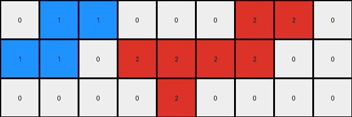

# 234bbc79 • 005 • refine_dreamer

---

Previous Code:
```python
"""
1.  **Column Removal:** Remove columns 3 and 6 (counting from 0) of the input grid to create a reduced grid.

2.  **Color Replacement for '5' (Gray) Pixels:**
    *   If a '5' pixel in the *input* grid is directly above or below a '1' (blue) pixel, change it to '1' (blue) in the corresponding position in the *output* grid.
    *   If a '5' pixel in the *input* grid is horizontally or vertically adjacent to a '2' (red) pixel, change to '2'(red)
    *   If a '5' pixel in the *input* grid is horizontally or vertically adjacent to a '8' (azure) pixel, change to '8'(azure)

3.  **Preservation of Other Colors:** All other pixels (not '5') retain their original color from the input grid to the output grid, maintaining their relative positions after the column removal.
4. All gray(5) will be replaced with a neighbor color if applicable. If multiple neighbors are candidates, preference should follow blue > red > azure
"""

import numpy as np

def get_neighbors(grid, row, col):
    neighbors = []
    rows, cols = grid.shape
    if row > 0:
        neighbors.append((grid[row-1, col], row-1, col))  # Up
    if row < rows - 1:
        neighbors.append((grid[row+1, col], row+1, col))  # Down
    if col > 0:
        neighbors.append((grid[row, col-1], row, col-1))  # Left
    if col < cols - 1:
        neighbors.append((grid[row, col+1], row, col+1))  # Right
    return neighbors

def transform(input_grid):
    # Initialize output_grid by removing columns 3 and 6
    output_grid = np.delete(input_grid, [3, 6], axis=1)

    rows, cols = output_grid.shape
    temp_output_grid = output_grid.copy()

    # Iterate through the output_grid and apply transformation rules
    for row in range(rows):
        for col in range(cols):
            # Map the output grid indices back to the input grid
            input_col = col
            if col >= 3:
                input_col += 1
            if col >= 5:
                input_col += 1

            # Color Replacement Logic
            if input_grid[row, input_col] == 5:
                neighbors = get_neighbors(input_grid, row, input_col)
                #prioritize the color
                neighbor_colors = [color for color, _,_ in neighbors]
                replace_color = 0 #default
                if 1 in neighbor_colors:
                    replace_color = 1
                elif 2 in neighbor_colors:
                    replace_color = 2
                elif 8 in neighbor_colors:
                    replace_color = 8

                temp_output_grid[row,col] = replace_color
    output_grid = temp_output_grid

    return output_grid
```

Train Set Results:

## Example 1:

Input:
```
0 5 0 0 0 0 0 0 0
2 2 0 5 1 0 5 2 2
0 0 0 0 5 0 0 0 0
```
Expected Output:
```
0 2 1 1 0 0 0
2 2 0 1 2 2 2
0 0 0 0 0 0 0
```
Transformed Output:
```
0 2 0 0 0 0 0
2 2 0 1 0 2 2
0 0 0 1 0 0 0
```

match: False
pixels_off: 4
size_correct: True
color_palette_correct: True
correct_pixel_counts: False

## Example 2:

Input:
```
0 0 0 5 1 5 0 0 0 0 0
2 2 0 0 0 0 0 0 3 3 3
0 5 0 0 0 0 0 5 3 0 0
```
Expected Output:
```
0 0 0 0 0 0 0 0 0
2 2 0 0 0 0 3 3 3
0 2 1 1 1 3 3 0 0
```
Transformed Output:
```
0 0 0 1 1 0 0 0 0
2 2 0 0 0 0 3 3 3
0 2 0 0 0 0 3 0 0
```

match: False
pixels_off: 6
size_correct: True
color_palette_correct: True
correct_pixel_counts: False

## Example 3:

Input:
```
0 0 0 0 0 0 5 0 0 0 0
2 2 2 0 5 8 8 0 0 0 0
0 0 5 0 0 0 0 0 5 6 6
```
Expected Output:
```
0 0 0 0 0 0 0 0 0
2 2 2 0 0 8 6 6 6
0 0 2 8 8 8 0 0 0
```
Transformed Output:
```
0 0 0 0 0 0 0 0 0
2 2 2 8 8 0 0 0 0
0 0 2 0 0 0 0 6 6
```

match: False
pixels_off: 11
size_correct: True
color_palette_correct: True
correct_pixel_counts: False

## Example 4:

Input:
```
0 1 5 0 0 0 0 0 2 2 0
1 1 0 0 5 2 0 5 2 0 0
0 0 0 0 0 5 0 0 0 0 0
```
Expected Output:
```
0 1 1 2 2 0 2 2
1 1 0 0 2 2 2 0
0 0 0 0 0 0 0 0
```
Transformed Output:
```
0 1 1 0 0 0 2 2 0
1 1 0 2 2 2 2 0 0
0 0 0 0 2 0 0 0 0
```

match: False
pixels_off: None
size_correct: False
color_palette_correct: True
correct_pixel_counts: False
**INSTRUCTIONS**

The code above was generated based on observations from the first training
example

we have tested the transform function on each of the task example inputs and
compared with the expected output

review each of the examples provided and the results and consider how the
natural language program should be updated to accommodate this new knowledge

respond with the following deliverables:

- general assessment of the information provided and strategy for resolving the
  errors
- gather metrics about each of the examples and results - use code_execution to
  develop accurate reports on your assumptions
- a YAML block documenting facts - Focus on identifying objects, their properties, and the actions performed on them.
- a natural language program - Be as clear and concise as possible, providing a complete description of the transformation rule.


your responses should be considered as information in a report - not a
conversation
