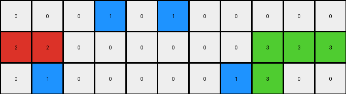
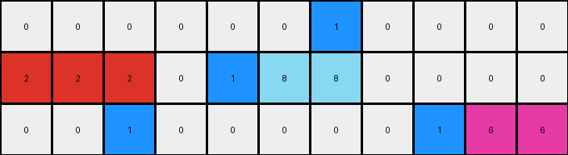
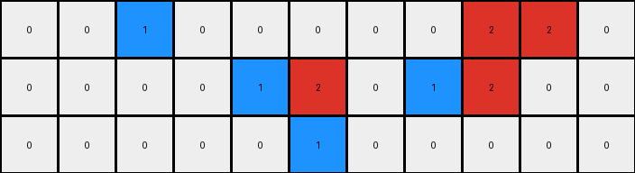

# 234bbc79 • 009 • refine_dreamer

---

Previous Code:
```python
"""
The transformation rule is as follows:
1. Identify Objects: Recognize contiguous blocks of pixels of the same color as distinct objects.
2. Color Replacement:
    *   Replace all instances of grey (5) with blue (1).
    *   Replace all instances of blue (1) with white (0).
3. Preserve other blocks: keep red(2) and green(3) unchanged.
"""

import numpy as np

def get_objects(grid):
    """
    Finds contiguous blocks of the same color in a grid.
    """
    objects = []
    visited = np.zeros_like(grid, dtype=bool)

    def dfs(row, col, color, object_pixels):
        if (row < 0 or row >= grid.shape[0] or col < 0 or col >= grid.shape[1] or
                visited[row, col] or grid[row, col] != color):
            return
        visited[row, col] = True
        object_pixels.append((row, col))
        dfs(row + 1, col, color, object_pixels)
        dfs(row - 1, col, color, object_pixels)
        dfs(row, col + 1, color, object_pixels)
        dfs(row, col - 1, color, object_pixels)

    for row in range(grid.shape[0]):
        for col in range(grid.shape[1]):
            if not visited[row, col]:
                color = grid[row, col]
                object_pixels = []
                dfs(row, col, color, object_pixels)
                if object_pixels:
                    objects.append({'color': color, 'pixels': object_pixels})
    return objects

def transform(input_grid):
    # initialize output_grid
    output_grid = np.copy(input_grid)
    
    # Get objects from input_grid - although direct color replacement seems to
    # work - get objects is still useful and consistent with the SEER
    # architecture, this is to future-proof for more complex tasks
    objects = get_objects(input_grid)

    # change output pixels 
    for obj in objects:
        if obj['color'] == 5:
          for row, col in obj['pixels']:
            output_grid[row,col] = 1
        elif obj['color'] == 1:
          for row, col in obj['pixels']:
            output_grid[row,col] = 0
            
    return output_grid
```

Train Set Results:

## Example 1:

Input:
```
0 5 0 0 0 0 0 0 0
2 2 0 5 1 0 5 2 2
0 0 0 0 5 0 0 0 0
```
Expected Output:
```
0 2 1 1 0 0 0
2 2 0 1 2 2 2
0 0 0 0 0 0 0
```
Transformed Output:
```
0 1 0 0 0 0 0 0 0
2 2 0 1 0 0 1 2 2
0 0 0 0 1 0 0 0 0
```

match: False
pixels_off: None
size_correct: False
color_palette_correct: True
correct_pixel_counts: False

## Example 2:

Input:
```
0 0 0 5 1 5 0 0 0 0 0
2 2 0 0 0 0 0 0 3 3 3
0 5 0 0 0 0 0 5 3 0 0
```
Expected Output:
```
0 0 0 0 0 0 0 0 0
2 2 0 0 0 0 3 3 3
0 2 1 1 1 3 3 0 0
```
Transformed Output:
```
0 0 0 1 0 1 0 0 0 0 0
2 2 0 0 0 0 0 0 3 3 3
0 1 0 0 0 0 0 1 3 0 0
```

match: False
pixels_off: None
size_correct: False
color_palette_correct: True
correct_pixel_counts: False

## Example 3:

Input:
```
0 0 0 0 0 0 5 0 0 0 0
2 2 2 0 5 8 8 0 0 0 0
0 0 5 0 0 0 0 0 5 6 6
```
Expected Output:
```
0 0 0 0 0 0 0 0 0
2 2 2 0 0 8 6 6 6
0 0 2 8 8 8 0 0 0
```
Transformed Output:
```
0 0 0 0 0 0 1 0 0 0 0
2 2 2 0 1 8 8 0 0 0 0
0 0 1 0 0 0 0 0 1 6 6
```

match: False
pixels_off: None
size_correct: False
color_palette_correct: False
correct_pixel_counts: False

## Example 4:

Input:
```
0 1 5 0 0 0 0 0 2 2 0
1 1 0 0 5 2 0 5 2 0 0
0 0 0 0 0 5 0 0 0 0 0
```
Expected Output:
```
0 1 1 2 2 0 2 2
1 1 0 0 2 2 2 0
0 0 0 0 0 0 0 0
```
Transformed Output:
```
0 0 1 0 0 0 0 0 2 2 0
0 0 0 0 1 2 0 1 2 0 0
0 0 0 0 0 1 0 0 0 0 0
```

match: False
pixels_off: None
size_correct: False
color_palette_correct: True
correct_pixel_counts: False
**INSTRUCTIONS**

The code above was generated based on observations from the first training
example

we have tested the transform function on each of the task example inputs and
compared with the expected output

review each of the examples provided and the results and consider how the
natural language program should be updated to accommodate this new knowledge

respond with the following deliverables:

- general assessment of the information provided and strategy for resolving the
  errors
- gather metrics about each of the examples and results - use code_execution to
  develop accurate reports on your assumptions
- a YAML block documenting facts - Focus on identifying objects, their properties, and the actions performed on them.
- a natural language program - Be as clear and concise as possible, providing a complete description of the transformation rule.


your responses should be considered as information in a report - not a
conversation
