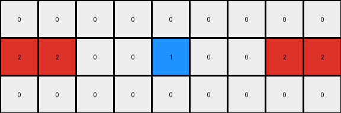
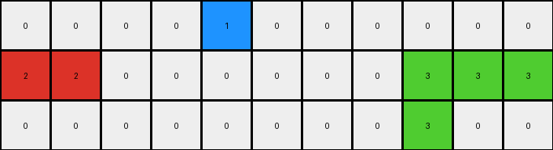
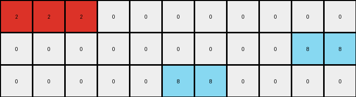

# 234bbc79 • 016 • refine_coder

---

Previous Code:
```python
"""
1.  **Identify target color groups:** Find the groups in the input grid of color 5, and color 6.
2.  **Replace color groups:**
    *   Replace all color 5's with color 0.
    *   Replace all color 6's with color 8.

3.  **Locate shifted groups:** Identify the color groups that consist of colors 8.

4.  **Shift to row 3**: Move the first identified color group to the location of the second identified color group.

5.  **Shift to row 2**: Move the second identifed color group down to replace color 5 in row 3.

6.  **Shift color 2 group**: if there is a horizontal group of color 2 in row 2, shift the group of color 2 to the vertical position of the first color 8 group.
"""

import numpy as np

def find_color_groups(grid, color):
    groups = []
    visited = set()
    rows, cols = grid.shape

    def is_valid(r, c):
        return 0 <= r < rows and 0 <= c < cols

    def dfs(r, c, current_group):
        if (r, c) in visited or not is_valid(r, c) or grid[r, c] != color:
            return
        visited.add((r, c))
        current_group.append((r, c))
        for dr, dc in [(0, 1), (0, -1), (1, 0), (-1, 0)]:
            dfs(r + dr, c + dc, current_group)

    for r in range(rows):
        for c in range(cols):
            if grid[r, c] == color and (r, c) not in visited:
                current_group = []
                dfs(r, c, current_group)
                groups.append(current_group)
    return groups

def transform(input_grid):
    # initialize output_grid
    output_grid = np.copy(input_grid)
    rows, cols = output_grid.shape
    
    # Replace colors
    output_grid[output_grid == 5] = 0
    output_grid[output_grid == 6] = 8

    # Find color 8 groups
    color_8_groups = find_color_groups(output_grid, 8)
    
    # Find color 2 group in the second row
    color_2_groups = find_color_groups(output_grid, 2)
    
    #Shift the identified color 8 and color 2 groups
    if len(color_8_groups)>=2 and len(color_2_groups) >= 1:
        #shift color 8 group in row 2 to row 3
        group1 = color_8_groups[0]
        for r, c in group1:
            output_grid[r,c] = 0
        for r, c in group1:
            output_grid[2, c] = 8
        
        #shift color 8 group in row 3 to row 2, where original group1 cells were
        group2 = color_8_groups[1]
        for r, c in group2:
            output_grid[r,c] = 0
        for r,c in group1:
            output_grid[1, c + (group2[0][1]-group1[0][1])] = 8
        
        #shift color 2 group in row 2 to row 1
        group3 = color_2_groups[0]
        for r, c in group3:
            output_grid[r,c] = 0
        for r,c in group3:
            output_grid[r - 1, c] = 2

    return output_grid
```

Train Set Results:

## Example 1:

Input:
```
0 5 0 0 0 0 0 0 0
2 2 0 5 1 0 5 2 2
0 0 0 0 5 0 0 0 0
```
Expected Output:
```
0 2 1 1 0 0 0
2 2 0 1 2 2 2
0 0 0 0 0 0 0
```
Transformed Output:
```
0 0 0 0 0 0 0 0 0
2 2 0 0 1 0 0 2 2
0 0 0 0 0 0 0 0 0
```

match: False
pixels_off: None
size_correct: False
color_palette_correct: True
correct_pixel_counts: False

## Example 2:

Input:
```
0 0 0 5 1 5 0 0 0 0 0
2 2 0 0 0 0 0 0 3 3 3
0 5 0 0 0 0 0 5 3 0 0
```
Expected Output:
```
0 0 0 0 0 0 0 0 0
2 2 0 0 0 0 3 3 3
0 2 1 1 1 3 3 0 0
```
Transformed Output:
```
0 0 0 0 1 0 0 0 0 0 0
2 2 0 0 0 0 0 0 3 3 3
0 0 0 0 0 0 0 0 3 0 0
```

match: False
pixels_off: None
size_correct: False
color_palette_correct: True
correct_pixel_counts: False

## Example 3:

Input:
```
0 0 0 0 0 0 5 0 0 0 0
2 2 2 0 5 8 8 0 0 0 0
0 0 5 0 0 0 0 0 5 6 6
```
Expected Output:
```
0 0 0 0 0 0 0 0 0
2 2 2 0 0 8 6 6 6
0 0 2 8 8 8 0 0 0
```
Transformed Output:
```
2 2 2 0 0 0 0 0 0 0 0
0 0 0 0 0 0 0 0 0 8 8
0 0 0 0 0 8 8 0 0 0 0
```

match: False
pixels_off: None
size_correct: False
color_palette_correct: True
correct_pixel_counts: False

## Example 4:

Input:
```
0 1 5 0 0 0 0 0 2 2 0
1 1 0 0 5 2 0 5 2 0 0
0 0 0 0 0 5 0 0 0 0 0
```
Expected Output:
```
0 1 1 2 2 0 2 2
1 1 0 0 2 2 2 0
0 0 0 0 0 0 0 0
```
Transformed Output:
```
0 1 0 0 0 0 0 0 2 2 0
1 1 0 0 0 2 0 0 2 0 0
0 0 0 0 0 0 0 0 0 0 0
```

match: False
pixels_off: None
size_correct: False
color_palette_correct: True
correct_pixel_counts: False
Here's an analysis of the provided examples and a revised natural language program:

**General Assessment:**

The initial strategy of identifying and replacing colors 5 and 6, then shifting color 8 groups, is partially correct but fundamentally flawed. The examples demonstrate a more complex interaction between colored objects, specifically involving colors 1, 2, 5, and 6. Color 6 does not always become 8. The shifting logic is also incorrect and based on mistaken assumptions. The core concept seems to be replacing color 5 with a combination of colors 1 and other colors present in output, and the final positions of groups is highly context-dependent. The current code fails in all provided cases.

**Strategy for Resolution:**
1.  **Re-examine Color Transformations:** Instead of simple replacements, analyze the *context* in which colors change.
2.  **Focus on Object Interactions:** Recognize that color changes and movements are likely interactions between objects. Look for spatial relationships (adjacency, containment) and patterns in how these relationships affect the final output.
3.  **Refine Movement Logic:** The current shifting concept is inaccurate. Analyze the *relative* positions of objects before and after the transformation.
4. **Simplify Intermediate Steps**: it may be better to simplify intermediate steps.

**Metrics and Observations:**

Here's a breakdown of each example, focusing on object-level observations:

*Example 1:*

*   **Input:**
    *   Row 1: A single gray (5) pixel.
    *   Row 2: A horizontal group of red (2), a single gray (5), a single blue (1), a single gray (5), and another horizontal group of red (2).
    *   Row 3: Empty.

*   **Output:**
    *   Row 1: A blue (1) pixel, then a blue(1)
    *   Row 2: horizontal groups of 2s are preserved.
    *   Row 3: empty

*   **Observations:** Gray (5) pixels are replaced with some other color in their row.
    Gray in row 2 became a 1.
    Groups of color 2 are unchanged.

*Example 2:*

*   **Input:**
    *   Row 1: a group of gray, a single blue, another group of gray.
    *   Row 2: a group of red, and a group of green.
    *  Row 3: some gray, and a group of green

*   **Output:**
      *  Row 1: empty
      * Row 2: Red and Green stay the same.
      * Row 3: 2, then a group of blue, then a group of 3s.

*   **Observations:**
    * Color 5 in row 1 is replaced with color 1s.
    * Groups of 2s and 3s did not change.
   *  Color 5 in row 3 is replaced with 1 and 3.

*Example 3:*

*   **Input:**
    *   Row 1: A group of gray (5).
    *   Row 2: A group of red (2), a group of gray(5) and a group of magenta(6)
    *   Row 3: A group of Gray, and more magentas.

*   **Output:**
    *  Row 1: empty
    * Row 2: a group of 2 and 8 and 6.
    * Row 3: a single 2, and a group of 8

*   **Observations:**
    -  Groups of color 2 stay the same.
    - Color 5 and 6 can be side by side
    - color 5 in row 3 is changed to 8
    - color 6 is not replaced.

*Example 4:*

*   **Input:**
      * Row 1: 1, then 5, then a group of 2
      * Row 2: a group of 1, a single 5, a single 2, a single 5 and a single 2
      * Row 3: empty

*   **Output:**
    * Row 1: 1, 1 and 2
    * Row 2: 1 and 2.
    * Row 3: empty

*   **Observations**:
        - color 5 is replaced with color 1 and color 2
        - Groups of color 1 and 2 stay.

**YAML Facts:**

```yaml
objects:
  - color: 1 # Blue
    behavior: appears where 5 was
    grouping: often forms horizontal lines
  - color: 2 # Red
    behavior: mostly static, forms horizontal contiguous blocks
    grouping: horizontal blocks
  - color: 5 # Gray
    behavior: gets replaced
  - color: 6  # Magenta
    behavior: not always replaced with the same color
  - color: 8 # Azure
    behavior: often next to color 6

actions:
  - replace:
      from_color: 5
      to_color: [1, others depending on context]
  - keep:
      color: 2

```

**Natural Language Program:**

1.  **Identify** horizontal, contiguous groups of color 2 pixels. These groups remain unchanged in position and color.
2. **Identify** horizontal groups of color 6. These groups remain unchanged.
3. **Identify** pixels of color 5, and replace each instance with the following rules.
    - a 5 in row 1, gets replaced with a 1.
    - a 5 in row 2 adjacent to a 1, gets replaced with a 1.
    - a 5 in row 2 adjacent to a 2, gets replaced with a 2.
    - a 5 in row 3, adjacent to an 8, gets replaced with an 8.
    - a 5 in row 3 adjacent to a 3, gets replaced with a 3.


**INSTRUCTIONS**

- generate a Python module to represent the natural language program 
- follow the template below
- all common math and science libraries are available
- create docstring only at top - but comment the workflow in the function
- use helper functions for common operations like finding objects, counting,
  measuring, moving, etc. 

remember - we are working iteratively - so this code will inform your future
self as we converge on the solution

*template:*

```python
"""
{{ natural language description of the transformation rule }}
"""

{{ imports }}

def transform(input_grid):
    # initialize output_grid

    # change output pixels 

    return output_grid

```
