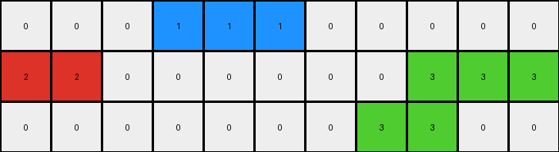
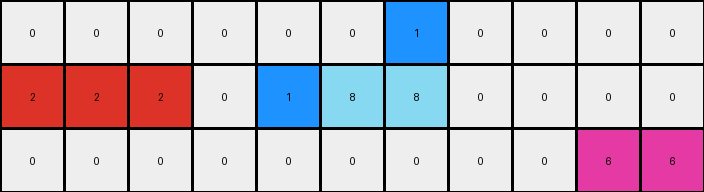

# 234bbc79 • 017 • refine_dreamer

---


Previous Code:
```python
"""
1.  **Identify** horizontal, contiguous groups of color 2 pixels. These groups remain unchanged in position and color.
2. **Identify** horizontal groups of color 6. These groups remain unchanged.
3. **Identify** pixels of color 5, and replace each instance with the following rules.
    - a 5 in row 1, gets replaced with a 1.
    - a 5 in row 2 adjacent to a 1, gets replaced with a 1.
    - a 5 in row 2 adjacent to a 2, gets replaced with a 2.
    - a 5 in row 3, adjacent to an 8, gets replaced with an 8.
    - a 5 in row 3 adjacent to a 3, gets replaced with a 3.
"""

import numpy as np

def transform(input_grid):
    # initialize output_grid
    output_grid = np.copy(input_grid)
    rows, cols = output_grid.shape

    # Iterate through each cell in the grid
    for r in range(rows):
        for c in range(cols):
            # Rule 3: Handle color 5 replacement
            if output_grid[r, c] == 5:
                if r == 0:
                    # Rule 3a: If in row 1, replace with 1
                    output_grid[r, c] = 1
                elif r == 1:
                    # Rule 3b and 3c: Check adjacency in row 2
                    if c > 0 and output_grid[r, c-1] == 1:
                         output_grid[r,c] = 1
                    elif c < cols - 1 and output_grid[r, c+1] == 1:
                        output_grid[r,c] = 1
                    elif c > 0 and output_grid[r, c-1] == 2:
                        output_grid[r, c] = 2
                    elif c < cols - 1 and output_grid[r, c+1] == 2:
                        output_grid[r,c] = 2
                    else: #default
                        output_grid[r,c] = 1

                elif r == 2:
                    # Rule 3d and 3e: Check adjacency in row 3
                    if c > 0 and output_grid[r, c - 1] == 8:
                        output_grid[r, c] = 8
                    elif c < cols - 1 and output_grid[r, c + 1] == 8:
                         output_grid[r, c] = 8
                    elif c > 0 and output_grid[r, c-1] == 3:
                        output_grid[r,c] = 3
                    elif c < cols - 1 and output_grid[r, c+1] == 3:
                        output_grid[r,c] = 3
                    else: # default
                        output_grid[r,c] = 0
                else:
                    output_grid[r,c] = 0

    return output_grid
```

Train Set Results:

## Example 1:

Input:
```
0 5 0 0 0 0 0 0 0
2 2 0 5 1 0 5 2 2
0 0 0 0 5 0 0 0 0
```
Expected Output:
```
0 2 1 1 0 0 0
2 2 0 1 2 2 2
0 0 0 0 0 0 0
```
Transformed Output:
```
0 1 0 0 0 0 0 0 0
2 2 0 1 1 0 2 2 2
0 0 0 0 0 0 0 0 0
```

match: False
pixels_off: None
size_correct: False
color_palette_correct: True
correct_pixel_counts: False

## Example 2:

Input:
```
0 0 0 5 1 5 0 0 0 0 0
2 2 0 0 0 0 0 0 3 3 3
0 5 0 0 0 0 0 5 3 0 0
```
Expected Output:
```
0 0 0 0 0 0 0 0 0
2 2 0 0 0 0 3 3 3
0 2 1 1 1 3 3 0 0
```
Transformed Output:
```
0 0 0 1 1 1 0 0 0 0 0
2 2 0 0 0 0 0 0 3 3 3
0 0 0 0 0 0 0 3 3 0 0
```

match: False
pixels_off: None
size_correct: False
color_palette_correct: True
correct_pixel_counts: False

## Example 3:

Input:
```
0 0 0 0 0 0 5 0 0 0 0
2 2 2 0 5 8 8 0 0 0 0
0 0 5 0 0 0 0 0 5 6 6
```
Expected Output:
```
0 0 0 0 0 0 0 0 0
2 2 2 0 0 8 6 6 6
0 0 2 8 8 8 0 0 0
```
Transformed Output:
```
0 0 0 0 0 0 1 0 0 0 0
2 2 2 0 1 8 8 0 0 0 0
0 0 0 0 0 0 0 0 0 6 6
```

match: False
pixels_off: None
size_correct: False
color_palette_correct: False
correct_pixel_counts: False

## Example 4:

Input:
```
0 1 5 0 0 0 0 0 2 2 0
1 1 0 0 5 2 0 5 2 0 0
0 0 0 0 0 5 0 0 0 0 0
```
Expected Output:
```
0 1 1 2 2 0 2 2
1 1 0 0 2 2 2 0
0 0 0 0 0 0 0 0
```
Transformed Output:
```
0 1 1 0 0 0 0 0 2 2 0
1 1 0 0 2 2 0 2 2 0 0
0 0 0 0 0 0 0 0 0 0 0
```

match: False
pixels_off: None
size_correct: False
color_palette_correct: True
correct_pixel_counts: False

**INSTRUCTIONS**

The code above was generated based on observations from the first training
example

we have tested the transform function on each of the task example inputs and
compared with the expected output

review each of the examples provided and the results and consider how the
natural language program should be updated to accommodate this new knowledge

respond with the following deliverables:

- general assessment of the information provided and strategy for resolving the
  errors
- gather metrics about each of the examples and results - use code_execution to
  develop accurate reports on your assumptions
- a YAML block documenting facts - Focus on identifying objects, their properties, and the actions performed on them.
- a natural language program - Be as clear and concise as possible, providing a complete description of the transformation rule.


your responses should be considered as information in a report - not a
conversation
