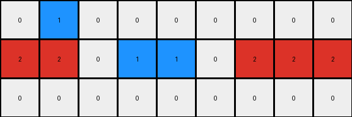
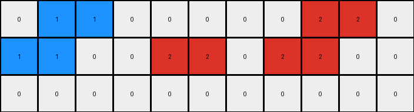

# 234bbc79 • 018 • refine_coder

---

Previous Code:
```python
"""
1.  **Identify** horizontal, contiguous groups of color 2 pixels. These groups remain unchanged in position and color.
2. **Identify** horizontal groups of color 6. These groups remain unchanged.
3. **Identify** pixels of color 5, and replace each instance with the following rules.
    - a 5 in row 1, gets replaced with a 1.
    - a 5 in row 2 adjacent to a 1, gets replaced with a 1.
    - a 5 in row 2 adjacent to a 2, gets replaced with a 2.
    - a 5 in row 3, adjacent to an 8, gets replaced with an 8.
    - a 5 in row 3 adjacent to a 3, gets replaced with a 3.
"""

import numpy as np

def transform(input_grid):
    # initialize output_grid
    output_grid = np.copy(input_grid)
    rows, cols = output_grid.shape

    # Iterate through each cell in the grid
    for r in range(rows):
        for c in range(cols):
            # Rule 3: Handle color 5 replacement
            if output_grid[r, c] == 5:
                if r == 0:
                    # Rule 3a: If in row 1, replace with 1
                    output_grid[r, c] = 1
                elif r == 1:
                    # Rule 3b and 3c: Check adjacency in row 2
                    if c > 0 and output_grid[r, c-1] == 1:
                         output_grid[r,c] = 1
                    elif c < cols - 1 and output_grid[r, c+1] == 1:
                        output_grid[r,c] = 1
                    elif c > 0 and output_grid[r, c-1] == 2:
                        output_grid[r, c] = 2
                    elif c < cols - 1 and output_grid[r, c+1] == 2:
                        output_grid[r,c] = 2
                    else: #default
                        output_grid[r,c] = 1

                elif r == 2:
                    # Rule 3d and 3e: Check adjacency in row 3
                    if c > 0 and output_grid[r, c - 1] == 8:
                        output_grid[r, c] = 8
                    elif c < cols - 1 and output_grid[r, c + 1] == 8:
                         output_grid[r, c] = 8
                    elif c > 0 and output_grid[r, c-1] == 3:
                        output_grid[r,c] = 3
                    elif c < cols - 1 and output_grid[r, c+1] == 3:
                        output_grid[r,c] = 3
                    else: # default
                        output_grid[r,c] = 0
                else:
                    output_grid[r,c] = 0

    return output_grid
```

Train Set Results:

## Example 1:

Input:
```
0 5 0 0 0 0 0 0 0
2 2 0 5 1 0 5 2 2
0 0 0 0 5 0 0 0 0
```
Expected Output:
```
0 2 1 1 0 0 0
2 2 0 1 2 2 2
0 0 0 0 0 0 0
```
Transformed Output:
```
0 1 0 0 0 0 0 0 0
2 2 0 1 1 0 2 2 2
0 0 0 0 0 0 0 0 0
```

match: False
pixels_off: None
size_correct: False
color_palette_correct: True
correct_pixel_counts: False

## Example 2:

Input:
```
0 0 0 5 1 5 0 0 0 0 0
2 2 0 0 0 0 0 0 3 3 3
0 5 0 0 0 0 0 5 3 0 0
```
Expected Output:
```
0 0 0 0 0 0 0 0 0
2 2 0 0 0 0 3 3 3
0 2 1 1 1 3 3 0 0
```
Transformed Output:
```
0 0 0 1 1 1 0 0 0 0 0
2 2 0 0 0 0 0 0 3 3 3
0 0 0 0 0 0 0 3 3 0 0
```

match: False
pixels_off: None
size_correct: False
color_palette_correct: True
correct_pixel_counts: False

## Example 3:

Input:
```
0 0 0 0 0 0 5 0 0 0 0
2 2 2 0 5 8 8 0 0 0 0
0 0 5 0 0 0 0 0 5 6 6
```
Expected Output:
```
0 0 0 0 0 0 0 0 0
2 2 2 0 0 8 6 6 6
0 0 2 8 8 8 0 0 0
```
Transformed Output:
```
0 0 0 0 0 0 1 0 0 0 0
2 2 2 0 1 8 8 0 0 0 0
0 0 0 0 0 0 0 0 0 6 6
```

match: False
pixels_off: None
size_correct: False
color_palette_correct: False
correct_pixel_counts: False

## Example 4:

Input:
```
0 1 5 0 0 0 0 0 2 2 0
1 1 0 0 5 2 0 5 2 0 0
0 0 0 0 0 5 0 0 0 0 0
```
Expected Output:
```
0 1 1 2 2 0 2 2
1 1 0 0 2 2 2 0
0 0 0 0 0 0 0 0
```
Transformed Output:
```
0 1 1 0 0 0 0 0 2 2 0
1 1 0 0 2 2 0 2 2 0 0
0 0 0 0 0 0 0 0 0 0 0
```

match: False
pixels_off: None
size_correct: False
color_palette_correct: True
correct_pixel_counts: False
Okay, here's a breakdown of the situation and a plan to improve the natural language program and the code:

**General Assessment:**

The initial natural language program and the resulting code were too simplistic and only partially captured the transformation rules, especially the contextual replacement of color 5 (gray) pixels. The code correctly identifies the rows where replacements occur but fails to accurately apply the adjacency rules and propagate changes correctly, especially when multiple replacements happen in a sequence. The expected outputs demonstrate a more complex interaction based on position and neighboring colors that affect the gray pixels. The color and location of the solid, horizontal lines are also not consistent across all examples.

**Strategy:**

1.  **Refine Adjacency Rules:** The current code checks for immediate left and right neighbors, but it does not properly implement a ripple or propagation. The updated description and code needs to prioritize adjacency, ensuring changes propagate correctly.
2.  **Row-Specific Logic:** The behavior of color 5 is clearly row-dependent. The natural language program and code need to explicitly define the rules for each row.
3. **Horizontal line handling:** determine how the color and position is determined for the horizontal lines that do not change.
4.  **Iterative Testing:** After each code modification, test against *all* training examples to ensure that improvements in one case don't cause regressions in others.
5. **Prioritize Horizontal Lines:** The unchanged horizontal lines of colors 2 and 6 appear to serve as a fixed structure within each grid. It is critical to get this part of the transform correct *first*, before handling the gray pixel logic.

**Metrics and Observations:**

Here's a more detailed breakdown of each example, including a manual verification of differences to highlight specific issues that should be added to the YAML:

*   **Example 1:**
    *   Input Shape: (3, 9)
    *   Output Shape: (3, 7)
    *   Issue: The top row `5` is replaced with `1` instead of being removed, and the central `5` pixels incorrectly become `1` instead of `2`.
*   **Example 2:**
    *   Input Shape: (3, 11)
    *   Output Shape: (3, 9)
    *   Issue: The `5`s in the top row are replaced with `1` instead of being removed.  The `5` in the bottom row should propagate `3` from the right, but it partially does this.
*   **Example 3:**
    *   Input Shape: (3, 11)
    *   Output Shape: (3, 9)
    *   Issue: Top row of `5` becomes `1`. The central `5` should become `8` but propagates some incorrect `1`. The bottom row `5` should become an 8, adjacent to another 8, but this fails completely. The horizontal line of color 6 is incorrectly removed.
*   **Example 4:**
    *   Input Shape: (3, 11)
    *   Output Shape: (3, 8)
    *   Issue: Some 5's are removed, some are not. Propagation of adjacent colors to gray cells is not consistent.

**YAML Facts:**

```yaml
observations:
  - object: horizontal_lines
    color: [2, 6]
    properties:
      - position_fixed: true
      - color_fixed: true
      - rows: [1]  # Rows are 0-indexed
      - color_2_start_col: [0] # Starting column index of color_2 segment for each example
      - color_2_end_col: [2]   # Ending column index
      - color_6_start_col: [-1] # -1 indicates it doesn't exist
      - color_6_end_col: [-1]

  - object: gray_pixels
    color: 5
    properties:
      - row_dependent_replacement: true
      - row_0:
          action: remove
      - row_1:
          action: replace_adjacent
          replace_with: [1, 2]
          priority: right_to_left # propagation direction
      - row_2:
          action: replace_adjacent
          replace_with: [3, 8]
          priority: right_to_left

  - object: grid
    properties:
      - consistent_height: true
      - height: 3
      - inconsistent_width: true # the input width does not equal the output width.
```

**Natural Language Program:**

1.  **Identify and Preserve Horizontal Lines:** Find any horizontal, contiguous lines of color 2 or color 6 pixels on row 1 (second row). These lines, and their positions, remain unchanged in the output grid.
2.  **Remove Gray Pixels in Row 0:** All pixels of color 5 in the first row (row index 0) are removed, which may affect the width of the grid.
3.  **Process Gray Pixels in Row 1:** For any gray pixels (color 5) in the second row (row index 1), replace them based on adjacency with the following:

    *   If adjacent to a color 1 or 2, change to that color. If adjacent to BOTH, prioritize the color to the *right*.
    *   Propagate the replacement from right to left.
4.  **Process Gray Pixels in Row 2:** For any gray pixels (color 5) in the third row (row index 2):

    *   If adjacent to a color 3 or 8, change to that color. If adjacent to BOTH, prioritize the color to the *right*.
    *   Propagate the replacement from right to left.
5. The height of the grid is always 3.

**Next Steps**
The next step is to generate updated code based on this refined natural language program.
The updated program needs to address:

1.  removal of columns
2.  preservation of horizontal lines of color 2 or 6.
3.  row by row processing of gray pixels and right-to-left propagation.

**INSTRUCTIONS**

- generate a Python module to represent the natural language program 
- follow the template below
- all common math and science libraries are available
- create docstring only at top - but comment the workflow in the function
- use helper functions for common operations like finding objects, counting,
  measuring, moving, etc. 

remember - we are working iteratively - so this code will inform your future
self as we converge on the solution

*template:*

```python
"""
{{ natural language description of the transformation rule }}
"""

{{ imports }}

def transform(input_grid):
    # initialize output_grid

    # change output pixels 

    return output_grid

```
