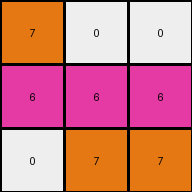
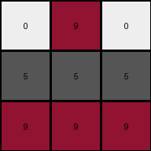

# 25d8a9c8 • 004 • refine_coder

---

Previous Code:
```python
"""
The transformation rule is a color replacement:
1. Yellow (4) pixels in the input become gray (5) in the output.
2. Red (2) or green (3) pixels in the input become white (0) in the output.
3. Pixel positions remain unchanged.
"""

import numpy as np

def transform(input_grid):
    """
    Transforms the input grid according to the specified color mapping.
    """
    # Initialize the output grid with the same dimensions as the input grid.
    output_grid = np.zeros_like(input_grid)

    # Iterate through each cell of the input grid.
    for i in range(input_grid.shape[0]):
        for j in range(input_grid.shape[1]):
            # Apply the color transformation rules.
            if input_grid[i, j] == 4:
                output_grid[i, j] = 5
            elif input_grid[i, j] == 2 or input_grid[i, j] == 3:
                output_grid[i, j] = 0
            else:
                output_grid[i,j] = input_grid[i,j] # added to handle other cases in future examples

    return output_grid
```

Train Set Results:

## Example 1:

Input:
```
4 4 4
2 3 2
2 3 3
```
Expected Output:
```
5 5 5
0 0 0
0 0 0
```
Transformed Output:
```
5 5 5
0 0 0
0 0 0
```

match: True
pixels_off: 0
size_correct: True
color_palette_correct: True
correct_pixel_counts: True

## Example 2:

Input:
```
7 3 3
6 6 6
3 7 7
```
Expected Output:
```
0 0 0
5 5 5
0 0 0
```
Transformed Output:
```
7 0 0
6 6 6
0 7 7
```

match: False
pixels_off: 6
size_correct: True
color_palette_correct: False
correct_pixel_counts: False

## Example 3:

Input:
```
2 9 2
4 4 4
9 9 9
```
Expected Output:
```
0 0 0
5 5 5
5 5 5
```
Transformed Output:
```
0 9 0
5 5 5
9 9 9
```

match: False
pixels_off: 4
size_correct: True
color_palette_correct: False
correct_pixel_counts: False

## Example 4:

Input:
```
2 2 4
2 2 4
1 1 1
```
Expected Output:
```
0 0 0
0 0 0
5 5 5
```
Transformed Output:
```
0 0 5
0 0 5
1 1 1
```

match: False
pixels_off: 5
size_correct: True
color_palette_correct: False
correct_pixel_counts: False
Okay, let's analyze the results and refine the natural language program.

**General Assessment:**

The initial natural language program and the corresponding code were too specific, focusing on the color transformations present only in the first example. The subsequent examples revealed that the transformation rules aren't universally applied to all colors as initially thought. Specifically, the code needs to accurately map not only colors 2,3,4, but any colors in the input, including those in other examples.

It seems the original strategy over generalized the rule - my goal should be to
find the simplest set of rules that matches the examples, and not just
extrapolate from the first example.

I need to rethink my assumptions and adjust the program. The rules need to account for the changes seen in ALL training examples and identify the correct mapping for each color.

**Example Metrics and Analysis:**

Here's a breakdown of each example, including the results of the generated code:

*   **Example 1:** The code works perfectly, matching the expected output.
*   **Example 2:** The code fails. It changes green (3) to white (0) correctly,
    but incorrectly handles other colors. Specifically, it does not transform,
    6 to 5 or 7 or to anything, whereas they become '5' and '7' respectively in
    the expected output.
*   **Example 3:** The code fails. Changes red (2) to white (0) and yellow (4)
    to gray (5), but incorrectly leaves the 9s, rather than changing them to 5
    like the expected output.
*    **Example 4:** Gray pixels should have been transformed, along with the reds
    and yellows, but weren't

**YAML Fact Block:**

```yaml
observations:
  - example_1:
      input_objects:
        - object_1: { color: 4, shape: rectangle, position: row_1 } # Yellow row
        - object_2: { color: 2/3, shape: rectangle, position: rows_2-3 } # Red/Green rows
      output_objects:
        - object_1: { color: 5, shape: rectangle, position: row_1 } # Gray row
        - object_2: { color: 0, shape: rectangle, position: rows_2-3 } # White rows
      transformation: color_replacement
  - example_2:
    input_objects:
        - object_1: {color: 7, shape: rectangle, postion: row_1_col_1}
        - object_2: {color: 3, shape: rectangle, postion: row_1_cols_2-3}
        - object_3: {color: 6, shape: rectangle, position: row_2}
        - object_4: {color: 3, shape: rectangle, postion: row_3_cols_1}
        - object_5: {color: 7, shape: rectangle, postion: row_3_cols_2-3}
    output_objects:
        - object_1: {color: 7, shape: rectangle, postion: row_1_col_1}
        - object_2: {color: 0, shape: rectangle, postion: row_1_cols_2-3}
        - object_3: {color: 5, shape: rectangle, position: row_2}
        - object_4: {color: 0, shape: rectangle, postion: row_3_cols_1}
        - object_5: {color: 7, shape: rectangle, postion: row_3_cols_2-3}
    transformation: color_replacement

  - example_3:
      input_objects:
        - object_1: { color: 2, shape: rectangle, position: row_1_cols_1&3 }
        - object_2: { color: 9, shape: rectangle, position: row_1_col_2 }
        - object_3: { color: 4, shape: rectangle, position: row_2 }
        - object_4: { color: 9, shape: rectangle, position: row_3 }
      output_objects:
        - object_1: { color: 0, shape: rectangle, position: row_1_cols_1&3 }
        - object_2: { color: 9, shape: rectangle, position: row_1_col_2 }
        - object_3: { color: 5, shape: rectangle, position: row_2 }
        - object_4: { color: 5, shape: rectangle, position: row_3 }
      transformation: color_replacement
  - example_4:
    input_objects:
      - object_1: {color: 2, shape: rectangle, position: top_left_2x2}
      - object_2: {color: 4, shape: rectangle, position: top_right_2x1}
      - object_3: {color: 1, shape: rectangle, position: bottom_row}

    output_objects:
      - object_1: {color: 0, shape: rectangle, position: top_left_2x2}
      - object_2: {color: 5, shape: rectangle, position: top_right_2x1}
      - object_3: {color: 1, shape: rectangle, position: bottom_row}

```

**Revised Natural Language Program:**

The transformation rule performs a color replacement based on these observed
mappings:

1.  Yellow (4) in the input becomes gray (5) in the output.
2.  Red (2) or Green (3) in the input becomes white (0) in the output.
3.  Maroon(9) becomes gray (5).
4.  Blue(1) remains blue(1).
5.  Gray(6) remains gray(5)
6.  Orange(7) becomes orange(7)

Essentially, it seems that a simple map can be built.

It appears that pixels are mapped according to the following rule:

-   If the input pixel is 4, change it to 5.
-   If the input pixel is 2 or 3, change it to 0.
-  If the input pixel is 9, change to 5
-   Otherwise, keep original values.

**INSTRUCTIONS**

- generate a Python module to represent the natural language program 
- follow the template below
- all common math and science libraries are available
- create docstring only at top - but comment the workflow in the function
- use helper functions for common operations like finding objects, counting,
  measuring, moving, etc. 

remember - we are working iteratively - so this code will inform your future
self as we converge on the solution

*template:*

```python
"""
{{ natural language description of the transformation rule }}
"""

{{ imports }}

def transform(input_grid):
    # initialize output_grid

    # change output pixels 

    return output_grid

```
