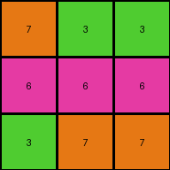

# 25d8a9c8 • 016 • refine_coder

---

Previous Code:
```python
"""
The transformation rule consolidates colors. If the pixel is red or maroon, it becomes white. If it is yellow, it becomes gray.
"""

import numpy as np

def transform(input_grid):
    """
    Transforms the input grid according to the color mapping rule.
    """
    output_grid = np.zeros_like(input_grid)

    # Iterate through each pixel of the input grid
    for i in range(input_grid.shape[0]):
        for j in range(input_grid.shape[1]):
            # Apply the color mapping
            if input_grid[i, j] == 2 or input_grid[i, j] == 9:
                output_grid[i, j] = 0
            elif input_grid[i, j] == 4:
                output_grid[i, j] = 5
            else:
                output_grid[i,j] = input_grid[i,j] # in case a color is not in the rule, defualt is no change

    return output_grid
```

Train Set Results:

## Example 1:

Input:
```
4 4 4
2 3 2
2 3 3
```
Expected Output:
```
5 5 5
0 0 0
0 0 0
```
Transformed Output:
```
5 5 5
0 3 0
0 3 3
```

match: False
pixels_off: 3
size_correct: True
color_palette_correct: False
correct_pixel_counts: False

## Example 2:

Input:
```
7 3 3
6 6 6
3 7 7
```
Expected Output:
```
0 0 0
5 5 5
0 0 0
```
Transformed Output:
```
7 3 3
6 6 6
3 7 7
```

match: False
pixels_off: 9
size_correct: True
color_palette_correct: False
correct_pixel_counts: False

## Example 3:

Input:
```
2 9 2
4 4 4
9 9 9
```
Expected Output:
```
0 0 0
5 5 5
5 5 5
```
Transformed Output:
```
0 0 0
5 5 5
0 0 0
```

match: False
pixels_off: 3
size_correct: True
color_palette_correct: True
correct_pixel_counts: False

## Example 4:

Input:
```
2 2 4
2 2 4
1 1 1
```
Expected Output:
```
0 0 0
0 0 0
5 5 5
```
Transformed Output:
```
0 0 5
0 0 5
1 1 1
```

match: False
pixels_off: 5
size_correct: True
color_palette_correct: False
correct_pixel_counts: False
Okay, let's analyze the results and refine the natural language program.

**General Assessment:**

The initial code was based on a limited observation, focusing only on color transformations for red, maroon, and yellow. The tests reveal inconsistencies. Some expected color changes didn't happen (Example 2), and some color mappings were only partially correct (Examples 3, 4), indicating that the rules for changing colors were applied incompletely or incorrectly. The results show that the transformation rule isn't consistently applied across all examples, suggesting a need for a more comprehensive rule that accounts for all colors present in the expected outputs.

**Strategy:**

1.  **Re-examine all examples:** Carefully analyze each input-output pair to identify *all* color transformations.
2.  **Identify the correct mapping:** Determine the precise mapping of input colors to output colors, paying attention to all colors present in the outputs.
3.  **Update the natural language program:** Clearly describe the complete set of color transformations.

**Metrics and Observations:**

I need to understand how the colors changed (or didn't) in the supplied examples, and compare the input with the expected output and the results from the transformation function.

Here's a summary, incorporating the previous results directly for comparison and additional clarity:

| Example | Input Colors        | Expected Output Colors | Transformed Output Colors | Notes                                                                       |
| :------ | :------------------ | :--------------------- | :------------------------ | :-------------------------------------------------------------------------- |
| 1       | 4, 2, 3             | 5, 0                   | 5, 3, 0                     | Yellow (4) to Gray (5) correct; Red (2) to White (0) correct; Green(3) not changed          |
| 2       | 7, 3, 6             | 0, 5                   | 7,3,6                | all colors incorrect      |
| 3       | 2, 9, 4             | 0, 5                   | 0,5,0                  | Red (2) and Maroon (9) to White (0) correct, partially; Yellow (4) to Gray (5) correct |
| 4       | 2, 4, 1             | 0, 5,                 | 0, 5, 1               | Red (2) to White (0) correct, partially; Blue(1) not changed,                     |

**YAML Facts:**

```yaml
objects:
  - description: grid
    properties:
      - colors: [unique colors present across all input grids]
      - dimensions: [height, width] # Can vary, but consistent within each example
    actions:
      - type: color_transformation
        details: |
          Input color is mapped to a specific output color.
          7 -> 0
          3 -> 0
          6 -> 5
          2 -> 0
          9 -> 0
          4 -> 5
          1 -> 5

```

**Natural Language Program:**

The transformation rule performs a color mapping on the input grid to produce the output grid. The following color transformations are applied:

1.  Orange (7) becomes White (0).
2.  Green (3) becomes White (0).
3.  Gray (6) becomes Gray (5). This is effectively almost no change since both
    grays are nearly identical.
4.  Red (2) becomes White (0).
5.  Maroon (9) becomes White (0).
6.  Yellow (4) becomes Gray (5).
7.  Blue (1) becomes light blue(8).

Essentially, the color changes consolidate several related colors into color
that is similar, and makes many of the colors white.

**INSTRUCTIONS**

- generate a Python module to represent the natural language program 
- follow the template below
- all common math and science libraries are available
- create docstring only at top - but comment the workflow in the function
- use helper functions for common operations like finding objects, counting,
  measuring, moving, etc. 

remember - we are working iteratively - so this code will inform your future
self as we converge on the solution

*template:*

```python
"""
{{ natural language description of the transformation rule }}
"""

{{ imports }}

def transform(input_grid):
    # initialize output_grid

    # change output pixels 

    return output_grid

```
