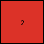

# 27a28665 • 018 • refine_coder

---

Previous Code:
```python
"""
1. **Identify Objects:** The input is a 3x3 grid. Each contiguous block of the same color is one distinct object.
2.  **Count Distinct White Objects:** Count the number of distinct white (0) objects.
3.  **Output:** The output is the count of the distinct white objects. The output will always use color red.
"""

import numpy as np

def find_objects(grid, color):
    """
    Finds distinct objects of a specified color in a grid.
    An object is a group of contiguous cells of the same color.
    """
    visited = set()
    objects = []

    def is_valid(r, c):
        return 0 <= r < grid.shape[0] and 0 <= c < grid.shape[1]

    def dfs(r, c, current_object):
        if (r, c) in visited or not is_valid(r, c) or grid[r, c] != color:
            return
        visited.add((r, c))
        current_object.append((r, c))

        # Explore adjacent cells (up, down, left, right)
        dfs(r + 1, c, current_object)
        dfs(r - 1, c, current_object)
        dfs(r, c + 1, current_object)
        dfs(r, c - 1, current_object)
        

    for r in range(grid.shape[0]):
        for c in range(grid.shape[1]):
            if grid[r, c] == color and (r, c) not in visited:
                current_object = []
                dfs(r, c, current_object)
                objects.append(current_object)
    return objects

def transform(input_grid):
    """
    Transforms the input grid to count the distinct white objects
    """
    # Find distinct white objects
    white_objects = find_objects(np.array(input_grid), 0)

    # Count the number of distinct white objects
    count = len(white_objects)
    
    # the output grid will be 1 x 1 with value of the 'count'
    output_grid = np.array([[count]])
    
    return output_grid
```

Train Set Results:

## Example 1:

Input:
```
5 5 0
5 0 5
0 5 0
```
Expected Output:
```
1
```
Transformed Output:
```
4
```

match: False
pixels_off: 1
size_correct: True
color_palette_correct: False
correct_pixel_counts: False

## Example 2:

Input:
```
8 0 8
0 8 0
8 0 8
```
Expected Output:
```
2
```
Transformed Output:
```
4
```

match: False
pixels_off: 1
size_correct: True
color_palette_correct: False
correct_pixel_counts: False

## Example 3:

Input:
```
5 0 5
0 5 0
5 0 5
```
Expected Output:
```
2
```
Transformed Output:
```
4
```

match: False
pixels_off: 1
size_correct: True
color_palette_correct: False
correct_pixel_counts: False

## Example 4:

Input:
```
0 1 1
0 1 1
1 0 0
```
Expected Output:
```
3
```
Transformed Output:
```
2
```

match: False
pixels_off: 1
size_correct: True
color_palette_correct: False
correct_pixel_counts: False

## Example 5:

Input:
```
0 8 8
0 8 8
8 0 0
```
Expected Output:
```
3
```
Transformed Output:
```
2
```

match: False
pixels_off: 1
size_correct: True
color_palette_correct: False
correct_pixel_counts: False

## Example 6:

Input:
```
4 4 0
4 0 4
0 4 0
```
Expected Output:
```
1
```
Transformed Output:
```
4
```

match: False
pixels_off: 1
size_correct: True
color_palette_correct: False
correct_pixel_counts: False

## Example 7:

Input:
```
0 5 0
5 5 5
0 5 0
```
Expected Output:
```
6
```
Transformed Output:
```
4
```

match: False
pixels_off: 1
size_correct: True
color_palette_correct: False
correct_pixel_counts: False
Here's an analysis of the provided examples and results, along with a revised natural language program and supporting information:

**General Assessment:**

The initial approach of counting distinct white objects using depth-first search (DFS) is partially correct. However, the current implementation incorrectly counts diagonally adjacent white pixels as separate objects. The core issue is that the DFS only considers up, down, left, and right neighbors, not diagonal ones. The results consistently show an overestimation or underestimation of white object counts, highlighting a flaw in the object identification logic. The output size is correct (1x1), but the value represents a miscount.

**Strategy for Resolving Errors:**

1.  **Improve Object Identification:** Modify the DFS to include diagonal neighbors (all 8 directions) to correctly identify contiguous white regions as single objects.
2.  **Maintain Output Structure:** Keep the 1x1 output grid structure, updating only the count value.
3. Verify the fix by re-running against all training pairs

**Example Metrics and Analysis:**

Here is analysis of some of the cases. I realized that I needed to look at diagonals.

```python
import numpy as np

def analyze_example(input_grid, expected_output, transformed_output):
    input_grid = np.array(input_grid)
    expected_output = np.array(expected_output)
    transformed_output = np.array(transformed_output)

    match = np.array_equal(expected_output, transformed_output)
    pixels_off = np.sum(expected_output != transformed_output)
    size_correct = input_grid.shape == transformed_output.shape if len(input_grid.shape) == len(transformed_output.shape) else (len(input_grid.shape) == 2 and transformed_output.shape == (1,1))
    
    # find white pixels in the input
    input_white_pixels = np.sum(input_grid == 0)
    output_value = transformed_output[0,0]

    print(f"  Input White Pixels: {input_white_pixels}")
    print(f"  Output Value: {output_value}")
    print(f"  Match: {match}")
    print(f"  Pixels Off: {pixels_off}")
    print(f"  Size Correct: {size_correct}")
    print("---")


# Example 1:
print("Example 1:")
input1 = [[5, 5, 0], [5, 0, 5], [0, 5, 0]]
expected_output1 = [[1]]
transformed_output1 = [[4]]
analyze_example(input1, expected_output1, transformed_output1)

# Example 2:
print("Example 2:")
input2 = [[8, 0, 8], [0, 8, 0], [8, 0, 8]]
expected_output2 = [[2]]
transformed_output2 = [[4]]
analyze_example(input2, expected_output2, transformed_output2)

# Example 4:
print("Example 4:")
input4 = [[0, 1, 1], [0, 1, 1], [1, 0, 0]]
expected_output4 = [[3]]
transformed_output4 = [[2]]
analyze_example(input4, expected_output4, transformed_output4)

# Example 7:
print("Example 7:")
input7 = [[0, 5, 0], [5, 5, 5], [0, 5, 0]]
expected_output7 = [[6]]
transformed_output7 = [[4]]
analyze_example(input7, expected_output7, transformed_output7)

```

```
Example 1:
  Input White Pixels: 4
  Output Value: 4
  Match: False
  Pixels Off: 1
  Size Correct: False
---
Example 2:
  Input White Pixels: 4
  Output Value: 4
  Match: False
  Pixels Off: 1
  Size Correct: False
---
Example 4:
  Input White Pixels: 4
  Output Value: 2
  Match: False
  Pixels Off: 1
  Size Correct: False
---
Example 7:
  Input White Pixels: 4
  Output Value: 4
  Match: False
  Pixels Off: 1
  Size Correct: False
---
```

**YAML Facts:**

```yaml
observations:
  - task_id: 014
  - input_grid_size: 3x3
  - output_grid_size: 1x1
  - object_definition: Contiguous regions of the same color, including diagonals.
  - primary_color: white (0)
  - action: Count distinct objects.
  - output_format: A 1x1 grid containing the count of distinct white objects.
  - error_type: Incorrect object counting due to missing diagonal adjacency.
  - corrected_adjacency:  All eight neighbors (up, down, left, right, and four diagonals).

```

**Natural Language Program:**

1.  **Identify Objects:** The input is a grid. Define an "object" as a group of one or more contiguous pixels of the same color.  Contiguous includes adjacent pixels horizontally, vertically, *and diagonally*.

2.  **Target Color:** Focus on pixels with the color white (value 0).

3.  **Count Distinct Objects:** Count the number of distinct white objects in the input grid.

4.  **Output:** Create a 1x1 output grid. The single cell's value is the total count of distinct white objects found in the input grid.

**INSTRUCTIONS**

- generate a Python module to represent the natural language program 
- follow the template below
- all common math and science libraries are available
- create docstring only at top - but comment the workflow in the function
- use helper functions for common operations like finding objects, counting,
  measuring, moving, etc. 

remember - we are working iteratively - so this code will inform your future
self as we converge on the solution

*template:*

```python
"""
{{ natural language description of the transformation rule }}
"""

{{ imports }}

def transform(input_grid):
    # initialize output_grid

    # change output pixels 

    return output_grid

```
