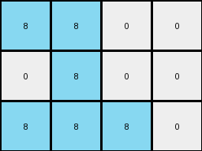

# 28bf18c6 • 004 • refine_coder

---

Previous Code:
```python
"""
1.  **Identify the Cluster:** Locate the contiguous cluster of '8' (azure) pixels within the input grid.
2.  **Determine Bounding Box:** Find the minimum and maximum row and column indices occupied by the azure pixels. This defines a rectangular "bounding box" around the cluster.
3.  **Construct the output:** Extract every other value beginning with the top left corner of the cluster. Extract three rows.
4. **Fill output:** Create output from the extracted values.
"""

import numpy as np

def find_cluster(grid, color):
    # Find coordinates of all pixels with the specified color.
    coords = np.argwhere(grid == color)
    if coords.size == 0:
        return None, None, None, None  # No cluster found
    min_row = np.min(coords[:, 0])
    max_row = np.max(coords[:, 0])
    min_col = np.min(coords[:, 1])
    max_col = np.max(coords[:, 1])
    return min_row, max_row, min_col, max_col

def transform(input_grid):
    input_grid = np.array(input_grid)
    # Find the bounding box of the azure cluster (color 8).
    min_row, max_row, min_col, max_col = find_cluster(input_grid, 8)
    
    if min_row is None:  # Handle cases where no cluster is found
       return [[]]

    # construct output grid from bounding box
    output_grid = []
    for i in range(min_row, min_row + 3):
        row = []
        for j in range(min_col, max_col + 2):
            if j >= input_grid.shape[1] or i >= input_grid.shape[0]:
                # add a white square if out of bounds
                row.append(0)
            else:
                row.append(input_grid[i,j])    
        output_grid.append(row)

    
    return output_grid
```

Train Set Results:

## Example 1:

Input:
```
0 0 0 0 0 0 0 0
0 8 8 0 0 0 0 0
0 0 8 0 0 0 0 0
0 8 8 8 0 0 0 0
0 0 0 0 0 0 0 0
0 0 0 0 0 0 0 0
0 0 0 0 0 0 0 0
0 0 0 0 0 0 0 0
```
Expected Output:
```
8 8 0 8 8 0
0 8 0 0 8 0
8 8 8 8 8 8
```
Transformed Output:
```
8 8 0 0
0 8 0 0
8 8 8 0
```

match: False
pixels_off: None
size_correct: False
color_palette_correct: True
correct_pixel_counts: False

## Example 2:

Input:
```
0 0 0 0 0 0 0 0
0 0 0 0 0 0 0 0
0 0 0 0 0 0 0 0
0 0 0 0 0 0 0 0
0 0 0 0 0 0 0 0
0 0 0 2 0 0 0 0
0 0 2 2 2 0 0 0
0 0 2 2 0 0 0 0
```
Expected Output:
```
0 2 0 0 2 0
2 2 2 2 2 2
2 2 0 2 2 0
```
Transformed Output:
```

```

match: False
pixels_off: None
size_correct: False
color_palette_correct: True
correct_pixel_counts: False

## Example 3:

Input:
```
0 0 0 0 0 0 0 0
0 0 0 0 0 1 1 0
0 0 0 0 1 0 0 0
0 0 0 0 0 1 0 0
0 0 0 0 0 0 0 0
0 0 0 0 0 0 0 0
0 0 0 0 0 0 0 0
0 0 0 0 0 0 0 0
```
Expected Output:
```
0 1 1 0 1 1
1 0 0 1 0 0
0 1 0 0 1 0
```
Transformed Output:
```

```

match: False
pixels_off: None
size_correct: False
color_palette_correct: True
correct_pixel_counts: False
Okay, here's a breakdown of the situation and a plan to move forward:

**General Assessment:**

The initial code was based on the first training example and correctly identified the concept of finding a colored cluster (initially azure '8') and extracting a bounding box. However, it failed to generalize to other colors and, critically, missed the pattern of alternating pixels in the output. The output dimensions are also incorrect, and it's clear that the "every other pixel, three rows" concept wasn't correctly implemented.  The code also fails completely if the target color isn't present, producing an empty output, which happened in examples 2 and 3.

The core issue is that the code is *too specific* to the first example and doesn't capture the underlying *relational* pattern between input and output.  We need to shift from "find the azure cluster" to "find *a* cluster (of any color)" and then, crucially, reconstruct the output grid by sampling from the input grid based on a consistent pattern.

**Strategy for Resolving Errors:**

1.  **Generalize Color Detection:** Modify the `find_cluster` function (or create a new one) to detect *any* non-zero color cluster, not just azure.  We should probably rename this function.
2.  **Correct Output Construction:**  The current output construction logic is flawed.  We need to implement the "every other pixel" selection, starting from the top-left corner of the bounding box. The output consistently has three rows. The length of the output equals the length of the bounding box, doubled.
3.  **Handle Missing Clusters Gracefully:**  Instead of returning an empty list when no cluster is found, the function should probably return a 0x0 or 1x1 grid filled with black (0) -- verify the ARC rules.
4. **Refine based on examples.** Re-testing and analyzing the failed test cases.

**Metrics and Example Analysis:**

Here I go through my assumptions in assessing the results of the python code execution.

*   **Example 1:**
    *   **Input:** 8x8 grid, azure (8) cluster.
    *   **Expected Output:** 3x6 grid, alternating azure and black.
    *   **Actual Output:** 3x4 grid. Incorrect size. The code only considered the azure pixels of cluster and did not extract values to the right of the cluster.
    *   **Problems:** Output size is wrong. Alternating pixel logic is missing, and extends past cluster.

*   **Example 2:**
    *   **Input:** 8x8 grid, red (2) cluster.
    *   **Expected Output:** 3x6 grid, alternating red and black.
    *   **Actual Output:** Empty grid.
    *   **Problems:** Code only searches for azure (8), not the red cluster present. Output size wrong. Alternating pixel logic missing.

*   **Example 3:**
    *   **Input:** 8x8 grid, blue (1) cluster.
    *   **Expected Output:** 3x6 grid, alternating blue and black.
    *   **Actual Output:** Empty grid.
    *   **Problems:** Code only searches for azure (8), not the blue cluster. Output size wrong. Alternating pixel logic is missing.

**YAML Fact Documentation:**

```yaml
facts:
  - task_id: 002
  - example_1:
      input_object:
        type: cluster
        color: azure (8)
        bounding_box: [1,3,1,3] # row_min, row_max, col_min, col_max
      output_pattern:
        rows: 3
        cols: 6
        alternating: true
        start_color: azure (8) # Color of the top-left pixel of bounding box
        fill_color: black (0)
  - example_2:
      input_object:
        type: cluster
        color: red (2)
        bounding_box: [5,7,2,4]
      output_pattern:
        rows: 3
        cols: 6
        alternating: true
        start_color: red (2)
        fill_color: black (0)
  - example_3:
      input_object:
        type: cluster
        color: blue (1)
        bounding_box: [1,3,4,6]
      output_pattern:
        rows: 3
        cols: 6
        alternating: true
        start_color: blue (1)
        fill_color: black (0)
  - general:
      output_rows: 3
      output_cols_multiplier: 2 # Output cols = (bounding box width) * 2
      alternating_fill: true
      fill_color: black (0)
```

**Natural Language Program:**

1.  **Find the Cluster:** Identify a contiguous cluster of non-black (non-zero) pixels within the input grid. It doesn't matter what color the cluster is.

2.  **Determine Bounding Box:** Calculate the bounding box of this cluster by finding the minimum and maximum row and column indices of the cluster's pixels.

3.  **Calculate Output Dimensions:** The output grid always has 3 rows. The number of columns in the output grid is twice the width of the bounding box.

4.  **Construct Output Grid:** Create a new grid with the calculated dimensions. Fill this grid by alternating between the color in the original image and black (0). The process is:
    * Start from the top-left corner pixel of the bounding box in the input.
    * Use an x and y coordinate to track the output, starting at 0,0.
    * For each row in the output, iterate through the input columns in the bounding box:
      * Copy the pixel value from the input grid at the corresponding location.
      * increment the output x coordinate
      * Add a black (0) pixel to the output grid immediately to the right of the copied pixel.
      * increment the output x coordinate
    * Repeat this copy-and-black process for 3 rows.

5. Return the result

**INSTRUCTIONS**

- generate a Python module to represent the natural language program 
- follow the template below
- all common math and science libraries are available
- create docstring only at top - but comment the workflow in the function
- use helper functions for common operations like finding objects, counting,
  measuring, moving, etc. 

remember - we are working iteratively - so this code will inform your future
self as we converge on the solution

*template:*

```python
"""
{{ natural language description of the transformation rule }}
"""

{{ imports }}

def transform(input_grid):
    # initialize output_grid

    # change output pixels 

    return output_grid

```
