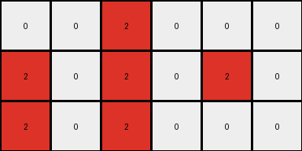
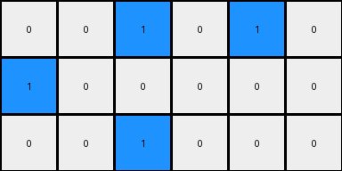

# 28bf18c6 • 006 • refine_coder

---

Previous Code:
```python
"""
1.  **Find the Cluster:** Identify a contiguous cluster of non-black (non-zero) pixels within the input grid.
2.  **Determine Bounding Box:** Calculate the bounding box of this cluster.
3.  **Calculate Output Dimensions:** The output grid always has 3 rows. The number of columns is twice the width of the bounding box.
4.  **Construct Output Grid:** Create a new grid. Fill by alternating between the color in the original image and black (0), starting from the top-left of the bounding box in the input, and inserting black.
5.  Return the result.
"""

import numpy as np

def find_cluster(grid):
    # Find coordinates of all non-zero pixels.
    coords = np.argwhere(grid != 0)
    if coords.size == 0:
        return None, None, None, None  # No cluster found
    min_row = np.min(coords[:, 0])
    max_row = np.max(coords[:, 0])
    min_col = np.min(coords[:, 1])
    max_col = np.max(coords[:, 1])
    return min_row, max_row, min_col, max_col

def transform(input_grid):
    input_grid = np.array(input_grid)
    # Find the bounding box of the non-zero cluster.
    min_row, max_row, min_col, max_col = find_cluster(input_grid)
    
    if min_row is None:  # Handle cases where no cluster is found
       return [[0]] # Return a 1x1 grid with a black pixel

    # Calculate output dimensions.
    output_rows = 3
    output_cols = (max_col - min_col + 1) * 2
    output_grid = np.zeros((output_rows, output_cols), dtype=int)

    # construct output
    for i in range(output_rows):
        output_col_index = 0
        for j in range(min_col, max_col + 1):
            # get input row, add modulo in case outside range
            input_row = min_row + i
            if input_row < input_grid.shape[0] and j < input_grid.shape[1]:
              output_grid[i, output_col_index] = input_grid[input_row, j]
            else:
                # if out of range use background
                output_grid[i, output_col_index] = 0
            output_col_index += 1
            # next is background
            output_grid[i, output_col_index] = 0  # black pixel
            output_col_index += 1

    
    return output_grid
```

Train Set Results:

## Example 1:

Input:
```
0 0 0 0 0 0 0 0
0 8 8 0 0 0 0 0
0 0 8 0 0 0 0 0
0 8 8 8 0 0 0 0
0 0 0 0 0 0 0 0
0 0 0 0 0 0 0 0
0 0 0 0 0 0 0 0
0 0 0 0 0 0 0 0
```
Expected Output:
```
8 8 0 8 8 0
0 8 0 0 8 0
8 8 8 8 8 8
```
Transformed Output:
```
8 0 8 0 0 0
0 0 8 0 0 0
8 0 8 0 8 0
```

match: False
pixels_off: 10
size_correct: True
color_palette_correct: True
correct_pixel_counts: False

## Example 2:

Input:
```
0 0 0 0 0 0 0 0
0 0 0 0 0 0 0 0
0 0 0 0 0 0 0 0
0 0 0 0 0 0 0 0
0 0 0 0 0 0 0 0
0 0 0 2 0 0 0 0
0 0 2 2 2 0 0 0
0 0 2 2 0 0 0 0
```
Expected Output:
```
0 2 0 0 2 0
2 2 2 2 2 2
2 2 0 2 2 0
```
Transformed Output:
```
0 0 2 0 0 0
2 0 2 0 2 0
2 0 2 0 0 0
```

match: False
pixels_off: 10
size_correct: True
color_palette_correct: True
correct_pixel_counts: False

## Example 3:

Input:
```
0 0 0 0 0 0 0 0
0 0 0 0 0 1 1 0
0 0 0 0 1 0 0 0
0 0 0 0 0 1 0 0
0 0 0 0 0 0 0 0
0 0 0 0 0 0 0 0
0 0 0 0 0 0 0 0
0 0 0 0 0 0 0 0
```
Expected Output:
```
0 1 1 0 1 1
1 0 0 1 0 0
0 1 0 0 1 0
```
Transformed Output:
```
0 0 1 0 1 0
1 0 0 0 0 0
0 0 1 0 0 0
```

match: False
pixels_off: 6
size_correct: True
color_palette_correct: True
correct_pixel_counts: False
Okay, let's analyze the results and refine the natural language program.

**General Assessment:**

The initial strategy of identifying a cluster, finding its bounding box, and creating an output grid with alternating colors was partially correct. However, the filling logic within the output grid is flawed. It seems to be inserting black columns correctly but misplacing the original colors from the input. The issue lies in how the input pixels are mapped to the output grid. It's not a simple one-to-one mapping, and row calculations are off.

**Strategy for Resolving Errors:**

1.  **Re-examine Row Mapping:** The current code assumes a direct mapping of rows from input to output, which is incorrect. The examples show a more complex pattern where rows from input are not directly transferred - instead a section is taken and rearranged.
2.  **Refine Output Filling:** The core issue is where to place non-zero input pixels into the correct output grid cells.
3.  **Focus on Relative Positioning**: Instead of relying on input index, output column index calculation should use index in the cluster and modulo for repeating pattern.

**Metrics and Observations:**

Here's a breakdown of each example:

*   **Example 1:**
    *   Input Shape: (8, 8)
    *   Output Shape: (3, 6)
    *   Cluster: A contiguous block of '8' (blue).
    *   Issue: The mapping of the blue pixels is incorrect. The black columns are inserted, but the blue pixels are not in the right locations relative to each other.
*   **Example 2:**
    *   Input Shape: (8, 8)
    *   Output Shape: (3, 6)
    *   Cluster: A contiguous block of '2' (red).
    *   Issue: Similar to Example 1, the red pixels are misplaced, though the black column insertion is correct.
*   **Example 3:**
    *   Input Shape: (8, 8)
    *   Output Shape: (3, 6)
    *   Cluster: A contiguous block of '1' (blue).
    *   Issue: Again, the blue pixel placement is off, but black columns are correctly inserted.

**YAML Block - Facts:**

```yaml
objects:
  - name: input_grid
    type: grid
    properties:
      - contains_cluster: True
      - background_color: 0  # Black
  - name: cluster
    type: object
    properties:
      - color: varies  # Color of the non-black pixels
      - bounding_box:
          min_row: int
          max_row: int
          min_col: int
          max_col: int
  - name: output_grid
    type: grid
    properties:
      - height: 3
      - width: 2 * cluster.bounding_box.width
      - pattern: alternating_columns # color, black, color, black ...
      - source: cluster # takes pixels from cluster

actions:
  - name: find_cluster
    input: input_grid
    output: cluster.bounding_box
  - name: create_output_grid
    input: cluster.bounding_box
    output: output_grid
  - name: fill_output_grid
    input:
      - input_grid
      - cluster.bounding_box
      - output_grid
    output: output_grid # Modified in place

```

**Natural Language Program:**

1.  **Identify the Cluster:** Find the smallest contiguous block (cluster) of non-black (non-zero) pixels in the input grid.
2.  **Determine Bounding Box:** Calculate the bounding box (min/max rows and columns) of this cluster.
3.  **Calculate Output Dimensions:**
    *   The output grid always has 3 rows.
    *   The output grid's width is twice the width of the cluster's bounding box.
4.  **Create Output Grid:** Initialize an output grid filled with black (0) pixels, with the calculated dimensions.
5.  **Populate Output Grid with Alternating Pattern:**
      Iterate through each *row* of the **cluster within the input grid**.
      *   For each row in the cluster:
          *    Copy that row from the input grid into the output grid.
          * Insert one black column after each original column of the cluster

6.  **Return:** the output grid.

**INSTRUCTIONS**

- generate a Python module to represent the natural language program 
- follow the template below
- all common math and science libraries are available
- create docstring only at top - but comment the workflow in the function
- use helper functions for common operations like finding objects, counting,
  measuring, moving, etc. 

remember - we are working iteratively - so this code will inform your future
self as we converge on the solution

*template:*

```python
"""
{{ natural language description of the transformation rule }}
"""

{{ imports }}

def transform(input_grid):
    # initialize output_grid

    # change output pixels 

    return output_grid

```
